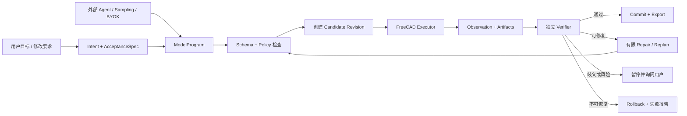
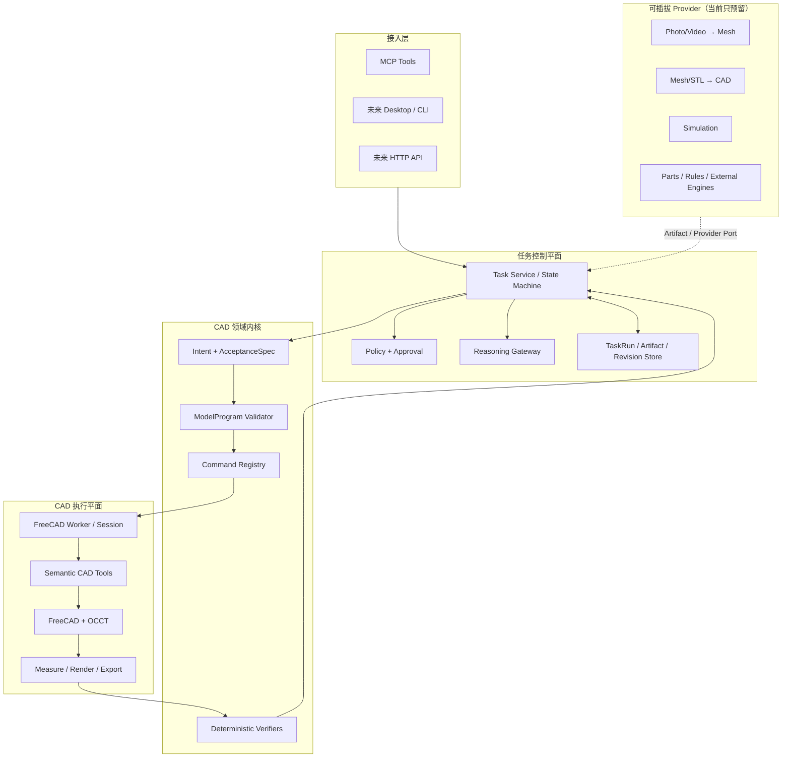
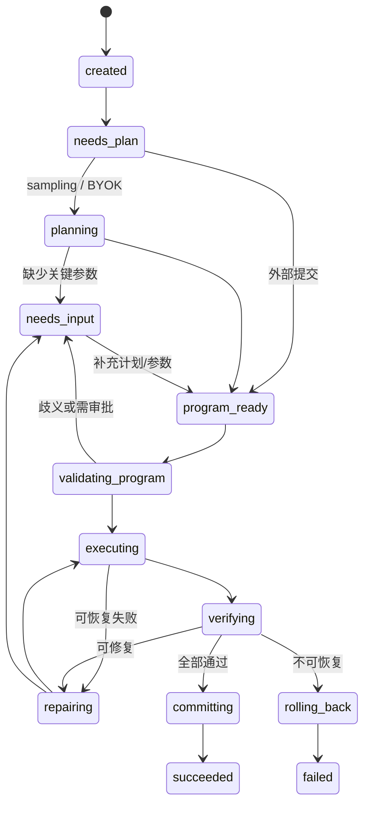

# VibeCAD 目标架构与开发路线

> 状态：Accepted
> 日期：2026-07-16
> 当前实现基线：VibeCAD 0.4.0
> 文档角色：本文件是 Agent、模型接入和后续工作流开发的当前决策真源。
> 当前代码事实见 [`ARCHITECTURE.md`](ARCHITECTURE.md)；2026-07-02 的 Agent spec 和 prototype plan 为历史方案，已被本文取代。

## 1. 已锁定的产品定位

VibeCAD 是一个可独立运行、也可被 Claude Code、Codex、WorkBuddy 等外部 Agent 调用的垂直 CAD Agent。它的核心价值不是提供模型，而是把不稳定的模型意图变成可执行、可验证、可编辑、可回滚的 CAD 产物。

```text
模型 / 外部 Agent：理解目标、提出方案、处理歧义
VibeCAD：约束方案、管理任务、执行、验证、版本化、回滚
FreeCAD / OCCT：几何计算、文档重算、格式导入导出
```

以下约束已经锁定：

| 决策 | 结论 |
|---|---|
| 模型商业模式 | 用户自带模型授权；短期不采购、补贴或转售模型 Token |
| 主要接入协议 | 标准 MCP；不为单个开源 Agent 维护独立核心实现 |
| 主要宿主 | 欧美优先 Claude Code、Codex；中国优先 WorkBuddy/CodeBuddy；VS Code/Copilot 用作完整 MCP Sampling 基准 |
| OpenClaw / Hermes | 保持标准 MCP 自然兼容；Hermes 可作 Sampling 协议测试，不作为首要获客入口 |
| 主执行路径 | 版本化 `ModelProgram` 调用受控语义 CAD 操作 |
| 任意代码生成 | 上限高但风险高，只能作为未来隔离的高级通道，禁止成为主路径 |
| 几何正确性 | 模型不能自证成功；必须由 FreeCAD 事实和独立验证器验收 |
| 前置重建 | 照片/视频到 Mesh、Mesh/STL 到 CAD 只预留 Provider，不自研底层引擎 |
| 仿真 | 只预留 Simulation Provider，当前不实现 |
| 当前重点 | 把 CAD 中间闭环做实：计划、候选执行、验证、修复、提交、回滚、导出 |

## 2. 产品边界

### 2.1 VibeCAD 负责

- 任务状态和生命周期。
- 用户目标、约束、假设和验收条件的结构化。
- `ModelProgram` schema、操作白名单和参数校验。
- FreeCAD 候选执行、事务、checkpoint、回滚和项目保存。
- 几何、拓扑、尺寸、文件产物和装配干涉的确定性验证。
- 失败分类、有限重试、需要用户确认时暂停。
- Artifact、Revision、TaskRun、诊断和评估记录。
- MCP、未来桌面端/CLI/API 共用的领域内核。
- 用户自带模型授权的适配与安全隔离。

### 2.2 VibeCAD 当前不负责

- 自营模型、模型额度套餐或 Token 差价。
- 自研摄影测量、NeRF、Gaussian Splatting 或图生 3D 基础模型。
- 自研通用 STL 逆向工程内核。
- 自研有限元、CFD 或 CAM 求解器。
- 让模型直接判断最终几何是否正确。
- 把任意 Python/FreeCAD 代码直接暴露为默认 MCP 工具。
- 为 OpenClaw、Hermes 等每个 Agent 复制一套业务逻辑。

## 3. 端到端目标流程



核心原则是先产生候选版本，再验收，最后提交。任何一次模型调用、工具调用或渲染成功都不等同于任务成功。

## 4. 总体分层



### 4.1 接入层

接入层只做协议转换、能力协商和身份上下文传递，不包含 CAD 业务逻辑。

- 当前：FastMCP stdio。
- 后续：桌面端、CLI、HTTP API 都调用同一个 Task Service。
- 低层 31 个语义工具继续保留，便于外部 Agent 精细控制和兼容已有用户。
- 新增高层任务工具，但不能在 `server.py` 中重新实现执行逻辑。

### 4.2 任务控制平面

Task Service 是未来 Agent 的中心，而不是某个模型 SDK：

- 创建并恢复 `TaskRun`。
- 决定当前 `reasoning_owner`。
- 驱动状态机和有限重试。
- 管理 project lock、candidate revision 和审批点。
- 记录每一步输入、输出、耗时、模型用量和 artifact。
- 把失败转换为明确的 `next_action`，而不是一段不可机器处理的文案。

### 4.3 CAD 领域内核

领域内核不依赖具体宿主和模型厂商：

- `Intent`：用户要达到什么结果。
- `AcceptanceSpec`：如何证明达到结果。
- `ModelProgram`：允许执行哪些操作、顺序、前后置条件和参数来源。
- `Command Registry`：把稳定 operation 映射到现有语义工具。
- `Verifier`：读取几何事实并作确定性判断。

### 4.4 CAD 执行平面

现阶段继续复用 `Session + tools + FreeCAD` 的进程内路径，避免重做已经稳定的几何能力。

短期约束：

- 同一 Session 写操作串行化。
- 同一时刻只允许一个 TaskRun 修改一个项目。
- 每个程序执行前创建 checkpoint/candidate。
- 执行失败或验收失败必须恢复到基线版本。

长期目标：将 FreeCAD 移入独立 Worker，使 OCCT 崩溃不带走任务控制平面。进程边界只传 `ModelProgram`、结构化 Observation 和 Artifact 引用，不序列化活的 OCCT Shape。

## 5. 三种推理模式

每个 TaskRun 必须且只能有一个推理所有者：

```text
reasoning_owner = external_plan | mcp_sampling | byok
```

### 5.1 External Plan

```text
Claude Code / Codex / WorkBuddy
→ 生成 Intent / AcceptanceSpec / ModelProgram
→ VibeCAD 校验、执行和验收
```

这是外部 Agent 调用 VibeCAD 时的默认主路径。它不要求 VibeCAD 持有任何模型 Key，也不产生嵌套模型调用。

### 5.2 MCP Sampling

```text
VibeCAD MCP Server
→ sampling/createMessage
→ 宿主使用其模型授权完成受约束推理
→ VibeCAD 校验返回内容
```

Sampling 是可选增强，必须先检查客户端 capability。第一版只允许基本 Sampling，不开放 `sampling.tools`，嵌套深度最多 1，并限制每个 TaskRun 的调用次数、最大输出和超时。

### 5.3 BYOK

```text
VibeCAD Reasoning Gateway
→ 用户选择的 Provider API
→ 用户自己的 API Key / Endpoint
```

BYOK 用于 VibeCAD 独立入口或宿主不负责规划时。它不是托管模型：账单直接发生在用户和模型供应商之间。

安全要求：

- Key 不得出现在 MCP 参数、项目文件、TaskRun、日志或导出产物中。
- 本地桌面环境优先使用系统 Keychain；仅允许环境变量作为开发/无 UI 回退。
- FreeCAD Worker 不得获得模型 Key。
- 日志统一做 secret redaction。
- Provider 连接失败不得切换到 VibeCAD 付费模型，因为不存在该后端。

### 5.4 推理选择规则

```python
if caller_supplied_program:
    reasoning_owner = "external_plan"
elif client_declares_sampling and user_allows_sampling:
    reasoning_owner = "mcp_sampling"
elif user_configured_byok:
    reasoning_owner = "byok"
else:
    status = "needs_reasoning_configuration"
```

禁止在同一阶段自动叠加多个来源。例如外层 Agent 已提交计划后，VibeCAD 不得为了“再确认一下”自行 Sampling 或调用 BYOK。

## 6. 核心数据契约

所有契约必须版本化、可持久化、可脱离模型单独测试。

### 6.1 Intent

至少包含：

- 用户目标和任务类型（创建、修改、装配、导出）。
- 输入项目和 artifact 引用。
- 用户明确给出的尺寸、材料或制造要求。
- 允许的假设及其来源。
- 未解决问题。

用户值和模型假设必须区分，修复流程不能悄悄改写用户给出的尺寸。

### 6.2 AcceptanceSpec

验收条件分为：

- `geometry`：bbox、体积、面积、质心、solid 数、孔径/深度等。
- `topology`：封闭实体、有效 shape、单 solid、依赖完整。
- `assembly`：位置、间隙、对齐和干涉上限。
- `artifact`：FCStd/STEP/STL 是否存在、非空、格式正确。
- `preservation`：哪些中心、轴、特征、尺寸或对象必须保持不变。
- `visual`：只用于辅助展示，不单独作为制造级通过依据。

### 6.3 ModelProgram

主路径不是 Python，而是受控 IR：

```json
{
  "schema_version": 1,
  "task_id": "task_123",
  "base_revision": "rev_004",
  "operations": [
    {
      "id": "op_1",
      "op": "modify_parameter",
      "target": {"object": "HoleFeature001"},
      "args": {"parameter": "Diameter", "value": 8, "unit": "mm"},
      "preserve": ["center", "axis", "depth"],
      "source": "user"
    }
  ],
  "acceptance": [
    {"check": "diameter", "target": "HoleFeature001", "expected": 8,
     "tolerance": 0.01},
    {"check": "center_unchanged", "target": "HoleFeature001",
     "tolerance": 0.01}
  ]
}
```

执行前必须验证：

- schema/version。
- operation 白名单和参数类型。
- 引用对象是否存在且唯一。
- 单位、数值范围和公差。
- `base_revision` 是否仍是当前版本。
- 是否触发用户确认或禁止操作。

### 6.4 StepResult

统一结果 envelope，替代当前 dict/Image/list 多态向 Agent 内核扩散：

```json
{
  "ok": true,
  "operation_id": "op_1",
  "revision": "candidate_005",
  "facts": {},
  "artifacts": [],
  "warnings": [],
  "error": null
}
```

错误至少包含稳定 `code`、用户可读 `message`、是否可重试、是否需要用户输入、关联对象和诊断 artifact。图片仍可通过 MCP content 返回，但 Task Service 只消费统一 envelope 和 artifact 引用。

### 6.5 TaskRun / Revision / Artifact

`TaskRun` 保存：

- goal、intent、acceptance 和 reasoning owner。
- base/candidate/committed revision。
- program、step results、verification 和 repair history。
- assumptions、approvals、模型 usage、耗时和最终状态。
- 输入和输出 artifact 引用。

初期使用原子写 JSON 目录即可；当跨任务检索、团队并发或规模化统计成为真实需求时再迁移数据库。

## 7. 状态机和恢复



规则：

- 每个 step 默认最多重试 1 次；同一 TaskRun 的重规划次数和模型调用次数有硬上限。
- 标签过期可以重新标注后重试。
- 模型假设导致的几何冲突可以在约束内修正。
- 用户明确给出的尺寸冲突必须暂停询问，不能自行修改。
- 未通过 AcceptanceSpec 的 candidate 永远不能提交。
- render/preview 失败不撤销已经通过的几何，但必须形成 warning/artifact error。
- 取消、超时、进程崩溃和客户端断开都必须留下可诊断状态。

## 8. 执行通道

### 8.1 语义工具通道（主路径）

`ModelProgram` operation 映射到当前稳定工具或后续新增的领域 command。优点是参数可验证、副作用可预测、事务和后置断言可复用。

第一版只纳入高质量白名单，不要求一次覆盖全部 31 个工具。优先覆盖：

- 项目打开/保存和 revision。
- 基础实体、布尔和 profile extrude。
- 孔、圆角、倒角和参数修改。
- 测量、描述、渲染和 STEP/STL 导出。
- 必要的零件放置和干涉检查。

### 8.2 程序化通道（未来实验）

模型生成 Python/FreeCAD 代码能表达语义工具尚未覆盖的复杂建模，能力上限更高，但只允许在以下条件全部满足后进入实验：

- 独立沙箱/Worker，无模型 Key 和用户全盘文件权限。
- CPU、内存、时间、输出目录和 import 白名单限制。
- 基于只读输入复制创建 candidate。
- 代码、stdout/stderr 和产物完整审计。
- 与主路径相同的独立 AcceptanceSpec 验证。
- 失败只销毁 candidate，不污染已提交项目。

它不能替代语义工具，也不能由外部 Agent 直接请求“关闭安全检查”。

## 9. Provider 端口

当前只定义边界，不实现底层算法：

```python
class SourceToMeshProvider(Protocol):
    def reconstruct_mesh(self, source_artifacts, constraints) -> MeshArtifact: ...

class MeshToCadProvider(Protocol):
    def reconstruct_cad(self, mesh_artifact, constraints) -> CadArtifact: ...

class SimulationProvider(Protocol):
    def run(self, cad_artifact, study_spec) -> SimulationArtifact: ...
```

未来数据流：

```text
照片/视频 Provider → Mesh Artifact
Mesh/STL 逆向 Provider → STEP/BRep/参数化候选 Artifact
VibeCAD Core → 精细编辑、验证、版本化
Simulation Provider → 报告和场结果 Artifact
```

Provider 只能通过 artifact 和 versioned request/response 与核心交互。VibeCAD 不依赖某个照片建模或逆向工程引擎的内部对象模型，也不把 Provider 结果直接视为已验收 CAD。

## 10. 对外 MCP 契约

现有低层语义工具继续工作。新增任务级工具建议保持小而稳定：

| 工具 | 作用 |
|---|---|
| `create_task` | 创建 TaskRun，返回 task id、当前事实、能力和 `next_action` |
| `submit_model_program` | 外部 Agent 提交版本化程序和验收条件 |
| `continue_task` | 从当前状态执行、恢复或在 Sampling/BYOK 模式推进一步 |
| `get_task` | 获取状态、失败、usage、artifact 和下一步，不产生写副作用 |
| `cancel_task` | 请求取消并回滚未提交 candidate（在异步/长任务阶段加入） |

每次返回必须含：

```json
{
  "task_id": "task_123",
  "status": "needs_plan",
  "next_action": "submit_model_program",
  "result": null,
  "artifacts": [],
  "error": null
}
```

不采用旧草案的单一同步 `agent_run(request)` 作为唯一入口，因为长任务、用户确认、客户端断开和失败恢复都需要可恢复 TaskRun。

## 11. 推荐包边界

在不大规模搬动现有代码的前提下新增：

```text
src/vibecad/
├── workflow/
│   ├── contracts.py       # Intent / AcceptanceSpec / ModelProgram / Result
│   ├── program.py         # schema、版本和 policy 校验
│   ├── state.py           # 状态机
│   ├── service.py         # Task Service
│   ├── store.py           # TaskRun / Revision / Artifact 持久化
│   └── repair.py          # 有界恢复策略
├── reasoning/
│   ├── base.py            # ReasoningBackend Protocol
│   ├── sampling.py        # MCP Sampling，可选
│   └── byok.py            # 用户 Provider，后续实现
├── execution/
│   ├── registry.py        # ModelProgram op → semantic command
│   ├── adapter.py         # 当前 in-process FreeCAD adapter
│   └── candidate.py       # checkpoint / commit / rollback
├── validation/
│   ├── engine.py          # AcceptanceSpec 调度
│   └── checks.py          # 纯确定性检查
└── providers/
    ├── source_to_mesh.py  # 仅 Protocol
    ├── mesh_to_cad.py     # 仅 Protocol
    └── simulation.py      # 仅 Protocol
```

已有 `runtime/`、`engine/`、`tools/`、`feedback/` 保持职责，不让模型 SDK 依赖向下渗透。

依赖方向必须是：

```text
server/UI → workflow → contracts
workflow → reasoning / execution / validation / artifacts
execution → existing tools → engine/session → FreeCAD
reasoning 不得依赖 FreeCAD
FreeCAD Worker 不得依赖 reasoning 或访问模型 Key
```

## 12. 开发路线和验收门

开发按“先证明确定性内核，再接模型”的顺序推进。每一阶段必须通过验收门，不能因为模型 demo 看起来可用而跳过。

### 阶段 0：决策和基线固化

交付：

- 本文档成为 Agent 架构真源。
- 历史自建模型草案标记为 superseded。
- 当前 0.4.0 全量快速测试和真实 FreeCAD 测试结果保留为基线。

验收门：团队能明确回答 VibeCAD 负责什么、模型负责什么，以及当前哪些能力尚未实现。

### 阶段 1：稳定执行契约

实现：

1. `Intent`、`AcceptanceSpec`、`ModelProgram v1`、`StepResult` schema。
2. 稳定错误分类：validation、conflict、label_expired、geometry、runtime、policy、cancelled。
3. Command Registry，首批映射高质量语义操作。
4. 当前多态工具返回在 adapter 层归一化，不强制立即破坏外部兼容。
5. 纯 schema/contract 单测和恶意/越界程序拒绝测试。

验收门：不启动模型、不依赖自然语言，给定一个合法 ModelProgram 可以完成静态校验；非法或越权程序在访问 FreeCAD 前被拒绝。

### 阶段 2：确定性 Task Kernel

实现：

1. TaskRun JSON 原子持久化和状态机。
2. project/session 写锁，先明确只支持单活动 writer。
3. candidate checkpoint、commit、rollback。
4. ModelProgram Executor。
5. AcceptanceSpec verifier。
6. 标签过期、模型假设冲突和不可恢复几何失败的规则化处理。

验收门：使用预先编写的 ModelProgram，在真实 FreeCAD 上完成“创建、修改、验证、导出”；注入任一步失败后，已提交基线保持不变且 TaskRun 可诊断。

### 阶段 3：外部 Agent 主路径

实现：

1. `create_task / submit_model_program / continue_task / get_task` MCP 工具。
2. 外部 Agent 所需的 schema、能力清单和紧凑几何上下文。
3. Claude Code、Codex、WorkBuddy 的最小接入说明和 conformance 用例。
4. 通用 MCP 兼容测试；OpenClaw/Hermes 不做专属业务分支。

验收门：至少两个不同宿主能对同一任务提交 ModelProgram，VibeCAD 得到等价几何结果；宿主退出后可通过 task id 读取最终或失败状态。

### 阶段 4：Eval 和产品级验收

建立固定任务集，至少覆盖：

- 从零创建单零件。
- 打孔、槽、圆角和尺寸修改。
- “孔中心不变，只改直径”等 preservation 约束。
- 项目打开、候选修改、失败回滚。
- 两零件放置和干涉。
- STEP/STL/FCStd 产物验证。
- 缺参、旧标签、非法尺寸和执行失败。

指标：首次计划通过率、闭环成功率、几何验收通过率、回滚成功率、平均步骤数、模型调用数、延迟和用户确认次数。

验收门：所有确定性 fixture 100% 可重复；模型 eval 单独报告波动，不得掩盖执行内核回归。

### 阶段 5：可选推理后端

先后实现：

1. `ExternalPlanBackend`（实际在阶段 3 已成立）。
2. `McpSamplingBackend`：capability negotiation、授权、限额、超时、depth=1。
3. `ByokBackend`：窄 Provider Protocol、secret store、usage/budget、至少一个参考 Provider。
4. 更新 `PRIVACY.md`：明确用户选择的宿主/Provider、最小发送内容、Key 存储和日志策略。
5. 通过相同 contract tests 验证不同推理来源输出同一种 ModelProgram。

验收门：每个 TaskRun 恰有一个 reasoning owner；禁用或拒绝 Sampling、缺少 Key、Provider 超时时，都能返回明确的 `next_action`，且日志中没有 Key。

### 阶段 6：扩大中间 CAD 能力

优先投入会直接提高真实任务完成率的能力：

- 参数化 profile 和更丰富的特征修改。
- 更稳定的语义选择器和 preservation 检查。
- STEP/FCStd 输入 artifact、现有模型识别与修改。
- 装配约束、标准件/规则 Provider 接口。
- 工程图和可制造性检查。
- 多项目/多 Worker 和崩溃恢复。

每一项都先增加领域 command、确定性验证和 eval，再允许模型规划调用。

### 阶段 7：外部重建、仿真和高级代码通道

只有核心闭环稳定后才进入：

- 接现成照片/视频到 Mesh Provider。
- 接现成 Mesh/STL 到 STEP/BRep/参数化重建 Provider。
- 接外部仿真 Provider。
- 实验性隔离代码生成 Worker。

这些能力全部以 artifact 进出，不改变 Task Service、ModelProgram 和验收主链。

## 13. 第一轮实现切片

下一轮代码工作建议只做阶段 1，不立即接任何模型：

1. 定义四个 versioned contract。
2. 建立 `ModelProgram` validator 和错误 taxonomy。
3. 建立首批 command registry。
4. 写 tool-result normalizer，兼容现有 31 个工具返回形态。
5. 用 3 个纯 fixture 覆盖创建、尺寸修改和非法程序拒绝。
6. 用 1 个真实 FreeCAD slow test 证明合法程序可执行，但暂不加入 TaskRun/模型循环。

这一步完成后再进入 Task Kernel，可以最大限度避免先写一个看似聪明、实际不可验证的 Agent loop。

## 14. 架构不变量

后续每次设计和代码评审都检查：

1. 是否出现两个 reasoning owner 或重复模型调用。
2. 是否在 schema/policy 校验前触碰 FreeCAD 或文件系统。
3. 是否让模型输出绕过 operation 白名单。
4. 是否把模型判断当作几何验收。
5. 是否先修改 committed revision，再尝试回滚，而不是在 candidate 上执行。
6. 是否把模型 Key 传给 MCP 参数、FreeCAD Worker、日志或 artifact。
7. 是否为某个宿主复制领域逻辑，而不是通过标准 adapter 接入。
8. 是否把未来 Provider 的内部对象泄漏进 VibeCAD 核心。
9. 是否在没有对应确定性测试和 eval 的情况下新增模型可调用能力。
10. 是否把实验性任意代码通道升级成默认主路径。

## 15. 成功标准

目标不是“模型能生成一段 FreeCAD 代码”，而是：

> 不同模型和不同宿主都能提交同一种受控设计意图；VibeCAD 能在候选版本上执行，使用几何事实证明结果，成功后提交，失败时完整回滚，并留下可以重放和审计的 TaskRun。
