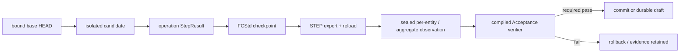
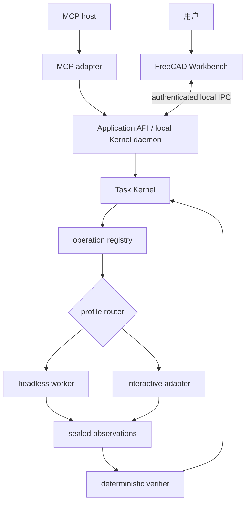

# VibeCAD Agent 架构与产品边界

> 决策状态：AR-1 reviewed / 2026-07-21
>
> 当前实现：P0-B core 正在执行；C01–C05 的 keyed task、发现/比较/清单和空闲任务取消已进入
> 未发布的 0.5.0 分支候选；协议与分发包仍为本地 host-ready
>
> 发布边界：真实 Claude/Codex 主机尚未安装激活验收，当前没有 tag 或 release
>
> 文档角色：Agent 定位、调用模式、信任边界和后续阶段的决策真源
>
> 实施分层见 [`ARCHITECTURE.md`](ARCHITECTURE.md)，企业能力路线见
> [`PRODUCT_CAPABILITY_ROADMAP.md`](PRODUCT_CAPABILITY_ROADMAP.md)。

## 1. 结论先行

VibeCAD 的定位是 **CAD 专家 Agent**，不是通用自主 Agent、聊天模型、模型供应商或新的几何内核。
它把外部宿主或用户给出的设计意图收敛为受控 CAD program，在隔离候选版本中执行，以 FreeCAD/
OCCT 的事实独立验收，并原子提交或安全保留审核草案。

当前产品状态：

| 能力层 | S3-8 本地实现状态 | 当前能否通过公共 MCP 调用 |
|---|---|---|
| 运行时/能力/项目/任务/审核/交付 | 21 个稳定工具已实现 | 能 |
| Registry 直接 CAD | 六个 object-level 工具已实现 | 能 |
| 多步 ModelProgram | versioned schema、ResultRef、Selector、Acceptance 已实现 | 能 |
| Durable review | require-review、跨重启 Accept/Reject、stale-base CAS 已实现 | 能 |
| Artifact | FCStd/STEP materialization、ResourceLink 与 MCP resource read 已实现 | 能 |
| Host-neutral skill | canonical skill 与分发合同已交付并通过包级验收 | host-ready；真实宿主尚未激活验证 |
| FreeCAD Workbench | 只有 CadExecutionPort/checkout/protocol seam | 不能；G1 实现 |
| Sampling/BYOK | 只有 reasoning-owner 枚举，未有 backend | 不能 |
| 自动 repair/replan | 当前零次语义重试 | 不能 |
| 照片/STL/仿真 Provider | 只有架构预留 | 不能 |
| 任意 Python/FreeCAD 代码 Worker | 不存在，也不是主路径 | 不能 |

所以准确说法是：**CAD 与任务内核已经打通，0.5.0 公共协议和分发包也已经在本地做到
host-ready，让兼容宿主具备低成本发现、正确调用和取回文件的合同。** 真实 Claude/Codex 中的 skill
安装、reload 与 canonical workflow 仍是 residual，不能把 typed/raw client conformance 宣称成
host-verified；当前候选也尚未发布。

## 2. 三方职责

```text
用户 / Claude / Codex
  负责：自然语言、目标、歧义、偏好、计划与用户交互

VibeCAD
  负责：schema、operation allowlist、项目/任务、隔离执行、证据、验收、版本、审核、恢复和交付

FreeCAD / OCCT
  负责：几何构造、BRep 运算、文档重算、格式读写和几何事实
```

FreeCAD 可以类比 CAD 编译器与执行环境，但“代码可执行”不等于“设计正确”。VibeCAD 增加的是编译
前约束、隔离 candidate、sealed observation、deterministic verifier、HEAD CAS 和 recovery，而不是
让模型直接控制一个更大的 Python REPL。

锁定决策：

| 决策 | 当前结论 |
|---|---|
| 模型商业模式 | 用户自带宿主订阅或 API 授权；VibeCAD 不采购、补贴或转售 token |
| 首要宿主 | Claude Code、Codex 和其他标准 MCP 宿主；业务逻辑不按宿主复制 |
| 主协议 | 标准 MCP + host-neutral skill |
| 主执行路径 | versioned `ModelProgram` + 固定 semantic operation |
| 简单交互 | registry-derived direct tool，仍进入同一 Task Kernel |
| 提交权 | 只属于 verifier + revision transaction，不属于模型或工具文本 |
| 文件语义 | 用户源文件只读；修改在 private candidate；发布形成 immutable revision |
| 人工审核 | durable draft；Accept 才发布，Reject 不改 HEAD |
| Workbench | 交互执行/预览端，不是第二 Agent、第二状态机或第二提交权威 |
| Headless | 当前已验证 profile，不是长期全能力强约束 |
| 照片/STL/仿真 | 调用成熟外部引擎或 FreeCAD/OCCT 能力，不自研底层算法 |
| 任意代码 | 表达上限高，但只可能成为未来高隔离实验通道，永不替代默认主路径 |

## 3. 当前用户工作流

### 3.1 简单直接操作

```text
get_capabilities
→ create_project(empty | supported Box/Cylinder-only import_fcstd)
→ create_task(review_policy)
→ 调用一个 direct CAD tool + explicit AcceptanceSpec
→ read task/verdict
→ auto_commit，或 Accept/Reject durable draft
→ export_task_artifacts
→ read FCStd / STEP resource
```

一个 direct 工具会被编译成一个单命令 ModelProgram；它不是“在当前文档上继续点一下”。任务终结后，
下一次 sequential direct edit 需要在新 HEAD 上新建任务。对已有对象的修改先通过 `inspect_model` 或
前序 ModelProgram result 获得 revision-bound object identity，再构造 SelectorV1；不能猜 Label/Name。

### 3.2 多步设计

多步设计一次提交完整 `ModelProgram`：

```text
ModelProgram
├── immutable task_id + base_revision
├── ordered ModelCommand[]
│   ├── fixed operation name
│   ├── strict target / args / preserve
│   ├── ResultRef or SelectorV1
│   └── declared dependency
└── AcceptanceSpec
```

创建命令返回 typed ResultRef，后续命令可引用同一 candidate 内的新对象。ModelProgram 不能排列或
省略 checkpoint、STEP、seal、observation、verification、commit/rollback；这些属于 Task Kernel。

### 3.3 两种审核策略

| Policy | 验证通过后的行为 | 用户动作 |
|---|---|---|
| `auto_commit` | 立即对绑定 base 执行 HEAD CAS | 读取结果并导出 |
| `require_review` | 发布 immutable draft，释放 project lease，HEAD 不变 | 查看证据/候选后 Accept 或 Reject |

Accept 不是“信任旧 verdict 后直接改指针”。它会重开 immutable candidate、重新采集事实、重新编译
验收、取得 fresh one-shot receipt，再重取 lease 并做完整 base HEAD CAS。Reject 只记录决定。

### 3.4 持久取消与执行中断

`cancel_task` 是 TaskRun 生命周期操作，不是 FreeCAD 进程信号。首次调用使用刚读取的 generation；
`created`、`needs_plan`、`program_ready` 或 `needs_input` 会以 CAS 立即进入 `cancelled`。响应未知时，
宿主可重放完全相同的旧请求；重启和并发调用仍返回同一 generation，不产生第二个
`request_cancel` event。等待审核的 draft 必须用 `reject_draft`。

当前空闲取消只写 task store，不构造 CAD/runtime/artifact 组件，不取得 project write lease，也不
改变 HEAD、源文件或交付目录。active CAD 状态不能通过 C05 中断；`cancel_requested`、`cancelling`
到 Worker kill、未提交证明和最终 reconcile 的执行路径由 C12 接通。MCP
`notifications/cancelled` 只取消一个 transport request，不是 durable task cancellation。

## 4. 两种调用方式为什么必须并存

直接工具和 ModelProgram 解决不同的人机问题：

- direct tool：名字和 schema 容易发现，适合“建一个 20×30×5 的盒子”“把长度改成 24 mm”；
- ModelProgram：多个操作共享一个 candidate 和整体验收，适合创建→修改→移动→检查等复杂设计；
- 两者都产生 TaskRun、candidate/draft、verification report、revision 和 artifact；
- 工具数量不是能力目标。稳定控制面保持小而稳定，CAD operation 可按准入门逐批扩展。

当前 27 个公开工具中，只有 6 个是 direct CAD 工具；其余是 5 个 service/runtime/capability 控制工具
和 16 个 project/revision/task/review/artifact facade。不能把“27 个公开工具”误写为“27 个 CAD command”。

每个新增 operation 必须同时具备：

1. 严格、versioned、bounded 参数合同；
2. ResultRef 或稳定 selector；
3. 固定 handler binding，不能携带 import path/callable/code；
4. candidate-only side effect、risk class 和 execution profile；
5. sealed observation 与可机器判断的 verifier；
6. preservation、失败回滚和 reload 后语义；
7. 真实 FreeCAD 成功/失败/恢复测试；
8. 如果 `direct_exposed=true`，还必须有宿主可读 description，且名称不得占用稳定 namespace。

## 5. Evidence 与提交权

一次成功不是单一布尔值，而是一条可追溯证据链：



当前 verifier 可证明：volume、area、bbox、center of mass、valid shape、solid count、FCStd/STEP artifact
和声明字段 preservation。它不把模型文本、截图审美或“FreeCAD 没抛异常”当作通过。

这套证据足够当前 Box/Cylinder、参数、Placement 和 object inspection；不等于已经能验证孔的制造语义、
Sketcher 约束、face/edge 意图、装配 mate、TechDraw 标注或仿真结果。

## 6. ReasoningOwner、订阅 token 与自动重试

schema 预留三种 owner：

```text
external_plan | mcp_sampling | byok
```

当前只执行 `external_plan`：Claude/Codex 使用自己的订阅或 API 配额理解用户、选择工具并生成 program；
VibeCAD 不读取或消耗一个可“转交”的宿主 token，也不在内部再调用模型。

`mcp_sampling` 未来可以让支持 Sampling 的宿主用其授权完成受控计划，但落地前必须有 capability
negotiation、明确用户授权、预算、超时和 depth=1。`byok` 未来使用用户自己的 Provider key，key 不得
进入 MCP 参数、TaskRun、项目、日志、artifact 或 FreeCAD process。

当前没有自动 repair/replan/semantic retry。失败后由宿主读取固定错误和 evidence，决定是否创建新任务
或提交新 program。`create_task` 已由 `task_create_` key 和不可变意图绑定，可在未知结果时用同一 key
安全重放；`list_tasks` 只用于未知 task id 的恢复发现。

项目 id 未知时，宿主才分页调用 `list_projects` 并用 `get_project` 读取当前权威 HEAD。
`list_revisions` 是严格只读的 committed-history 投影：只返回当前 HEAD ancestry，按 canonical
revision id 排序，调用方沿 `head`/`base_revision` 恢复时间链；draft、candidate、abandoned revision
被排除。cursor stale/conflict 时从第一页重启。这两条路径不触发 CAD/runtime，也不取得 project lease。

`compare_revisions` 在同一 committed ancestry 内重新校验两个 revision 的真实 FCStd/STEP payload，
只承诺谱系、manifest、文件 presence/hash/size 与 artifact descriptor 差异；它不推断 BRep、实体、
参数或设计意图差异。`get_artifact_manifest` 只读绑定 task generation、revision/draft、verification
与 observation；只有已经完整校验并 PUBLISHED 的 delivery 才返回 ResourceLink，否则明确
`materialized=false`，且不触发 CAD、复制、物化或 cleanup。

当前 canonical skill 要求宿主按服务端 `next_action` 行动：`submit_program` / `provide_input` 提交新
program，普通 `validate_program` / `reconcile` / `cleanup` 调 `resume_task`，`wait` 先刷新后至多恢复
一次，`review_draft` 只允许 Accept/Reject，`none` 停止修改。C05 的 cancellation state 是例外：
若观察到 `cancel_requested` 或 `cancelling`，宿主只能报告 active cancellation 尚未由 C12 接通，
不得声称 Worker 已终止，也不得把当前 `resume_task` 当成 active-cancel reconciler。
`request_plan` 对当前公共 `create_task` 是不可达状态；若刷新后仍返回它，必须停止并报告内部状态
不一致，不能提交或 resume。已知 task id 的不确定结果先 `get_task` 并采用服务端 generation；未知
task id 时可分页 `list_tasks` 后再读取权威任务，`get_task_events` 仅审计已持久化的 transition，
不是带时间戳的运行日志。

### 6.1 Skill 分发不是自动激活

S3-8 的 canonical artifact 是 `skills/vibecad-agent/` 和一个同内容 standalone archive。当前 Codex
installer 的首要实测路径是 `$CODEX_HOME/skills/vibecad-agent`（默认
`$HOME/.codex/skills/vibecad-agent`）；Codex 公开 authoring/discovery 的兼容路径是用户级
`$HOME/.agents/skills/vibecad-agent` 或项目级 `.agents/skills/vibecad-agent`。Claude Code 对应
`$HOME/.claude/skills/vibecad-agent` 或 `.claude/skills/vibecad-agent`。S3-8 已在包级合同中验证这些
安装目标与发现语义，但没有启动真实 Claude/Codex 主机。source、sdist、MCPB 和 standalone archive
携带同一 skill tree，Python wheel/managed runtime 刻意只携带 server。无论哪种包，只有复制/安装到
宿主识别目录并完成 reload 后才算激活；包内存在不等于
宿主已使用。

路径依据：[Codex skills](https://learn.chatgpt.com/docs/build-skills)、
[Claude Code skills](https://code.claude.com/docs/en/skills)。真实宿主执行仍需单独授权和验收。

## 7. Workbench：一个内核、两个执行端

目标拓扑：



S3-7 已有：CadExecutionPort、durable draft/review、ManagedCheckoutStore 和 versioned protocol codec seam。
它们足以证明 Workbench 不需要复制 Task/Revision 状态机，但还不是可运行 IPC：wire descriptor 不交付
本地路径，daemon/auth capability 均为 false。

G1 前必须由 P0-B core 后端补：

- local Kernel daemon 生命周期和同用户认证；
- secure file grant/handle/broker，而不是让插件拼内部路径；
- task/revision/artifact discovery；
- checkout source liveness/revocation；
- 最小可杀 FreeCAD 子进程与 crash/hang recovery。

G1 MVP 的诚实范围是：连接项目、显示 HEAD/draft、加载前后候选、显示 verdict、Accept/Reject、捕获
object/feature 选择。face/edge、semantic diff、参数 TaskPanel、dirty manual checkpoint/publish 属于 P1/G2，
除非用户之后明确要求扩大 G1 首发范围。

## 8. Selector 与交互边界

当前 SelectorV1 Level A 包含：

```text
project_id + revision_id
+ persistent object/feature UUID
+ object type + semantic role + provenance
+ expected cardinality
```

它能跨 recompute、checkpoint 和 reload 唯一定位 object/feature；错误 revision、零命中和多命中都拒绝。
GUI 鼠标选中 `Face3` 并不能自动获得跨版本稳定语义。Level B 还需 mapped element、normalized subobject
path、geometry/adjacency fingerprint、pick point、selection context 和 ambiguity candidates。

所以 G1 首版可以安全捕获 object/feature；P1 才开放 hole/fillet/chamfer 等依赖 face/edge 的 Agent-safe
operation。禁止为了赶 UI 把旧进程内标签或裸 `Face6/Edge8` 重新当作公共 selector。

## 9. Artifact、文件体验和宿主边界

ArtifactStore 只交付与 task/revision/report/manifest 全部一致的 FCStd/STEP materialization，并返回
`vibecad://artifact/...` URI。实际二进制通过 MCP resource read 返回，不允许模型指定任意服务器输出
路径。

S3-7 raw stdio E2E 已证明资源 hash、base64 和 FreeCAD reload；S3-8 又完成了以下协议/包层交付：

- export tool result 提供带精确 MIME type 的 FCStd/STEP 标准 ResourceLink；
- host-neutral skill 明确教授资源读取和 hash/format 检查；
- packed MCPB 通过 typed/raw resource link/read/save 验收。

这些结果仍不足以代表真实宿主文件体验。Claude/Codex 主机激活和执行未发生时，必须诚实保留
S3-RES-06 residual，不能伪造 host-verified 结果。

大于 64 MiB 的流式/本地 broker 交付属于 G1/P1，不用任意 copy-out 路径绕过当前上限。

## 10. 照片、视频、STL 与外部 Provider

VibeCAD 聚焦“已有形状之后的可编辑 CAD 编排”，不是照片重建、逆向工程或仿真底层引擎。目标接口：

```text
照片/视频 Provider → provenance-bound Mesh Artifact
Mesh/STL engine → faceted BRep / STEP candidate + loss report
VibeCAD Task Kernel → 选择、修改、验证、版本化和人工审核
Simulation Provider → revision-bound report / field artifact
```

Provider 结果只能成为带来源和 hash 的输入或 candidate，不能获得 commit authority。P1 先实现 FreeCAD/
OCCT 可验证的 STL → faceted BRep/STEP；结果可测量、可布尔、部分可编辑，但不宣称恢复原始草图和参数。
照片/视频重建、参数化逆向和专业仿真继续后移。

## 11. 任意代码通道的“上限高”到底意味着什么

模型生成 Python/FreeCAD 代码的表达能力接近 FreeCAD API 上限，能快速覆盖尚未进入 registry 的复杂
特征、算法和组合逻辑；这就是“上限高”。代价是：

- import、文件、网络、进程、时间和内存副作用难以静态界定；
- 代码运行成功不证明设计意图、preservation 或制造语义；
- FreeCAD/OCCT hang 和 crash 更难回滚；
- 重放、审计、跨版本复现和宿主一致性都更弱。

因此未来若实验代码 Worker，必须同时具备独立进程/沙箱、只读输入副本、资源/import/输出限制、完整
审计，并把结果重新送入与 ModelProgram 相同的 observation/verifier/revision 流。它是专家逃生通道，
不是默认主路径，也不能让 FreeCAD“编译通过”自充验收通过。

## 12. AR-1 结论与阶段顺序

AR-1 回答了五个问题：

| 问题 | 结论 |
|---|---|
| Claude/Codex 能否创建、修改、看证据、安全提交 | 内核/协议能；S3-8 已补 descriptions、skill、ResourceLink 和分发 E2E，当前为 host-ready；真实宿主验证仍需授权 |
| Direct 是否薄适配 | 是；构造单命令 ModelProgram 并只调用 TaskApi，无 legacy public writer |
| Durable review 是否支持插件 | 足以支撑 immutable draft 预览/Accept/Reject；secure daemon file delivery 尚缺 |
| Selector/observation/verifier 是否达到 G1 前置 | 达到 object/feature G0；未达到 face/edge、semantic diff 和 PartDesign |
| 下一步先扩 CAD 还是补可靠性 | S3-8 已完成，P0-B core/G1 前置正在执行；P1/P2 不提前 |

AR-1 没有改变以下已批准边界：专家 Agent、用户自带模型、单 Task Kernel、受控 ModelProgram、
Workbench 非第二权威、Provider 不自研底层引擎。因此当前不需要新的产品级批准。

固定推进顺序：

```text
[complete] S3-8
  宿主发现 + skill + ResourceLink + 0.5.0 + final package/E2E（本地 host-ready）
→ [executing] P0-B core
  keyed/list/recover/compare/manifest/idle cancel 已进入当前分支
  + verified forward revert + active cancel/Worker reconcile + secure daemon/file grant
  + source liveness/revocation + minimum crash isolation
→ G1 MVP
  Workbench preview + verdict + stale/revoked rejection + Accept/Reject + object/feature selection
→ P0-B hardening close
  retention/GC + runner upgrade + observability/recovery gaps
→ P1/G2
  Sketcher + PartDesign + Selector Level B + controlled import/STL + fine interaction
→ P2
  assembly + BOM + TechDraw + release package
```

P0-B hardening 可以与 G1 UI 原型并行，但进入 P1 产品交付前必须关闭。P3 再补远程 Worker/queue、
身份权限、审计、备份和企业可观测性；P4 才扩展 PMI、CAM、外部重建和仿真 Provider。

## 13. 架构不变量

后续每个 packet 和 operation 必须检查：

1. 一个 TaskRun 是否始终只有一个 reasoning owner。
2. schema、预算、program、acceptance 是否在 project/CAD effect 前完成 preflight。
3. 模型是否只能选择 registry operation，不能提交 callable、handler、路径或代码。
4. 所有 public writer 是否共享唯一 lease/revision/commit authority。
5. 修改是否只发生在 isolated candidate，用户源文件是否保持不变。
6. verifier 是否读取 sealed/reloaded facts，而不是信任模型或 handler 文本。
7. HEAD 前移后是否只 reconcile、不倒退、不重复 CAD effect。
8. direct tool 是否来自同一 registry 并编译为 ModelProgram。
9. tool namespace、description、schema 和 execution profile 是否可发现且无歧义。
10. awaiting review 是否释放 lease；Accept 是否 fresh reverify + HEAD CAS；Reject 是否 HEAD-neutral。
11. Workbench 是否只承担交互/预览，不复制 Task Kernel、不持模型 key、不直接提交。
12. Provider/代码 Worker 是否仍是受验证输入，不获得 commit authority。
13. 当前文档是否把 Sampling、BYOK、GUI、face/edge、STL 参数恢复或企业能力误写成已实现。
14. 新能力是否同时有真实 FreeCAD、failure atomicity、reload、recovery 和 package/host 证据。
