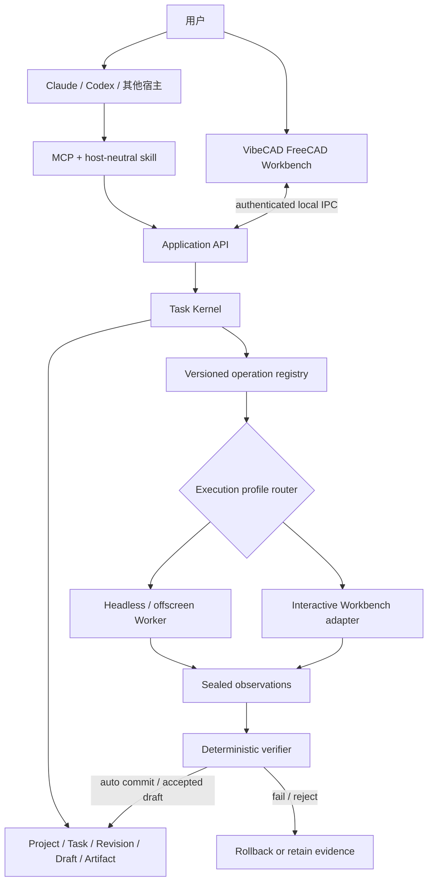
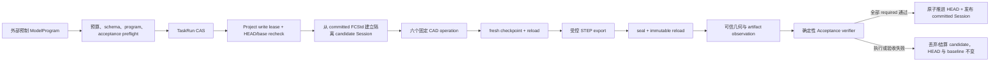
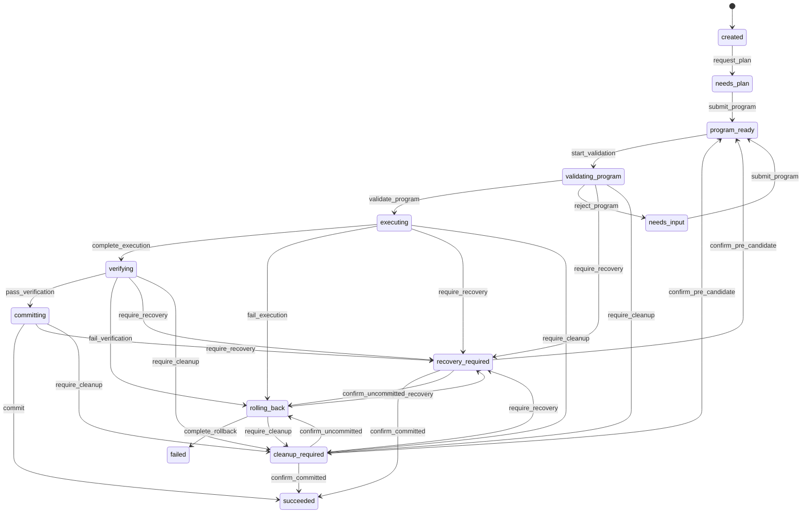

# VibeCAD Agent 架构与开发路线

> 状态：Accepted current-state baseline + reviewed 2026-07-21 Stage 3 dependency order
>
> 日期：2026-07-20
>
> 当前实现基线：VibeCAD 0.4.0 worktree，Stage 3 S3-1 至 S3-3 已本地提交
>
> 文档角色：Agent 定位、已实现边界和目标架构的决策真源
>
> 当前项目通用架构见 [`ARCHITECTURE.md`](ARCHITECTURE.md)
>
> 分期能力与企业化路线见 [`PRODUCT_CAPABILITY_ROADMAP.md`](PRODUCT_CAPABILITY_ROADMAP.md)

## 1. 结论先行

VibeCAD 的目标定位是一个 **CAD 专家 Agent**，不是通用自主 Agent，也不是模型供应商。它负责把外部模型或用户给出的设计意图收敛成受控程序，在隔离候选版本中执行，以 FreeCAD/OCCT 的事实独立验收，然后提交或回滚。

截至 2026-07-20，准确的产品状态是：

| 层次 | 当前状态 | 用户现在能否直接使用 |
|---|---|---|
| 现有低层 FastMCP | 已有 31 个低层 CAD/运行时工具 | 能，但它们仍走原有 Session 路径 |
| 确定性 Task Kernel | TK1–TK9 已形成内部 Python 组合；首批六操作和真实 FreeCAD 成功/失败/Selector/重载门已通过 | 只能由代码直接组合调用 |
| 任务级 MCP | 尚未注册 `create_task` 等高层工具 | 不能 |
| Codex/Claude 等宿主 skill | 尚未交付 | 不能 |
| FreeCAD Workbench | 目标架构已预留，G0/G1 尚未实现 | 不能 |
| Sampling / BYOK | 只有枚举预留，没有 backend 或模型调用 | 不能 |
| 自动 repair / replan / retry | 未实现，当前为零次语义重试 | 不能 |
| 照片、视频、STL、仿真 Provider | 只有架构预留，源码中没有 Provider 包 | 不能 |
| 任意 Python/FreeCAD 代码 Worker | 未来实验方向，当前不存在 | 不能 |

因此，Stage 2 完成的是“专家 Agent 的确定性内部内核”，不是已经可被 Claude、Codex
直接调用的完整 Agent 产品。下一产品阶段 Stage 3 不只是给五个内部方法套 MCP：
它还要把直接 CAD 操作与 ModelProgram 统一到同一个 Task Kernel，补齐稳定引用、
细粒度验收和 durable review，并建立 FreeCAD Workbench 的接入缝。

## 2. 已锁定的产品定位与目标架构

```text
用户 / 外部 Agent：理解目标、处理自然语言和歧义、生成受控计划
VibeCAD：校验计划、隔离执行、收集事实、验收、版本化和恢复
FreeCAD / OCCT：几何计算、文档重算、格式导入导出
```

锁定约束：

| 决策 | 结论 |
|---|---|
| 模型商业模式 | 用户自带宿主订阅或 API 授权；短期不采购、补贴或转售模型 Token |
| 首要宿主 | 欧美优先 Claude Code、Codex；亚洲补充 WorkBuddy/CodeBuddy 等支持标准 MCP 的宿主 |
| 核心协议 | 标准 MCP + 宿主无关 skill；不为每个 Agent 复制 CAD 业务逻辑 |
| 主执行路径 | 版本化 `ModelProgram` + 固定语义操作，不执行模型任意代码 |
| 工具策略 | 稳定控制面 + operation registry 派生的直接工具；工具数量不是产品目标 |
| 提交权 | 模型和工具返回都不能自证成功；确定性 verifier 拥有提交权 |
| 版本策略 | 所有修改先进入隔离 candidate；通过后才原子推进 HEAD |
| 执行端 | 一个 Task Kernel；后台 Worker 与 FreeCAD Workbench 是可组合的两个执行端 |
| 交互验收 | 验证成功的 candidate 可进入 durable draft；Accept 才推进 HEAD，Reject 不改 HEAD |
| Headless | 是 operation capability profile，不是所有能力的强制准入条件 |
| 照片/STL/仿真 | 后续调用现有外部引擎，通过 artifact Provider 接入，不自研底层引擎 |
| 任意代码 | 表达上限高，但只可能成为未来隔离 Worker，永不作为默认主路径 |

### 2.1 已确定的目标架构



Workbench 是选择、预览、微调和人工验收界面，不是第二个 Agent、第二个状态机或第二个
提交权威。宿主模型负责理解和规划；Task Kernel 负责隔离、验证、Revision 和恢复；
FreeCAD/OCCT 负责几何事实。

进程拓扑分两步演进：Stage 3 由 MCP server 在进程内拥有 AgentApplication，并只冻结
CadExecutionPort 与 IPC protocol；G1 再把相同 Application API 提取为独立 local
Kernel daemon，供 MCP adapter 与 Workbench 通过认证 IPC 共同访问。GUI managed
checkout 可以临时手工编辑，但发布时必须成为新 candidate 并重新验证，不能沿用旧
draft verdict。

## 3. 当前已经实现的内部闭环

当前 `TaskService` 是 direct-module-only 的同步服务，只接受外部已经生成的 `ModelProgram`。一次提交执行一个确定性尝试，不调用模型，不自动修改计划。



TK9 和 S3-3 已在现有 FreeCAD 环境中证明：

- 成功路径：Box/Cylinder 创建、参数修改、移动、旋转和 inspection 可在一个 program 中通过
  ResultRef 串联，checkpoint、STEP、seal、verify 和 commit 后 FCStd/STEP 重载事实一致。
- 稳定目标：revision-bound Selector 可跨 recompute/checkpoint/reload 定位已有对象；导入的
  180° partial Cylinder 按真实 BoundBox center 旋转，不把质心误当 pivot。
- 执行失败和验收失败都不推进 HEAD；base revision/hash、manifest/generation、live baseline
  Session 与 durable TaskRun 均通过回滚断言。
- 多对象 aggregate observation 与 STEP 覆盖完整 managed primitive inventory，不再只依赖
  legacy 单一 result root。

## 4. 当前代码分层

### 4.1 当前公共入口

`src/vibecad/server.py` 注册 31 个低层 FastMCP 工具，包括项目、建模、修改、测量、渲染和运行时工具。它们早于 Task Kernel 存在，仍操作原有进程内 Session。

当前没有任务级 MCP 工具。`TaskService.create_task()`、`get_task()`、`submit_model_program()`、`continue_task()` 和 `reconcile_task()` 只是内部 Python 方法，没有在 `server.py` 注册。

在 Stage 3 完成共享 lease/session ownership 前，不能把 TaskService 与低层 mutating
MCP 同时用于同一项目，否则会形成两条未同步写路径。目标边界已经确定：

- 旧 module-global Session 公共写路径退役；
- 有价值的直接 CAD 工具交互形态保留，但由 operation registry 生成薄 adapter；
- 直接工具和 ModelProgram 都绑定显式 project/base revision，并进入相同的
  candidate、verifier、commit/rollback/recovery；
- 未达到稳定 selector、observation 和 verifier 准入门的旧能力暂不公开迁移。

因此，只把五个 TaskService 方法套一层 MCP decorator，或让直接工具继续旁路 Kernel，
都不算完成 Stage 3。

### 4.2 当前任务控制平面

已实现：

- 严格、版本化的 `TaskRun` 状态与 transition history。
- 有 generation 的 `TaskRunStore` compare-and-set 与原子持久化。
- 同项目排他写 lease。
- `LocalRevisionStore` 的 immutable revision、HEAD、journal 和 reconcile。
- `CandidateCoordinator` 的 Session 隔离、checkpoint、seal、commit、rollback/reconcile。
- `TaskService` 的单次同步事务编排。

未实现：

- 自然语言 Intent 解析、计划生成、模型调用和 usage 统计。
- 自动 repair/replan、语义 retry、取消或异步 job worker。
- 公共任务 envelope、MCP capability negotiation 和宿主接入。

### 4.3 当前 CAD 领域与执行平面

已实现的默认 `ModelProgram` registry 精确包含六个 object-level operation：

| operation | 固定 handler | 作用 |
|---|---|---|
| `create_box` | `create_box` | 创建参数化 Box |
| `create_cylinder` | `create_cylinder` | 创建参数化 Cylinder |
| `modify_parameter` | `modify_parameter` | 修改一个对象参数 |
| `move_part` | `move_part` | 设置对象绝对位置 |
| `rotate_part` | `rotate_part` | 绕固定全局轴和对象 BoundBox center 旋转 |
| `inspect_model` | `inspect_model` | 由 executor 返回 revision-bound per-object 与 aggregate observation |

`create_document` 已退出 ModelProgram；空文档或导入 FCStd 属于 project bootstrap 和 trusted
candidate lifecycle。创建操作返回 typed result handle；后续 mutator 只接受同 program ResultRef
或 revision-bound SelectorV1，不接受 raw Name/Label。

FCStd checkpoint、STEP export、seal、observation 和 commit 是 TaskService 固定内核步骤，不是模型可以排列或省略的 operation。

当前执行器是 same-process 的 `InProcessCadExecutor`，复用既有 `Session + tools + FreeCAD`。独立 FreeCAD Worker 仍是未来目标；当前不能宣称 OCCT 崩溃与控制平面已经进程隔离。

### 4.4 当前 verifier

提交权只来自 sealed candidate 的可信 observation。当前白名单是：

| 类别 | checks |
|---|---|
| geometry | `volume`、`area`、`bbox`、`center_of_mass` |
| topology | `valid_shape`、`solid_count` |
| artifact | `exists`、`non_empty`、`format` |
| preservation | `unchanged`（绑定 per-entity preservation observation） |

artifact `format` 当前只接受 `fcstd` 和 `step`。孔径/深度、装配干涉、视觉、制造规则和
深层 STEP 语义检查尚未拥有 commit authority。

## 5. 当前契约事实

### 5.1 ReasoningOwner

schema 预留了：

```text
external_plan | mcp_sampling | byok
```

但当前 `TaskService.create_task()` 只接受 `external_plan`；另外两个值会返回固定的 unsupported 错误。源码中没有 Sampling backend、BYOK Provider、Keychain、模型 SDK、模型预算或嵌套推理。

### 5.2 ModelProgram v1

下面是当前代码可以 round-trip 的真实结构，不是未来示意：

```json
{
  "schema_version": 1,
  "task_id": "task_11111111111111111111111111111111",
  "base_revision": "revision_22222222222222222222222222222222",
  "operations": [
    {
      "schema_version": 1,
      "id": "box",
      "op": "create_box",
      "target": {},
      "args": {"length_mm": 10, "width_mm": 20, "height_mm": 30},
      "preserve": [],
      "source": "model",
      "depends_on": []
    },
    {
      "schema_version": 1,
      "id": "length",
      "op": "modify_parameter",
      "target": {"object": {"command_id": "box", "slot": "object"}},
      "args": {"parameter": "length", "value_mm": 12},
      "preserve": [],
      "source": "model",
      "depends_on": ["box"]
    }
  ],
  "acceptance": {
    "schema_version": 1,
    "id": "acceptance-box",
    "criteria": [
      {
        "schema_version": 1,
        "id": "volume",
        "kind": "geometry",
        "check": "volume",
        "target": "body",
        "expected": 7200,
        "tolerance": 0,
        "parameters": {"unit": "mm^3"},
        "required": true
      },
      {
        "schema_version": 1,
        "id": "solid",
        "kind": "topology",
        "check": "solid_count",
        "target": "body",
        "expected": 1,
        "tolerance": null,
        "parameters": {},
        "required": true
      }
    ]
  }
}
```

`preserve` 只能从 operation metadata 的封闭字段集中选择，并且只能增加固定 handler 不变量，
不能削弱它们。每条命令执行前后的实体 observation 和 sealed/reloaded preservation evidence
共同决定是否允许提交。

### 5.3 TaskRun v1

当前持久化字段只有：

- id、project id、base revision 和 reasoning owner。
- status、program、candidate revision、committed revision。
- step records、verification reports、artifact refs、last error 和 transitions。

AcceptanceSpec 通过 `program` 持久化；step 可以保存 elapsed time。TaskRun 当前不保存独立 goal、Intent、assumptions、approvals、模型 usage 或通用 repair history。

`workflow.contracts` 中已经有 versioned `Intent` 数据契约，但当前 TaskService 不接收它，TaskRun 也不持久化它；它尚未进入执行闭环。

当前也没有独立的通用 Artifact Store。任务保存 path-free artifact refs；FCStd/STEP 文件由 revision store 拥有。

## 6. 当前状态机与恢复语义

当前有 13 个 durable status，没有 `planning`、`repairing`、`cancelled` 或 `timed_out`：



恢复边界必须精确理解：

- HEAD 前：执行或 required verification 失败会结算 candidate；committed HEAD、baseline revision bytes 和 committed Session 不变。
- seal 后但 HEAD 前：immutable、未提交 revision 可以保留，用于证据与 reconcile；它不是 committed revision。
- HEAD 原子前移后：HEAD 绝不倒退。后续 TaskRun CAS、Session 发布或清理出现歧义时进入 recovery/cleanup，由 HEAD、manifest、revision ancestry、journal 和 live binding 共同判定。
- “rollback”绝不表示撤销已经提交的 HEAD。
- 当前没有自动语义重试。已发布 candidate 只有在 rollback 被明确证明完成后才终止为 `failed`；清理或持久化结果不确定时会停在 `cleanup_required` / `recovery_required`。clean failure 后的新计划需要新 TaskRun；validation rejection 需要外部重新提交 program，而 pre-candidate crash 只有在 reconcile 明确回到 `program_ready` 后才能显式继续。

## 7. 推理模式的当前与目标边界

### 7.1 External Plan：当前内部可用

```text
Claude / Codex / WorkBuddy / 用户代码
→ 生成 ModelProgram + AcceptanceSpec
→ VibeCAD 内部 TaskService 校验、执行和验收
```

这是 Stage 3 要公开的第一条主路径。VibeCAD 不持有模型 Key，也不产生嵌套模型调用。当前缺的是公共 MCP/skill 适配，不是内核执行能力。

### 7.2 MCP Sampling：未来可选

目标是由支持 Sampling 的宿主使用自己的模型授权返回受约束计划。落地前必须有 capability negotiation、用户授权、调用/输出/超时预算和 depth=1 限制。当前没有任何实现。

### 7.3 BYOK：未来独立入口

目标是用户直接配置 Provider API。Key 不得进入 MCP 参数、TaskRun、项目、日志、artifact 或 FreeCAD Worker。当前没有 secret store、Provider adapter 或参考模型后端。

同一 TaskRun 任何时候只能有一个 reasoning owner。外部已经提交 program 后，VibeCAD 不得为了“再确认”隐式调用 Sampling 或 BYOK。

## 8. 计划中的公共接口、直接工具与 skill

公共接口分为两层，使用同一个 Application API 和 Task Kernel。

### 8.1 稳定控制面

Stage 3 首批控制面包括：

- Runtime：`ping`、`get_runtime_status`、`ensure_runtime`、
  `uninstall_runtime`；
- Capability：`get_capabilities`；
- Project：`create_project`、`get_project`；
- Task：`create_task`、`get_task`、`submit_model_program`、
  `resume_task`；
- Review：`accept_draft`、`reject_draft`；
- Artifact：`export_task_artifacts`。

`continue_task` 和 `reconcile_task` 是内部恢复 primitive，由 `resume_task`
根据 durable 状态选择。当前没有 `cancel_task`、异步 job worker 或通用
`agent_run(request)`，不能提前宣称。

### 8.2 Registry 派生的直接工具

第一批只迁移不依赖 face/edge 拓扑重定位的 object-level operation：

`create_box`、`create_cylinder`、`modify_parameter`、`move_part`、
`rotate_part` 和 `inspect_model`。

直接工具不是 legacy handler 的重新注册。它必须被编译为 ModelCommand，绑定显式
project/base revision，并进入同一个 candidate 和 verifier。工具 manifest 是稳定
控制面与 registry 中 direct_exposed operation 的并集，不使用固定数字作为产品目标。

### 8.3 宿主 skill

宿主 skill 只教授：

- 如何发现 operation schema、execution profile 和真实限制；
- 何时使用直接工具，何时构造 ModelProgram/AcceptanceSpec；
- 如何读取固定错误、TaskStatus、generation、draft 和 next action；
- 如何处理 conflict、needs_input、failed、awaiting_user_review 和
  recovery_required；
- 哪些能力尚不支持，不能退化为任意 Python。

skill 不复制状态机、Revision、CAD handler 或提交逻辑。

## 9. 未来 Provider 与高级代码通道

源码当前没有 `providers/` 包或以下 Protocol；这些只是目标端口：

```python
class SourceToMeshProvider(Protocol): ...
class MeshToCadProvider(Protocol): ...
class SimulationProvider(Protocol): ...
```

目标数据流：

```text
照片/视频引擎 → Mesh Artifact
Mesh/STL 逆向引擎 → STEP/BRep/参数化候选 Artifact
VibeCAD Task Kernel → 精细编辑、验证、版本化
Simulation Provider → 报告与场结果 Artifact
```

Provider 结果只能作为有来源、有哈希的输入或候选 artifact，不能直接获得 commit authority。

任意 Python/FreeCAD 代码的表达上限高，但当前没有代码 Worker。若未来实验，必须同时具备独立进程/沙箱、只读输入副本、CPU/内存/时间/import/输出限制、完整审计，以及与主路径相同的独立验收。它永不替代 ModelProgram 主路径。

## 10. 当前包边界

已存在：

```text
src/vibecad/
├── workflow/
│   ├── contracts.py
│   ├── errors.py
│   ├── program.py
│   ├── state.py
│   ├── store.py          # TaskRun persistence
│   ├── lease.py
│   └── service.py
├── execution/
│   ├── registry.py
│   ├── results.py
│   ├── adapter.py
│   ├── revisions.py      # Revision/HEAD/journal/artifact persistence
│   ├── candidate.py
│   └── executor.py
└── validation/
    ├── contracts.py
    ├── checks.py
    └── engine.py
```

尚不存在：

```text
workflow/repair.py
reasoning/
providers/
独立 FreeCAD worker
local Kernel daemon / authenticated IPC
任务级 MCP / host-neutral Agent skill
application/ composition API
interaction/ CadExecutionPort
FreeCAD Workbench plugin
```

依赖方向继续保持：

```text
server / future Workbench → application API
application API → workflow
workflow → execution + validation
execution → existing semantic tools → engine/session → FreeCAD
future reasoning 不得依赖 FreeCAD
future FreeCAD worker 不得获得模型 Key
future Workbench 不得拥有独立 Task/Revision 状态机或模型 Key
```

## 11. 开发路线与可见交付

| 阶段 | 状态 | 完成后用户能看到什么 |
|---|---|---|
| Stage 0 决策与基线 | 已完成 | 产品边界、模型策略和主路径明确 |
| Stage 1 稳定执行契约 | 已完成 | versioned contracts、registry、normalizer、program validation |
| Stage 2 确定性 Task Kernel | 已完成内部窄切片 | 真实 FreeCAD 成功提交及两类失败回滚可重复证明 |
| Stage 3 Agent 主路径与 G0 | S3-R3.2 执行中，S3-1 至 S3-3 已完成 | 控制面、首批直接工具、ModelProgram、durable review 和插件接入缝 |
| G1/P1 交互单零件 | 未开始 | FreeCAD 中选择、预览、Accept/Reject、精调和 STL 主流程 |
| P2 完整机械交付 | 未开始 | 装配、BOM、TechDraw、Release Package |
| P3 企业试点 | 未开始 | Worker/queue、身份权限、审计、备份、可观测性和 API |
| P4 高级制造 | 未开始 | PMI/AP242、制造分析、外部重建与仿真 Provider |

Stage 3 的开发顺序：

1. 补 command result handle、扩展类型系统和 execution profile metadata（已完成）。
2. 实现 object/feature UUID、SelectorV1 Level A、per-object observation 和 preservation
   verifier（已完成）。
3. 迁移首批六个 object-level operation（已完成）。
4. 冻结 bounded Application/Task API envelope、strict JSON ingress、可执行 Task adapter 和
   registry capability projection；不提前注册 MCP。
5. 实现 durable draft/review、Accept/Reject、HEAD CAS 和重启恢复。
6. 组合 AgentApplication、CadExecutionPort、project bootstrap、lazy isolated runtime、
   managed checkout 与 runtime/data 边界。
7. 先完成 verified artifact materialization，再原子发布稳定 MCP 控制面、registry 派生直接
   工具和 manifest cutover；随后执行 AR-1。
8. 发布 host-neutral skill、文档和分发契约，并执行全量、真实 FreeCAD 与跨宿主 E2E。

具体 commit、gate、恢复矩阵和持续执行规则见
[`orchestrated/vibecad-agent-stage3.md`](orchestrated/vibecad-agent-stage3.md)。

Stage 3 完成时，用户应能在 Claude Code 或 Codex 中对同一 managed project 使用简单
直接工具或多步 ModelProgram。两条路径都返回可重读 task、可信 verifier 证据和
committed FCStd/STEP，或返回可跨重启 Accept/Reject 的 draft；失败时原项目不变。
FreeCAD Workbench 尚未在该时点交付，但已有稳定接口可以进入 G1，而不需要重做任务、
Revision 和验收系统。

## 12. 架构不变量

后续每次设计和评审必须检查：

1. 一个 TaskRun 是否始终只有一个 reasoning owner。
2. program 大小、持久化 envelope、schema、acceptance 和 operation 是否在 project mutation、candidate 创建和 FreeCAD 调用前完成 preflight。
3. 模型输出是否只能进入固定 operation registry，不能提供 handler、输出路径或任意代码。
4. StepResult、模型文本或渲染是否被错误地当作 commit 证据。
5. 修改是否发生在隔离 candidate，而不是 committed Session/revision。
6. HEAD 前移后是否只 reconcile、不倒退、不重复 CAD side effect。
7. public MCP 与低层工具是否共享唯一 lease/session authority。
8. 是否把未来 Sampling、BYOK、repair、Provider 或 Worker 写成当前能力。
9. 模型 Key 是否可能进入 FreeCAD、TaskRun、日志、artifact 或 MCP 参数。
10. 每项新增 CAD operation 是否同时具有参数契约、确定性 observation/verifier 和真实回归。
11. 直接工具是否由同一 registry 派生，并进入与 ModelProgram 相同的 candidate 和 Revision 流程。
12. operation 是否诚实声明 headless、offscreen_gui 或 interactive_gui profile，且没有静默降级。
13. awaiting_user_review 是否释放 lease；Accept 是否重取 lease 并对 base HEAD 做 CAS；Reject 是否保持 HEAD 不变。
14. Workbench 是否仅承担交互执行和审阅，不复制 Task Kernel、不持有模型 Key、不直接提交 immutable revision。

## 13. 目标成功标准

最终目标不是“模型能生成一段 FreeCAD 代码”，而是：

> 不同模型和不同宿主都能提交同一种受控设计意图；VibeCAD 在隔离候选版本上执行，使用几何与 artifact 事实证明结果，通过后提交，失败时保持 committed 项目不变，并留下可恢复、可重放、可审计的 TaskRun。

当前已经证明其中的内部确定性执行、验证、提交与回滚部分。跨宿主公共协议、直接工具
派生、durable review、交互式 Workbench、扩大 CAD 白名单和外部 Provider 仍需按上述
阶段逐步交付。
