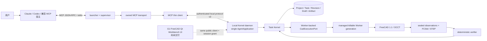
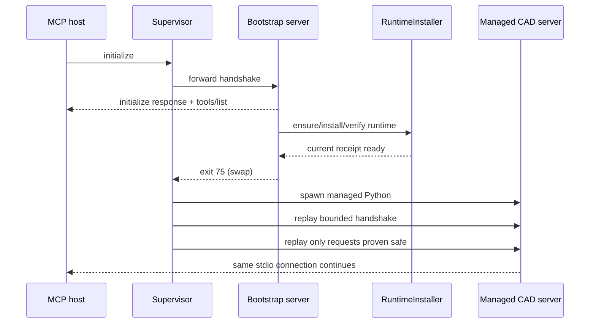
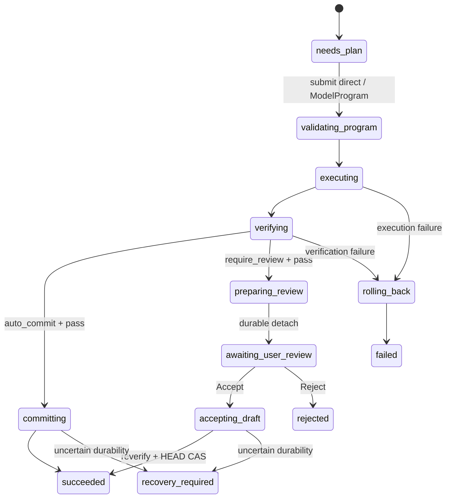

# VibeCAD 当前实施架构

> 实现基线：P0-B core backend / VibeCAD 0.6.0 / runtime epoch 4
>
> 架构复审：AR-1 + P0-B C14 refresh / 2026-07-23
>
> S3-8 的宿主 skill、发现合同和 ResourceLink，以及 P0-B 的可恢复生命周期、单 Kernel daemon、
> file grant 和可杀 Worker backend 已在本地交付。0.6.0 仍是未发布候选：尚未在真实
> Claude/Codex 主机中安装激活并执行验收，当前没有 tag 或 release；protocol/package
> `host-ready` 不能表述为 `host-verified`。
>
> 本文只描述当前源码已经实现的边界。产品定位与调用策略见
> [`AGENT_ARCHITECTURE.md`](AGENT_ARCHITECTURE.md)，分期能力见
> [`PRODUCT_CAPABILITY_ROADMAP.md`](PRODUCT_CAPABILITY_ROADMAP.md)。

## 1. 系统定位

VibeCAD 是一个由 Claude、Codex 等外部宿主调用的本地 FreeCAD 专家 Agent。宿主模型负责理解
自然语言、消除歧义和生成计划；VibeCAD 负责把计划约束为可验证 CAD 操作，并管理项目、任务、
候选版本、人工审核、恢复和交付。

当前边界是：

- VibeCAD 不内置、采购或转售模型 token；当前 reasoning owner 只有 `external_plan` 可执行。
- 公共主路径是 Agent-first 项目与任务协议，不再公开旧版 31 个 module-global Session 工具。
- 模型不能提交 Python、FreeCAD 脚本、handler 名、shell 命令或任意输出路径。
- 所有 CAD 修改都发生在 committed revision 的隔离副本中，并由确定性 verifier 决定能否发布。
- 当前真实 CAD 执行 profile 是 macOS 上的 managed `headless` Worker；same-user authenticated
  daemon、session-bound file grant 和 Worker crash/hang recovery 已实现，G1 FreeCAD Qt Workbench
  UI 与 interactive GUI profile 尚未交付。
- 当前项目可从空模型或只含 `Part::Box` / `Part::Cylinder` 的受支持 FCStd 信封开始；公开交付格式为
  FCStd 和 STEP，通用 FCStd 导入仍属 P1。

历史 `engine/`、`tools/` 和 `feedback/` 仍保存大量 FreeCAD 能力实现与测试资产，但它们是内部
执行库存，不是当前公共 endpoint 合同。后续能力只能经 operation registry、Task Kernel 和 verifier
逐项迁入，不能重新暴露旧 Session 旁路。

## 2. 系统上下文与唯一写入权威



所有写请求必须经过同一条权威链：

```text
strict request
→ bind project HEAD and immutable base revision
→ acquire project write lease
→ create isolated candidate
→ execute allowlisted operations
→ checkpoint / STEP / reload / seal observations
→ deterministic verification
→ auto-commit or durable review
→ HEAD CAS / reject / rollback / recovery
```

`RevisionStore` 的 HEAD 是项目提交事实；`TaskRunStore` 记录执行与审核事实；journal 记录 revision
事务结论。响应文本、模型自评、FreeCAD `recompute()` 返回值、渲染图或单个 StepResult 都不能取得
提交权。

## 3. 入口、进程和运行时换芯

### 3.1 入口

| 场景 | 入口 | 当前行为 |
|---|---|---|
| MCPB | `mcpb_entry.py` | 通过 `uv run --frozen` 启动 launcher，并启用自动安装 |
| Python/其他 MCP 客户端 | `vibecad` / `python -m vibecad` | 进入同一 launcher；默认不自动下载 FreeCAD |
| 命令行维护 | `vibecad --uninstall [--yes]` | 只处理受管运行时，不启动 MCP |
| 低层调试 | `python -m vibecad.server` | 运行 owned server；没有 supervisor 时不能透明换芯 |

`launcher.py` 保持纯标准库。`Supervisor` 选择 bootstrap Python 或已经验证的受管 Python，并把
客户端 stdio 代理给子 server。Server 使用 MCP SDK 的 typed request/result 类型，但公开工具不是
一组 `@mcp.tool` decorator；`server.py` 从冻结的 `PublicToolSpec` 生成 discovery，再由 owned transport
执行严格 framing、握手、请求准入、取消、资源读取和有界并发。领域请求通过薄
`LocalAgentClient` 进入同一个持久 local Kernel daemon；MCP 进程断开不会销毁 Kernel，也不会创建
第二个 `AgentApplication` 或第二套 store 权威。

### 3.2 Bootstrap 与受管 CAD 进程



换芯不是通用“重试所有请求”。Supervisor 只重放握手和被固定 annotations/状态证明为 replay-safe
的请求；无法证明结果的非幂等请求不得盲重试。Owned server 当前有四个 work slots，但所有真正
进入 FreeCAD 的操作还受一个进程级 CAD gate 串行化；project lease 和 HEAD CAS 再处理跨进程竞争。

## 4. 受管 FreeCAD 与数据隔离

当前受管环境固定 Python 3.12、FreeCAD 1.1.0、MCP 1.27.2。安装器使用版本、私有 server epoch、
MCP 版本和 public-surface digest 组成 receipt；只有 receipt 与目标解释器中的真实包身份都匹配时，
supervisor 才会交棒。

运行时与用户数据严格分根：

```text
VIBECAD_HOME/
├── runtime/
│   ├── bin/micromamba
│   ├── mamba/envs/vibecad/
│   ├── status.json
│   ├── install.log
│   └── external-runtime.json
├── data/
│   ├── locks/
│   ├── tasks/
│   ├── projects/
│   ├── bootstrap/
│   ├── checkouts/
│   └── artifacts/
├── .runtime-maintenance.lock
└── .runtime-removal.json
```

macOS 默认根目录为 `~/Library/Application Support/VibeCAD`。Stage 3 的 durable Application data opener
当前只在 Darwin 上声明可用；Windows/Linux 虽保留部分 runtime 兼容代码，但不是当前 Agent-first
产品支持声明。

`uninstall_runtime` 采用预览/确认两段式，只能删除 `runtime/` 身份绑定的受管目标；`data/` 中项目、
任务、revision、draft、checkout 和 artifact 必须保持字节不变。外部 `VIBECAD_FREECAD_ENV` 只验证、
不自动改写或删除。

## 5. 当前公共 MCP 面

当前 `tools/list` 精确包含 28 个工具：22 个稳定控制/领域 facade，加 6 个 registry-derived 直接
CAD 工具。

| 组别 | 工具 |
|---|---|
| 服务与运行时 | `ping`, `get_runtime_status`, `ensure_runtime`, `uninstall_runtime` |
| 能力 | `get_capabilities` |
| 项目与版本 | `create_project`, `get_project`, `list_projects`, `list_revisions`, `compare_revisions`, `revert_project` |
| 任务 | `create_task`, `list_tasks`, `get_task`, `get_task_events`, `submit_model_program`, `resume_task`, `cancel_task` |
| 审核 | `accept_draft`, `reject_draft` |
| 交付 | `get_artifact_manifest`, `export_task_artifacts` |
| Registry direct | `create_box`, `create_cylinder`, `inspect_model`, `modify_parameter`, `move_part`, `rotate_part` |

Manifest、运行时 discovery 和 receipt digest 都来自同一 public-surface 合同；S3-8 已门禁 manifest
与 `PublicToolSpec` 的名称和 description 精确一致，并在稳定工具与 registry direct operation 重名时
fail closed。所有 tool 输入是关闭的
JSON Schema；unknown field、错误类型、非有限数、重复 JSON key、深度/节点/字节超限都在 Application
或 FreeCAD 访问前拒绝。领域调用统一返回：

```json
{
  "schema_version": 1,
  "ok": true,
  "result": {},
  "error": null
}
```

失败时 `result` 为 null，`error` 只包含固定 code、bounded path 和固定 message，不反射本地路径、
异常文本或模型输入。MCP `structuredContent` 与 JSON 文本内容表达同一 envelope。

AR-1 发现 S3-7 discovery 缺少 tool description，而且重复广播完整 task output schema，使一次
`tools/list` 约 350 KB。S3-8 已补齐描述、从宿主发现投影中省略可选 output schema，并继续在服务端
保留完整输出验证；当前固定 28-tool SDK projection 为 21,438 bytes，SHA-256 为
`5d7703a55dd7b20c21c487d6f4740fbfb894cf6867c840ccb30adf57de63efda`；完整 discovery frame 为
21,483 bytes，SHA-256 为
`22c903b05fc6e46868bd74380880cca5c915f312ac2ddf24f7e48896b8cdf826`，低于 32,768-byte 上限。
direct operation 与稳定工具重名会 fail closed。

## 6. Application 与 Task Kernel 分层

```text
MCP server / future Workbench UI
└── LocalAgentClient                 thin public adapter
    └── authenticated protocol v2
        └── Local Kernel daemon
            └── AgentApplication     single process-owned composition root
                ├── ProjectApi / DurableProjectService
                ├── TaskApi / DirectOperationApi
                ├── RevisionCompareService
                ├── ArtifactApi / ArtifactManifestService / ArtifactMaterializationService
                ├── TaskCatalogService
                ├── per-project TaskService runtime
                ├── ResourceLeaseManager
                ├── TaskRunStore
                ├── LocalRevisionStore
                ├── ManagedCheckoutStore
                └── CadExecutionPort
                    └── managed killable Worker generation
```

唯一 `AgentApplication` 由 daemon 在第一个获准领域请求后加载；discovery 不导入 FreeCAD、legacy
Session、candidate executor 或 artifact service。它绑定 daemon 创建进程 PID，close 后或 fork 后不能
复用。MCP 与 public Workbench client 只提交同一组 Application request，不直接打开 store、lease 或
Worker，也不拥有第二个 scheduler。

直接工具不是第二套 handler。`DirectOperationApi` 读取同一 registry metadata，验证 task generation、
状态和 revision-bound selector，把调用编译成一个 `ModelCommand` 和一个 `ModelProgram`，最后只进入
`TaskApi.submit_model_program()`。多步任务直接提交一个 ModelProgram；两条路径共享 candidate、
verifier、Revision、review 和 recovery。

## 7. 项目、任务和审核生命周期

### 7.1 项目

`create_project` 支持：

- `empty`：创建 generation-zero 空 revision；
- `import_fcstd`：只接受非空且全部对象均为受支持 `Part::Box` / `Part::Cylinder` 的 FCStd 信封，将其
  复制到私有 staging，用 FreeCAD 重新验证、补齐 identity 并归一化，再发布 generation-zero revision；
  原文件不被修改，任一其他对象类型都 fail closed。

`create_key` 使项目创建在响应丢失后可按同一意图重放。`get_project` 返回 coherent HEAD/revision
快照和内容寻址 artifact 元数据。项目 id 未知时，`list_projects` 以 snapshot-bound cursor 分页返回
当前 committed HEAD 摘要；`list_revisions` 只投影指定项目当前 HEAD 的完整已提交祖先。revision
页面按 canonical id 排序而非时间排序，调用方从 `head` 沿 `base_revision` 恢复链；draft、candidate
和 abandoned revision 不会伪装成 committed history。cursor snapshot 改变时返回 conflict，调用方
从第一页重启。两条发现路径不导入 FreeCAD、不构造 runtime，也不取得 project write lease。

`compare_revisions` 只接受这条已验证 ancestry 中的两个 revision，并在前后 ancestry 快照之间流式
核对 manifest、FCStd 和 STEP 的存在、大小与 SHA-256。它报告谱系、base、manifest 和 artifact
descriptor 差异，但将 geometry/entity/parameter semantic diff 明确标为 `unsupported`。
`get_artifact_manifest` 绑定 exact task generation、revision、draft、verification 和 observation，
只读检查已有 PUBLISHED delivery；空 catalog 或未发布 delivery 返回 `materialized=false`，不创建
artifact store、不运行 CAD、不复制、物化或清理文件。

### 7.2 TaskRun

每个任务绑定创建时的完整 base HEAD、一个 `review_policy` 和唯一 reasoning owner。当前公共创建只
使用 `external_plan`。任务通过 generation compare-and-set 推进，调用方必须使用上一次响应中的
`expected_generation`，不能靠内存状态猜测。取消响应未知时允许重放完全相同的旧请求；若取消已
持久化，服务返回当前 cancellation state，而不是再追加一次 transition。



实际状态机还包含 `created`、`needs_input`、`program_ready`、`cleanup_required` 等恢复状态；调用方按
`next_action` 和固定 error code 处理，不自行推动内部 transition。

`cancel_task` 当前只从 `created`、`needs_plan`、`program_ready` 和 `needs_input` 以 task-store CAS
立即进入 `cancelled`。相同取消意图在响应丢失、重启或并发后收敛到同一 generation 和唯一
`request_cancel` event。这个路径不构造 CAD/runtime/artifact 组件，不取得 project write lease，也不
改变项目 HEAD、源文件或 artifact tree。`awaiting_user_review` 必须用 `reject_draft`。

active CAD 状态的 durable cancellation backend 已接通：`cancel_task` 先持久化
`cancel_requested` / `cancelling`，再请求终止当前 Worker generation。父 Kernel 以 generation fence、
候选 rollback、未提交证明和 TaskRun CAS 收敛最终状态；不确定的子进程退出或持久化结果不会被包装成
成功。并发取消、响应丢失和重启都复用同一持久意图，不透明重放 CAD effect。MCP
`notifications/cancelled` 仍只终止一个 transport request，不替代 durable task cancellation。

`auto_commit` 在验证通过后推进 HEAD。`require_review` 只发布 immutable draft 并释放 lease；Accept
重新打开候选、重新采集事实、重新验证、重取 lease 并对完整 base HEAD 做 CAS。Reject 只改变 task
状态，永不修改 HEAD。awaiting draft 可跨 server 重启恢复。

`create_task` 要求 caller 保留 `task_create_` key；相同 key 与不可变意图可安全重放并返回任务的当前
generation。未知 task id 时用 `list_tasks` 的快照分页恢复，再以 `get_task` 读取权威状态；
`get_task_events` 只投影持久化 `TaskRun.transitions`，不声称时间戳或第二套事件库。

## 8. CAD operation、Selector 和 verifier

当前 registry 只有六个公开 operation：

| Operation | 目标 | 关键证据 |
|---|---|---|
| `create_box` | 新建 Box | 参数、object id、volume、bbox、valid/solid、reload |
| `create_cylinder` | 新建 Cylinder | 参数、object id、volume、bbox、valid/solid、reload |
| `modify_parameter` | 已有对象或 ResultRef | 参数前后值、对象 identity、preservation |
| `move_part` | 已有对象或 ResultRef | Placement、几何不变量、preservation |
| `rotate_part` | 已有对象或 ResultRef | Placement、bbox-center pivot、preservation |
| `inspect_model` | 当前 candidate | revision-bound per-entity 与 aggregate observation |

创建命令返回 typed ResultRef，供同一 ModelProgram 的后续命令引用。已有模型使用 SelectorV1 Level A：
project/revision、持久 object/feature UUID、object type、semantic role、provenance 和 cardinality。零命中、
多命中、错误 revision 或伪造 identity 全部 fail closed。

当前 verifier 支持 geometry aggregate、topology、artifact 和声明的 preservation；它足以证明首批 object
级操作，不足以证明 face/edge 语义、Sketcher 约束自由度、PartDesign feature intent 或完整 semantic
diff。Selector Level B、subshape fingerprint、mapped element、pick context 和更细 verifier 属于 P1。

FreeCAD/OCCT 已从控制面移入受管、可杀的 Worker generation。父 Kernel 保留 Task、Revision、lease、
review 和提交权；Worker 只持 opaque CAD session 和父进程预留的 candidate staging，不接收 daemon
secret 或 store authority。每个私有 CAD RPC 都有固定 deadline；timeout、signal、EOF、损坏响应或
generation mismatch 会终止整个子进程组、驱逐该 generation 的 session，并由父 Kernel 回滚或
reconcile。它提供 fault containment，但仍是同 UID 可信子进程，不是恶意代码 OS sandbox；远程
Worker/queue 和强沙箱留在 P3。

## 9. Artifact 与 MCP resource

候选通过 CAD 执行后，RevisionStore 拥有 immutable FCStd 和 STEP。`export_task_artifacts` 只接受：

- 已提交且与 TaskRun/immutable revision/manifest 一致的 revision，包括项目 HEAD 后续前移后的历史
  committed revision；或
- 明确绑定同一 task generation、draft id、passing report 和 manifest 的 awaiting draft。

Artifact service 在 task transition 共用 gate 下，按 `export_key` 幂等地执行 descriptor-bound copy、
hash/size/identity 校验、FreeCAD reload 验证和原子 PUBLISHED materialization。返回对象不泄露本地
路径，只给出：

```text
vibecad://artifact/<materialization_id>/<artifact_id>
```

`resources/read` 再返回 `BlobResourceContents`。当前 MCP SDK 会在内存中完整缓冲 base64 payload，读取
上限固定为 64 MiB；更大文件、流式传输和本地 broker 属于 G1/P1。S3-8 已在成功 export 的 tool
result 中返回带精确 MIME type 的 FCStd/STEP 标准 ResourceLink，并用 typed/raw client 和 packed MCPB
验证两个资源的发现、读取与保存。真实 Claude/Codex 文件体验仍未在主机中激活验收，不能用任意
用户路径 copy-out 绕过 ArtifactStore，也不能把协议/包层结果升级为 host-verified 声明。

## 10. Managed checkout 与 Workbench 接入缝

`ManagedCheckoutStore` 可以从 HEAD 或 durable draft 创建只读来源绑定的私有 FCStd 副本，记录 source
revision、task generation、manifest、hash 和 open/closed tombstone。Checkout 永远不是权威数据；手工
修改若未来需要发布，必须形成新 candidate 并重新 observe/verify。

`interaction.protocol_v2` 与 local Kernel daemon 已形成可运行协议。daemon 使用 pinned private
run root、same-user peer identity、secret proof、session/error framing 和单实例发布；启动、升级、
卸载和 authenticated retirement 共享 crash-safe maintenance barrier。Checkout descriptor 仍不暴露
`local_path`。Workbench client 先打开 live HEAD/draft checkout，再领取仅绑定该 session、descriptor、
inode 与有效期的一次性 file grant；跨 session、重放、过期、symlink/hardlink 或 source
stale/revoked 都 fail closed。

当前 fake Workbench client 已通过公共 client package 与 MCP 共享同一个 daemon、TaskRun、draft、
verdict 和 HEAD；这证明 G1 可以作为薄客户端实现。G1 FreeCAD Qt Workbench UI 尚未交付。首版 UI
仍只承诺 HEAD/draft 预览、verdict、Accept/Reject 和 object/feature 选择；face/edge 与 dirty manual
publish 不在首版口径。

## 11. 安全与失败语义

- 几何与项目默认只在本机处理；网络访问只用于受管运行时和 Python 包安装。
- stdio MCP 信任启动它的宿主；独立 local daemon 另以 same-user peer identity、private secret proof
  和 session-bound protocol v2 鉴权，不接受未认证客户端。
- Application data、lease、revision、checkout、bootstrap 和 artifact store 使用私有目录、descriptor、
  owner/mode/link/identity 检查及 bounded records，拒绝 symlink/hardlink/path replacement。
- 同一 UID 的恶意进程仍位于当前本地主机信任边界之外；descriptor、file grant 和 Worker generation
  已减少意外路径/身份漂移，但不构成 OS sandbox。
- 任意 schema、execution、verification、export 或 review 失败都不得污染用户输入文件；HEAD 已提交
  后不倒退，只根据 durable truth reconcile。
- 错误、日志和 MCP SDK namespace 经过固定化/过滤，不回显秘密请求、绝对内部路径或原始异常。

## 12. 打包与测试事实

当前 0.6.0 本地交付候选冻结：

- source、manifest、lock 和 managed server receipt 的目标版本为 0.6.0；公开工具 28 个，MCP 1.27.2，
  server epoch 4，FreeCAD 1.1.0；receipt public-surface digest 为
  `ae495ba457af40a5837a03e77eef4b396b0a4209755878350bc341ac7de8bfd3`；
- 固定 28-tool SDK projection 为 21,438 bytes，SHA-256 为
  `5d7703a55dd7b20c21c487d6f4740fbfb894cf6867c840ccb30adf57de63efda`；完整 discovery frame 为
  21,483 bytes，SHA-256 为
  `22c903b05fc6e46868bd74380880cca5c915f312ac2ddf24f7e48896b8cdf826`。tool description 和 input
  schema 对宿主可见，完整 output validation 保留在服务端；
- canonical skill 位于 `skills/vibecad-agent/`；source、sdist、MCPB 和 standalone skill archive 携带
  同一 skill tree，wheel/受管 Python 环境刻意不携带 skill；
- MCPB 只声明已验证的 Darwin 产品路径；`uv.lock` 随包，tests/docs/runtime/cache 不进入产品包；
- C13 已证明 MCP 与 public Workbench client 经同一 Application/Task Kernel 共享 draft、verdict 和
  HEAD，client EOF/重连不改变 durable truth；C14 负责把同一 28-tool/skill/package identity 刷新到
  wheel、sdist、MCPB、fresh install 和 managed receipt。

完成 C14 package gate 后，该候选仍只能称为本地 protocol/package `host-ready`。真实
Claude/Codex 主机中的 skill 安装、reload、发现、长任务和文件取回尚未执行；当前没有 tag 或
release。

## 13. 源码地图

| 路径 | 当前职责 |
|---|---|
| `src/vibecad/server.py` | public discovery、strict MCP facade、runtime guard、resource read |
| `src/vibecad/mcp_transport.py` | framing、JSON lexical guard、admission、cancel、owned stdio runner |
| `src/vibecad/supervisor.py` | 子进程监督、握手/安全请求重放、runtime swap |
| `src/vibecad/daemon/` | 单实例 local Kernel、same-user auth、protocol v2 client/facade、启动与退休 |
| `src/vibecad/worker/` | managed FreeCAD Worker codec、generation、watchdog 与 session proxy |
| `src/vibecad/application/` | Agent composition、project/task/direct/artifact public use cases |
| `src/vibecad/workflow/` | TaskRun、CAS store、catalog、lease、review/recovery service |
| `src/vibecad/execution/` | registry、program binding、selector、candidate、revision、executor |
| `src/vibecad/validation/` | observation、acceptance compile、deterministic checks |
| `src/vibecad/interaction/` | CadExecutionPort、managed checkout、protocol v2 与 session-bound file grants |
| `src/vibecad/runtime/` | paths、receipt、installer、status、uninstall |
| `src/vibecad/engine/`, `tools/`, `feedback/` | 内部 FreeCAD 能力库存；非公共 endpoint |
| `manifest.json` | MCPB 平台、启动和 28-tool 静态声明 |
| `tests/` | 纯契约、恢复/竞态、真实 FreeCAD、package/MCPB E2E |

## 14. 当前限制与下一步

当前可可靠完成简单 object-level 单零件建模和尺寸/位置修改，但还没有：

- 真实 Claude/Codex 主机中的 skill 激活、canonical workflow 与文件体验验收；
- G1 FreeCAD Qt Workbench UI；
- retention/GC、private runner generation migration 和完整运行观测/恢复审计；
- face/edge Selector Level B、可视/语义 diff、Sketcher/PartDesign；
- STL/STEP 受控导入、mesh-to-faceted-BRep、装配、BOM、TechDraw；
- Sampling/BYOK backend、照片/视频重建 Provider 或仿真 Provider。

0.6.0 package/managed-runtime 本地候选已完成收口但尚未 tag 或发布。后续固定顺序是：
G1 Workbench MVP → P0-B hardening 收口 → P1/G2 单零件与 STL → P2 装配/图纸/交付。
真实宿主激活验收作为 S3-RES-06 residual 单独
关闭，不阻塞已完成的 protocol/package host-ready 定义。只有阶段需要改变专家
Agent、用户自带模型、单 Task Kernel 或 Workbench 非第二权威这些边界时，才需要新的产品决策。
