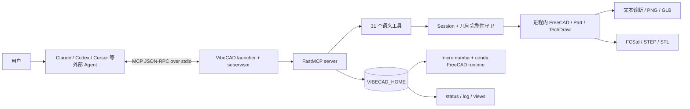
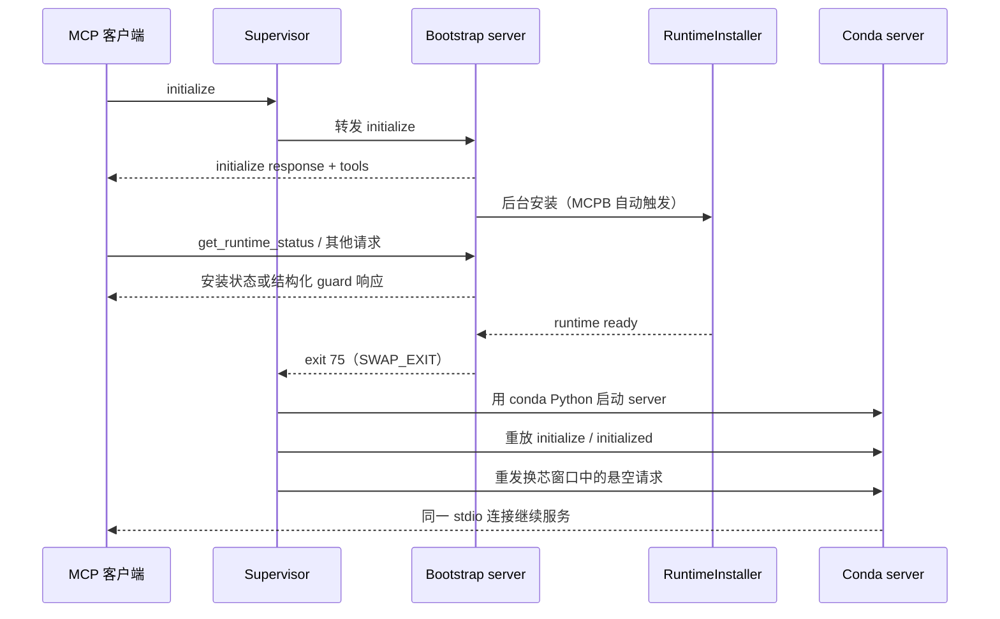
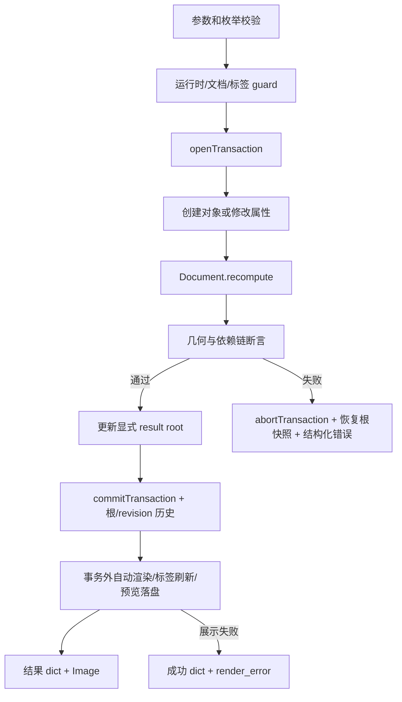

# VibeCAD 架构说明

> 基线：VibeCAD 0.4.0
> 更新日期：2026-07-20
> 文档口径：以当前源码、manifest 和测试为准；历史设计稿只用于解释决策，不代表已实现能力。
>
> 本文描述 0.4.0 现状。Agent-first、Task Kernel 与 FreeCAD Workbench 目标架构见
> [`AGENT_ARCHITECTURE.md`](AGENT_ARCHITECTURE.md)，分期能力见
> [`PRODUCT_CAPABILITY_ROADMAP.md`](PRODUCT_CAPABILITY_ROADMAP.md)。

## 1. 项目定位

VibeCAD 是一个以 MCP stdio 暴露能力的本地 CAD 后端。外部 AI 客户端负责理解自然语言、规划步骤和选择工具；VibeCAD 负责确定性地执行参数化建模、几何验证、装配、渲染和文件导出。

当前系统边界是：

- 它是 **MCP 工具服务**，不是一个已经自带模型和规划循环的独立 Agent。
- 它以 **FreeCAD 1.1.0 + OCCT** 为几何内核；0.4.0 不要求用户打开 FreeCAD GUI。
  这只是当前执行方式，不是长期强约束；目标架构同时支持后台 Worker 和交互 Workbench。
- 它通过受控的语义工具操作模型，不把任意 Python 或 FreeCAD 脚本执行暴露给模型。
- 它面向单次 MCP 连接维护一个活动 CAD 会话，可把完整参数化项目保存为 `.FCStd`，并将制造文件和预览图写到本地文件系统。
- 它的核心工程原则是：**参数先校验、修改进事务、结果靠几何事实验证、失败必须响亮、展示失败不能伪装成建模失败。**

当前没有实现的设计稿能力包括：内部 LLM 调用与 Agent Orchestrator、规则引擎、标准件库、BOM、约束草图、崩溃后自动恢复未保存修改，以及完整的工程图出图系统。

## 2. 系统上下文



系统分成两个运行层：

1. **引导层**：宿主或用户提供的普通 Python，只负责快速握手、运行时状态、后台安装和进程监督，不导入 FreeCAD。
2. **CAD 层**：VibeCAD 自建的 conda Python 3.12 环境，包含 FreeCAD、MCP 依赖和一份 `vibecad` 包；真正的建模工具在这个解释器中进程内执行。

这种拆分解决了两个冲突：MCP 必须快速启动，而 FreeCAD 又只能在特定 conda 运行时中可靠导入。

## 3. 入口、进程与启动模式

### 3.1 入口

| 场景 | 入口 | 行为 |
|---|---|---|
| Claude Desktop / Cowork 扩展 | `mcpb_entry.py` | manifest 用 `uv run` 启动，固定开启自动安装 |
| PyPI / 其他 MCP 客户端 | `vibecad` 或 `python -m vibecad` | 进入同一个 launcher；默认不自动下载运行时 |
| 命令行卸载 | `vibecad --uninstall [--yes]` | 不启动 MCP，直接走安全卸载逻辑 |
| 裸调试 | `python -m vibecad.server` | 可运行 server，但没有 supervisor，运行时就绪后不能无感换芯 |

`launcher.py` 保持纯标准库，先处理待执行卸载，再启动常驻 `Supervisor`。`Supervisor` 选择当前引导 Python 或托管 conda Python，并以子进程运行 `vibecad.server`。

### 3.2 零重连“换芯”



监督进程承担以下协议责任：

- 逐行双向转发 JSON-RPC，并记录 initialize 握手和未响应请求。
- 只把退出码 75 解释为换芯；其他退出码作为真实退出或崩溃原样透传。
- 在新子进程上重放握手，丢弃重复 initialize 响应，再重发悬空的引导阶段请求。
- 30 秒内无法完成新握手时强制失败，避免客户端永久挂起。
- 连续三次快速换芯时停止，防止哨兵与解释器状态不一致造成重启循环。
- 客户端 stdin EOF 后关闭并回收子进程，避免升级或退出后残留孤儿进程。

已知协议取舍：换芯窗口内没有 JSON-RPC `id` 的通知不记账，也不会重发。

## 4. FreeCAD 运行时

### 4.1 安装状态机

运行时状态落在 `status.json`，阶段如下：

```text
not_started
  -> downloading_micromamba   5%
  -> creating_env            20%
  -> installing_pip          80%
  -> verifying               95%
  -> ready                  100%
  \-> failed
```

百分比是阶段级估计，不是下载字节的实时进度。

首次安装流程为：

1. 下载固定版本 `micromamba 2.8.0-0`。
2. 从官方 release 下载并校验 SHA-256，使用 `.part` 临时文件和原子改名。
3. 创建 conda-forge 环境，固定 `python=3.12`、`freecad=1.1.0`。
4. 在该环境中安装与 bootstrap 同源同版的 `vibecad`：发布包默认使用精确版本，源码/MCPB 开发态可定位本地项目，`VIBECAD_PIP_SPEC` 可显式覆盖。
5. 用目标解释器验证 `FreeCAD`、`Part`、`vibecad.server` 和 `vibecad.__version__` 均符合当前契约。
6. 原子写入 JSON `.vibecad_ready` 凭据，再由 supervisor 切换解释器。

安装由守护线程执行，stdout/stderr 写入 `install.log`，不能污染 MCP stdio。跨进程安装使用原子目录锁；持锁进程死亡或锁超过一小时后可以回收陈旧锁。

`.vibecad_ready` 不再是“文件存在即就绪”的空哨兵，而是版本化凭据：

```json
{
  "schema": 1,
  "runtime_kind": "managed",
  "vibecad_version": "0.4.0",
  "python_pin": "python=3.12",
  "freecad_pin": "freecad=1.1.0"
}
```

bootstrap 只向精确匹配当前契约的运行时交棒。旧格式、缺失、损坏或版本不匹配的凭据不会直接决定“重建”：installer 先用目标 Python 做精确校验；若 Python、FreeCAD 与 server 已全部匹配，只原子补写 JSON 凭据；若 Python/FreeCAD 健康而仅 server 旧或缺失，只执行 pip server 同步和版本验证，复用已下载的 2–3GB FreeCAD；只有目标解释器/引擎 pin 不匹配或健康检查失败，才安全删除并重建固定的托管 env。多进程在取得安装锁后会二次检查凭据，避免重复升级。

`VIBECAD_FREECAD_ENV` 指定的外部环境记录 `runtime_kind=external`，只验证不自动改写；如其中 server 版本不匹配，用户需在该环境中手动安装对应版本。

### 4.2 运行时目录

| 平台 | 默认 `VIBECAD_HOME` |
|---|---|
| macOS | `~/Library/Application Support/VibeCAD` |
| Windows | `%LOCALAPPDATA%\VibeCAD` |
| Linux | `$XDG_DATA_HOME/VibeCAD` 或 `~/.local/share/VibeCAD` |

主要内容：

```text
VIBECAD_HOME/
├── bin/micromamba
├── mamba/envs/vibecad/       # Python 3.12 + FreeCAD + vibecad server
│   └── .vibecad_ready        # JSON 版本/引擎凭据
├── status.json
├── install.log
├── .install.lock/
└── views/<document>/         # 每个文档最近 20 张自动预览图
```

### 4.3 环境变量

| 变量 | 用途 |
|---|---|
| `VIBECAD_HOME` | 覆盖运行时、日志和预览图的数据根目录 |
| `VIBECAD_AUTO_INSTALL=1` | server 启动即后台安装；MCPB manifest 固定开启 |
| `VIBECAD_FREECAD_ENV` | 复用用户已有 conda 环境；只验证，不自建，也不在卸载时删除 |
| `VIBECAD_PIP_SPEC` | 指定安装到 CAD 环境中的 VibeCAD 包或本地源码 |
| `VIBECAD_RUN_INTEGRATION=1` | 启用真实 FreeCAD 慢速测试 |
| `VIBECAD_SUPERVISED=1` | supervisor 注入的内部标记，允许 server 以 75 自退 |

### 4.4 卸载

MCP 工具采用两段式确认：第一次只返回路径和大小；`confirm=true` 时写卸载标记并触发换芯。下次 spawn 前，supervisor 在选择解释器之前删除整个 `VIBECAD_HOME`。

删除前有三层保护：拒绝符号链接、根目录、家目录和过浅路径；目录必须具有 VibeCAD 强特征或为空；用户通过 `VIBECAD_FREECAD_ENV` 指定的外部环境永不删除。

MCPB 固定启用自动安装，因此扩展保持启用时，确认卸载后的新 bootstrap server 会再次启动安装。若目标是持续释放空间，必须同时移除/禁用扩展，或关闭自动安装。

## 5. MCP 服务层

`server.py` 是适配层，不承载主要几何算法。它负责：

- 注册 FastMCP 工具和行为 annotations。
- 运行 `_runtime_guard`，在运行时未就绪时返回安装阶段，而不是尝试导入 FreeCAD。
- 把 MCP 参数转换为内部 Python 参数并将异常转为结构化失败。
- 在成功建模后附加工程图、参数清单、标签表和预览文件路径。
- 保护 stdout：所有可能触发 FreeCAD/OCCT C++ 输出的路径都在 `silence_fd1()` 中把 fd 1 临时重定向到 stderr。
- 设置 `QT_QPA_PLATFORM=offscreen`，避免无头服务隐式拉起 GUI。

服务进程中有一个模块级 `Session`，因此默认语义是“一个 MCP server 连接对应一个活动 CAD 会话”。当前没有显式的会话 ID、租户隔离或并发锁。

### 5.1 31 个工具

| 类别 | 工具 | 主要作用与副作用 |
|---|---|---|
| 运行时 | `ping` | 只读连通性和版本检查 |
| 运行时 | `get_runtime_status` | 读取状态；就绪时可能安排换芯，所以 annotation 非只读 |
| 运行时 | `ensure_runtime` | 幂等启动后台安装；唯一声明 `openWorldHint=true` 的工具 |
| 运行时 | `smoke_cad` | 创建 10×10×10 临时 Box，并写临时 STEP |
| 文档 | `new_document` | 新建并切换活动 FreeCAD 文档；未保存修改默认受保护 |
| 项目 | `save_project` | 同目录临时写入并原子替换 `.FCStd`，保存参数化文档、活动零件和显式结果根 |
| 项目 | `open_project` | 原子替换活动文档，恢复零件/结果根；不恢复标签和历史 |
| 编辑 | `delete_object` | 删除对象；依赖默认拒绝，`cascade=true` 才级联 |
| 编辑 | `undo` | 撤销当前文档最近一个事务，同步结果根与注册状态 |
| 编辑 | `redo` | 重做最近一个已撤销事务 |
| 基础建模 | `add_box` | 创建参数化 `Part::Box` |
| 基础建模 | `add_cylinder` | 创建参数化 `Part::Cylinder`，支持 x/y/z 轴向 |
| 基础建模 | `boolean_cut` | 创建 `Part::Cut`，要求实际移除材料 |
| 基础建模 | `boolean_fuse` | 创建 `Part::Fuse`；同零件、单 solid 守卫 |
| 基础建模 | `boolean_common` | 创建 `Part::Common`；无正体积交集会失败回滚 |
| 输出 | `export_part` | 写 STEP/STL/GLB；装配可按零件拆 STEP |
| 诊断 | `describe_part` | 单件或装配体的体积、包围盒、质心、实体和干涉摘要 |
| 测量 | `measure` | summary / 最短距离 / 平面夹角 / 明确两平行面厚度 |
| 反馈 | `render_part` | 写/返回普通预览、标注图或 2×2 工程视图 |
| 特征 | `add_hole` | 平面圆孔、盲孔/通孔、线性/圆形阵列、沉头 |
| 特征 | `fillet_edges` | 按已展示的边标签创建 `Part::Fillet` |
| 特征 | `chamfer_edges` | 按已展示的边标签创建 `Part::Chamfer` |
| 编辑 | `modify_part` | 修改白名单参数并重算依赖链 |
| 编辑 | `move_part` | 移动 Box/Cylinder 图元到绝对位置 |
| 编辑 | `rotate_part` | 绕全局轴和对象包围盒中心旋转 Box/Cylinder 图元 |
| 轮廓 | `extrude_profile` | rect/circle/polygon/slot 的 pad 或 pocket |
| 装配 | `new_part` | 创建 `App::Part` 容器并进入多零件模式 |
| 装配 | `set_active_part` | 切换后续建模工具默认作用的零件 |
| 装配 | `place_part` | 设置零件绝对平移并可累加旋转 |
| 装配 | `align_parts` | 两个零件面贴面对齐，支持 offset/gap 和显式干涉豁免 |
| 生命周期 | `uninstall_runtime` | 两段式删除托管 CAD 运行时 |

工具 annotations 的当前分组是：

- 真只读：`ping`、`describe_part`、`measure`。
- 带文件/运行时/会话替换副作用：`get_runtime_status`、`ensure_runtime`、`smoke_cad`、`save_project`、`open_project`、`delete_object`、`undo`、`redo`、`export_part`、`render_part`、`uninstall_runtime`、`new_document`。其中可覆盖、丢弃、删除或回退状态的工具标为 destructive。
- 会话内非幂等建模/装配写：其余 16 个工具，标为本地、非破坏性提示。

### 5.2 返回形态

当前返回不是单一 schema：

- 普通只读工具主要返回 dict 或字符串。
- 建模成功通常经 `_attach_view` 返回 `[结果 dict, PNG Image]`，协议化后成为 JSON 文本内容加图片内容。
- `open_project` / `delete_object` / `undo` / `redo` 只在操作后仍有显式结果时附图；空文档成功不伪造渲染错误。`save_project` 和 `measure` 只返回结构化数据。
- `render_part` 以图片为主，返回顺序相反：`[Image, JSON 文本]`；无标注且不保存时可只返回 `Image`。
- 几何成功但自动渲染失败时，仍返回成功 dict，并增加 `render_error`；绝不把已提交的几何谎报为失败。
- 多数附图工具返回类型为 `Any`，FastMCP 没有为它们生成稳定的 `outputSchema`。客户端必须容忍 dict、Image 和多内容列表。

## 6. CAD 会话与模型表示

### 6.1 Session 状态

`Session` 保存：

- 当前 FreeCAD `Document`。
- 是否已准备 FreeCAD import 路径。
- 最近一次面/边标签指纹注册表。
- 多零件注册表 `{零件名: App::Part 容器 + 对象名集合}`。
- 当前活动零件名。
- 单零件/每个装配零件的显式结果根 `result_roots`。
- 与 FreeCAD undo/redo 栈对应的显式结果根、活动零件和本地 revision 快照历史。
- 当前状态与最后保存状态的完整 dirty 快照：revision、活动零件和显式结果根；任一项变化都会触发 `new_document` / `open_project` 的未保存保护。

单零件模式使用内部 `__single__` 命名空间保存标签和结果根。第一次调用 `new_part` 时，如果已有几何，会创建隐式零件 `Part1` 并把已有对象、标签快照和结果根一起迁移；此后每个事务通过对象名前后差集，把新对象归入指定 owner（默认活动零件）。

### 6.2 模型树

基础对象和特征主要依赖 FreeCAD 原生对象图：

```text
Part::Box / Part::Cylinder
        │
        ├── Part::Cut
        ├── Part::Fuse
        ├── Part::Common
        ├── Part::Fillet
        └── Part::Chamfer
```

`extrude_profile` 先生成静态 `Part::Feature`，再通过 `Part::Fuse` 或 `Part::Cut` 与基体组合。它返回 `parametric: false`，轮廓和拉伸高度不能通过 `modify_part` 继续修改。

装配不是 FreeCAD Assembly 工作台约束系统。每个零件由 `App::Part` 容器保存局部对象图，装配位姿写在容器 `Placement` 上；渲染、描述、干涉和导出时，把每个零件结果 shape 变换到全局坐标，再组成 `Part::Compound`。

### 6.3 显式结果根

`get_result_object(part)` 的主路径是按命名空间查找 `_result_roots`，再验证根对象仍属于该零件、Shape 非 NULL/有效且体积为正。所有创建新最终实体的工具在同一事务中明确调用 `set_result_object`；事务失败时根快照与 FreeCAD 对象一起回滚。

这消除了“已有 Cut 后再建 primitive，渲染/导出仍选到旧 Cut”的启发式漂移。`undo` / `redo` 同步维护结果根、活动零件和 revision 快照栈；`delete_object` 删除当前根时优先恢复它的 Base。仅在打开没有 VibeCAD metadata 的旧/外部 FCStd，或 undo 后缺少本地根历史时，才使用一次性确定性兼容回退建立新根，之后继续走显式路径。

显式 root 不代表自动将多个断开 primitive 合并。新建对象成为当前根；用户需明确调用 `boolean_fuse`，而且断开多 solid 并集会被完整性守卫拒绝。

## 7. 写操作与几何可信度

### 7.1 通用写链



`recompute()` 的返回值不被视为成功证明。当前守卫包括：

- shape 非 NULL、`isValid()`、正体积。
- boolean cut 后体积必须真实下降；fuse/common 体积必须满足输入上界。
- 布尔 operands 必须属于同一装配零件，不跨 owner 建局部对象。
- 单零件/每个装配零件必须维持一个 solid。
- 打孔后必须按半径增加完整圆柱面，阵列全有全无。
- 盲孔和 pocket 的实际移除体积必须与名义体积相符。
- 参数修改后属性必须回读一致，对象不能保持 `Touched`。
- 结果对象名不能因吞件而漂移到刀具对象。
- 已有孔的完整圆柱面计数不能退化。
- 孔两端都被材料封死时拒绝不可加工的密封内腔。
- 装配零件两两求 `common().Volume`，超过 `1e-6 mm³` 即为干涉。
- 导出文件必须存在且非空。

守卫集中在 `tools/_integrity.py`，modify/transform/sketch 会把守卫锚定到被操作对象所属零件，而不是错误地使用当前活动零件。

### 7.2 事务边界

几何工具、`delete_object` 和装配位姿工具在 FreeCAD document transaction 中运行，异常时同时回滚文档和显式根。`undo` / `redo` 调用 FreeCAD 原生历史后重建零件归属、清空标签，并从对应根/revision 栈恢复状态。以下行为不属于完整几何事务：

- `new_document` 创建并切换文档；`open_project` 只在新 FCStd 成功打开并恢复后才替换旧文档，两者都在替换前检查 revision + 活动零件 + 结果根组成的 dirty 快照。
- `new_part` 在 FreeCAD document transaction 中创建 `App::Part`，并把活动零件、结果根和 revision 一起纳入 undo/redo 快照；`set_active_part` 只修改 Session 活动零件/revision，不打开 document transaction，但仍会使 dirty 状态变化。
- `save_project` 在 recompute 后把 metadata 写入 Document，使用 `saveCopy` 写同目录临时 FCStd，验证非空后 `os.replace` 原子替换目标；文件中断不会破坏旧版本，但 metadata 变更本身仍不属于几何事务。
- 自动渲染、参数清单采集和 PNG 落盘发生在几何 commit 之后。
- STEP/STL/GLB 导出是逐文件写入，不是跨格式原子事务；后续格式失败时，先前文件可能保留。

## 8. 面/边指代系统

对话式 CAD 没有鼠标拾取，VibeCAD 用“可见标签 + 几何指纹”代替裸 FreeCAD 索引。

流程如下：

1. `render_part(annotate='faces'|'edges')` 为面生成 A、B、…，为边生成 E1、E2、…。
2. 面指纹保存曲面类型、面积、质心、轴和圆柱半径；边指纹保存曲线类型、长度和中点。
3. Session 同时记录本次真正展示给模型的标签；未展示的标签即使存在于全量注册表中也不能使用，防止 AI 编造盲选。
4. 特征工具在当前 shape 上以 `1e-3` 级容差做唯一匹配。
5. 零命中或多命中都抛 `LabelExpiredError`，要求重新标注，不静默猜测。

装配模式中，标注指纹来自应用容器 Placement 后的全局 compound；每个零件拥有独立标签命名空间。匹配在全局坐标进行，得到的索引在零件局部 shape 上消费。

这是对 FreeCAD 拓扑命名问题的防误用缓解，不是永久稳定的拓扑命名系统。重复、对称或经过复杂布尔变化的几何会主动让旧标签过期。

## 9. 反馈、渲染与导出

### 9.1 反馈层级

| 层级 | 实现 | 目的 |
|---|---|---|
| 文本诊断 | `feedback/text.py` | 所有客户端都能读取体积、bbox、质心、solid/shell 和干涉 |
| 普通 PNG | Shape tessellate + matplotlib Agg | 无 GPU 的形状、比例和方向预览 |
| 标注 PNG | 逐面 tessellation + 标签表 | 让用户和 Agent 能指认面/边 |
| 2×2 工程视图 | TechDraw HLR + matplotlib | front/right/top 可见线、隐藏线、中心线、尺寸，加 iso 标注视图 |
| GLB | 每个面一个 primitive | 输出轻量三角网和面级 `extras` |

成功建模后默认自动生成 2×2 工程视图，刷新标签和可改参数清单，并写入：

```text
VIBECAD_HOME/views/<document>/<NNN>-<tool>.png
```

每个文档滚动保留最近 20 张。`render_part(save_to=...)` 还可以另存到用户路径。

### 9.2 制造文件

- STEP：单件或整体装配；`split=true` 时可按零件拆分 STEP。
- STL：单件或整体装配的网格导出。
- GLB：逐面三角化，保存 `face_index` 和曲面类型等 metadata。

当前 GLB 没有法线、材质或完整装配零件归属，主要是轻量预览/未来交互拾取的基础，不是完整可视化资产管线。

### 9.3 只读测量

`measure` 在应用装配 Placement 后的全局坐标系中计算：

- `summary`：当前结果/装配或指定对象的体积、面积、总边长、bbox、质心和拓扑计数。
- `distance`：两个 object / 已展示 face / 已展示 edge 的 OCCT 最短距离、最近点对和解数量。
- `angle`：两个已标注平面的有向法线夹角与无方向平面夹角。
- `thickness`：两个用户明确指定的平行平面之间距离。非平面、不平行、相交或重合均拒绝，不做模糊的自动薄壁推断。

单位固定为 mm / mm² / mm³ / degree。面边测量仍遵守“必须先向 Agent 展示标签”的 gate。

## 10. 状态与持久化

| 状态 | 位置 | 生命周期 |
|---|---|---|
| 活动 Document、对象归属、标签、结果根、undo/redo 历史 | server 进程内存 | server 重启即丢失；可保存部分见下行 |
| 参数化 Document、App::Part/Placement、活动零件、显式结果根/revision | 用户指定 `.FCStd` | `save_project` 后跨进程持久，`open_project` 恢复 |
| 面/边标签快照与 undo/redo 历史 | 仅 server 进程内存 | 不写入 FCStd；打开后标签清空、历史从零开始 |
| FreeCAD 运行时 | `VIBECAD_HOME/mamba` | 跨扩展重启持久，卸载时删除 |
| 运行时版本凭据 | `<active env>/.vibecad_ready` JSON | 启动时精确校验，server-only 升级后原子重写 |
| 安装状态和日志 | `status.json`、`install.log` | 跨进程持久 |
| 自动预览图 | `VIBECAD_HOME/views` | 每文档最近 20 张，卸载时删除 |
| STEP/STL/GLB | 用户指定目录 | 由用户管理 |
| 内部 `.FCStd` checkpoint | `Session._checkpoint()` | 仍是底层测试/未来恢复原语，不代替用户显式保存 |

`save_project` 在 Document 动态属性中保存 schema、active part、result roots 和 revision。打开时先成功获得新 Document，再重建 `App::Part.Group` 归属、恢复 metadata 和稳定根，最后才关闭旧 Document；无效路径/文件不会先丢弃当前会话。

这是手动持久化，不是自动崩溃恢复。“事务回滚”也只保证单个工具失败不污染活动文档。server/OCCT 崩溃、连接重启或升级后，上次成功 `save_project` 之后的未保存修改仍然无法自动恢复。

## 11. 打包、平台与发布

### 11.1 Python 包与 MCPB

- `pyproject.toml` 定义 PyPI 包和 `vibecad` console script。
- 普通 Python 依赖由 uv/pip 管理；FreeCAD 明确不进入 pip 依赖，而由 micromamba 管理。
- `manifest.json` 定义 MCPB 0.4 扩展、31 个工具和自动安装环境变量。
- `.mcpbignore` 排除 `.venv`、测试、文档、CI 和 2–3GB 运行时。
- 版本号由测试约束在 `pyproject.toml`、`manifest.json`、`vibecad.__version__` 三处一致。
- 同一版本还写入运行时 receipt，bootstrap 与 CAD env 中的 server 版本不一致时不会交棒。

### 11.2 平台

运行时代码支持：

- macOS x86_64 / arm64
- Linux x86_64 / aarch64
- Windows x86_64

Windows arm64 和其他 Linux 架构会明确拒绝。MCPB manifest 只声明 `darwin`、`win32`，而 Linux 主要通过 uvx/其他 MCP 客户端和 CI 覆盖。

### 11.3 发布流水线

tag `v*` 触发：

1. 校验 tag、`pyproject.toml`、`manifest.json` 和 `vibecad.__version__` 四方版本一致。
2. `uv build` 并通过 Trusted Publishing 发布 PyPI。
3. 用固定 `@anthropic-ai/mcpb@2.1.2` 校验和打包。
4. 创建 GitHub Release，并附加 `VibeCAD.mcpb`。

## 12. 测试架构

当前测试分两层：

- **快速测试**：纯函数、fake FreeCAD、MCP 协议契约、31 工具 annotations/manifest、版本化 receipt 与 server-only 升级分流、supervisor 竞态、显式根历史、项目安全默认、测量和几何完整性守卫。默认 `pytest` 排除 slow。
- **真实集成测试**：在 2–3GB conda FreeCAD 中验证进程内 import、安装与换芯、真实 OCCT 建模、布尔与 result root、FCStd 生命周期、undo/redo/delete、测量、TechDraw 渲染和导出。

CI：

- 快速层：Ubuntu x64、Ubuntu ARM64、macOS、Windows；同时跑 Ruff，Ubuntu 上校验 MCPB schema。
- 慢速层：Ubuntu、macOS、Windows，45 分钟超时，在真实 FreeCAD 环境执行全部 slow tests。

仓库还提供端到端对话验收场景，覆盖自动安装/版本升级、零重连换芯、单件、孔阵列、槽、装配、干涉、FCStd、撤销/删除、布尔、测量、导出、错误恢复和卸载。

## 13. 安全和失败语义

- 几何和文件默认在本机处理，VibeCAD 本身不上传模型。
- 网络访问集中在 micromamba/conda/PyPI 安装链；micromamba 二进制校验官方 SHA-256。
- MCP stdio 本身没有额外身份认证，安全边界依赖宿主进程和本机用户权限。
- `save_project`、导出和 `render_part(save_to=...)` 可以向用户可写路径落盘并覆盖已有文件；调用方应把它们视为真实文件系统副作用。
- `new_document` / `open_project` 默认保护未保存 revision；`discard_unsaved=true`、`delete_object(cascade=true)` 只应在用户明确同意丢弃/级联删除时使用。
- `uninstall_runtime` 是 destructive 工具，并有预览确认和路径自校验。
- `allow_interference=true` 是显式安全豁免，只应在用户明确接受压配/重叠时使用。
- 代码总体采用结构化错误，但仍有少数底层异常路径可能穿透包装；新增工具应统一维持 `{ok:false,message}` 契约。

## 14. 当前边界与架构债务

以下是基于当前源码的实际边界，按优先级列出。

### P0：会话可靠性与并发

1. **全局 Session 没有并发控制。** 当前隐含假设是 MCP 工具串行调用；若客户端并发发起写操作，FreeCAD document、活动零件、result roots 和标签注册表可能竞态。
2. **FreeCAD 与 server 同进程且普通崩溃不由 supervisor 重启。** 这减少了 RPC 和 shape 序列化成本，但 OCCT 段错误会直接终止服务。已保存 FCStd 可手动重开，上次保存后的修改仍会丢失。
3. **没有自动 checkpoint/恢复策略。** `save_project` 解决了手动持久化，但尚无定期自动保存、崩溃启动恢复或保留未保存历史的日志。
4. **运行时 receipt 是廉价契约，不是每次启动的完整动态库体检。** 版本/schema/pin 不匹配已会阻止交棒并分流升级，但 receipt 写入后发生的磁盘损坏、杀毒软件隔离或动态库损坏不在每次握手时运行 120s import 健康检查。
5. **`boolean_cut` 尚未统一执行完整孔语义守卫。** 它现在已校验同 owner、有效、正体积、实际减料和 single-solid，但对既有孔意图的保护仍弱于 modify/transform/sketch。

### P1：建模和反馈能力

1. `extrude_profile` 是静态 Feature，不能参数化修改；polygon 不预检自交。
2. `modify_part` 只允许 Box、Cylinder、Fillet、Chamfer 的白名单参数。
3. `move_part`/`rotate_part` 只直接操作 Box/Cylinder；复杂结果依赖其基础图元跟随。
4. 装配只有容器 Placement 和单次面贴面对齐，没有持久 mate/constraint、绕法向 roll 约束、装配树、BOM 或标准紧固件。
5. 孔密封探针只拒绝两端都封死；通孔因变换变成盲孔时无法区分创建意图，会放行。
6. 标注渲染没有完整遮挡检测；复杂凹腔标签可能穿透前景，标签表比图上位置更权威。
7. 工程视图是 MVP：主要提供投影/bbox 总尺寸，可见完整圆才标直径；密集孔尺寸可能拥挤。
8. GLB 是轻量几何，缺法线、材质和完整装配 metadata。

### P2：协议与产品化

1. MCP 返回多态且多数建模工具没有 output schema；应定义统一的结果 envelope 和 artifact 列表。
2. profile/pattern 等输入 schema 较宽，很多枚举和数组长度只在运行时 Python 中校验。
3. 制造文件导出不是原子事务，部分成功会留下文件；`render_part(save_to=...)` 文档称绝对路径但代码没有强制。
4. 打开外部/旧 FCStd 时会根据 `App::Part.Group` 和确定性回退重建 VibeCAD 状态；这能恢复几何，但不能凭空恢复未写入的原始语义意图。
5. 依赖多数只有最低版本，没有上限；开发锁文件能稳定 CI，但 MCPB 打包排除了 `uv.lock`，首次 runtime pip 解析仍可能随时间变化。精确 VibeCAD 版本只防止 server 跨版漂移。
6. MCPB 自动安装模式下，“仅卸载引擎、继续保留启用扩展”不是稳定状态，因为新 server 会立即重新安装。
7. release workflow 的 PyPI 和 MCPB job 都依赖 tag/四方版本一致性 guard，但 tag 发布流程仍未依赖完整主 CI；第三方 Action 使用可变 major tag，MCPB CLI 也在 job 内通过 `npx` 现场获取。

## 15. 与未来 Agent 架构的关系

[`AGENT_ARCHITECTURE.md`](AGENT_ARCHITECTURE.md) 是已确认的目标架构和开发路线；它描述未来能力，不是 0.4.0 的当前运行路径。2026-07-02 的 Agent spec 和 prototype plan 已标记为 Superseded，只保留历史决策背景。

目标定位是：VibeCAD 既可独立运行，也可被 Claude Code、Codex、WorkBuddy 等外部 Agent 调用；模型只负责产生受控意图和计划，VibeCAD 负责 TaskRun、候选版本、FreeCAD 执行、独立验收、提交、回滚和产物。

推理来源限定为用户拥有的三种模式：

1. `external_plan`：外部 Agent 直接提交 `ModelProgram`，VibeCAD 不再调用模型。
2. `mcp_sampling`：客户端明确声明支持且用户授权时，由宿主完成可选 Sampling。
3. `byok`：独立使用时调用用户自己的 Provider API Key/Endpoint。

每个 TaskRun 只能选择一个 reasoning owner。短期没有 VibeCAD managed model、模型转售或 Token 套餐。任意 Python/FreeCAD 代码仍不是主路径；主路径是版本化 `ModelProgram` 和受控语义工具。

已完成和后续顺序为：

```text
统一 contract / error / result envelope
→ 无模型 Task Kernel
→ candidate commit/rollback + deterministic verification
→ External Plan MCP + registry 派生直接工具
→ durable review + Workbench G0/G1
→ 扩大 CAD 能力与 Eval
→ 企业平台能力
→ 外部照片/网格重建、仿真 Provider
```

当前 0.4.0 已在内部 Python 组合中实现窄切片 ModelProgram、TaskService、candidate、
deterministic verification、Revision commit/rollback 和恢复；它们尚未注册为公共任务级
MCP，也没有宿主 skill、durable review、Workbench、Reasoning Backend 或 Agent eval。
文档和产品不得把目标能力描述成当前可直接使用的功能。

`rules/` 当前只有占位模块；历史设计中提到的 YAML 工程规则和 OCCT 谓词尚未进入产品路径。

## 16. 源码地图

| 路径 | 职责 |
|---|---|
| `mcpb_entry.py` | MCPB 扩展入口 |
| `src/vibecad/launcher.py` | CLI 分支、待卸载处理、启动 supervisor |
| `src/vibecad/supervisor.py` | stdio 代理、换芯、握手重放、子进程回收 |
| `src/vibecad/server.py` | FastMCP 注册、runtime guard、返回适配、自动回图 |
| `src/vibecad/runtime/` | 平台、路径、版本化 receipt、micromamba、server-only 同步、安装状态、卸载 |
| `src/vibecad/runtime/spec.py` | bootstrap/CAD env 共享的 schema、VibeCAD/Python/FreeCAD pin 契约 |
| `src/vibecad/engine/session.py` | Document、事务、dirty 状态快照、undo/redo 根/活动零件/revision 历史、FCStd metadata、多零件和标签 |
| `src/vibecad/engine/naming.py` | 面/边指纹、唯一匹配和语义描述 |
| `src/vibecad/tools/modeling.py` | Box、Cylinder、Boolean Cut/Fuse/Common |
| `src/vibecad/tools/project.py` | FCStd 保存/打开、未保存保护、删除、undo/redo |
| `src/vibecad/tools/measure.py` | summary、对象/面/边距离、平面角度和明确厚度 |
| `src/vibecad/tools/features.py` | 孔/阵列/沉头、圆角、倒角 |
| `src/vibecad/tools/sketch.py` | profile DSL、pad/pocket |
| `src/vibecad/tools/modify.py` | 参数白名单、依赖链重算 |
| `src/vibecad/tools/transform.py` | 图元移动和旋转 |
| `src/vibecad/tools/assembly.py` | 零件 Placement、贴面对齐、干涉检查 |
| `src/vibecad/tools/_integrity.py` | 共享几何完整性守卫 |
| `src/vibecad/tools/export.py` | STEP/STL/GLB 输出编排 |
| `src/vibecad/feedback/` | 文本、软渲染、标注、三视图、GLB、预览持久化 |
| `manifest.json` | MCPB 元数据、入口、平台和工具声明 |
| `.github/workflows/` | 多平台 CI 与 tag 发布 |
| `tests/` | 快速契约测试和真实 FreeCAD 慢速测试 |

## 17. 架构变更检查清单

新增或修改工具时至少检查：

1. manifest 工具表、server registry、annotations 和版本是否一致。
2. 模块导入是否仍保持引导阶段不 import FreeCAD/重依赖。
3. 所有可能写 stdout 的 FreeCAD/OCCT 调用是否在 `silence_fd1()` 中。
4. 参数校验是否发生在 Session/FreeCAD 访问之前。
5. 几何写操作是否在 document transaction 中，并有可证明结果正确的后置断言。
6. 多零件守卫是否锚定被操作对象 owner，而不是活动零件。
7. 几何 commit 与自动渲染失败是否保持正确语义边界。
8. 标签变化是否刷新注册表，旧标签是否会响亮过期。
9. 文件输出是否明确标注副作用、验证非空并处理部分失败。
10. 快速 fake 测试与至少一个真实 FreeCAD slow 场景是否同时覆盖。
