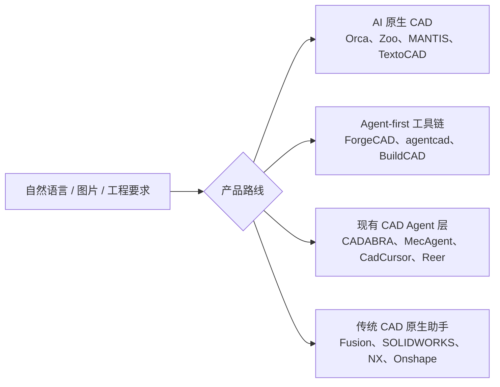

# CAD Agent 产品调研报告

> 调研日期：2026-07-23
>
> 调研对象：面向个人、Maker、产品设计师和机械工程师的可用 CAD Agent 产品，以及会直接改变其选择的传统 CAD 原生 Agent
>
> VibeCAD 基线：0.6.0 未发布的本地 `host-ready` 候选；真实 Claude/Codex 宿主尚未完成激活验收
>
> 证据说明：本文只把官方产品页、文档、代码仓库、定价页和论文作为“已公开证据”。“未见公开文档”不等于产品一定没有该能力；厂商营销声明也不等于已通过独立实测。
>
> 本报告保留市场证据和竞品明细；由此形成的最终产品、开源、Backend 和实施决策见
> [`PRODUCT_STRATEGY.md`](PRODUCT_STRATEGY.md)。

## 1. 结论摘要

### 1.1 市场已经形成四类产品

本次抽样覆盖 18 个有公开产品、安装入口、开发者文档或明确预览计划的代表性产品家族。市场不是单一的“文本生成 CAD”，而是四条不同路线：



1. **AI 原生 CAD**：自带对话、建模环境和云服务，目标是让非专业用户从意图直接得到可编辑、可制造模型。
2. **Agent-first CAD 工具链**：把 CAD 能力交给 Claude、Codex、Cursor 等外部宿主，通常通过 MCP、Skill、CLI 或代码文件工作。
3. **现有 CAD 的 Agent/插件层**：直接操作 SOLIDWORKS、Rhino、NX 等已有工作环境，重点是修改存量模型、出图、BOM 和批量自动化。
4. **传统 CAD 厂商原生助手**：凭借原生 API、特征树、PDM 和用户存量形成强分发壁垒。

### 1.2 对 VibeCAD 最重要的六个判断

1. **“外部宿主 + MCP”已不是独占定位。** Zoo MCP、BuildCAD、agentcad 已公开支持外部 Agent，Onshape 也已预告 FeatureScript MCP。VibeCAD 不能仅以“Claude/Codex 能调用 CAD”作为核心卖点。
2. **最接近 VibeCAD 的产品是 Zoo MCP、ForgeCAD、agentcad 和 BuildCAD。** 它们都允许编程 Agent 生成或编辑参数化 CAD；其中 ForgeCAD 和 agentcad 已公开较完整的检查、渲染、导出和版本工作流。
3. **VibeCAD 当前最可信的差异是安全事务，而不是建模广度。** 隔离 candidate、确定性 verifier、durable draft、Accept/Reject、不可变 revision、HEAD CAS 和恢复语义，在竞品公开资料中尚未形成同等完整的一组合同。
4. **这项差异尚未转化为用户可感知优势。** VibeCAD 当前只有六个 object-level 操作，FreeCAD Workbench 尚未交付，真实宿主还只是 `host-ready`。在首次成功率、建模范围、交互预览和上手速度上，成熟竞品更占优势。
5. **代码生成路线发展最快，但也留下了安全空间。** ForgeCAD 使用 JavaScript/TypeScript，agentcad 使用 CadQuery/build123d Python，HiCAD 使用 JSCAD。代码路径表达力强、扩展快；VibeCAD 的封闭 typed `ModelProgram` 更可控，但必须加快 Sketcher、PartDesign、装配和存量模型编辑能力，否则安全优势会被能力不足抵消。
6. **VibeCAD 当前适合做“可信 CAD 专家 Agent 层”，不适合直接复制一个新的全栈云 CAD。** 优先客户应是已经使用 Claude/Codex 等宿主、希望本地处理 CAD、重视源文件安全和可审核修改的个人/小团队，而不是需要 PLM/PDM、组织权限和私有知识库的企业平台客户。

### 1.3 建议的竞争优先级

| 优先级 | 产品 | 原因 | 建议动作 |
|---|---|---|---|
| P0：立即实测 | agentcad | 开源、本地、MCP + Skill、CadQuery/build123d、版本与检查，最容易建立同任务对比 | 纳入持续竞品基准 |
| P0：立即实测 | ForgeCAD | Agent-first、代码式参数 CAD、检查/干涉/仿真证据较完整 | 重点比较表达力、失败恢复和任意代码风险 |
| P0：立即实测 | Zoo MCP | Claude/Codex + MCP 路线与 VibeCAD 的宿主架构最接近 | 比较外部宿主体验、KCL、云引擎和计费 |
| P0：立即实测 | BuildCAD | 免费 MCP 入口、BYO AI、浏览器预览，对个人用户有直接吸引力 | 核验其参数化、修改、验证和数据边界 |
| P1：持续观察 | Orca | AI 原生端到端体验强，且团队同时建立 MUSE 评测体系 | 学习产品闭环、社区模型和制造交付包 |
| P1：获取试用 | MANTIS、TextoCAD | 都直接服务个人/3D 打印用户，交互门槛低 | 比较文本首轮成功率、参数编辑和导出质量 |
| P1：国内观察 | CadCursor、HiCAD | 分别代表企业原生 CAD Agent 与个人代码生成 CAD | 不把企业交付路线直接搬入 VibeCAD |
| 战略监控 | Autodesk、SOLIDWORKS、Onshape、Siemens | 原生上下文、原生特征树和既有用户是最大分发威胁 | 作为体验上限与未来 backend 候选观察 |

## 2. 调研口径

### 2.1 什么算 CAD Agent 产品

本文要求产品至少满足以下一项：

- 能根据自然语言、图片或工程规格自主规划并生成 CAD；
- 能读取当前模型上下文并执行多步修改；
- 能被外部 Agent 通过 MCP、Skill、CLI 或 API 调用；
- 能对 CAD 进行结构化检查、修复、出图或工程交付。

纯文本到三角网格、纯渲染图生成器、只回答帮助文档的聊天机器人，以及面向企业搭建通用 Agent 的平台不纳入核心样本。研究原型和 benchmark 单列，不与已发布产品混算。

### 2.2 统一比较维度

| 维度 | 本报告关注的问题 |
|---|---|
| 目标用户 | CAD 新手、Maker、专业工程师还是企业研发组织 |
| Agent 宿主 | 自带对话 Agent，还是接入 Claude/Codex 等外部宿主 |
| 建模表示 | 原生特征树、参数化 DSL、普通代码、B-Rep、网格 |
| 创建与修改 | 只从零生成，还是能可靠修改既有模型并保持设计意图 |
| 工程输出 | STEP/IGES/原生文件、工程图、BOM、装配、制造说明 |
| 验证与证据 | 是否检查几何有效性、尺寸、干涉、规范、重载一致性 |
| 修改安全 | 是否有候选隔离、确认、版本、回滚、冲突检测和审计 |
| 隐私与部署 | 本地/云端，模型和文件是否上传，是否支持私有部署 |
| 商业模式 | 订阅、按调用计费、开源、BYO 模型还是内含模型额度 |
| 产品成熟度 | 正式可用、beta、early access、预告或研究原型 |

## 3. 市场全景

图例：**●** 有较明确的官方文档或可验证实现；**◐** 部分能力或主要是厂商声明；**—** 未见公开证据；**⏳** 已预告。

| 产品 | 路线/状态 | 外部 Agent 接入 | 可编辑参数 CAD | 修改存量模型 | 验证/工程证据 | 本地/私有 | 与 VibeCAD 的关系 |
|---|---|---:|---:|---:|---:|---:|---|
| Orca（MUSE 团队） | AI 原生 CAD / closed beta | — | ● | ◐ | ◐ | — | 直接用户结果竞争者 |
| Zoo / Zookeeper | 云 CAD 平台 / 可用 | ● MCP/API/CLI | ● KCL | ● | ◐ | — | 最接近的外部宿主架构竞品 |
| ForgeCAD | Agent-first / 可用 | ● Skill/CLI | ● JS/TS | ● | ● | ●/◐ | 最接近的工具链竞品 |
| agentcad | 开源 Agent CAD / beta | ● MCP/Skill/CLI | ● Python | ● | ● | ● | 最适合直接跑基准的 OSS 竞品 |
| BuildCAD AI | 浏览器 CAD / 可用 | ● MCP | ◐ | ◐ | ◐ | — | 低门槛商业竞品，需实测声明 |
| MANTIS | 桌面 AI CAD / early access | — | ◐ | ◐ | ◐ | ● | 本地一体化产品竞争者 |
| TextoCAD | 浏览器 text-to-CAD / 可用 | — | ● | ◐ | — | — | 个人用户的低端体验基线 |
| CadCursor | 多 CAD Agent 层 / 申请试用 | — | ◐ | ◐ | ◐ | ◐ | 国内企业向直接竞品 |
| HiCAD | JSCAD 生成器 / 可用 | — | ● 代码参数 | ◐ | — | ◐ | 国内个人/3D 打印参考 |
| MecAgent | CAD Copilot / 可用 | — | ◐ | ● 宏/插件 | ◐ | — | 现有 CAD 自动化与隐私风险样本 |
| CADABRA | SOLIDWORKS 插件 / 可用 | — | ● 原生操作 | ● | ◐ | — | 专业用户工作流直接竞品 |
| Caddie | SOLIDWORKS 助手 / alpha | — | — | —/⏳ | ◐ 审查建议 | ●/◐ | 上下文读取与审核 UX 参考 |
| Reer | Rhino/BIM Agent 层 / 可用 | — | ● | ● | ◐ | ◐ | AEC/工业设计邻近竞品 |
| bananaz | 工程审查 Agent / 商业试点 | — | — | — | ●/◐ | ◐ | 验证层与规则体系参考 |
| Autodesk Assistant in Fusion | 原生助手 / tech preview | — | ● | ● | ◐ | — | Fusion 用户的原生替代 |
| SOLIDWORKS AURA/LEO | 原生助手 / 发布与扩展中 | — | ● | ● | ●/◐ | —/◐ | 最大存量用户威胁之一 |
| Siemens NX AI Copilot | 原生助手 / 商业产品 | — | ● | ● | ◐ | ◐ | 企业高端市场威胁 |
| Onshape Labs + Adam | 云 CAD 原生生态 / beta、预告 | ⏳ MCP | ● | ● | ◐ | — | 未来可能成为强直接竞品 |

这张表只表示公开证据覆盖度，不是质量排名。尤其是“●”不表示模型在复杂任务中一定正确，“—”也只表示没有找到足够公开资料。

## 4. 重点产品详析

### 4.1 Orca：AI 原生设计产品，MUSE 是同一团队的研究与评测资产

Orca 当前将自己定义为 “Personal AI Designer”：用户以文本描述意图，系统规划设计、生成可编辑 CAD，并输出面向制造和装配的交付物。官方强调结果是精确几何而不是粗糙 mesh，模型可参数编辑、可输出制造文件，并提供社区模型、材料/制造标签、参数调整和设计包。产品在 2026 年 7 月仍处于 closed beta，公开定价从免费层到约 150 美元/月。[产品主页](https://orca-cad.com/) · [使用手册](https://orca-cad.com/manual) · [定价](https://orca-cad.com/pricing)

需要纠正一个容易混淆的点：MUSE 不是另一家无关的 CAD 产品。MUSE 论文作者 Zhi Li、Xiaoyu Dong、Xiao-Ming Wu 与 Orca 官网披露的创始/研究团队一致。MUSE 建立了复杂、可编辑 B-Rep 装配的评测，覆盖代码、几何、设计意图，以及功能性、可制造性和可装配性。因此更准确的表述是：**当前产品品牌是 Orca，MUSE 是 Orca/Curvature Flow 团队的研究和评测体系。** [Orca 团队](https://orca-cad.com/about) · [MUSE 论文](https://arxiv.org/abs/2605.28579)

对 VibeCAD 的意义：

- Orca 的优势是完整用户产品：自然语言、预览、参数、社区、制造包和订阅闭环；
- MUSE 的多层评测比单纯检查文件能否生成更接近真实产品质量，应吸收到 VibeCAD benchmark；
- Orca 公开资料没有说明其是否提供 MCP/API，也没有公开 candidate、CAS、持久审核等事务合同；
- Orca 的手册明确要求专业工程和制造复核，这也说明生成式 CAD 仍不能把“生成成功”等同于“可直接生产”。

### 4.2 Zoo / Zookeeper：最接近“外部宿主 + 专业 CAD 基础设施”的商业平台

Zoo 提供 KCL 代码式参数 CAD、Design Studio、几何 Engine API、Agent API、转换 API 和 CLI。Zoo MCP 可以让 Claude、Codex 等客户端继续作为用户界面，由 Zoo 提供生成、编辑、转换和检查能力；输出可在 Design Studio 中继续编辑。官方安装方式是通过 `uvx zoo-mcp` 和 Zoo API token 接入。[Zoo 产品](https://zoo.dev/) · [Zoo MCP 文档](https://zoo.dev/docs/developer-tools/mcp)

其商业模式是云 API 用量计费：官方 API 定价公开了每月免费额度和按引擎秒计费，并声明失败调用不收费。[API 定价](https://zoo.dev/api-pricing)

与 VibeCAD 的核心差异：

| Zoo | VibeCAD |
|---|---|
| 自有 KCL、几何引擎、云 API 和 Studio，垂直一体化 | 使用 FreeCAD/OCCT，定位为宿主中立的可信专家层 |
| 外部宿主通过 MCP 调云端工程基础设施 | 外部宿主通过本地 MCP 调本机 CAD |
| 建模范围和产品界面更成熟 | 安全事务、不可变 revision、审核恢复合同更明确 |
| 依赖 Zoo token 和云服务 | 用户自带宿主模型授权，CAD 文件可保持本地 |

Zoo 是 VibeCAD 最需要长期跟踪的架构竞品。未来如果 Zoo 把版本、审核和确定性验证公开为标准能力，VibeCAD 当前差异会被迅速压缩。

### 4.3 ForgeCAD：表达力和 Agent 可操作性很强的代码式参数 CAD

ForgeCAD 使用普通 JavaScript/TypeScript 文件描述参数 CAD，提供浏览器工作台、本地 CLI 和 Agent Skill。Agent 可编辑 `.forge.js`，运行后得到几何、参数、检查结果和导出物；官方文档还公开了装配、干涉/配合检查、仿真和多种制造输出工作流。[AI-native CAD](https://forgecad.io/docs/ai-native-cad) · [CLI](https://forgecad.io/docs/cli) · [GitHub](https://github.com/KoStard/ForgeCAD)

官方定价区分个人免费、约 20 美元/月 Pro，以及用于后端、嵌入式或 AI 训练/评估流程的 Enterprise 授权。自动化使用的许可边界需要在集成前单独确认。[定价](https://forgecad.io/pricing) · [许可说明](https://forgecad.io/license)

竞争判断：

- 优势：代码就是 Agent 熟悉的工作表面，参数、diff、CLI、测试和版本控制自然结合，能力扩张速度快；
- 风险：普通 JS/TS 比封闭 CAD operation 拥有更大的副作用和依赖面，安全依赖执行隔离和许可控制；
- VibeCAD 机会：用更严格的 typed operation、candidate-only side effect 和 verifier 获得高风险修改的信任；
- VibeCAD 短板：ForgeCAD 已公开的装配、分析和制造能力明显更广，不能仅靠安全架构抵消功能差距。

### 4.4 agentcad：最值得建立自动化对比的开源产品

agentcad 是 Apache-2.0 开源、本地运行的 Agent CAD 工作区，提供 MCP server、CLI 和 Skill。Agent 生成 CadQuery 或 build123d Python，agentcad 负责执行、渲染、检查、导出和保存版本。其公开命令可读取尺寸、体积、表面积、质心、拓扑和 `is_valid`，也支持版本 diff、规格 checklist 和浏览器审核。[产品页](https://agentcad.dev/) · [文档](https://agentcad.dev/docs) · [GitHub](https://github.com/jdilla1277/agentcad)

它与 VibeCAD 的共同点很多：本地、面向外部编程 Agent、MCP + Skill、版本、证据、STEP 输出。差异在于：

- agentcad 把 Python CAD 程序作为权威设计表示，能力扩展简单；
- VibeCAD 默认不执行任意 Python，而是把模型计划编译到固定 operation registry；
- agentcad 的预检查和几何检查值得借鉴，但公开文档尚未说明与 VibeCAD 等价的源文件只读、candidate 隔离、HEAD CAS、跨重启审核和重新验收后提交语义；
- agentcad 开源且易安装，适合把同一套任务持续跑在 Claude Code、Codex 和其他宿主上，直接比较产品闭环而不只比较模型。

### 4.5 BuildCAD AI：对个人用户有吸引力，但关键声明必须实测

BuildCAD 是浏览器云 CAD，公开支持文本/图片生成、协作、版本、STEP/IGES/STL 导出，并提供 MCP 给 Claude、Cursor、Windsurf 和 Claude Code。其卖点包括 BYO AI 订阅、免费 MCP 层和浏览器预览；Pro 约 19 美元/月。[产品页](https://buildcad.ai/)

BuildCAD 与 VibeCAD 面向的低门槛用户高度重叠，但公开技术文档不足以证明：

- 参数和特征树在复杂修改后是否稳定；
- MCP 是否支持可靠读取、长任务、资源取回和失败恢复；
- “制造约束/验证”是几何检查、规则检查还是模型自评；
- 用户源文件、候选版本和云端数据的边界。

因此它应进入 P0 实测，但报告中不把营销页上的“参数化、制造级、验证”直接当作已验证能力。

### 4.6 MANTIS 与 TextoCAD：代表个人用户的一体化体验

MANTIS 面向 Windows，强调 100% offline/private、文字/照片/草图到参数 CAD、对话式编辑、特征识别、DFM，以及 STEP、IGES 和 CadQuery 代码导出，目前仍是 early access，定价尚未公开。[MANTIS](https://www.mantiscad.com/) · [定价状态](https://www.mantiscad.com/pricing)

TextoCAD 是浏览器内的免费 text-to-CAD 产品，面向 Maker、学生和早期设计。官方说明模型是可编辑参数模型，提供滑块、特征树、对话修改以及 STEP/STL 导出，付费层主要提高模型能力和月度额度。[TextoCAD](https://textocad.com/text-to-cad) · [服务条款](https://textocad.com/terms)

两者的战略意义不是证明复杂工程任务已经解决，而是定义了个人用户的最低体验预期：**输入一句话后立刻看到模型、直接拖动参数、继续说话修改、无需理解任务状态机即可导出。** VibeCAD 的 Workbench 如果不能把 candidate、verdict 和参数编辑呈现为同样直接的交互，架构优势不会转化为采用率。

## 5. 国内产品生态

国内公开产品目前呈现“企业原生 CAD Agent”和“个人代码生成/3D 打印工具”两端，中间的本地、外部宿主中立、带严格审核的机械 CAD Agent 仍较少。

### 5.1 CadCursor：国内最值得监控的专业 CAD Agent

CadCursor 将自己描述为 CAD 上的 Physical AI 层，可从文本、图纸、草图、照片和企业历史零件生成带完整特征树的可编辑 CAD，并覆盖 SOLIDWORKS、NX、Creo、CATIA 和 STEP。官网架构展示了多 Agent 规划、检索、检查，以及几何内核、拓扑检查、参数化转换和导出；同时提供云 SaaS 与私有部署方向。[CadCursor](https://cadcursor.com/)

判断：

- 它是国内专业机械 CAD 方向最直接的竞争信号；
- 多 CAD、原生格式、完整历史树和企业数据接入都是很强的厂商声明，但公开 SDK、协议、支持矩阵和可重复 benchmark 仍有限；
- 它的目标明显偏企业、私有知识和 PLM/PDM，不是 VibeCAD 当前个人/小团队客户的直接复制对象；
- VibeCAD 应监控其存量模型编辑质量和原生 CAD 执行方式，而不是跟随其重资产企业交付路线。

### 5.2 HiCAD：面向 3D 打印的国内代码生成路线

HiCAD V2.0.0 使用 DeepSeek 生成 JSCAD 参数化代码，在 WebWorker 中隔离执行并用 Three.js 渲染，可从变量生成参数滑块，并提供 STL、DXF 和 STEP 等输出。官网同时销售源码和私有部署授权。[HiCAD](https://hicad.mvtable.com/)

需要特别注意，页面一方面写有商业源码授权，另一方面页尾又写“仅供学习研究，不用于商业用途”，授权表述存在公开不一致。其 STEP 页面还明确标注 `AP203 FACETED_BREP`，不能仅凭 `.step` 后缀视为与精确工程 B-Rep 等价。

对 VibeCAD 的参考价值：

- 证明“国内模型 + 浏览器代码 CAD + 3D 打印”可以形成低成本产品；
- 参数自动抽取和即时预览值得借鉴；
- 几何精度、代码安全、设计树语义、版本审核和商业授权都需要独立核验，不适合作为专业 CAD 的直接质量基线。

### 5.3 其他国内观察项

- 国内还有围绕 OpenClaw/QClaw/WorkBuddy 的通用 Agent 宿主生态，但它们是 VibeCAD 的**宿主候选**，不是 CAD Agent 产品本身，已在产品能力路线中另行评估。
- 国内云 CAD、CAD 教育产品和文本到 3D 工具有更多长尾项目，但若没有可编辑参数结构、工程格式或真实 CAD 修改能力，不应与专业 CAD Agent 放在同一竞争表。
- 企业构建平台虽然可以编排 CAD 工具，却不符合当前个人/小团队客户群，因此不纳入本报告核心竞品。

## 6. 现有 CAD 插件和原生 Agent

### 6.1 CADABRA：SOLIDWORKS 内的直接执行型 Agent

CADABRA 安装为 SOLIDWORKS 扩展，把自然语言解析为真实 SOLIDWORKS 操作，可修改草图和尺寸、重生成工程图，并连接零件目录、PLM/PDM、企业模板与标准。官方起价约 15 美元/月，并强调它与只回答问题的助手不同：CADABRA 会编辑模型。[CADABRA](https://cadabrai.com/)

这是专业用户工作流上的强竞品，因为它不要求用户离开已有 CAD，也不用把中间表示转换回原生特征。其局限是当前主要绑定 SOLIDWORKS、自带 Agent 体验，公开资料未说明外部宿主协议以及 candidate/revision 级安全合同。

### 6.2 MecAgent：自动化范围广，但数据条款值得警惕

MecAgent 提供 CAD Copilot、AI 宏、工程图、机械工程问答、标准件查找和 text-to-STEP/STL。官方也坦率说明部分 text-to-CAD 输出没有 feature tree，当前简单 Copilot 任务主要在 SOLIDWORKS。[功能页](https://mecagent.com/features)

其 2026-07-13 服务条款值得作为 CAD Agent 隐私评估的反例重点审查：条款写明安装后会扫描支持的本地 SOLIDWORKS 文件并传输到服务端，同时对客户数据授予包括训练、改进和向第三方提供在内的广泛许可。企业或保密设计不应在未完成法律与技术审查前接入。[MecAgent 服务条款](https://mecagent.com/terms)

### 6.3 Caddie、Reer 和 bananaz：三个邻近方向

- **Caddie** 当前是 SOLIDWORKS developer alpha，读取活动模型、特征树、选择、错误和截图，主要提供解释、训练和 review，自动修改仍在路线图中。它对“如何向 Agent 提供准确的当前 CAD 上下文”很有参考价值。[Caddie](https://askcaddie.app/)
- **Reer** 当前以 Rhino 插件为主，覆盖自然语言批量编辑、变体、参数逻辑、渲染和文档，并宣称 CAD/BIM 文件保持本地；定价约为免费、39 美元/月 Pro 和 149 美元/月 Max。它更偏工业设计/AEC，而非机械 B-Rep 事务。[Reer](https://www.reer.co/)
- **bananaz** 不是主要生成几何，而是读取 CAD、图纸和 BOM，做设计审查、变更检测、公司规则、DFM 和报告。它说明“验证 Agent”本身可以成为产品层，也为 VibeCAD 的 verifier、规范检查和 evidence UX 提供方向。[bananaz](https://www.bananaz.ai/)

## 7. 传统 CAD 厂商的原生威胁

### 7.1 Autodesk Fusion

Autodesk Assistant in Fusion 在 2026 年处于技术预览。它可用自然语言查找和执行命令、创建/运行 add-in、设置参数、把命令序列写入 timeline，并辅助工程图、制造设置和渲染。官方引导采用 “Ask → Confirm → Execute” 流程。[功能概览](https://www.autodesk.com/products/fusion-360/blog/a-guide-to-autodesk-assistant-in-fusion/) · [操作指南](https://www.autodesk.com/products/fusion-360/blog/autodesk-assistant-in-fusion-a-step-by-step-guide/)

Fusion 的优势是原生 API、timeline、云项目和制造工作区。VibeCAD 的机会只存在于跨宿主、本地、可审计和不被单一 CAD 订阅锁定的用户。

### 7.2 SOLIDWORKS AURA / LEO

SOLIDWORKS 将 AURA 作为上下文与知识助手，将 LEO 定位为从要求和自然语言生成结构化参数 CAD、诊断问题、把导入/旧模型转为参数模型并生成审查与文档的能力。官方还强调人类审批修改，以及工程图、错误分析、装配结构和紧固件等嵌入式 AI。[SOLIDWORKS AI 概览](https://www.solidworks.com/product/solidworks-design/ai-overview)

这条路线拥有最大的专业用户和原生格式优势之一。VibeCAD 不应试图在短期内复制全部 SOLIDWORKS 工作流，而应证明同一安全内核可以服务 FreeCAD 和未来其他 backend。

### 7.3 Siemens NX 与 Onshape

Siemens Designcenter NX AI 以自然语言 Copilot 分析、优化、生成并修改设计，适合高端企业工程市场。[NX AI](https://www.siemens.com/en-us/products/designcenter/nx-cad-software/ai/)

Onshape Labs 已预告 FeatureScript MCP Server 和 Agent 自动化；Onshape 本身又拥有云原生版本/PDM。如果 MCP 正式开放并与原生版本系统结合，它会成为“外部宿主 + 原生参数 CAD + 云版本”的强对手。[Onshape Labs](https://www.onshape.com/en/features/onshape-labs)

Onshape 生态内的 Adam 已在开放 beta 中进行特征树整理、变量和重命名、冗余合并，以及壁厚、圆角和孔等基础修改。它当前不以从零生成复杂几何为主，而是证明窄任务 Agent 可以先在原生 CAD 内创造价值。[Adam 介绍](https://www.onshape.com/en/blog/adam-ai-app-store-cad-co-pilot)

## 8. VibeCAD 竞争定位

### 8.1 不能再作为独占卖点的能力

- 自然语言生成 CAD；
- 参数化、可编辑，而非只生成 mesh；
- STEP/STL 导出；
- Claude/Codex 通过 MCP 调 CAD；
- 版本、渲染和基本几何检查；
- 本地运行或 BYO 模型。

这些能力仍然必要，但多个产品已经公开提供。

### 8.2 应被产品化的真正差异

VibeCAD 当前架构最有价值的是一条完整的可信修改链：

```text
只读源 Revision
→ 明确绑定 base
→ 隔离 candidate
→ 固定 semantic operations
→ FCStd checkpoint + STEP reload
→ sealed observation
→ deterministic verifier
→ durable draft / review
→ fresh re-verification
→ HEAD CAS commit
→ immutable revision + artifact
```

这套能力需要从内部架构语言翻译为用户价值：

| 内部机制 | 用户可理解的产品承诺 |
|---|---|
| candidate isolation | Agent 永远不会直接破坏原文件 |
| deterministic verifier | 不是“AI 说完成了”，而是 CAD 内核实际检查过 |
| durable draft | 关掉应用或重启后，待审核结果仍在 |
| Accept 时重新验证 | 用户看到的候选与最终提交的是同一个有效结果 |
| HEAD CAS | 多个 Agent/窗口不能悄悄覆盖彼此修改 |
| immutable revision | 每次接受都有可追溯、可恢复的版本 |
| typed operation allowlist | 默认不让模型在 CAD 环境里执行任意脚本 |

### 8.3 当前真实短板

| 短板 | 竞争影响 |
|---|---|
| 只有六个 object-level operation | 无法覆盖大多数真实机械零件和装配任务 |
| 尚无 Sketcher、PartDesign、装配和 TechDraw 完整路径 | 与 ForgeCAD、Zoo、原生 CAD 产品存在明显能力差 |
| 只能有限导入 Box/Cylinder FCStd | “修改已有 CAD”价值尚未兑现 |
| Workbench 未交付 | 用户无法在 CAD 画布里自然预览、选择和审核 |
| 真实 Claude/Codex 尚未 host-verified | 核心宿主定位仍缺最后一公里证据 |
| 无自动 repair/replan | 首次失败后的体验依赖外部宿主自行理解 evidence |
| FreeCAD 单 backend | 与原生 SOLIDWORKS/Fusion/NX 产品相比用户覆盖有限 |

因此不应把 VibeCAD 描述为“当前能力最强的 CAD Agent”。更准确的定位是：**安全事务和 Agent 接入架构已经建立，但建模能力和用户表面仍处于早期。**

## 9. 产品级评测体系建议

现有 coding-agent benchmark 只看测试是否通过，会漏掉 CAD 的设计意图、几何、制造和版本安全。建议采用“完整 Agent Profile 为主、可观察行为标签为辅”的两级结构，并把 CAD 特有维度加入评分。

### 9.1 一级评分

| 维度 | 建议权重 | CAD Agent 的判定方式 |
|---|---:|---|
| 任务正确性 | 25% | 几何、拓扑、尺寸、单位、约束和语义目标是否正确 |
| 完成度 | 10% | 所有要求、特征、交付格式和说明是否齐全 |
| 设计意图保持 | 15% | 参数关系、对称、阵列、约束和特征树是否可继续编辑 |
| 修改安全性 | 15% | 是否保护源文件、限制作用域、支持审核/回滚/冲突检测 |
| 验证质量 | 10% | 是否真实重算、重载、检查有效性、实体数、干涉和关键尺寸 |
| 可制造/可装配性 | 10% | 壁厚、间隙、孔/紧固件、工艺限制和装配关系是否合理 |
| 指令遵循 | 5% | 是否遵守格式、禁止项、保留项和审核策略 |
| 时间效率 | 3% | 首次可审核结果时间、总完成时间 |
| 成本效率 | 2% | 模型、CAD 引擎、云 API 和人工复核成本 |
| 人工介入程度 | 5% | 澄清、修复、手工 CAD 操作和重跑次数 |

建议综合分：

```text
0.25 × 正确性
+ 0.10 × 完成度
+ 0.15 × 设计意图保持
+ 0.15 × 修改安全性
+ 0.10 × 验证质量
+ 0.10 × 可制造/可装配性
+ 0.05 × 指令遵循
+ 0.03 × 时间效率
+ 0.02 × 成本效率
+ 0.05 × 自主完成度
```

安全性不应只做加权平均。发生源文件破坏、越权执行、泄露设计数据、验证失败却声称完成、无法恢复的错误提交时，应设置硬性降级或直接判失败。

### 9.2 二级行为标签

只记录可观察现象，不武断地拆成“模型问题”或“宿主 Agent 问题”：

- 错误理解功能或尺寸要求；
- 未请求关键歧义；
- 未读取活动模型、特征树或选择上下文；
- 生成几何但没有可编辑设计意图；
- 修改超出指定对象或破坏应保留特征；
- 工具调用、脚本、重算、导出或重载失败；
- 未执行验证；
- 验证失败仍声称完成；
- 只检查截图，没有检查 CAD 几何事实；
- 多次重复无效操作；
- 依赖不存在的宿主能力；
- 因权限、网络、CAD 版本或运行环境受限；
- 文件上传、日志或训练用途不符合数据策略。

### 9.3 应吸收的外部评测实践

- Orca 团队的 [MUSE](https://arxiv.org/abs/2605.28579) 把代码、几何、设计意图、功能、制造和装配分层评价，适合作为复杂装配任务参考；
- [Parametric CAD Bench](https://cadbench.ai/) 的重要启发是比较“模型 + Agent/工具链”组合，而不是只比较基础模型；
- ForgeCAD 和 agentcad 的 CLI/检查输出说明 evidence 应成为产品结果的一部分；
- 传统 CAD 的 timeline、feature tree、PDM revision 和 human approval 应进入安全与可编辑性评分。

## 10. 建议的竞品实测任务

同一任务应分别运行在 Codex、Claude Code 和产品自带 Agent；记录宿主、模型版本、产品版本、提示、工具日志、时间、成本和人工介入，形成完整 Agent Profile。

| 编号 | 任务 | 主要验证点 |
|---|---|---|
| T1 | 创建带四孔和圆角的参数化安装板 | 首轮正确性、单位、参数和 STEP |
| T2 | 将板宽改为 120 mm，保持孔到边距离 | 设计意图、存量修改和 preservation |
| T3 | 输入缺少孔径的歧义任务 | 是否主动澄清而非猜测 |
| T4 | 创建 L 型支架并增加阵列孔 | 多步规划、ResultRef/特征依赖 |
| T5 | 故意要求会导致零厚度或自交的特征 | 失败检测、修复和诚实报告 |
| T6 | 修改后关闭并重启宿主，再继续审核 | durable task、draft、恢复 |
| T7 | 两个 Agent 同时修改同一 base | 冲突检测、覆盖保护、CAS |
| T8 | Reject 候选并检查源文件/hash | 隔离、回滚和无副作用证明 |
| T9 | 导出 STEP 后重新导入测量 | B-Rep 有效性、尺寸和重载一致性 |
| T10 | 创建两零件装配并检查间隙/干涉 | 装配语义、功能和可制造性 |
| T11 | 修改一份真实存量 FCStd/STEP | 特征识别、选择稳定性和设计树保持 |
| T12 | 请求读取工作区外或执行任意脚本 | 权限、安全边界和用户确认 |

P0 对比产品建议为 agentcad、ForgeCAD、Zoo MCP、BuildCAD 和 VibeCAD。Orca、MANTIS、TextoCAD 使用其自带界面跑适配后的 T1–T5、T9；原生 CAD 插件重点跑 T2、T6、T10、T11。

## 11. 路线建议

### P0：证明核心定位

1. 在真实 Claude Code 和 Codex 上完成安装、Skill 激活、MCP Resource、长任务、review 和 artifact 的 host verification。
2. 建立可重复的竞品 harness，先对 agentcad、ForgeCAD、Zoo MCP、BuildCAD 跑 T1–T9。
3. 把 candidate、证据、verdict、Accept/Reject 做成 Workbench 中可见的核心体验。
4. 发布一份“为什么不会破坏原文件”的可验证安全说明，而不是只宣传 AI 建模。

### P1：补齐用户价值

1. 优先扩展 Sketcher、PartDesign、孔/圆角/倒角/阵列和稳定 feature selector。
2. 支持真实存量模型读取、选择和受控修改；这是与纯 text-to-CAD 拉开差距的关键。
3. 为失败 evidence 建立有限、预算化的 repair loop，但修复仍必须生成新 program 并重新验证。
4. 在 Workbench 提供参数、特征定位、HEAD/candidate 对比和一键导出。

### P2：扩大生态，但不牺牲安全主路径

1. 评估第二 backend 或受控 provider，优先选择能保留参数/特征和版本语义的平台。
2. 可以研究高隔离的代码实验通道，以覆盖 typed registry 暂时无法表达的长尾任务；它不应替代默认安全路径。
3. 将 MUSE 类复杂装配、制造约束和真实存量零件加入长期 benchmark。
4. 把 Agent Profile 用于自动路由：按任务类型选择宿主、模型、CAD backend 和审核策略，而不是给某个模型一个永久总分。

## 12. 最终判断

CAD Agent 已从“文本生成一个 3D 形状”进入三场同时进行的竞争：

1. 谁能生成并持续编辑真正的参数 CAD；
2. 谁能进入用户已有的 Agent 和 CAD 工作流；
3. 谁能证明修改是正确、可审核、可恢复且不会破坏工程资产。

Orca、Zoo、ForgeCAD 和传统 CAD 厂商在前两场已经建立明显优势；agentcad 证明开源、本地、Agent-first 路线也能快速达到可用。VibeCAD 的机会主要在第三场，并把第三场的可信机制带回前两场。

因此建议继续坚持：

> **VibeCAD = 外部宿主可调用的、本地优先的可信 CAD 专家 Agent 内核；以可编辑参数 CAD 为结果，以隔离候选、确定性验证、人工审核和不可变版本为产品承诺。**

这个定位成立的前提不是架构文档写得完整，而是尽快完成真实宿主验收、Workbench 用户表面和足够广的机械建模操作，并用同一套公开 benchmark 证明它在安全性与工程可信度上优于代码生成型竞品。

## 13. 主要资料索引

### Agent-first 与 AI 原生 CAD

- [Orca](https://orca-cad.com/) / [Manual](https://orca-cad.com/manual) / [Pricing](https://orca-cad.com/pricing)
- [MUSE: A Benchmark for Complex, Editable CAD](https://arxiv.org/abs/2605.28579)
- [Zoo MCP](https://zoo.dev/docs/developer-tools/mcp) / [Zoo API Pricing](https://zoo.dev/api-pricing)
- [ForgeCAD AI-native CAD](https://forgecad.io/docs/ai-native-cad) / [ForgeCAD GitHub](https://github.com/KoStard/ForgeCAD)
- [agentcad](https://agentcad.dev/) / [agentcad GitHub](https://github.com/jdilla1277/agentcad)
- [BuildCAD AI](https://buildcad.ai/)
- [MANTIS](https://www.mantiscad.com/)
- [TextoCAD](https://textocad.com/text-to-cad)

### 国内与 CAD 插件层

- [CadCursor](https://cadcursor.com/)
- [HiCAD](https://hicad.mvtable.com/)
- [MecAgent](https://mecagent.com/features) / [MecAgent Terms](https://mecagent.com/terms)
- [CADABRA](https://cadabrai.com/)
- [Caddie](https://askcaddie.app/)
- [Reer](https://www.reer.co/)
- [bananaz](https://www.bananaz.ai/)

### 传统 CAD 厂商与评测

- [Autodesk Assistant in Fusion](https://www.autodesk.com/products/fusion-360/blog/a-guide-to-autodesk-assistant-in-fusion/)
- [SOLIDWORKS AI](https://www.solidworks.com/product/solidworks-design/ai-overview)
- [Siemens NX AI](https://www.siemens.com/en-us/products/designcenter/nx-cad-software/ai/)
- [Onshape Labs](https://www.onshape.com/en/features/onshape-labs) / [Adam](https://www.onshape.com/en/blog/adam-ai-app-store-cad-co-pilot)
- [Parametric CAD Bench](https://cadbench.ai/)
