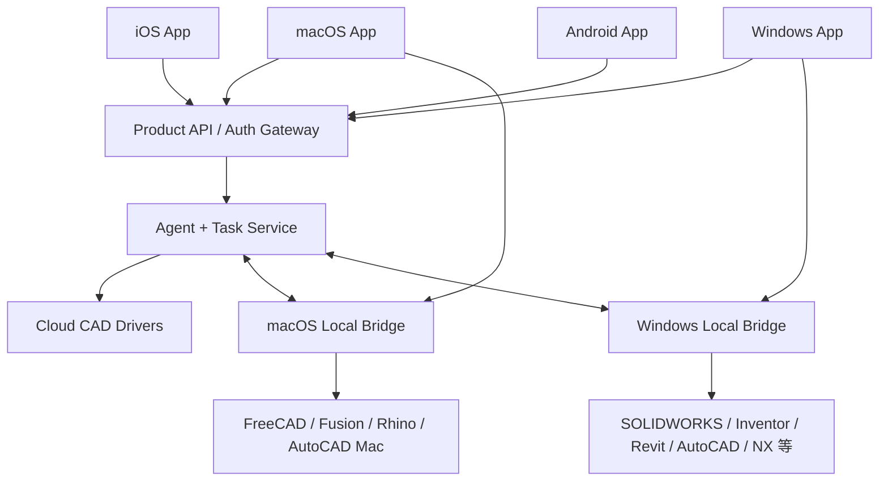
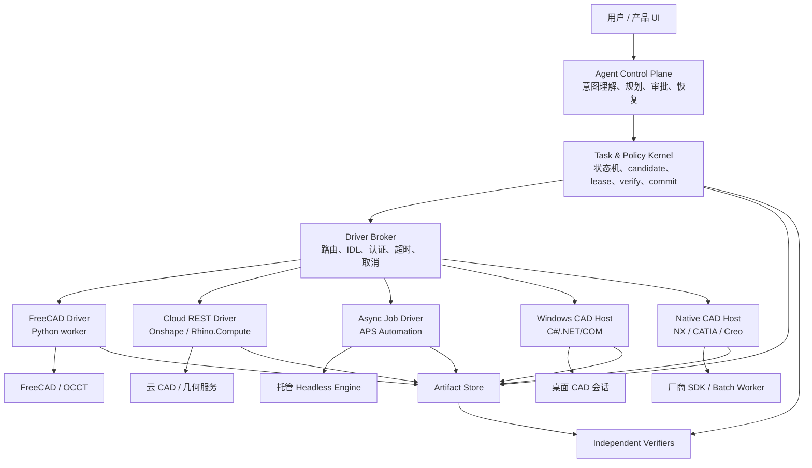
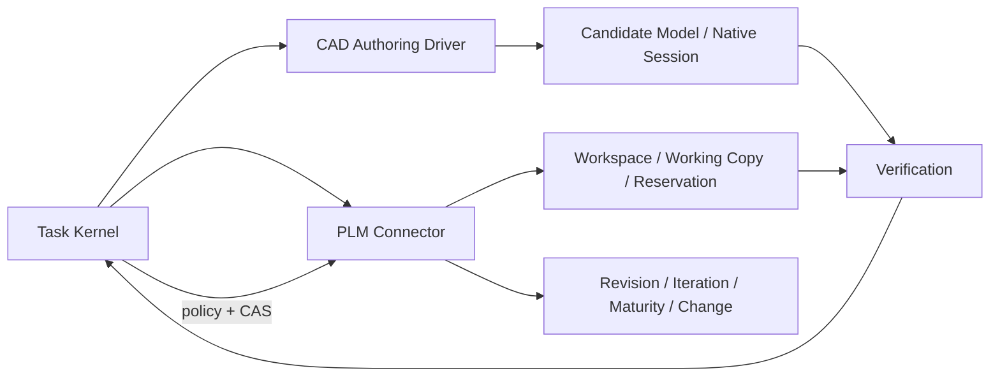

# VibeCAD 多 CAD 后端市场与技术调研报告

> 调研日期：2026-07-21
> 调研目标：判断主流 CAD 是否普遍采用 Python API，并为 VibeCAD Agent 后续接入其他 CAD 引擎设计可落地的多后端架构。
> 资料口径：优先采用产品厂商、项目官方文档和官方开发者资料；第三方封装只作为“可能的桥接方式”，不视为厂商正式支持。
> 结论性质：本报告用于产品与架构决策，不替代各厂商的采购、授权、再分发和生产部署条款审核。

阅读导航：第 3–4 节是 CAD 市场/API 调研；第 5 节是 Agent 语言以及 iOS/Android/macOS/Windows 方案；第 6 节审计当前耦合；第 7–10 节给出目标架构、协议、事务和安全；第 11 节是实施路线；第 13 节汇总最终决策。

与 CAD Agent 市场、开源策略、AutoCAD/国产 CAD 优先级合并后的最终决策见
[`PRODUCT_STRATEGY.md`](PRODUCT_STRATEGY.md)。

## 1. 执行摘要

### 1.1 核心结论

1. **CAD 行业没有统一采用 Python API。** Python 在 FreeCAD、Fusion 桌面版、Rhino、NX、Solid Edge、3DEXPERIENCE CATIA 的部分场景中得到官方支持，但支持深度、执行位置和授权方式差异很大。
2. **“能用 Python 调用”不等于“提供官方 Python API”。** Onshape 的核心外部接口是 REST，Python 只是客户端语言之一；AutoCAD、Inventor、SolidWorks 的 Python 接入往往建立在 COM/Automation 上；Revit 的官方桌面 Add-in 语言仍是 .NET；Creo 的正式工具链主要是 C/C++、Java、JavaScript/Web.Link 和 VB。
3. **同一产品在不同执行表面上也可能采用不同语言。** Fusion 桌面 Script/Add-in 支持 Python/C++，而 Autodesk Platform Services（APS）云端 Fusion Automation 当前执行 TypeScript。Inventor 桌面主要是 Automation/COM，APS 中则通过云端 Inventor Server 和预部署的 App Bundle 执行。
4. **Python 应当是 backend driver 的实现细节，而不是 Agent 协议。** Agent 应只看到版本化、受控、厂商无关的 CAD 语义；Task Kernel 应只处理 Task、candidate、evidence、verification 和 commit；只有具体驱动知道 Python、COM、.NET、REST、FeatureScript 或厂商 SDK。
5. **VibeCAD 当前方向正确，但现有执行与持久化仍深度绑定 FreeCAD。** `ModelProgram`、严格 registry、ResultRef/Selector、candidate、revision、verifier、CAS 和 lease 都值得保留；`ExecutionProfile`、`CadExecutionPort`、FCStd checkpoint、固定 STEP 工件和 `InProcessCadExecutor` 需要逐步泛化。
6. **不应承诺任意 CAD 之间无损往返。** 每个项目首先绑定一个 backend；原生文件或云端原生版本是该 backend 下的可编辑事实，`ModelProgram` 是 VibeCAD 创建/修改行为的语义记录，不是能够完整替代所有厂商特征树的万能 CAD 格式。
7. **推荐的验证顺序是：FreeCAD reference backend → fake conformance backend → Onshape cloud backend → 两条并行路线（Fusion/Rhino desktop bridge；一个明确 APS engine 的远程异步作业）→ 按客户需求接 SOLIDWORKS/NX/CATIA/Creo。** APS 是共享作业框架，不是一个统一 CAD backend。
8. **若完全不考虑当前代码资产，从零选择 Agent 主体语言，首选 TypeScript（Node.js）。** 它负责协议、状态机、模型/MCP、OAuth、异步 I/O 与 UI；CAD 几何留在厂商最佳语言的隔离 worker 中。Python、C#、C++ 或 Java 是 driver 语言，而不是统一公共层。
9. **未来做 iOS/Android/macOS/Windows App 不要求重写 Python Agent。** 移动端默认做远程薄客户端；macOS/Windows 可增加本地 bridge。Client Product API、Agent/MCP 与内部 Driver Protocol 应是三条独立边界。

### 1.2 对产品定位的直接影响

VibeCAD 应明确形成两种产品模式：

| 模式 | 默认引擎 | 用户前置条件 | 产品价值 |
|---|---|---|---|
| 托管 CAD 引擎 | FreeCAD/OCCT | 无需预装商业 CAD | 零安装、可控、跨平台、适合长尾用户与自动化任务 |
| Bring Your Own CAD | Fusion、Onshape、Rhino、SolidWorks、NX 等 | 用户已有安装、账号或 API/引擎授权 | 保留企业原生文件、特征树、插件生态和组织流程 |

商业 CAD 驱动不能沿用当前“VibeCAD 自动下载整个引擎”的分发承诺。合理模式是：

- 本地产品由用户自行安装和授权，VibeCAD 只安装签名驱动或插件。
- 云产品由用户授权 OAuth/API 访问，或使用用户/组织自己的 APS、Onshape 等账号。
- VibeCAD 不把模型密钥、CAD 许可证密钥或 OAuth refresh token 传给 Agent/模型。
- Agent 永远提交结构化 `ModelProgram`，不能直接提交 Python、C#、TypeScript、FeatureScript 或宏代码。

## 2. 调研问题、范围与判定标准

### 2.1 本报告回答的问题

1. 主流机械 CAD、通用 CAD、BIM CAD、云 CAD 和代码式 CAD 是否提供 Python API？
2. 即使支持 Python，它是在应用内、外部进程、无头引擎还是远程云端执行？
3. API 是否能创建和修改参数化几何，还是只能读取文件属性或执行有限脚本？
4. API 的操作系统、GUI、授权、并发和部署约束是什么？
5. VibeCAD 应如何抽象 backend，避免被 FreeCAD/Python/FCStd 绑定？
6. 哪些产品适合作为第二、第三个真实 backend？

### 2.2 产品范围

本报告覆盖以下代表性类别：

- 开源/可嵌入：FreeCAD、CadQuery、build123d、OpenSCAD。
- 主流桌面机械 CAD：Autodesk Fusion、Inventor、SOLIDWORKS、Solid Edge。
- 通用 CAD/BIM：AutoCAD、BricsCAD、Revit。
- 云原生/云自动化：Onshape、Autodesk APS Automation、Rhino.Compute。
- 企业高端机械 CAD：Siemens NX、CATIA V5/3DEXPERIENCE CATIA、Creo Parametric。

Blender、Maya、3ds Max 等 DCC 工具不是 VibeCAD 当前“参数化、可制造机械 CAD”主范围。APS 的 3ds Max Python 能力只作为同平台对比，不进入推荐 backend 清单。

### 2.3 Python 支持等级

为了避免把不同概念混为一谈，报告使用以下分级：

| 等级 | 定义 | 典型例子 |
|---|---|---|
| P1：官方一等 Python 建模接口 | 厂商提供 Python runtime/binding、文档和建模对象模型 | FreeCAD、Fusion 桌面、Rhino、NX |
| P2：官方 Python 脚本或局部领域接口 | Python 是官方能力，但只覆盖特定 App、BIM 数据或规则环境 | 3DEXPERIENCE CATIA Engineering Rules Capture、BricsCAD BIM |
| P3：语言无关 API，可由 Python 调用 | 核心接口是 REST、COM/Automation 等，Python 只是客户端之一 | Onshape REST、Inventor Automation、Solid Edge Automation |
| P4：第三方/非官方 Python 桥接 | 厂商不把 Python 列为正式主路径，社区通过 COM/.NET 包装 | AutoCAD、SOLIDWORKS、Revit 桌面常见 Python 生态 |
| P0：无实际 Python 路径 | 公开正式接口和常用桥接均不以 Python 为可行方案 | 本次样本中很少，通常仍可通过进程/RPC 间接连接 |

### 2.4 执行表面分类

API 语言之外，更重要的是执行位置：

| 执行表面 | 特征 | 代表产品 |
|---|---|---|
| 本地库/无头 Worker | VibeCAD 可启动隔离进程，不依赖用户操作 GUI | FreeCAD、CadQuery、build123d、OpenSCAD CLI |
| 应用内脚本/插件 | CAD 必须运行，驱动通常受主线程和文档生命周期约束 | Fusion、Rhino、NX、CATIA、Creo |
| 本地外部自动化 | Sidecar 通过 COM/.NET/Automation 控制 CAD | AutoCAD、Inventor、SOLIDWORKS、Solid Edge |
| 远程同步 REST | 请求直接操作云端文档/工作区 | Onshape |
| 远程异步作业 | 上传输入、选择引擎/Bundle、提交 WorkItem、取回结果 | Autodesk APS Automation |
| 服务化几何引擎 | 本地或云端部署专门的计算服务 | Rhino.Compute |

一个合格的 VibeCAD backend 抽象必须同时表达“产品是谁”和“通过哪种执行表面接入”，不能继续只用 `headless/offscreen_gui/interactive_gui` 三个值表达全部差异。

## 3. 市场总览

### 3.1 跨产品对比矩阵

| 产品/执行表面 | Python 等级 | 官方主接口 | 执行模型 | 无头/云能力 | VibeCAD 接入形态 | 初步优先级 |
|---|---:|---|---|---|---|---:|
| FreeCAD | P1 | Python + C++ | 本地进程内或命令行 | 强，本项目已验证 | 隔离 Python Worker | Reference |
| CadQuery | P1 | Python library | 本地库 | 强 | Python Worker | 测试/补充 |
| build123d | P1 | Python library | 本地库 | 强 | Python Worker | 测试/补充 |
| OpenSCAD | 非 Python DSL | OpenSCAD language + CLI | 本地命令行 | 强 | 固定模板编译器 + CLI | 低 |
| Autodesk Fusion Desktop | P1 | Python/C++；TypeScript 为 Preview | 应用内 | 桌面 API 依赖 Fusion 会话 | Fusion 插件 + 本地 IPC | 中高 |
| Autodesk Fusion via APS | 非 Python | APS REST + TypeScript bundle | 云端异步 WorkItem | 强 | APS Driver + 固定 Bundle | 高（商业云） |
| Onshape | P3 | REST + FeatureScript | 云端同步/异步 API | 强 | REST/OAuth Driver | 高（第二 backend） |
| Rhino Desktop | P1 | CPython/IronPython + RhinoCommon | 应用内 | GUI 内为主 | Rhino 插件 + IPC | 中高 |
| Rhino.Compute | P3 | REST over Rhino geometry | 本地/服务器 | 强但有部署与计费约束 | Compute REST Driver | 中高 |
| Inventor Desktop | P3 | Automation/COM、.NET/VBA | 应用内或外部 EXE | 完整建模通常依赖 Inventor | Windows Sidecar | 中 |
| Inventor Apprentice | P3 | ActiveX 子集 | 无 GUI、进程内组件 | 只读几何/B-Rep 为主 | 读取/验证专用 Sidecar | 补充 |
| Inventor via APS | 非 Python | APS REST + Inventor App Bundle | 云端异步 WorkItem | 强 | APS Driver | 高（有客户时） |
| SOLIDWORKS | P4 | COM，VB/VBA/.NET/C++/C# | 应用内或外部 EXE | 完整建模通常依赖桌面会话 | Windows COM/.NET Sidecar | 中高（需求驱动） |
| SOLIDWORKS Document Manager | P3 | 授权 COM 组件 | 无完整 SOLIDWORKS 也可部署 | 偏文档、属性、引用和数据提取 | 读取/预检专用 Sidecar | 补充 |
| Solid Edge | P3 | Automation API，VB.NET/C#/C++/Python | Windows 自动化/OEM | 取决于 Solid Edge/OEM | Windows Sidecar | 中 |
| AutoCAD Desktop | P4 | AutoLISP、ObjectARX、.NET、ActiveX、JS | 应用内/外部自动化 | 有受限 core/automation 路径 | .NET/ObjectARX 插件或 COM Sidecar | 中低（机械方向） |
| AutoCAD via APS | 非 Python | APS REST + AutoCAD Bundle/脚本 | 云端异步 WorkItem | 强 | APS Driver | 中 |
| BricsCAD | P2/P3 | BRX C++/.NET、LISP、COM；BIMPYTHON | 应用内/Windows 外部自动化 | Python 主要偏 BIM 数据 | BRX/.NET 插件或 Automation Sidecar | 中低 |
| Revit Native Add-in | P4 | .NET（C#/VB.NET/C++/CLI） | 应用内主线程 | 桌面版不宜当通用无头库 | .NET 插件 + IPC | 低（非当前垂直） |
| Dynamo for Revit | P2 | Graph + Python node | Revit 内脚本环境 | 不是原生外部 Python SDK | 受控脚本/图环境 | 低 |
| Revit via APS | 非 Python | APS REST + Revit add-in | 云端 headless | 强 | APS Driver | 中（若进入 BIM） |
| Siemens NX | P1 | NX Open Python，另有 C/C++/.NET/Java | 应用内/受授权自动化 | 依许可证与部署 | NX Open 插件/Worker + IPC | 中高（企业需求） |
| CATIA V5 | P3/P4 | CAA C++、Automation/VBA/VBScript | 应用内/外部自动化 | 授权和部署复杂 | CAA/Automation Sidecar | 低（早期） |
| 3DEXPERIENCE CATIA Native Script | P2 | 特定 App 内 Python + EKL binding | Native App 当前 session | 未证明可通用无人值守触发 | 先做受支持触发方式 spike | 中低 |
| 3DEXPERIENCE Platform REST | 非 Python | REST/Web Services | 云/平台服务 | 偏 PLM 数据与企业集成，不是几何内核 | 独立 PLM connector | 需求驱动 |
| Creo Parametric | P4 | Toolkit C/C++、Object Toolkit Java、Creo.JS、Web.Link、VB | DLL、spawned process 或 Web | 依 Creo 会话/授权 | Toolkit/Java/JS 插件 + IPC | 中（需求驱动） |

说明：

- “无头/云能力强”不代表免费、可再分发或无需许可证。
- “Python P1”也不代表能够从普通系统 Python 中直接 `pip install` 并调用。
- 接入优先级是针对 VibeCAD 当前机械 CAD/Agent 路线的判断，不是产品能力排名。

### 3.2 最重要的市场规律

#### 规律 A：高性能内核通常不是 Python

FreeCAD 官方说明其核心功能为保证稳健性和性能而采用 C++，大量外层、工作台和 UI 通信采用 Python；其源码文档同时覆盖 C++ 与 Python。Python 的主要价值是可编排性、扩展效率和生态，而不是承担底层 B-Rep 内核计算。[FreeCAD API](https://www.freecad.org/api/)

类似规律也适用于大量商业 CAD：底层几何与文档模型由原生代码实现，再暴露 C++、.NET、COM、Java、Python 或 REST binding。因此，VibeCAD 不应把“CAD 能力”与“Python 函数签名”视为同一层。

#### 规律 B：桌面 API 大多绑定应用生命周期

Fusion 创建的 Python Script 入口由 Fusion 在运行会话中调用；Rhino.Python 嵌入 Rhino；NX Open、CATIA/Creo 工具链通常也围绕产品会话运行。此类 backend 需要一个产品内固定插件和认证本地 IPC，而不是让 MCP server 直接 import 厂商模块。[Fusion Script/Add-in](https://help.autodesk.com/cloudhelp/ENU/Fusion-360-API/files/WritingDebugging_UM.htm)

#### 规律 C：Windows COM 仍然广泛存在

SOLIDWORKS 明确将 API 定义为 COM programming interface；Inventor 将 API 暴露为 Microsoft Automation；AutoCAD 支持 ActiveX/VBA/.NET/ObjectARX；Solid Edge 也以 exposed objects/Automation 为核心。这些 API 可以被 Python 间接调用，但生产驱动更适合使用官方 .NET/C++ 语言构建稳定 sidecar，再给 VibeCAD 暴露 JSON-RPC。

#### 规律 D：云 CAD 采用 REST/作业协议，不关心 Agent 使用什么语言

Onshape 对外暴露 JSON REST API，并用 FeatureScript 扩展参数化特征；APS 用 REST 管理 engine、App Bundle、activity 和 WorkItem。对这类产品，Python 只可能是 VibeCAD Driver 的客户端实现，不能成为跨 backend 契约。[Onshape REST](https://onshape-public.github.io/docs/api-intro/)、[APS Automation](https://aps.autodesk.com/en/docs/design-automation/v3)

#### 规律 E：文件与事务语义并不统一

- FreeCAD 适合通过 FCStd 副本形成 candidate。
- Onshape 原生拥有 document、workspace、version、microversion 和 branch 语义。
- APS 以输入/输出文件和 WorkItem 为边界。
- 桌面 COM/API 产品通常需要另存副本、临时文档或受控 undo/transaction。

因此，Task Kernel 可以统一“stage → execute → checkpoint → seal → verify → publish”的业务语义，但不能要求每个驱动都实现同一种文件路径或原生事务机制。

## 4. 各产品详细调研

### 4.1 FreeCAD

**官方接口与 Python 地位**

- FreeCAD 官方文档同时覆盖 C++ 与 Python，并指出绝大多数 API 相同或相近。
- 官方手册提供 Python console、macro 和对象建模示例。
- FreeCAD 的 Python 暴露范围包括文档、参数化对象、几何、导入导出和大量工作台能力。
- VibeCAD 当前已经在 conda runtime 中验证无 GUI import、FCStd checkpoint、STEP 导出和 OCCT 几何检查。

来源：[FreeCAD 源码/API 文档](https://www.freecad.org/api/)、[FreeCAD 手册](https://www.freecad.org/manual/a-freecad-manual.pdf)

**Agent 接入评价**

- 优点：开源、可托管分发、Python 一等支持、可进程隔离、无用户商业账号、适合自动化。
- 缺点：`FreeCADCmd`/console 环境没有完整 `FreeCADGui`，依赖 GUI 的模块必须逐 capability 验证；工作台 API 一致性和拓扑稳定引用仍需 VibeCAD 自己治理；OCCT 崩溃必须由 worker 隔离。
- 授权：FreeCAD 采用 LGPL-2.1-or-later；可托管/再分发不等于没有义务，构建、修改和随附许可仍需合规审核。[FreeCAD License](https://github.com/FreeCAD/FreeCAD/blob/main/LICENSE)
- 结论：继续作为 reference backend 和独立 verifier 的基础，不代表其他 backend 要模仿其 Python API。

### 4.2 CadQuery 与 build123d

CadQuery 是用于参数化 3D CAD 的 Python library，目标包括可读脚本、参数化模型和 STEP/AMF/3MF 等高质量输出。build123d 是基于 Open Cascade 的 Python BREP 建模框架，强调 Pythonic interface、类型提示和可维护 CAD-as-code。[CadQuery](https://cadquery.readthedocs.io/en/stable/)、[build123d](https://build123d.readthedocs.io/en/stable/)

**Agent 接入评价**

- 二者很适合做轻量 backend、单元测试 backend 或表达能力实验。
- 它们的可编辑事实更接近“版本固定的 Python/IR source + 依赖环境”；STEP/BREP 是派生工件，不能保存完整参数化源语义。[CadQuery Import/Export](https://cadquery.readthedocs.io/en/stable/importexport.html)
- 它们与 FreeCAD 同属 Python/OCCT 技术谱系，不能充分验证 VibeCAD 是否真正摆脱本地 Python 和文件系统假设。
- 它们与 FreeCAD/OCCT verifier 还可能共享相同几何内核缺陷，因此不构成真正独立的第二内核验证。
- 它们缺少大型商业 CAD 的完整装配、工程图、PLM、UI 和组织工作流。
- 结论：可用于 conformance 与性能比较，但不应取代 Onshape/APS 作为第二种架构形态验证。

### 4.3 OpenSCAD

OpenSCAD 使用自己的声明式文本语言，不是 Python API。官方文档覆盖 primitives、transform、boolean、extrusion、module/function、import/export 和命令行执行；命令行可直接生成 STL/PNG 等工件。[OpenSCAD 文档](https://openscad.org/documentation)、[官方手册 PDF](https://files.openscad.org/documentation/manual/OpenSCAD_User_Manual.pdf)

**Agent 接入评价**

- 优点：纯文本、确定性较强、CLI 友好、部署简单。
- 缺点：与历史特征/约束式机械 CAD 有明显差异；直接让模型生成任意 OpenSCAD 代码会违反 VibeCAD 的受控操作原则。
- 正确接入方式：由固定 compiler 将允许的 `ModelProgram` 编译成模板化 OpenSCAD AST/代码，再调用 CLI；禁止模型直接提交脚本。
- 可重现性要求：固定 OpenSCAD executable、CGAL/Manifold 渲染 backend、字体、library path、seed 和全部外部依赖；不同版本/后端不能默认产生完全相同结果。
- 分发前还要审核 OpenSCAD GPLv2+ 及其 CGAL linking exception，而不是把“命令行程序”误认为无许可义务。[OpenSCAD COPYING](https://github.com/openscad/openscad/blob/master/COPYING)
- 结论：低优先级，但适合证明同一个语义操作可以编译到非 Python DSL。

### 4.4 Autodesk Fusion Desktop

**官方接口与 Python 地位**

- Fusion 使用一套可从 Python、C++ 或 TypeScript 调用的桌面 API，但 Desktop TypeScript 当前属于 Preview；官方明确不建议交付依赖 preview 的生产程序。因此生产驱动以 Python/C++ 为主，TypeScript 只用于实验性 spike。
- Python script 的 `run` 入口由 Fusion 调用，并在 Fusion 会话中执行。
- API 能操作设计、装配、CAM、UI、事件和导入导出，但具体子领域覆盖度仍需逐项验证。

来源：[Fusion API User Manual](https://help.autodesk.com/cloudhelp/ENU/Fusion-360-API/files/UserManualIndex_UM.htm)、[Python Specific Issues](https://help.autodesk.com/cloudhelp/ENU/Fusion-360-API/files/PythonSpecific_UM.htm)、[TypeScript Preview](https://help.autodesk.com/cloudhelp/ENU/Fusion-360-API/files/TypeScriptSpecific_UM.htm)

**Agent 接入评价**

- 不能按 FreeCAD 模式假设普通 Python 进程可以直接 import 并无头建模。
- 推荐在 Fusion 内安装固定 VibeCAD Add-in，Add-in 通过认证 loopback IPC 领取结构化 operation。
- 后台线程可以做网络监听或一般计算，但不能调用 Fusion API；建模调用必须通过 custom event 等机制回到 Fusion 主线程。[Fusion Threading](https://help.autodesk.com/cloudhelp/ENU/Fusion-360-API/files/Threading_UM.htm)
- UI/main-thread、文档激活、事件回调、用户正在编辑的文档和保存冲突必须由插件管理。
- 用户需要 Fusion 安装和相应订阅；VibeCAD 不负责重新分发 Fusion runtime。
- 结论：商业桌面 CAD 的优先 pilot，能验证 in-app plugin 模式。

### 4.5 Autodesk Platform Services Automation

APS Automation 是比单一桌面 API 更值得单独建模的执行表面。官方当前支持 AutoCAD、3ds Max、Inventor、Revit 和 Fusion engine，通过 App Bundle、Activity 与 WorkItem 执行云端自动化任务；Fusion engine 当前执行 TypeScript，Inventor/Revit/AutoCAD 使用各自引擎和 bundle 体系。[APS Automation 概览](https://aps.autodesk.com/en/docs/design-automation/v3)

**Agent 接入评价**

- 优点：真正无头、可扩展、无需用户桌面保持打开；一次 driver framework 可复用 WorkItem、回调、状态和工件处理。
- 限制：每个 CAD engine 的 bundle 语言和 API 仍不同；存在 OAuth、配额、速率、云数据边界、引擎版本生命周期和计费问题。
- 成本：APS 已采用新的商业计费模式；例如 Fusion Automation 官方当前公布为每处理小时 3 Flex tokens。正式优先级必须经过实际 job 的耗时、传输、并发与价格 spike，而不能只看 API 可用性。[APS 商业模型](https://aps.autodesk.com/blog/aps-business-model-evolution)、[Fusion Automation GA](https://aps.autodesk.com/blog/design-automation-api-fusion-now-generally-available)
- 安全要求：上传的是 VibeCAD 预构建/签名 bundle；模型不能动态提供 TypeScript/.NET/脚本。
- 状态要求：Task Kernel 必须支持异步 job、超时、取消、幂等回调、重复投递和结果下载校验。
- 结论：作为商业云 track 优先级很高，但不能假装“一次实现即支持五个 CAD”；共享的是作业控制面，不是几何 handler。

### 4.6 Onshape

**官方接口与 Python 地位**

- Onshape 是云原生 CAD，对外提供 GET/POST/DELETE REST API 和 JSON 数据模型。
- 官方 quick start 使用 Python `requests`，也给出 JavaScript/C++ 等示例，说明 Python 是客户端选择而不是专有 API。
- 参数化建模扩展采用 Onshape 自有 FeatureScript；标准 Extrude、Fillet 等本身由 FeatureScript 构成。
- Document 内部包含 workspace、version、microversion、branch 和 element；写操作面向 workspace。
- API 同时有 endpoint 速率限制和年度账号/API 配额：速率限制返回 `429` 与 `Retry-After`，账号配额耗尽则可能返回 `402`；导入导出可能是异步 translation。

来源：[REST Introduction](https://onshape-public.github.io/docs/api-intro/)、[Python Quick Start](https://onshape-public.github.io/docs/api-intro/quickstart/)、[FeatureScript](https://cad.onshape.com/FsDoc/index.html)、[API Limits](https://onshape-public.github.io/docs/auth/limits/)、[Import/Export](https://onshape-public.github.io/docs/api-adv/translation/)

**Agent 接入评价**

- 是检验 backend 抽象最有价值的第二个真实实现：没有本地 Python runtime、没有 FCStd 路径，并且天然具备版本语义。
- Driver 应直接调用 REST；必要的自定义特征应由预发布、版本固定的 FeatureScript 模块实现，不接受模型生成的任意 FeatureScript。
- Raw Feature API 暴露 `BTMFeature-*`/`BTMParameter-*` 等内部 JSON，官方提示参数结构可能变化；这些类型只能存在于 Onshape driver，不能泄漏进公共 IR。[Feature API](https://onshape-public.github.io/docs/api-adv/featureaccess/)
- Endpoint 版本必须显式固定；不能省略版本而意外落到 `v0`，并应监控 `X-Deprecated` 及运行兼容测试。[REST API Versioning](https://onshape-public.github.io/docs/api-intro/)
- candidate 可映射为隔离 workspace/branch；seal 可映射为不可变 version/microversion；实际 API 可行性需通过 spike 验证。
- 需要 OAuth/API key、速率限制、异步 translation、网络失败和组织权限处理。
- 第二 backend spike 应使用付费私有计划或无保密数据；Onshape Free Plan 仅限非商业用途且文档公开，不适合承载私有商业样件。[Onshape Pricing](https://www.onshape.com/en/pricing)
- Driver 应批量提交、缓存 observation，并避免把每个微小查询都变成 REST 往返，以控制年度配额和 endpoint 限流。
- 结论：推荐作为第二 backend，而非因为市场份额推断，而是因为它能最大化检验架构是否真正 transport-neutral。

### 4.7 Rhino Desktop 与 Rhino.Compute

**官方接口与 Python 地位**

- Rhino 8 的新脚本基础设施支持 Python 3 CPython，并保留 Python 2 IronPython 路径；具体 Python runtime/version 必须由 driver manifest 探测，不能写死为协议假设。
- Python 可创建交互脚本、命令、插件、文件格式和 Grasshopper component。
- Rhino.Compute 通过 REST 暴露 Rhino geometry engine，可本地调试或部署到服务器。
- 官方生产部署文档明确涉及 Windows Server、进程管理和按 core-hour 的生产授权/计费；本地开发可以使用现有 Rhino 许可证。

来源：[Rhino ScriptEditor](https://developer.rhino3d.com/guides/scripting/scripting-command/)、[Language Initialization](https://developer.rhino3d.com/guides/scripting/advanced-langinit)、[Rhino.Compute](https://developer.rhino3d.com/guides/compute/development/)、[Compute Production Deployment](https://developer.rhino3d.com/en/guides/compute/deploy-to-iis/)

**Agent 接入评价**

- Desktop 可采用插件 + IPC；Rhino 8.11+ 的 `rhinocode` CLI 可连接已运行且开启 Script Server 的实例，适合低成本 spike，但 production 仍应执行固定、受信命令/脚本。[RhinoCode CLI](https://developer.rhino3d.com/guides/scripting/advanced-cli/)
- Compute 可采用 REST driver，但应被视为 stateless geometry service，不是自带历史特征树和 candidate transaction 的完整机械 CAD backend。
- Rhino 擅长 NURBS、Grasshopper 和几何计算，但与机械历史特征树、装配语义并不完全等价。
- Compute 是良好的几何服务 backend。Windows 是成熟生产路径；官方已有 Linux Compute WIP，但当前明确不建议用于生产，且插件、非 3DM I/O 等仍有限；macOS 不支持 Compute。[Linux Compute WIP](https://developer.rhino3d.com/guides/compute/compute-linux-getting-started/)、[Compute FAQ](https://developer.rhino3d.com/guides/compute/compute-faq/)
- `rhino3dm` 适合作为跨平台 `.3dm` artifact reader/writer 和轻量 verifier；openNURBS 不提供完整布尔、相交、网格化和质量属性能力，不能冒充 Rhino/Compute backend。[rhino3dm](https://developer.rhino3d.com/guides/opennurbs/what-is-rhino3dmio/)、[openNURBS 限制](https://developer.rhino3d.com/guides/opennurbs/what-is-opennurbs/)
- 生产部署、插件可用性、平台差异和授权必须纳入 manifest。
- 结论：优先级仅次于 Onshape/APS，可作为几何/工业设计方向的重要扩展。

### 4.8 Autodesk Inventor

**官方接口与 Python 地位**

- Inventor API 基于 Microsoft Automation，官方说明多种语言包括 Python 都可以访问。
- 官方 SDK/样例仍主要采用 VBA 和 C#；生产扩展更自然地使用 .NET/COM。
- 完整 Inventor API 可创建和修改零件、装配、工程图和参数化特征。
- Apprentice Server 是无 UI 的 ActiveX 子集，可读取 assembly structure、B-Rep、geometry、render style 等，但多数几何访问是只读，写入集中在属性和文件引用。
- Inventor 2026 起 Apprentice Server 必须独立安装；它只能作为客户进程内的 ActiveX 组件使用，不能运行在 Inventor Add-in 或 VBA 内。
- APS 还提供云端 Inventor Server，能够修改 IPT/IAM/IDW 等文件。

来源：[Inventor API Getting Started](https://help.autodesk.com/cloudhelp/2018/ENU/Inventor-API/files/GettingStarted.htm)、[Inventor 2026 API Manual](https://help.autodesk.com/view/INVNTOR/2026/ENU/?guid=UserManualIndex)、[Apprentice Server](https://help.autodesk.com/cloudhelp/2026/ENU/Inventor-API/files/Apprentice_Overview.htm)、[APS Automation](https://aps.autodesk.com/en/docs/design-automation/v3)

**Agent 接入评价**

- Desktop 推荐用 .NET sidecar 或 Add-in，不建议以 Python COM 封装作为产品级稳定边界。
- Apprentice 可用于文件预检、属性/引用读取和部分几何 observation，不能替代完整建模 backend。
- 如果目标是无人值守企业自动化，APS Inventor 比驱动用户桌面更可控。
- 结论：有 Autodesk/制造客户时优先接 APS；桌面 backend 次之。

### 4.9 SOLIDWORKS

**官方接口与 Python 地位**

- SOLIDWORKS 将主 API 明确定义为 COM programming interface。
- 官方列出的语言包括 VB、VBA、VB.NET、C++、C# 和宏；任何支持 COM 的语言理论上可构建 standalone 应用。
- Python 可借助 COM/IDispatch 间接调用，但不是官方文档和样例的一等语言。
- Add-in DLL、注册表、COM apartment、应用会话、版本兼容和用户桌面状态都是生产接入要点。
- SOLIDWORKS Document Manager 是可独立部署的 COM 组件，适合读取/修改属性、引用、configuration、部分 geometry stream 等；需要按版本申请 license key，且不是完整 SOLIDWORKS 建模引擎。
- Document Manager key 只提供给有效订阅客户，每位使用者需要 key，主要版本升级需更新，且不能向公司外部共享或随通用产品分发。

来源：[SOLIDWORKS API 2026](https://help.solidworks.com/2026/English/SolidWorks/sldworks/c_solidworks_api.htm)、[Standalone/Add-in Overview](https://help.solidworks.com/2025/English/api/sldworksapiprogguide/GettingStarted/SolidWorks_API_Standalone_and_Add-in_Applications_Overview.htm)、[Document Manager Getting Started](https://help.solidworks.com/2026/english/api/swdocmgrapi/GettingStarted-swdocmgrapi.html)

**Agent 接入评价**

- 推荐固定 C#/.NET Add-in 或 sidecar，向 Task Kernel 暴露小型 JSON-RPC；不要让模型或主 Python 进程直接操作 COM object。
- Sidecar 必须串行化 COM 调用、处理 STA/main-thread、崩溃重启、弹窗、未保存文档和版本选择。
- 完整 SOLIDWORKS 可通过 `UserControlBackground` 隐藏运行，但仍是依赖完整应用、桌面会话和许可证的 automation worker，不是真正 headless。[UserControlBackground](https://help.solidworks.com/2026/English/api/sldworksapi/SOLIDWORKS.Interop.sldworks~SOLIDWORKS.Interop.sldworks.ISldWorks~UserControlBackground.html)
- candidate 应从原生文件副本或临时文档启动，绝不能直接修改用户活动模型后再依赖 undo 回滚。
- Document Manager 可作为独立只读/预检 provider，但不能宣称支持完整 feature editing。
- 结论：商业价值高、工程成本也高，应由真实客户需求和可用测试许可证驱动。

范围说明：上述 P4 判断针对机械设计主产品的 SOLIDWORKS Design API。SOLIDWORKS Electrical 是不同产品/API，官方另有 Python 示例和后台初始化能力；若未来进入电气设计，应单列 backend，不能从主 Design API 推断。[SOLIDWORKS Electrical API](https://help.solidworks.com/2026/english/api/sldworkselecapihelp/index.html)

### 4.10 Solid Edge

Siemens 官方资料说明 Solid Edge API 可读取和操作 Part、Sheet Metal、Assembly 和 Draft 环境，暴露对象可由 VB.NET、C#、C++ 和 Python 访问；其历史资料显示这是典型的 Windows exposed-object/Automation 模型。[Siemens Solid Edge API](https://blogs.sw.siemens.com/solidedge/developing-solid-edge-oem-solutions/)

**Agent 接入评价**

- Python 在官方资料中明确可用，但更接近“Python 调用 Automation objects”，不是可跨平台嵌入的 Python 几何库。
- 推荐与 Inventor/SOLIDWORKS 共用 Windows sidecar 运行框架，但 operation binding、对象身份和事务仍需独立实现。
- Solid Edge 是 Windows 桌面产品，官方不建议运行在 Windows Server；隐藏 UI 不应被标记为 server/headless。
- COM worker 必须处理 `Application is Busy`、`Call was Rejected By Callee` 等调用拒绝，使用消息过滤、退避和有界重试。
- OEM toolkit 是用于品牌化垂直应用的独立商业方案，不是标准 Solid Edge 许可证天然包含的 headless 模式；采购和再分发条款必须单独确认。
- 结论：技术可行，优先级低于已有明确用户群的 SOLIDWORKS/NX。

### 4.11 AutoCAD

**官方接口与 Python 地位**

- AutoCAD 官方接口包括 AutoLISP、ObjectARX C++、Managed .NET、ActiveX Automation、VBA 和 JavaScript。
- 能力必须按平台声明：Windows 完整版覆盖最广；macOS 主要是 AutoLISP/ObjectARX；Web 端的公开自动化面又不同，不能共用一个 capability manifest。
- 官方支持矩阵没有把 Python 列为一等接口；Python 常见方案是第三方包调用 ActiveX/COM，主要受 Windows 约束。
- ObjectARX 直接访问数据库、图形系统和原生命令；.NET 是较低门槛的托管接口。
- APS 可在云端运行 AutoCAD engine、脚本、AutoLISP 或预构建插件。

来源：[AutoCAD Supported Programming Interfaces](https://help.autodesk.com/cloudhelp/2026/ENU/AutoCAD-Customization/files/GUID-E6429154-36DF-4D84-8ABC-9FCA15B66158.htm)、[ObjectARX Environment](https://help.autodesk.com/cloudhelp/2022/ENU/OARX-DevGuide/files/GUID-9A679CBB-F622-4A3F-BBE5-D4ED130EF303.htm)、[APS Automation](https://aps.autodesk.com/en/docs/design-automation/v3)

**Agent 接入评价**

- AutoCAD 的核心数据模型、2D/3D 实体和 DWG 语义与 VibeCAD 当前机械特征模型不同。
- 如果接入，应优先明确是“DWG 自动化 backend”还是“机械 B-Rep backend”，避免把通用命令映射成错误的语义等价。
- 本地推荐 .NET/ObjectARX 固定插件；云端批处理推荐 APS。
- Windows 的 `accoreconsole.exe`/Core Console 是桌面插件与 APS 之间的独立本地批处理 surface，适合经过验证的脚本/数据库任务。[AutoCAD Core Console](https://help.autodesk.com/cloudhelp/2026/ENU/AutoCAD-DidYouKnow/files/GUID-BE44AE86-7638-48C9-BE5B-C1DF8E4C8808.htm)
- APS AutoCAD Automation 不提供各 vertical toolset 的命令/API，只能使用基础 AutoCAD 引擎及相应 Object Enabler；Civil 3D、Architecture、Plant 3D 等不能据此默认云端可执行。
- 结论：生态大，但不是当前机械单零件/装配路线的最优第二 backend。

### 4.12 BricsCAD

- BricsCAD 主扩展体系包括 BRX C/C++、.NET、LISP 和 COM，BRX 目标之一是与 AutoCAD ObjectARX 兼容。
- BricsCAD BIM 提供嵌入 Python 和 `BIMPYTHON` 命令，可查询和管理 BIM model data；官方同时说明 BricsCAD 不提供 Python shell。
- BricsCAD V26 的 .NET host 已迁到 .NET 8，面向旧版本构建的插件不能假定二进制兼容。
- Windows 还支持外部 COM Automation 与 `/Automation`、`/B` 隐藏/批处理启动；这仍是完整 BricsCAD 进程，不是真正 headless。
- 因此不能把 BIMPYTHON 的存在推导为完整 BRX/B-Rep API 都已提供 Python binding。

来源：[BricsCAD BIM Python](https://help.bricsys.com/en-us/document/bricscad-bim/building-data/using-python-scripts?version=V26)、[BRX](https://developer.bricsys.com/bricscad/help/en_US/V25/DevRef/source/BRX.htm)

**Agent 接入评价**

- BIM 数据任务可用官方 Python；深度实体、插件和跨版本兼容更适合 BRX/.NET。
- 可与 AutoCAD 共用部分 operation/compiler 思路，但仍需要独立 capability conformance，不能因 API 兼容宣传而复用未经验证的 handler。
- 结论：如果产品进入 DWG/BIM 市场再考虑。

### 4.13 Revit

- Revit 桌面 API 是 .NET API，官方支持 C#、VB.NET 和 C++/CLI；官方 FAQ 明确其他 CLR 语言可能工作但未经测试、不受支持。
- Python 在 Revit 社区非常常见，但主要依赖 pyRevit、Dynamo/IronPython 等生态，不等于 Autodesk 官方 Python Add-in 契约。
- Dynamo for Revit 是 Autodesk 随产品提供的官方脚本/图形编程环境并包含 Python 节点，可归为 P2 surface；它不是原生 Revit API 的官方 Python binding，也不宜作为 VibeCAD production driver 的通用 IPC 契约。[Dynamo for Revit](https://help.autodesk.com/cloudhelp/2026/ENU/RevitDynamo/files/RevitDynamo_Whats_New_in_Dynamo_for_Revit_html.html)
- 原生 Revit API 只支持进程内 DLL，且只能在主线程的有效 API context 中调用；外部 Agent 必须通过 Add-in + IPC，再由 `ExternalEvent` 等机制调度。[Revit API Deployment](https://help.autodesk.com/view/RVT/2024/ENU/?guid=Revit_API_Revit_API_Developers_Guide_Introduction_Getting_Started_Using_the_Autodesk_Revit_API_Deployment_Options_html)
- APS 提供云端 headless Revit，可创建、读取、修改 RVT/RTE/RFA 数据并运行固定 add-in。

来源：[Revit API Introduction](https://help.autodesk.com/cloudhelp/2024/ENU/Revit-API/files/Revit_API_Developers_Guide/Introduction/Getting_Started/Welcome_to_the_Revit_Platform_API/Revit_API_Revit_API_Developers_Guide_Introduction_Getting_Started_Welcome_to_the_Revit_Platform_API_Introduction_to_the_Revit_Platform_API_html.html)、[Revit API FAQ](https://help.autodesk.com/cloudhelp/2025/PTB/Revit-API/files/Revit_API_Developers_Guide/Revit_API_Revit_API_Developers_Guide_FAQ_html.html)、[APS Automation](https://aps.autodesk.com/en/docs/design-automation/v3)

**Agent 接入评价**

- Revit 的 element/family/BIM transaction 语义不能直接映射到机械 `solid/body/part`。
- 若未来进入 BIM，应建立新的领域 capability namespace，而不是扩张现有机械 operation 直到含义模糊。
- 结论：技术上可通过桌面 .NET 或 APS 接入，但不属于近期机械 CAD 主线。

### 4.14 Siemens NX

- Siemens 正式提供 NX Open Python Author，包含 Python API library、文档和开发工具。
- NX Open 生态同时存在其他语言/工具；`NX Open Python Author` 是开发用 add-on，生产执行仍需要程序实际调用功能对应的 NX feature license，不能笼统合并成一个“Python runtime license”。
- NX Open 存在 internal、batch 和部分 remote 执行模式；公开资料对 .NET remoting、Java RMI/remote 的说明更明确，Python remote 能力必须按语言和 release 验证。对 Agent 最稳妥的是由外部调度器启动/复用受控 NX worker，让代码在 NX runtime 内执行，而不是跨进程持有 native object/tag。
- NX 适合复杂零件、装配、PMI、制造和企业流程，但 API、许可与测试环境成本显著高于开源 backend。

来源：[Siemens NX Mach Series / NX Open Python Author](https://blogs.sw.siemens.com/wp-content/uploads/sites/2/2020/11/NX-Add-on-Module-Brochure.pdf)、[NX Programming and Customization](https://media.plm.automation.siemens.com/nx/CAD_design-solutions/pdf/08/NXCAD01_08_en_custmiz_FS.pdf)

**Agent 接入评价**

- 推荐 NX 内固定 NX Open plugin/worker，通过 IPC 接收受控 operation。
- 必须把 NX release、开发工具 entitlement、实际 feature licenses、模块 availability 和执行模式约束放入 capability manifest。
- 不能仅因“官方有 Python”就在 MCP server 中直接 import NX；驱动部署仍然与安装会话绑定。
- 结论：企业机械 CAD 中很有价值，但应在拿到持续测试许可和客户场景后启动。

### 4.15 CATIA V5 与 3DEXPERIENCE CATIA

需要区分两代执行环境：

**CATIA V5**

- 深度扩展主要依赖 CAA C++ 和 Automation/VBA/VBScript。
- 公开 CAA 安装资料要求熟悉 C++ 和 Visual Studio；完整 developer guide 常需要 3DS Support 权限。
- Python 常见方案是调用 COM Automation 或第三方包装，不应称为 CATIA V5 官方一等 Python API。

**3DEXPERIENCE CATIA**

- Engineering Rules Capture App 从 R2022x FD01 起提供官方 Python Scripting。
- Python 通过 EKL binding 访问 EKL 类型、函数、session feature、relations、geometry 和 PLM objects，也可按配置引用外部包。
- 这是特定 CATIA App、角色、版本和当前 Native session 内的嵌入式脚本能力，是 EKL complement；不等价于开放的外部 Python SDK，也没有公开证据证明可作为通用无人值守 Agent adapter 触发。

来源：[CATIA V5/CAA Installation](https://www.3ds.com/support/documentation/resource-library/installation-catia-v5-and-caa-api)、[3DEXPERIENCE Developer Guides](https://www.3ds.com/support/documentation/developer-guides)、[Python as an EKL Complement](https://www.3ds.com/support/documentation/resource-library/python-scripting-3dexperience-platform-python-ekl-complement)、[Python Script in Engineering Rules Capture](https://3dswym.3dexperience.3ds.com/wiki/catia-buildings-infrastructure/python-script-in-engineering-rules-capture_gWo7vJx4S4ubCI6Iu4JMJw)、[Desktop Native Apps Installation](https://www.3ds.com/support/cloud/desktop-apps-installation)

**Agent 接入评价**

- V5 适合 CAA/Automation sidecar；3DEXPERIENCE Python/EKL 必须先验证受支持的程序化触发和无人值守方式，不能直接列为 production adapter。
- 3DEXPERIENCE Native App、CAA native extension 与平台 REST/Web Services 是不同执行面。REST 适合 Engineering Item、Document、结构、属性和生命周期，不应推导成远程 CATIA 几何引擎。
- 产品角色、平台版本、脚本安全策略、支持权限和部署拓扑必须成为显式 capability/availability 信息。
- 结论：不能用一个笼统的 `catia` backend 覆盖全部能力；至少拆为 `catia_v5.automation/caa`、`catia3dx.native_script`、`catia3dx.caa_native` 和 `3dx.rest_plm`。

### 4.16 Creo Parametric

- Creo Parametric 的正式工具链包括 Creo TOOLKIT、Object Toolkit C++/Java、Creo.JS、Web.Link 和 VB API。
- Creo TOOLKIT 支持 DLL mode 和 multiprocess/spawned mode；后者通过 IPC 模拟直接调用。
- Creo 还提供明确的 noninteractive/no-graphics batch session（例如 `-g:no_graphics -i:rpc_input`），比单纯隐藏桌面窗口更接近正式无人值守 worker。[Creo Non-Interactive Session](https://support.ptc.com/help/creo_toolkit/protoolkit_plus/usascii/creo_toolkit/user_guide/Setting_Up_a_Non_Interactive_Session.html)
- 官方当前 toolkit 帮助中心列表没有 Python API。
- Web.Link/Creo.JS 为 Web/JavaScript 自动化路径，Object Toolkit Java/C++ 和原生 Toolkit 覆盖更深能力。

来源：[Creo Toolkit Help Centers](https://support.ptc.com/help/creo/creo_pma/r12/usascii/whats_new_pma/Creo_Toolkit_help_centers_added_on_CD_image.html)、[How Creo Toolkit Works](https://support.ptc.com/help/creo_toolkit/protoolkit_pma/r11.0/usascii/creo_toolkit/user_guide/How_Creo_Toolkit_Works.html)、[Web.Link](https://support.ptc.com/help/creo_toolkit/pfcweblink_pma/r11.0/usascii/creo_toolkit/user_guide/about_pfcweblink.html)、[Creo TOOLKIT Licensing](https://support.ptc.com/help/creo_toolkit/protoolkit_pma/r11.0/usascii/creo_toolkit/get_started/Licensing_for_Creo_TOOLKIT.html)、[Object Toolkit Java Licensing](https://support.ptc.com/help/creo_toolkit/otk_java_pma/r11.0/usascii/creo_toolkit/user_guide/Licensing_for_Creo_Object_TOOLKIT_Java.html)

**Agent 接入评价**

- 可借鉴 Creo 自身 multiprocess 模式，部署固定 Toolkit/Java/JS adapter，再由 VibeCAD 通过认证 IPC 调用。
- 许可、应用签名/解锁、版本兼容和 Creo session 生命周期是主要成本。
- 许可必须按 adapter 区分：Creo TOOLKIT C/C++ 开发/测试与解锁后的终端运行条件不同；Object Toolkit Java 另有 development/runtime license。no-graphics 只覆盖不需要用户交互且实际通过 conformance 的 operation。
- Python 不应成为 Creo driver 的设计目标；可以使用 Python 编写 VibeCAD 控制面，但真正 CAD adapter 应选择官方工具链。
- 结论：需求驱动的企业 backend，优先级低于取得测试环境更容易的 Onshape/Fusion/Rhino。

## 5. Agent 主体是否必须使用 Python

### 5.1 结论

**不必须。CAD driver 使用什么语言，与 Agent 主体使用什么语言，是两个独立决策。**

如果完全忽略 VibeCAD 当前代码资产，从零设计一个“面向多 CAD 的 Agent 控制面”，本报告建议：

> **Agent / Application Control Plane 首选 TypeScript（Node.js）；CAD drivers 使用各厂商最佳支持语言；未来只有在高可信内核确有必要时，才将安全关键执行与监督部分拆为 Rust。**

如果要求整个产品只能采用一种语言，则选择取决于产品边界：

| 产品边界 | 首选语言 | 原因 |
|---|---|---|
| 多 CAD、MCP、模型、OAuth、云/本地 RPC 的 Agent 控制面 | TypeScript | JSON/schema、异步 I/O、Web/OAuth、SDK 和 UI 生态均衡 |
| Agent 本身还直接承担 FreeCAD/OCCT/科学计算 | Python | CAD/AI/科学计算库最丰富，但会加重控制面与几何运行时耦合 |
| Windows-first 企业 CAD 自动化产品 | C#/.NET | AutoCAD、Inventor、SOLIDWORKS、Revit、BricsCAD、Solid Edge 接入面强 |
| 高可信、单二进制、本地沙箱/监督内核 | Rust | 内存安全、并发、资源控制和分发好，迭代与 CAD/Agent 生态较弱 |
| 纯云端高并发作业调度服务 | Go 或 TypeScript | 网络服务、并发 I/O、部署简单；CAD SDK 仍需外部 driver |

MCP 本身不构成语言约束。官方当前将 TypeScript、Python、C# 和 Go SDK 都列为 Tier 1，Java/Rust 也有官方 SDK，只是 tier 不同。[MCP 官方 SDK 列表](https://modelcontextprotocol.io/docs/sdk)

### 5.2 为什么从零首选 TypeScript

#### 适合 Agent 的真实工作负载

一个 backend-neutral Agent 主体主要做的是：

- MCP client/server 和模型 provider 交互。
- JSON 输入、schema validation 和版本迁移。
- `Intent → ModelProgram → AcceptanceSpec` 规划与编排。
- Task 状态机、审批、重试、取消和恢复。
- OAuth、REST、WebSocket、callback、streaming。
- 本地 IPC、远程 job、事件队列和 UI 状态同步。
- capability negotiation 和 backend routing。

这些工作主要是协议、状态和异步 I/O，不是 B-Rep 数值计算。TypeScript 的优势因此比较集中：

1. JSON 是语言原生数据模型，适合严格定义 wire contract。
2. discriminated union 适合实现可穷尽检查的 Task 状态机、错误类型和 backend variant。
3. Zod/JSON Schema/Ajv 一类运行时 schema 工具可以同时约束模型输入和静态类型。
4. Node 的异步网络、OAuth、WebSocket、SSE、回调和子进程生态成熟。
5. Agent 控制面与未来 Web UI、桌面壳或浏览器扩展可以共享类型和协议包。
6. CAD 重计算放在 worker 后，Node 的单事件循环不是主要性能瓶颈。

与 Python 的相对比较如下；这是针对控制面，不是针对几何 worker：

| 维度 | TypeScript | Python | 判断 |
|---|---|---|---|
| JSON/IDL | 语言对象模型与 JSON 高度一致；前后端类型生成成熟 | Pydantic/dataclass 很强，但需额外类型与生成链 | TS 略优 |
| 状态机 | discriminated union、`never` 穷尽检查自然 | `Enum`/union/match 可实现，严格性依赖 typing 工具链 | TS 优 |
| HTTP/OAuth/streaming | Node 原生异步生态集中 | `asyncio` 能力足够，但库常混合同步/异步模型 | TS 略优 |
| Web/移动/桌面共享 | 可共享 schema、API client、部分领域逻辑 | UI 通常仍需另一门语言 | TS 明显优 |
| 运行时 schema | Zod/Ajv/JSON Schema，仍必须显式校验 | Pydantic/JSON Schema，能力同样强 | 相当 |
| AI/Agent 研究 | 主流 provider 支持好 | eval、notebook、数据/模型生态更广 | Python 优 |
| CAD/科学计算 | 依赖远程或 sidecar | FreeCAD、OCCT wrapper、CadQuery、NumPy 等更强 | Python 明显优 |
| 静态约束 | 编译器默认参与日常构建 | 类型提示可很严格，但更容易被局部绕过 | TS 略优 |
| native 依赖打包 | Node native addon 仍可能复杂 | wheel/ABI/CAD 内嵌 Python 容易出现版本组合 | 纯控制面 TS 通常更简单 |
| CPU/几何性能 | 不应在主线程执行 | 也不应在主进程执行；大量计算实际落在 C/C++ | 都不是选型依据 |

TypeScript 类型会在编译后消失，因此它绝不能替代 runtime schema、policy、transaction 或 verifier；其优势是让控制面团队在编写和演进协议时更早发现一部分错误，而不是让系统天然安全。

推荐约束：

- 开启最严格 TypeScript compiler options。
- 禁止在核心 contract 中使用 `any`。
- wire types 必须由 JSON Schema/IDL 生成或与其双向一致。
- 所有 backend 返回都进行运行时校验，不能只相信 TypeScript 编译期类型。
- CPU/大文件 hash、压缩和几何处理进入 worker/process，不阻塞事件循环。

### 5.3 Python 仍然很强，但不应成为多 CAD 协议

Python 的优势是真实且重要的：

- AI/LLM provider、数据处理和评测生态广。
- FreeCAD、CadQuery、build123d、Rhino、NX 等存在直接或官方 Python 路径。
- 原型速度快，适合规划器、eval、research 和 geometry tooling。
- MCP Python SDK 也是官方 Tier 1。

但把 Python 同时作为 Agent、Task Kernel 和所有 CAD 的统一扩展语言会产生问题：

- Windows 商业 CAD 的稳定主路径往往是 C#/.NET/COM 或 C++，仍然需要 sidecar。
- Fusion desktop Python 与 APS Fusion TypeScript 不能共用执行代码。
- Python runtime、CAD 内嵌 Python、普通系统 Python 的 ABI 和依赖可能不一致。
- 动态类型需要额外的严格 ingress/egress validation 才能承担高可信状态机。
- 原生 CAD 扩展崩溃会终止 Python 进程，因此无论如何都需要进程隔离。
- GIL 不是核心问题；CAD 会话本身通常要求串行或主线程调用，真正扩展并发应依赖多 worker，而不是共享线程。

因此更合理的定位是：

> Python 是若干 driver、评测工具和研究组件的优秀实现语言，但不是 VibeCAD 跨 CAD 的公共语言。

### 5.4 C#/.NET 是最有价值的第二语言

如果 VibeCAD 进入企业 Windows CAD，C# 很可能是 driver 数量最多的语言：

- AutoCAD Managed .NET。
- Inventor COM/.NET Add-in。
- SOLIDWORKS COM/Add-in。
- Revit 官方 .NET API。
- BricsCAD .NET。
- Solid Edge COM interop。

C# 同样拥有官方 Tier 1 MCP SDK、强类型、成熟 async/await、COM interop、Windows service/desktop 部署能力和跨平台 .NET runtime。[MCP C# SDK](https://github.com/modelcontextprotocol/csharp-sdk)

如果产品目标从一开始就是“仅服务 Windows 企业 CAD”，C# 可以超过 TypeScript 成为 Agent 主体首选。但对 VibeCAD 当前的跨平台 FreeCAD、Onshape、APS、Fusion、Rhino 混合目标，C# 更适合作为 Windows driver host，而不是强迫所有组件迁入 .NET。

### 5.5 Rust、Go、Java 的位置

**Rust**

- 适合 supervisor、sandbox broker、artifact store、签名/哈希、资源限制和高可信本地 daemon。
- 不适合早期承担频繁变化的 Agent planning、provider 适配和 CAD product integration。
- 官方 MCP Rust SDK 当前不是 Tier 1，生态和迭代成本高于 TypeScript/Python/C#。

#### 为什么不把整个 Agent 都写成 Rust

这里的“高可信执行/监督内核”不是 LLM reasoning，也不是 CAD 几何 kernel，而是一个小型、高权限、低变化的机制层：

- 校验请求身份、driver 签名、policy、deadline 和资源预算；
- 启动、监控、限时终止并回收 CAD worker/进程树；
- 实现认证 IPC、secret handle、最小权限文件/网络 broker；
- 校验 artifact digest、大小、类型和 producer receipt；
- 执行 candidate publish、CAS、journal 和审计的最后一道门。

Rust 的内存安全、所有权模型、强类型状态机、低常驻资源和单二进制分发，适合这类“接口窄、状态清晰、必须长期稳定”的组件。但它不能：

- 自动 sandbox 另一个进程中的 FreeCAD、COM 或厂商 C++ SDK；
- 防止 Agent 选错 operation、使用过期 capability 或写错 acceptance；
- 让 SOLIDWORKS/Revit/Fusion/NX 原生获得 Rust API；
- 替代 OS 级进程隔离、权限、签名和恢复设计。

把整个 Agent 都改用 Rust 的主要代价是：模型/Agent、MCP、OAuth/Web、schema/UI 的生态和接入速度弱于 TypeScript/Python；多数 CAD 仍需 Python/C#/C++/Java sidecar；厂商 ABI、COM 与主线程约束还要自己维护 binding/FFI。这样并不能实现真正的单语言系统，反而把变化最快的产品层也放进了成本最高的实现路径。

只有同时满足以下条件时，才建议认真评估“Rust-first 整体 Agent”：

- 产品是离线工业 appliance、边缘设备或高合规本地 daemon；
- 单二进制、极低资源、内存安全和长期无人值守优先级高于接入速度；
- 团队已经具备强 Rust 能力，并愿意长期维护 SDK/binding；
- 协议和产品形态已经相对稳定；
- profiling/事故数据证明现有控制面存在可由 Rust 实际解决的可靠性或资源问题。

否则更好的职责分工是：TypeScript/Python 承担高变化 Agent/control plane，Rust 只在证据充分时承担小而稳定的 supervisor/policy/artifact/commit 机制层，CAD driver 继续使用厂商最佳语言。

**Go**

- 适合远程 job scheduler、callback service、并发网络请求和单二进制部署。
- 官方 MCP Go SDK 为 Tier 1。
- CAD desktop SDK、COM、Python-native CAD 和 GUI plugin 生态较弱，因此不适合成为所有本地 CAD 能力的统一语言。

**Java**

- 对 NX/Creo Java toolkit 和大型企业平台有价值。
- 作为通用 Agent 控制面没有明显超过 TypeScript/C# 的优势。
- 更适合个别 driver，不适合作为默认产品语言。

### 5.6 最佳组件语言分工

从零设计时推荐：

| 组件 | 推荐语言 | 是否必须统一 |
|---|---|---|
| Agent reasoning/application control plane | TypeScript | 主体统一 |
| MCP/host adapter | TypeScript | 与 control plane 同进程或薄 adapter |
| Task/Revision/Policy Kernel | 初期 TypeScript；高安全需求后可拆 Rust | 不必一开始拆分 |
| FreeCAD/CadQuery/build123d driver | Python | 否 |
| Fusion desktop driver | 生产优先 Python/C++；TypeScript Preview 仅用于实验 | 否 |
| Fusion APS driver bundle | TypeScript | 否 |
| Onshape/Rhino.Compute driver | TypeScript 或任意 HTTP 语言 | 否 |
| AutoCAD/Inventor/SOLIDWORKS/Revit/BricsCAD/Solid Edge driver | C#/.NET，必要时 C++ | 否 |
| NX driver | Python、C# 或官方支持语言，按部署/许可选择 | 否 |
| CATIA deep driver | C++/CAA；Automation 可用 C# sidecar | 否 |
| Creo deep driver | C++/Java/Creo.JS | 否 |
| Supervisor/sandbox helper | Rust（只有需求成立后） | 否 |

这不是“为了多语言而多语言”。正确的约束是：

- 只有 Agent/control plane 是产品主语言。
- 每个 backend 只选择一种主要实现语言。
- 多语言边界只能出现在进程/RPC 边界，禁止在同一进程内混合复杂 FFI。
- 所有 driver 共享同一份 IDL、conformance tests 和错误语义。

### 5.7 基于当前 VibeCAD 资产的现实建议

虽然从零首选 TypeScript，但实际 VibeCAD 已有约 3.3 万行 Python source 和约 5.3 万行 Python tests（本次调研工作树快照），并且已实现严格 ModelProgram、candidate/revision、selector、verifier、MCP、runtime installer 和真实 FreeCAD integration。

因此现实决策不同：

> **短中期保留 Python AgentApplication/Task Kernel，不进行 TypeScript 重写；现在就冻结语言无关 driver protocol。新 CAD 驱动用厂商最佳语言。只有当控制面产品需求独立证明 TypeScript 的收益超过迁移成本时，再替换 northbound Agent shell，而不重写 backend contracts。**

值得重新评估控制面语言的触发条件：

- 主产品变为远程多租户服务，而不是本地 MCP server。
- Web UI、实时协作、OAuth provider 和云 job 成为大部分代码。
- Python packaging/runtime 冲突在剥离 CAD worker 后仍持续造成生产故障。
- 团队长期技能结构明显偏 TypeScript/.NET。
- 已有稳定 IDL、conformance suite 和跨语言 driver，可支持渐进迁移。

不构成重写理由：

- 单纯担心 GIL。
- 某个新 CAD 不支持 Python。
- 某个模型 SDK 首先发布 TypeScript 版本。
- 认为静态语言天然能替代运行时 schema、事务和 verifier。

### 5.8 面向 iOS、Android、macOS 与 Windows App 的语言影响

#### 核心结论

开发移动端或桌面 App，**不要求 Agent 与客户端使用同一种语言，也不要求重写 Python Agent**。应把三种语言决策分开：

1. Client UI：负责平台体验、离线缓存、3D 预览、文件选择和通知。
2. Agent/Task Service：负责推理编排、任务状态、审批、恢复和 API。
3. CAD Driver：负责本机/云端 CAD 的厂商接口。

推荐的四端拓扑是：



移动端主要是远程产品入口；macOS/Windows 端既可以是远程客户端，也可以多一个本地 bridge。真正的商业 CAD 通常不可能在 iPhone/Android 中直接运行。

#### 三种产品形态

| 形态 | Agent 位置 | CAD 位置 | 优点 | 主要限制 | 建议 |
|---|---|---|---|---|---|
| Cloud-first | 服务端 Python/TypeScript | 云 CAD 或远程 worker | 四端最简单、统一恢复与协作 | 需要联网、云成本与数据治理 | 默认首选 |
| Hybrid desktop | 服务端或本地 Agent + 桌面 bridge | 用户 macOS/Windows CAD | 支持 BYOCAD、原生文件和本地算力 | 安装、版本、桌面会话、许可证复杂 | 商业 CAD 必需 |
| Fully offline | 每台设备本地 Agent | 本地可用引擎 | 隐私与离线 | 移动端无法承载多数 CAD；模型和更新复杂 | 只为明确客户场景 |

#### 平台建议

| 平台 | UI 推荐 | Agent 部署 | CAD 接入 | 备注 |
|---|---|---|---|---|
| iOS | SwiftUI 或 React Native/Flutter | 默认远程；本地只放小型确定性逻辑 | 云/远程 worker | 不嵌入完整 CAD/runtime |
| Android | Kotlin/Compose 或 React Native/Flutter | 默认远程；必要时有限本地逻辑 | 云/远程 worker | 不把后台进程当永久服务 |
| macOS | SwiftUI/AppKit、Electron 或 Tauri | 可打包独立 Python/TS daemon | FreeCAD、Fusion、Rhino 等本地 bridge | UI、Agent、CAD worker 分进程 |
| Windows | WinUI/WPF、Electron 或 Tauri | 可打包 Python/TS service + per-user broker | C#/.NET/COM/native CAD host | 企业 CAD 覆盖最强 |

React Native/TypeScript 可以共享 schema、API client、状态类型和一部分纯领域逻辑，但 React Native 的 JavaScript runtime 不是 Node.js；依赖 Node 文件系统、子进程或服务器库的代码不能原样放进手机。原生模块仍需 Swift/Kotlin/C++ 等平台实现。[React Native Native Platform](https://reactnative.dev/docs/native-platform)

#### 移动端边界

iOS/Android App 建议只承担：

- 登录/OIDC PKCE 和设备级会话；
- 对话、模型选择、任务创建、审批和取消；
- task event stream、进度和错误呈现；
- glTF/USDZ/mesh 预览、截图批注和 acceptance review；
- 文件上传/下载、离线草稿和最近 observation cache；
- APNs/FCM 通知后重新查询权威 task 状态。

不建议承担：

- 长期运行的 CAD worker 或许可证会话；
- 唯一 Task journal/HEAD/CAS 权威；
- 在 App 退到后台后仍依赖永久 socket 完成数小时 CAD 作业；
- 动态下载并执行模型生成的 Python/JavaScript/CAD script。

Apple 当前要求 App 自包含，不能下载、安装或执行会引入/改变功能的代码；这使“在 iOS 内下载 Python 插件或模型生成脚本并执行”尤其不合适。[Apple App Review Guidelines 2.5.2](https://developer.apple.com/app-store/review/guidelines/)

移动操作系统会调度/限制后台执行。即使 iOS 已提供面向用户发起任务的持续后台能力，远程 CAD job 仍应在服务端继续，App 通过 push 和恢复查询展示结果，而不是把手机进程存活作为任务正确性的条件。[Apple Background Tasks](https://developer.apple.com/documentation/BackgroundTasks/performing-long-running-tasks-on-ios-and-ipados)、[Android WorkManager](https://developer.android.com/develop/background-work/background-tasks/persistent/how-to/long-running)

#### macOS App

Python Agent 在 macOS 上可作为 App 内随附的独立 helper/daemon：

```text
Signed macOS App
  ├── UI process
  ├── bundled, version-pinned Python runtime + Agent daemon
  ├── local authenticated IPC
  └── per-CAD plugin/worker process
```

要求：

- 不依赖系统 Python；把解释器、stdlib、native wheels/dylibs 和资源视作同一个签名发布单元。
- UI 与 Agent 分进程，Agent 与易崩溃 CAD worker 再分进程。
- XPC 是 macOS 原生的 helper/权限隔离选择；Unix domain socket/loopback 也可用，但必须认证 peer、限制权限和防止端口劫持。[Apple XPC](https://developer.apple.com/documentation/XPC)
- 直接分发需要 Developer ID、完整 nested-code signing、Hardened Runtime 和 notarization。[Apple macOS Distribution](https://developer.apple.com/macos/distribution/)、[Notarization](https://developer.apple.com/documentation/security/notarizing-macos-software-before-distribution)
- Mac App Store 强制 App Sandbox；如果产品要安装第三方 CAD 插件、访问多个任意工程目录或控制其他 App，需先做 entitlement/sandbox spike。深度 CAD 集成通常更适合 Developer ID + notarized direct distribution，而纯云客户端更适合商店。[Apple App Sandbox](https://developer.apple.com/documentation/security/app-sandbox)
- 若通过 Apple Events 控制其他 App，还会涉及 Automation entitlement 和用户授权；优先使用厂商插件/IPC，不以 GUI scripting 作为核心路径。[Apple Events Entitlement](https://developer.apple.com/documentation/bundleresources/entitlements/com.apple.security.automation.apple-events)

#### Windows App

Windows 是商业桌面 CAD 的主要接入面，推荐：

```text
Windows UI
  ├── bundled Agent service/process
  ├── authenticated Named Pipe / loopback broker
  ├── C# Windows CAD Driver Host
  └── product-specific Add-in / COM / native worker
```

要求：

- Python runtime 若继续使用，应 self-contained 打包，不依赖 PATH、系统 Python 或用户自行安装依赖。
- 共享 C# host 只复用 IPC、日志、COM STA、watchdog 和安装框架；每个 CAD adapter 仍是独立 capability/版本单元。
- 操作桌面 CAD 的 broker/worker 必须运行在登录用户的 interactive session。Windows service 从 Vista 起不能直接与用户交互；后台 service 如需监督，应通过 Named Pipe 等 IPC 与用户会话中的 broker 通信，不能让 Session 0 直接驱动 CAD UI。[Microsoft Interactive Services](https://learn.microsoft.com/en-us/windows/win32/services/interactive-services)
- 安装器要处理 x64/x86、CAD major version、注册表/Add-in manifest、per-user/per-machine、签名、升级和卸载回滚。
- MSIX 适合干净更新和 package identity，但文件/注册表虚拟化及跨包插件可见性可能与传统 CAD Add-in 冲突；应在选定 CAD 上做 spike，必要时采用签名 MSI/EXE 或 packaged-with-external-location。[Microsoft MSIX 准备事项](https://learn.microsoft.com/en-us/windows/msix/desktop/desktop-to-uwp-prepare)

#### Product API、MCP 与 Driver Protocol 必须分开

移动/桌面 UI 不应直接调用内部 Python object，也不应把 public MCP 暴露成普通 App 后端：

| 边界 | 调用方 | 目的 | 推荐协议 |
|---|---|---|---|
| Product API | iOS/Android/macOS/Windows UI | 用户身份、项目、任务、审批、事件、工件 | HTTPS REST/GraphQL + SSE/WebSocket + push |
| Agent/MCP | Codex、Claude 等 Agent host | 工具发现、受控模型交互 | MCP |
| Driver Protocol | Task Kernel ↔ CAD worker | 高信任事务化执行 | 认证 JSON-RPC/gRPC/IPC，语言无关 |

三者可以共享 canonical schema 和 ID，但权限、可发现性、生命周期、速率限制和错误暴露不能混为一层。

#### 何时在四端共享 Rust

如果未来确实需要离线策略校验、artifact hashing、加密、本地 journal 或 preview preprocessing，可把这些**纯确定性、无厂商依赖**的功能实现成 Rust library，通过 Swift/Kotlin/C#/TypeScript binding 共享。不要把 LLM provider、网络产品逻辑或商业 CAD binding 一起塞进跨平台 Rust core。

对四端产品，Rust 的最佳共享范围通常是“窄而稳定的机制库”，TypeScript/Flutter/native code 负责 UI，服务端 Agent 仍可使用 Python 或 TypeScript，Windows CAD 使用 C#，厂商 worker 使用其正式语言。

## 6. 当前 VibeCAD 架构审计

### 6.1 已经具备的可复用基础

当前架构中以下设计与 backend 语言无关，应保留并提升为正式公共契约：

- 版本化、严格 JSON 的 `ModelProgram`。
- operation registry 将元数据与可执行 callable 分离。
- `ResultRef` 与 revision-bound `SelectorV1`。
- candidate 隔离、checkpoint、seal、verify、commit/rollback。
- immutable revision、HEAD、journal、lease 和 compare-and-set。
- normalized outcome、observation 和 deterministic verifier。
- 模型/工具返回不能自证成功的提交原则。

这些比“Python 或 TypeScript”本身更决定产品可靠性。

### 6.2 当前 FreeCAD 耦合点

代码检查发现以下具体耦合需要在接第二 backend 前处理：

| 位置/概念 | 当前假设 | 多 backend 问题 |
|---|---|---|
| `ExecutionProfile` | enum 注释和 version gate 明确面向 FreeCAD | backend identity、执行表面和 GUI profile 被混在一起 |
| `OperationMetadata` | 存在 `minimum_freecad_version` / `maximum_freecad_version_exclusive` | 版本约束不能表达 Fusion/NX/Onshape/driver 版本 |
| `CadProfileCapability` | 只表示 headless/offscreen/interactive | 无法表达 REST、remote job、COM hidden UI、batch/no-graphics |
| `CadSnapshotPort` | `load_fcstd`、`checkpoint_fcstd` | 云 workspace、SLDPRT、F3D、3DM、source-code backend 无法实现同一文件方法 |
| `CandidateEvidence` | 恰好两个 artifact，固定 `model.FCStd` + `model.step` | 原生格式、云版本或多个工程图/CAM 工件无法表达 |
| Candidate values | 固定 `model_path`、`step_path` | 远程引用和无状态 backend 没有本地 path |
| Revision store | 只允许 `fcstd`、`step` 及固定文件名 | 无法存储 backend-native artifact role |
| Validation formats | 固定 `{fcstd, step}` | verifier 无法声明 3dm、sldprt、f3d、onshape version 等 |
| `InProcessCadExecutor` | 直接绑定 `Session` 和 FreeCAD tools | 不能跨进程、跨语言、跨网络 |

### 6.3 不应直接做的重构

- 不要一次性把所有 `FCStd` 字符串机械替换成 `native_model`。
- 不要先设计一个覆盖全部厂商功能的巨大通用 CAD object model。
- 不要为了“语言中立”允许 backend 注册任意动态 handler/import path。
- 不要让旧低层 MCP 工具和新 backend Task Kernel 同时修改一个项目。
- 不要在没有第二个真实 backend spike 前冻结过度复杂的 v2 schema。

## 7. 推荐的多 CAD 总体架构

### 7.1 设计原则

目标不是让所有 CAD 看起来完全相同，而是在**共同语义能够成立的范围内统一流程，在厂商差异真正存在的地方显式分叉**。

推荐遵守以下原则：

1. **Project 对一个 primary backend 有亲和性。** 项目创建时选择 backend，之后的可编辑事实由该 backend 的原生文件、文档或云版本承载。
2. **Agent 只生成受控数据，不生成可执行代码。** 模型输出 `Intent`、`ModelProgram` 和 `AcceptanceSpec`；固定 driver 将 operation 绑定到厂商 API。
3. **Task Kernel 不持有厂商对象。** COM object、NX tag、Fusion entity、Onshape microversion 等只能存在于 driver session 内。
4. **所有写入先进入 candidate。** 成功执行、导出、观察和独立验证后才 publish；厂商 Undo 只能优化体验，不能承担正确性。
5. **能力由 backend 声明，不靠产品名猜测。** 同一产品的 desktop、batch、cloud、read-only observer 必须是不同 backend surface。
6. **协议稳定，驱动可替换。** Agent/Kernel 与 driver 之间使用版本化、语言无关、可记录重放的协议。
7. **通用能力保持小而精。** 无法严谨统一的 BIM、CAM、PMI、drawing、sheet-metal 等能力使用命名空间扩展，而不是塞进一个万能 CAD object model。

### 7.2 逻辑分层



边界要求：

- Agent 可以查询 capability 和 observation，但不能绕过 Kernel 直接调用 driver。
- Driver 不能自行 publish project HEAD；它只能返回 candidate outcome 和 evidence。
- Artifact store 不把本地路径当作公共身份；路径、对象存储 URI、云 document/version 都是 locator 的不同 variant。
- Verifier 不复用“刚完成写入的同一个内存对象”作为唯一证据，至少要有一次重新打开、重新查询或中立格式检查。

### 7.3 Control plane 与 CAD execution plane 分离

| 维度 | Agent/Control plane | CAD execution plane |
|---|---|---|
| 主要职责 | 理解、规划、任务状态、审批、路由、恢复 | 执行固定 operation、维护 CAD session、生成工件 |
| 数据 | JSON/IDL、task、policy、capability、evidence | 厂商对象、文件、workspace、COM pointer、native tag |
| 生命周期 | 长期运行，可跨多个任务 | 每任务或每 worker 隔离，可重启 |
| 并发 | 可高并发 I/O | 通常每 CAD session 串行 |
| 信任 | 不信任模型输出，执行策略校验 | 不信任输入，重复 schema/权限/范围校验 |
| 失败处理 | 重试、补偿、恢复、人工审批 | 关闭 candidate、重启会话、返回结构化错误 |
| 推荐语言 | 从零首选 TypeScript | 厂商官方最佳语言 |

分离后，一个 CAD 不支持 Python 只影响它自己的 driver，不会迫使 Agent 重写；一个 driver 崩溃也不会带走 Task Kernel。

### 7.4 企业场景需要独立 PLM/Data-management plane

NX、CATIA、Creo 的 CAD authoring 与 Teamcenter、3DEXPERIENCE、Windchill 的数据管理不能合并成一个“企业 CAD driver”。建议逻辑上拆开：



原因是三套 PLM 的 workspace、checkout/reservation、revision/iteration、configuration/effectivity、maturity/change、ACL 和 impersonation 语义不同；“把文件保存成功”不等于“完成企业发布”。

PLM connector identity/manifest 至少补充：

```text
plm_provider
deployment / tenant / site
managed_mode
workspace / collaborative_space
configuration_context / effectivity
service_principal / impersonation_policy
reservation_and_lock_semantics
revision_iteration_and_maturity_model
required_roles_and_feature_licenses
```

CAD driver 负责在受控 workspace/session 中完成 authoring 和 native regenerate；PLM connector 负责 checkout/reservation、上传、版本/迭代、maturity/change 和 ACL。Task Kernel 在两者证据都通过后决定 publish。即使厂商 SDK 在同一进程暴露两类 API，逻辑权限和 conformance 也应分开。

## 8. Backend 协议与数据契约建议

### 8.1 Backend identity 不应只是产品名

建议 backend 实例由以下元组唯一描述：

```text
backend_family       例如 onshape、freecad、solidworks
execution_surface    embedded_worker、desktop_plugin、desktop_automation、batch、cloud_rest、cloud_job
product_version      例如 2026、8.0、R2026x FD03
api_version          厂商 API/endpoint/engine 版本
driver_version       VibeCAD driver 的 semver + build digest
platform             OS、architecture、runtime
capability_digest    本次 capability manifest 的内容哈希
plm_context          可选；provider、managed mode、tenant/site 与 configuration 摘要
```

因此应使用诸如 `fusion.desktop` 与 `fusion.aps`、`rhino.desktop` 与 `rhino.compute`、`inventor.desktop` 与 `inventor.apprentice`，而不是一个含义模糊的 `fusion` 或 `inventor`。

### 8.2 最小 Driver RPC

V1 建议只冻结以下语义，不冻结某一种传输：

| 方法 | 作用 | 是否改变状态 |
|---|---|---:|
| `describe` | 返回协议版本、产品、driver、capability、限制 | 否 |
| `preflight` | 检查安装、登录、许可证、模块、输入可读性和可用资源 | 否 |
| `open_candidate` | 从基线创建隔离候选并返回 opaque session handle | 是 |
| `execute_program` | 执行经过校验的 operation 序列，返回逐步 outcome | 是 |
| `checkpoint` | 保存可恢复的中间状态或云端微版本 | 是 |
| `observe` | 返回规范化结构、参数、bbox、质量和诊断 | 否 |
| `export_artifact` | 生成指定 role/format 的工件 | 可能 |
| `seal` | 关闭写入并产生不可变 candidate evidence | 是 |
| `dispose` | 成功后释放或失败后丢弃 candidate/session | 是 |
| `cancel` | 请求取消；必须说明是 cooperative 还是强制终止 | 是 |
| `health` | worker/session 健康与占用状态 | 否 |

每个请求至少携带：

```json
{
  "protocol_version": "1.0",
  "request_id": "uuid",
  "task_id": "uuid",
  "attempt": 1,
  "deadline": "RFC3339 timestamp",
  "idempotency_key": "stable-key",
  "backend_instance_id": "opaque-id",
  "expected_capability_digest": "sha256:...",
  "payload": {}
}
```

`session_handle` 和 CAD object handle 都必须：

- opaque，不让 Kernel 解释内部结构；
- 绑定 backend instance、task、candidate 和 lease；
- 有过期时间；
- 不允许跨 worker 或进程恢复后直接复用；
- 不出现在模型可见上下文中。

### 8.3 Capability manifest

能力声明建议同时描述“能做什么”和“在什么条件下能做”：

```json
{
  "backend": {
    "family": "solidworks",
    "surface": "desktop_automation",
    "product_version": "2026",
    "driver_version": "1.3.0"
  },
  "runtime": {
    "os": ["windows"],
    "requires_desktop_session": true,
    "requires_full_cad_runtime": true,
    "supports_unattended": true,
    "supports_no_graphics": false,
    "supports_server_os": false,
    "max_parallel_sessions": 1
  },
  "geometry_semantics": {
    "length_unit": "mm",
    "angle_unit": "rad",
    "coordinate_system": "right_handed_z_up",
    "model_tolerance": 0.000001,
    "kernel": {"name": "parasolid", "version": "backend-reported"}
  },
  "operations": {
    "core.sketch.create": {"versions": ["1"]},
    "core.feature.extrude": {"versions": ["1"]},
    "core.feature.fillet": {"versions": ["1"], "limits": {"selection": "edge"}},
    "solidworks.configuration.activate": {"versions": ["1"]}
  },
  "artifacts": {
    "native_model": ["sldprt"],
    "neutral_brep": ["step-ap242"],
    "mesh": ["stl"]
  },
  "transactions": {
    "candidate_strategy": "copy_on_write_file",
    "native_undo": "best_effort",
    "checkpoint": true
  },
  "licensing": {
    "scope": "customer_managed",
    "preflight_supported": true
  },
  "budgets": {
    "rate_limit_model": "provider_specific",
    "cost_model": "seat_or_token",
    "max_artifact_bytes": 1073741824
  }
}
```

Manifest 必须来自 driver 的实际 probe，并由 Kernel 记录摘要。不能在主程序里维护“SolidWorks 大概支持这些操作”的静态猜测。

### 8.4 Operation 分层

推荐三层 operation：

1. `core.*`：经过多个 backend conformance 验证的最小机械语义，例如参数、datum、sketch、extrude、revolve、boolean、fillet/chamfer、pattern。
2. `domain.*`：跨产品但只属于某个垂直领域，例如 `assembly.*`、`drawing.*`、`sheet_metal.*`、`cam.*`、`bim.*`。
3. `vendor.*`：厂商独有且产品价值明确的能力，例如 `onshape.*`、`solidworks.configuration.*`、`revit.family.*`。

统一 operation 必须满足：

- 输入、单位、坐标系、错误条件和结果类型能够跨 backend 精确定义；
- 至少两个异构 backend 实现并通过相同 conformance fixture；
- 不以某家 CAD 的 UI 命令名为抽象；
- 不通过“最小公分母”删除厂商高价值能力，差异通过 namespace 暴露。

例如，“拉伸一个闭合草图形成实体”可以成为 `core.feature.extrude.v1`；“生成 Revit 墙体”不应伪装成同一个 operation。

### 8.5 Error taxonomy

跨语言协议至少统一以下错误类别：

| 类别 | 是否可重试 | 示例 |
|---|---:|---|
| `INVALID_PROGRAM` | 否 | schema、单位、引用或前置条件错误 |
| `UNSUPPORTED_CAPABILITY` | 否，除非换 backend | 当前 surface 不支持该 operation/format |
| `AUTH_REQUIRED` | 用户处理后可 | OAuth 过期、桌面插件未配对 |
| `LICENSE_UNAVAILABLE` | 稍后或人工处理 | 席位、模块、role、credit 不足 |
| `RESOURCE_BUSY` | 是 | 文档锁、workspace lock、session 正忙 |
| `TRANSIENT_EXTERNAL` | 是 | 429、网络错误、云服务临时失败 |
| `USER_INTERACTION_REQUIRED` | 通常否 | 弹窗、活动命令、需要 GUI 选择 |
| `REGENERATION_FAILED` | 修改程序后重试 | 特征重建或拓扑引用失败 |
| `VERIFICATION_FAILED` | 修改程序后重试 | 执行成功但结果不满足验收 |
| `DRIVER_CRASHED` | 新 worker 可重试 | COM/C++/CAD 进程崩溃 |
| `DEADLINE_EXCEEDED` | 视幂等性 | 本地或远程任务超时 |
| `PROTOCOL_MISMATCH` | 否 | IDL、driver、capability digest 不兼容 |

错误必须包含 `phase`、`operation_index`、`vendor_code`、`diagnostic_summary`、`retry_after` 和 `state_disposition`；其中 `state_disposition` 明确 candidate 是 `unchanged`、`dirty_discard_required`、`sealed` 还是 `unknown`。

## 9. Candidate、版本与验证语义

### 9.1 不同执行表面的 candidate 映射

| Backend surface | Candidate 的合理实现 | Publish/commit | 失败回滚 |
|---|---|---|---|
| FreeCAD/本地文件 | 原生文件与依赖的 copy-on-write 工作目录 | 原子写入 revision store | 删除候选目录 |
| Onshape | 独立 workspace/branch 或专用临时 document | 创建不可变 version，再更新 VibeCAD HEAD 引用 | 删除/放弃 workspace；不改已发布 version |
| APS WorkItem | immutable input manifest + job-scoped output | 校验输出后写入 artifact store/revision | 丢弃输出和失败 job |
| Desktop COM/Add-in | 另存副本、临时文档或隔离工作目录 | 保存、关闭、重新打开验证后发布 | 关闭不保存并终止污染会话 |
| Rhino.Compute | 输入定义 + 幂等请求 + 输出 artifact | 内容寻址工件成为 revision | 丢弃响应工件 |
| NX/CATIA/Creo unmanaged/batch | 本地 workspace 副本 + 独立 session | 保存并发布内容寻址原生工件 | 终止 session、删除副本 |
| Teamcenter/3DEXPERIENCE/Windchill managed mode | 各 PLM 自己的 workspace/working copy/reservation | 由独立 PLM connector 按 revision/iteration/maturity/change 规则发布 | 按 provider 取消 reservation/放弃 working copy；不可用统一“PLM sandbox”概括 |

特别注意：Creo Object Toolkit C++ 调用会影响会话 Undo/Redo stack，因此 vendor Undo 绝不能成为统一 rollback 机制。[Creo Object Toolkit C++ 工作方式](https://support.ptc.com/help/creo_toolkit/otk_cpp_plus/usascii/creo_toolkit/user_guide/How_Creo_Object_TOOLKIT_C_Works.html)

### 9.2 原生工件、语义记录与中立格式各自是什么

建议一个 revision 包含：

| 工件角色 | 作用 | 是否为唯一事实来源 |
|---|---|---:|
| `native_model` 或 `native_revision_ref` | 在当前 backend 继续编辑 | 是，针对原生 CAD 状态 |
| `model_program` | 记录由 VibeCAD 发起的受控操作与设计意图 | 是，针对 VibeCAD 行为；不是全部 CAD 内容 |
| `neutral_brep` | 跨工具检查、交换、预览 | 否，可能丢失历史和参数 |
| `mesh_preview` | 快速显示和视觉评审 | 否 |
| `observation` | 规范化结构、bbox、质量、属性和诊断 | 否，是证据快照 |
| `verification_report` | 验收结果、规则版本和 verifier 身份 | 否，是提交判定依据 |
| `driver_receipt` | backend、版本、capability、job/session 和调用摘要 | 否，是审计证据 |

这会替代当前“每个 candidate 恰好有 `model.FCStd` 和 `model.step`”的硬编码。工件使用 `role + media_type/format + digest + locator` 描述，允许一对多和远程引用。

### 9.3 Project backend affinity 与迁移

默认规则应是：

- 每个 project/revision 绑定 `primary_backend_family` 和 backend-native lineage。
- 在同一 lineage 内可以换 driver 版本或执行 surface，但必须通过兼容性检查。例如桌面 Inventor 与 APS Inventor 可能共享 IPT/IAM，却仍需验证 API/引擎版本。
- STEP、IGES、Parasolid 等中立格式导入另一个 backend 是**派生/迁移任务**，不是无损切换。
- 迁移产生新的 project lineage，明确记录哪些语义丢失：feature history、constraints、configuration、mates、PMI、materials、expressions、drawings、CAM 等。
- 只有 VibeCAD 自己创建且所有 operation 都有目标 backend compiler 时，才可以声称可重放；即便如此仍必须重新验证几何与语义结果。

### 9.4 稳定引用与选择器

不同 CAD 的对象 ID 都不适合作为长期全局 ID：

- FreeCAD object name/topological edge 可随重建变化。
- COM object reference 只在当前进程和文档中有效。
- NX tag/CATIA object 绑定当前 session/context。
- Onshape entity query 受 workspace/microversion 和 regeneration 影响。

因此继续采用“revision-bound semantic selector”方向，并要求 driver 返回：

- `result_ref`：当前 program 内后续步骤引用结果；
- `native_hint`：仅供同一 driver 优化，不构成跨 revision 承诺；
- `semantic_selector`：基于创建来源、几何/拓扑特征、邻接和容差的可重算描述；
- `resolution_evidence`：候选集合、排序、置信度和歧义原因。

无法唯一解析时必须失败或请求用户确认，不能静默选择第一个对象。

### 9.5 分层验证

推荐提交前至少经过以下流水线：

1. **Program validation**：JSON Schema、operation 版本、单位、引用、policy、资源预算。
2. **Capability validation**：backend、surface、产品版本、许可模块和限制是否满足。
3. **Native execution validation**：API 返回值、事务、rebuild/regenerate、文档错误列表。
4. **Native observation**：重新查询 body/feature/component、参数、bbox、质量、体积、材料和失败特征。
5. **Artifact reopen**：保存后关闭/重新打开，避免只验证脏内存状态。
6. **Independent geometry verification**：用 STEP/Parasolid/3DM 等中立工件在独立进程中检查实体有效性、数量、bbox、体积和拓扑粗特征。
7. **Acceptance verification**：把 observation 与 `AcceptanceSpec` 比较；需要时加入受控视觉检查或人工审批。

不是每个任务都需要最昂贵的第 6、7 层。Policy 可以按风险选择验证等级，但写入生产原生文件至少不能只有“厂商 API 返回成功”。

“独立进程”不一定等于“独立实现”：FreeCAD 执行器与基于同一 OCCT 的 verifier 仍可能共享 tolerance、boolean 或拓扑缺陷。高风险任务应组合结构不变量、中立格式解析和必要时第二几何内核/厂商重开验证，并在报告中标注 verifier 的相关性。

## 10. 执行、部署、安全与许可证

### 10.1 Desktop worker 的生产约束

桌面 CAD worker 应采用“一会话一任务流、会话内串行、进程外并发”的模型：

- 不操作用户当前打开的生产文档；使用专用 worker profile、临时目录和 CAD instance。
- COM 使用正确 apartment/thread 模型；Fusion/Revit 等调用必须回到厂商要求的主线程/API context。
- 禁用或隔离第三方 add-in，检测模态对话框、崩溃 reporter 和文件升级提示。
- watchdog 负责心跳、超时、子进程树终止、残留文件和许可证释放。
- 任务后根据污染等级选择复用、软重置或完全重启 worker。
- “窗口隐藏”只标记为 `unattended_desktop_automation`，不能误报为真正 `headless`。

### 10.2 Cloud/REST driver 的生产约束

- OAuth token/API key 由 secret broker 持有；Agent 和模型只能看到 credential handle。
- 身份机制必须按 provider 建模，不能都归为 OAuth/API key。例如 3DEXPERIENCE 可能涉及 3DPassport/CAS ticket、session cookie、CSRF token 或 PFI integration agent；代理主体仍需目标 Web Service 的 role/license。[3DEXPERIENCE Agent Authentication](https://3dswym.3dexperience.3ds.com/post/enovia-user-community/3dexperience-restful-web-services-authentication-alternative_uizUNOc8Tcuh0Wj_pWm5og)
- 明确 tenant、organization、workspace、document、project 和数据驻留边界。
- 对 429/5xx 实施带抖动的指数退避，并尊重 `Retry-After`。
- 异步 job 必须记录 provider job ID、输入摘要、bundle/engine 版本、状态游标和输出清单。
- callback 要验签、幂等，并允许 polling reconciliation，不能把一次 webhook 当作唯一事实。
- 上传/下载做大小限制、内容类型检查、摘要校验和恶意压缩包防护。
- 外部服务超时后状态可能未知；重试前先 reconcile，避免重复创建 feature 或版本。

### 10.3 禁止动态执行模型生成代码

无论 backend 是否原生支持 Python、TypeScript、FeatureScript、VBA、LISP 或宏，生产路径都应禁止模型直接提供源码执行。原因包括：

- 可以访问文件系统、网络、凭证、CAD session 和用户数据；
- 厂商脚本环境常缺乏可靠 sandbox；
- 动态代码难以做 capability、成本、幂等、回滚和审计；
- 云端 bundle/插件还涉及签名、版本和供应链安全。

正确方式是：

```text
模型生成 ModelProgram
    → schema/policy 校验
    → 固定 operation handler
    → 预构建、签名、版本固定的 driver/bundle/plugin
    → CAD API
```

自定义 FeatureScript、Grasshopper definition、macro 等只可作为管理员预注册的受信资源，通过 digest 和显式 capability 引用。

### 10.4 许可证与商业边界

统一 driver API 不能消除厂商许可差异。上线前至少需要逐产品确认：

- Agent/无人值守、远程桌面、server OS、虚拟机和并发 worker 是否允许。
- Add-in/SDK/Author/Toolkit 是否需要单独开发或 runtime 许可。
- named-user、floating、token、Flex、credit、core-hour 如何计费。
- VibeCAD 是否可以重新分发 runtime、interop assembly、SDK 文件或 bundle。
- 用户内容能否上传第三方云、跨区域处理、保留多久。
- OEM/嵌入式商业模式是否与普通桌面席位不同。

推荐商业模型是：

- FreeCAD backend 可由 VibeCAD 托管和分发。
- 商业 desktop backend 默认 BYOCAD：用户负责安装、版本和许可证。
- 商业 cloud backend 默认 BYO account/tenant，VibeCAD 只获得最小权限授权。
- 若 VibeCAD 代付计算或提供共享引擎，单独建立用量、租户隔离和厂商合同，不把它当技术细节。

### 10.5 审计与隐私

每次 task 至少记录：

- 用户/服务主体、授权方式和审批记录；
- 输入 revision 与所有工件摘要；
- ModelProgram、AcceptanceSpec、policy 版本；
- backend/driver/product/API/capability digest；
- 每步规范化结果、厂商错误码和耗时；
- 导出工件摘要、verification report 与最终 commit CAS；
- secrets 使用事件，但绝不记录 token、cookie 或许可证密钥本身。

模型内容、CAD 几何和日志的保留策略应可按组织配置；向模型发送 observation 前做字段级最小化和敏感元数据过滤。

## 11. Backend 选择与实施路线图

### 11.1 选择第二 backend 的标准

第二 backend 的首要任务不是立刻覆盖最多用户，而是尽早证明抽象是否真的成立。建议采用以下标准：

| 评价维度 | 说明 | Onshape | Fusion Desktop | Rhino.Compute | APS |
|---|---|---:|---:|---:|---:|
| 与 FreeCAD 架构差异 | 是否能暴露本地文件/Python 假设 | 很高 | 中 | 高 | 很高 |
| 官方自动化接口 | 文档、版本、稳定性 | 高 | 高 | 高 | 高 |
| 无人值守能力 | 是否适合自动化 worker | 高 | 低到中 | 高 | 高 |
| 获取测试环境难度 | 不含企业采购周期 | 中 | 低到中 | 中 | 中 |
| 原生机械参数语义 | 对当前 operation 的匹配度 | 高 | 高 | 中 | 取决于 engine |
| 实施复杂度 | 越低越适合早期 | 中 | 中高 | 中 | 高 |

因此仍推荐 Onshape 作为第二个真实 backend：它同时迫使架构处理 REST、远程 identity、workspace/version、限流和异步 translation，又保留较强的参数化机械 CAD 语义。

这不是市场份额结论。若首个付费客户明确要求 SOLIDWORKS、NX 或 Inventor，应由客户价值覆盖其测试许可和集成成本，优先级可以调整。

### 11.2 分阶段路线

#### 阶段 A：冻结语言无关边界

- 将 backend identity 与 execution surface 从 `ExecutionProfile` 中拆开。
- 用通用 `ArtifactDescriptor` 替代固定 FCStd/STEP 字段。
- 用通用 snapshot/candidate lifecycle 替代 `load_fcstd`/`checkpoint_fcstd`。
- 将 FreeCAD 版本 gate 泛化为 backend/product/API/driver compatibility constraint。
- 发布 Driver Protocol v0 和错误 taxonomy；先保持进程内 adapter 兼容现有实现。

退出条件：Task Kernel 源码中不再需要知道 `FCStd`、FreeCAD session 或固定本地路径，FreeCAD 回归测试全部通过。

#### 阶段 B：Fake backend 与 conformance suite

- 建立 deterministic fake backend，覆盖同步成功、部分失败、崩溃、超时、未知状态、取消、重复请求和版本不匹配。
- 同一 suite 验证 candidate 不污染基线、幂等、artifact 摘要、错误映射和 commit CAS。
- 定义 conformance levels：Read/Observe、Part Authoring、Assembly、Drawing、Cloud Job 等。

退出条件：新增 driver 不需要修改 Kernel 才能完成规定 conformance level。

#### 阶段 C：Onshape spike 与 production pilot

- 先只实现最小 `core.*`：新建/复制 candidate、参数、sketch、extrude、boolean、fillet、observe、version、STEP export。
- 验证 OAuth/API key、workspace/version/microversion 映射、429、translation job 和幂等恢复。
- 不在第一版开放任意 FeatureScript；只允许预注册模块。

退出条件：同一 ModelProgram 在 FreeCAD 与 Onshape 上通过语义等价的 acceptance fixtures；失败任务不污染已发布版本。

#### 阶段 D：商业云作业框架

- 实现 APS 通用 WorkItem control plane：bundle/activity version、上传、submit、poll/callback、cancel、download、计费观测。
- 首个 engine 按客户需求选择 Fusion 或 Inventor；不要同时实现全部 Autodesk engine。
- 在此阶段验证远程异步任务的恢复与未知状态处理。

退出条件：Kernel 重启后能够仅凭 journal 恢复或 reconcile 进行中的远程作业。

#### 阶段 E：桌面 CAD bridge framework

- 建立签名插件/sidecar 配对、loopback/Named Pipe 身份认证、主线程调度、worker watchdog 和桌面会话诊断。
- 先以 Fusion Desktop 或 Rhino Desktop 做跨平台插件 pilot；Windows COM host 再以真实客户最需要的 SOLIDWORKS/Inventor/Solid Edge 之一落地。
- 每个产品独立 conformance，公共框架只复用 IPC、日志、生命周期和安装器。

退出条件：CAD 崩溃、弹窗、用户关闭文档、许可证丢失和 driver 升级都能形成可恢复的结构化 task outcome。

阶段 D 与阶段 E 可按首个商业场景交换或并行；D 验证 remote async job，E 验证 in-app/desktop session，两者都不能替代另一种执行面。

#### 阶段 F：企业原生与 PLM

- NX、Creo、CATIA 必须绑定真实客户、版本、模块和持续测试环境。
- 引入 PLM workspace、reservation/lock、check-in/version/maturity 等新的 publish provider。
- 不用本地文件 revision 语义冒充 Teamcenter/3DEXPERIENCE/Windchill 生命周期。

### 11.3 Driver conformance 最小清单

每个 production driver 至少应证明：

1. `describe/preflight` 在缺安装、缺登录、缺许可和版本不符时给出稳定结果。
2. 任意执行失败都不会修改 baseline/HEAD。
3. 重复 `idempotency_key` 不重复创建 feature、document 或 version。
4. worker 在每个 operation 边界崩溃后，Kernel 能判定或 reconcile candidate 状态。
5. 超时和取消不会遗留无限占用的 CAD session/许可证。
6. 输出工件都有 digest、大小、media type、role 和 producer receipt。
7. 保存后重新打开/查询仍能通过 acceptance。
8. 不支持的能力在执行前失败，而不是静默降级。
9. driver/product/API 升级必须重新运行固定 golden fixtures。
10. 任意模型输入都不能逃逸到动态源码、任意文件、命令行或网络访问。

## 12. 主要风险与应对

| 风险 | 影响 | 应对 |
|---|---|---|
| 过度统一 CAD 语义 | 产生表面成功、实际错误的模型 | 小型 `core.*` + namespaced capability + conformance |
| 拓扑命名不稳定 | Fillet/Chamfer 选错对象 | revision-bound selector、歧义失败、几何证据 |
| 桌面会话不可靠 | 弹窗、卡死、用户干扰、许可证泄漏 | 专用 worker、watchdog、串行化、周期重启 |
| 云任务状态未知 | 重复建模、重复计费、错误发布 | idempotency、provider receipt、reconcile |
| 中立格式信息丢失 | 迁移后不可编辑或设计意图丢失 | 明确新 lineage 和 loss report，不宣称无损往返 |
| 厂商版本快速变化 | driver 在升级后行为漂移 | 版本矩阵、capability digest、golden fixtures、分批发布 |
| 授权条款不允许预期部署 | 无法商用或成本失控 | 采购/法务前置、BYOCAD/BYO tenant、license preflight |
| 多语言运维复杂 | 发布、日志和故障定位困难 | 每 backend 一种主语言、RPC 边界、统一 SDK/IDL/telemetry |
| 模型生成动态代码 | 远程代码执行与数据泄露 | 固定 handler、签名 bundle、无源码执行 |
| Driver 自报成功不可信 | 错误模型进入生产 | reopen + independent verifier + acceptance + CAS |

## 13. 最终建议与决策清单

### 13.1 关于“其他 CAD 是否也是 Python API”

答案是**不是**。市场实际由六种接口形态共同构成：

1. 官方内嵌/绑定 Python：FreeCAD、Fusion Desktop、Rhino、NX 等。
2. 局部 Python 脚本：3DEXPERIENCE CATIA 的特定 App、BricsCAD BIM。
3. COM/Automation：Inventor、SOLIDWORKS、Solid Edge、AutoCAD Windows、CATIA V5。
4. .NET/C#：Revit、AutoCAD、BricsCAD，以及多个 Windows CAD Add-in。
5. C/C++/Java/JavaScript 厂商 Toolkit：Creo、CATIA、NX 等。
6. REST/异步云作业/专有 DSL：Onshape、APS、Rhino.Compute、FeatureScript、OpenSCAD。

因此“以 Python API 为多 CAD 公共层”在事实和工程上都站不住脚。

### 13.2 关于 Agent 主体的最佳语言

在**完全不考虑当前代码资产、从零选择**的前提下：

> **首选 TypeScript（Node.js）作为 Agent/Application Control Plane 的主体语言。**

原因不是 TypeScript 更擅长几何，而是 Agent 主体的核心工作是 schema、状态机、模型/MCP、OAuth、异步 I/O、RPC、事件与 UI 协同；几何执行本来就应隔离在 CAD worker。TypeScript 在这些维度的总体平衡最好。

这个结论有明确边界：

- 如果产品限定为 Windows 企业桌面 CAD，C#/.NET 可能是更优单语言选择。
- 如果 Agent 还必须在同一进程直接承担 FreeCAD/OCCT/科学计算，Python 更合适。
- 如果任务只是云端调度且强调单二进制，Go 也有竞争力。
- Rust 适合以后承担高可信 supervisor/policy/artifact kernel，不建议作为早期 Agent 主体。

最佳系统不是“所有代码都用 TypeScript”，而是：

```text
TypeScript Agent/Control Plane
    + 语言无关 Driver Protocol
    + Python FreeCAD/Rhino/NX worker
    + C# Windows CAD host
    + TypeScript/HTTP cloud drivers
    + 必要时的 C++/Java vendor adapter
    + 成熟后可选 Rust supervisor
```

### 13.3 建议立即形成的架构决策

1. 通过 ADR 确认：**公共抽象是版本化 Driver Protocol，不是 Python API。**
2. 通过 ADR 确认：**Project 默认绑定一个 primary backend；跨 CAD 是显式迁移。**
3. 通过 ADR 确认：**ModelProgram 是唯一模型可写执行输入，禁止动态源码。**
4. 通过 ADR 确认：**candidate + independent verification + CAS 是所有 backend 的提交语义。**
5. 先泛化 artifact、backend identity、execution surface 与 error taxonomy，再接真实第二 backend。
6. 用 fake backend 建立 conformance suite，然后以 Onshape 验证远程、非 Python、非文件型架构。
7. 商业 desktop/enterprise backend 由真实客户需求、许可和持续测试环境触发，不凭 API 列表承诺支持。
8. 从零的新产品控制面选 TypeScript；对当前 VibeCAD 则保留 Python、先完成协议解耦，不做无收益重写。
9. 四端 App 只共享 canonical schema、API client 和适合共享的纯逻辑；移动端不承载完整 CAD，macOS/Windows 本地 bridge 与 UI 分进程。
10. 企业 CAD authoring driver 与 Teamcenter/3DEXPERIENCE/Windchill PLM connector 分离，不能把保存文件等同于企业发布。

## 14. 资料口径与待验证事项

本报告中的接口语言、执行模型和产品能力均尽量引用官方公开资料，但商业 CAD 的完整 SDK、认证矩阵和许可条款常位于登录后的客户门户，并随 release、合同、地区和产品 role 变化。进入任何 production integration 前，应以客户实际版本完成以下验证：

- 下载对应 release SDK/developer guide，并确认 API deprecation/compatibility。
- 由厂商或经销商书面确认无人值守、虚拟化、云端、并发和再分发权利。
- 在目标 OS、GPU/desktop session、PLM 模式和真实许可证服务器上运行 conformance suite。
- 对关键 operation 做几何、特征树、装配、工程图和保存重开的 golden-file 测试。
- 对 cloud provider 验证当前 endpoint、配额、计费、数据驻留和 OAuth scope。

最需要通过 spike 验证而不能只靠文档推断的事项包括：

- Onshape workspace/branch/version 与 VibeCAD candidate/publish 的最佳一一映射。
- Fusion Desktop 当前各语言 API 的覆盖一致性，以及 Desktop 与 APS bundle 的可共享语义范围。
- Rhino.Compute 在目标部署方式下可用的插件、队列、授权和横向扩展策略。
- 各 Windows CAD 在隐藏 UI、锁屏、无人登录、远程桌面断开和弹窗条件下的稳定性。
- NX/CATIA/Creo 在客户 PLM managed mode 中的锁、版本、签入和 license feature 行为。

报告结论应按季度或在目标 CAD major release、MCP/Agent SDK major release及重要许可变更时复核。
