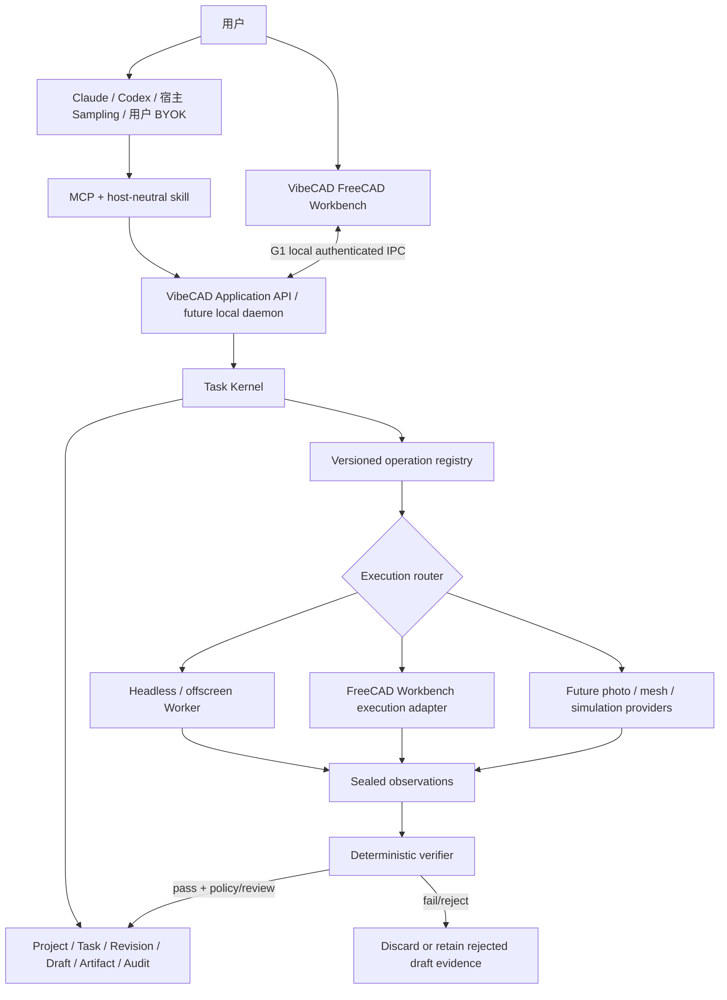

# VibeCAD 产品能力与企业化路线

> 状态：AR-1 reviewed；S3-8/P0-A 已形成未发布的 0.5.0 本地 host-ready 交付候选；
> P0-B core 正在执行，keyed task creation、task discovery/events 与 project/revision discovery 已实现
>
> 日期：2026-07-22
>
> 当前基线：VibeCAD 0.5.0 / runtime epoch 4 的 Task Kernel TK1–TK9、24-tool 公共 MCP、durable
> review、首批六操作、host-neutral skill 与 FCStd/STEP ResourceLink 已通过本地协议、受管 FreeCAD
> 和 packed MCPB 门禁。`create_task` keyed replay、`list_tasks` 恢复发现、`get_task_events`
> transition 审计，以及当前 HEAD 的 project/revision 发现已进入当前分支候选。真实 Claude/Codex 主机尚未安装激活验收，当前没有 tag 或
> release；P0-B 其余能力和 FreeCAD Workbench 尚未交付。

## 1. 结论

VibeCAD 的目标产品不应被限定为 headless CAD server。更合适的定位是：

**一个可被 Claude、Codex 等宿主调用的 CAD 专家 Agent 内核，加一个用于可视选择、
候选预览、人工验收和精细调整的 FreeCAD Workbench；后台 Worker 继续负责批处理、
自动化和 CI。**

工具数量不是产品能力指标。推荐形成三层接口：

1. 稳定的项目、任务、Revision、观察和产物控制工具；
2. 可逐步扩展的版本化 CAD operation registry，以及由它生成的常用直接工具；
3. FreeCAD 插件内部的交互协议，包括选择、预览、接受、拒绝和手工修改发布。

所有写操作，无论来自直接 MCP 工具、批量 ModelProgram、FreeCAD 插件还是未来
Provider，都必须进入同一个 Task Kernel。不存在第二条绕过 candidate、verifier、
Revision 和恢复机制的写路径。

没有存量用户意味着不需要兼容原 31 个端点的旧行为，但这 31 个工具仍是一份有
价值的能力库存。应保留和迁移功能，而不是保留隐藏 Session、活动零件、临时面边
编号和原地修改语义。

## 2. 当前能力与真实缺口

### 2.1 原 31 个工具的归宿

| 组别 | 数量 | 处理方式 |
|---|---:|---|
| 运行时控制 | 4 | `ping/status/ensure/uninstall` 保留；运行时维护与 CAD 执行互斥 |
| 内部诊断 | 1 | `smoke_cad` 不作为设计能力公开 |
| 文档生命周期 | 6 | `new/open/save/undo/redo/export` 改为项目导入、Revision、revert 和 verified artifact |
| 观察 | 3 | `describe/measure/render` 改为绑定 committed/draft revision 的可信观察 |
| CAD 修改 | 16 | 逐项迁入 operation registry；成熟项可生成直接 MCP 工具 |
| 隐藏状态 | 1 | `set_active_part` 删除，所有目标都显式携带 part/entity selector |

因此，成熟后的公共工具数量仍可能在 25–40 个之间，内部 operation 可以达到
60–100 项。数量可以变化，但每个修改能力必须只有一个权威执行路径。

### 2.2 P0-A 已经关闭的基础阻塞

以下四项是 Stage 3 启动时的基础阻塞，P0-A 已完成其 object-level 闭环：

1. **命令结果引用**：ResultRef 现在可以类型安全地引用同一 program 前序命令创建的实体；
2. **参数类型系统**：ValueShape 已支持 enum、quantity、vector2/3、selector、result ref 等封闭类型；
3. **稳定选择器**：SelectorV1 Level A 已能跨 recompute、checkpoint 和 reload 定位 object/feature；
4. **细粒度 observation/verifier**：首批六操作已有 per-entity observation、preservation 和 reload 验证。

此外，交互产品还需要第五项基础能力：**持久化 draft/review revision**。S3-7/P0-A 已把
`submit_model_program` 改为生成可恢复候选，并通过 `accept_draft` / `reject_draft` 显式决策；
首批六操作的 result handle、SelectorV1 Level A、细粒度 observation/verifier 也已进入公共路径。
上述四项在更广的 PartDesign、mapped subobject、复杂特征和装配范围仍需 P1/P2 继续扩展。

当前近期缺口已经转为 P0-B core 的 task cancel、revision compare/revert、完整 artifact manifest、
daemon 和认证 IPC，P0-B hardening 的 retention/GC，以及 G1 的 Workbench candidate review。

### 2.3 AR-1 的阶段裁决

AR-1 证明六个 direct operation 确实只是单命令 ModelProgram 薄适配，durable review 也已经具备
Workbench draft 预览所需的权威语义。当前不应立刻扩大几何白名单，而应先关闭宿主发现与平台
可靠性：

1. **[已完成] S3-8** 修复 tool description/namespace/discovery budget，交付 host-neutral skill、标准
   ResourceLink、0.5.0 和 packed MCPB/FreeCAD E2E，达到本地 protocol/package host-ready；
2. **[下一阶段] P0-B core** 补 task/project/revision/artifact 可发现与可恢复能力、secure
   daemon/file grant、checkout source liveness/revocation 和最小 FreeCAD crash/hang isolation；
3. G1 交付 Workbench 的 HEAD/draft 预览、verdict、stale/revoked 拒绝、Accept/Reject 与 object/feature
   选择；
4. P0-B hardening 可与 G1 UI 并行，但 retention/GC、runner upgrade 和恢复缺口必须在 P1 交付前关闭；
5. P1/G2 再扩 Selector Level B、Sketcher、PartDesign、受控导入和 STL 主流程。

这项排序不改变“专家 Agent、用户自带模型、单 Task Kernel、Workbench 非第二权威”的产品边界，
因此不需要新的产品决策。

## 3. 目标架构：一个内核、两个 FreeCAD 执行端



架构约束：

- Task Kernel 是任务、lease、Revision、commit、rollback 和 recovery 的唯一权威；
- 插件是可信交互执行端和人工验收界面，不是第二个 Agent，也不直接持有模型密钥；
- App-only CAD handler 尽量被两个执行端共享；选择、高亮和面板只存在于 Gui 层；
- 插件和 Worker 永远不同时写同一项目；最终通过 project lease 和 HEAD CAS 决胜；
- immutable revision 文件永远不在 FreeCAD 中被原地编辑；GUI 使用 managed checkout；
- managed checkout 可以临时接受用户手工编辑，但它不是 authoritative data；发布时
  必须作为全新 candidate 重新封存、观察和验证，不能复用旧 draft 的 verdict；
- headless 是一种 capability profile，不再是所有 operation 的强制准入条件；
- 每个 operation 明确声明支持 `headless`、`offscreen_gui`、`interactive_gui` 中哪些
  execution profile，宿主可以通过 capability discovery 选择路径。

## 4. Agent-first 工具策略

### 4.1 控制面

控制面用于管理生命周期，不直接等于 CAD 能力数量。建议逐步提供：

- Runtime：`ping`、`get_runtime_status`、`ensure_runtime`、`uninstall_runtime`；
- Project：`create_project`、`get_project`、`list_projects`；
- Revision：`list_revisions`、`compare_revisions`、`revert_project`；
- Task：`create_task`、`get_task`、`list_tasks`、`submit_model_program`、
  `resume_task`、`cancel_task`、`get_task_events`；
- Artifact/observation：`get_artifact_manifest`、`export_task_artifacts`、
  `inspect_feature_tree`、`query_entities`、`render_revision`、
  `measure_revision`、`validate_geometry`。

最终名称和合并粒度由公共契约设计决定，不再用“精确 12 个工具”作为产品目标。

### 4.2 直接 CAD 工具与 ModelProgram

两种调用方式同时存在：

- 直接工具适合明确、单步、交互式操作，提升宿主模型的能力发现和简单任务质量；
- ModelProgram 适合多步骤设计，能够把完整操作序列放在同一 candidate 中执行和
  整体验收。

直接工具是由同一 operation metadata 驱动的薄适配器，必须编译成一个或多个
ModelCommand 并进入 Task Kernel。禁止重新调用 legacy Session handler 形成旁路。

每个新 operation 的准入门：

1. 严格、版本化、带预算的参数契约；
2. 稳定 entity/feature/subshape selector 或前序命令 result handle；
3. 固定且可审计的 executor binding；
4. candidate-only side effects 和明确的风险等级；
5. sealed per-entity observation 与对应 verifier；
6. preservation、失败回滚和 reload 后语义检查；
7. 真实 FreeCAD 的成功、执行失败、验收失败和恢复测试；
8. execution profile 和版本兼容范围声明。

### 4.3 宿主 Agent 接入路线

VibeCAD 接入的是**宿主产品表面**，不是抽象模型名称。Claude Code 与 Claude Cowork、Codex 本地
宿主与 ChatGPT Work Web、Kimi Code 与 Kimi Claw 即使来自同一厂商，也可能具有完全不同的本机
进程、MCP、Skill 和文件能力，必须分别验收。模型能力只在宿主通过协议硬门后参与质量评价。

当前架构的直接接入硬门是：

1. 在用户 macOS 设备上启动本地 `stdio` MCP，并能传入工作目录和环境变量；
2. 激活 host-neutral `SKILL.md`，而不是只安装服务端后依赖模型猜测状态机；
3. 发现当前公共工具，并支持 MCP Resource、`resources/read` 和二进制 FCStd/STEP 取回；
4. 在多轮长任务中保留 project/task/revision/generation，遵循 `next_action`，不盲目重放写请求；
5. 支持运行时安装、长调用、权限确认、durable draft 的 Accept/Reject 和任务恢复；
6. 通过真实宿主端到端验收后才可称为 `host-verified`；仅通过 raw/typed MCP 和打包测试仍是
   protocol/package `host-ready`。

接入按“编程 Agent”和“通用工作 Agent”两条用户路线推进，不把企业 Agent 构建平台列为当前
目标客户产品：

| 路线与层级 | 宿主产品表面 | 当前结论 | 进入下一层的条件 |
|---|---|---|---|
| 编程 Agent / 首批正式验收 | Codex 本地宿主、Claude Code | 与现有本地 MCP + Skill 架构最直接匹配 | 各完成同一 canonical task、review 和 artifact conformance |
| 编程 Agent / 国内扩展 | Kimi Code；之后 Qwen Code、CodeBuddy/Trae | Kimi Code 已明确支持本地 `stdio` MCP、Skills 和插件；其余作为兼容扩展 | 证明 ResourceLink/resource read、长任务和 Skill 发现 |
| 通用 Agent / 国内首批试点 | 腾讯 QClaw、WorkBuddy 个人版 | 用户形态最匹配低频个人 CAD；本地执行、Skill/MCP 能力有公开依据，但必须真机核对完整协议 | macOS 安装、24-tool discovery、resource read、审核和重启恢复全部通过 |
| 通用 Agent / 开放基准 | OpenClaw 原版、QwenPaw（原 CoPaw） | OpenClaw 当前具备本地 stdio/HTTP MCP、Skill 和 resource utility；QwenPaw 可本地部署且开放 MCP/Skill | 形成可重复的自动化兼容矩阵，并证明不会绕过 Task Kernel |
| 通用 Agent / 后续观察 | AutoClaw、LinClaw、Claude Desktop 本地扩展 | 产品方向合适，但扩展版本、Skill 激活或完整 Resource 行为尚未证明 | 用户需求达到试点阈值，并完成与上层相同的宿主验收 |
| 当前暂缓 | Kimi Claw、ArkClaw、MaxClaw、Manus、ChatGPT Work Web、Claude Cowork 远程任务 | 默认在云端运行，不能直接托管当前用户 Mac 上的 `stdio` MCP/FreeCAD | 先有经批准的本地设备桥或远程认证 MCP 路线，再重新评审 |

其中腾讯 QClaw 应纳入国内通用 Agent 第一梯队：它基于 OpenClaw，提供 macOS/Windows 桌面端和
移动消息入口，产品门槛比原版 OpenClaw 低；但不能因为“基于 OpenClaw”就推定其始终继承上游全部
MCP Resource 行为。QwenPaw 是基于 AgentScope 的国内开放替代，不是 OpenClaw 分支，也应独立
记录兼容结果。WorkBuddy 与 OpenClaw Skill 兼容能力属于宿主适配事实，不应把它误写成 OpenClaw
代码分支。

当前只增加宿主打包与验收，不复制业务逻辑。OpenClaw/QClaw 路线优先复用同一 `SKILL.md`、同一
`stdio` server 和同一 Task Kernel；若宿主不能直接消费现有 MCPB，则提供薄 bundle 或显式 MCP
注册配置。云端 Agent 要访问本机 FreeCAD，未来可在 P0-B local daemon 之上评估 `vibecadctl` 薄
客户端或经过认证的 device bridge，但这属于新的安全与产品决策，不能隐含扩入 S3-8 或 P0-B core。

当前公开依据包括 [OpenClaw MCP](https://docs.openclaw.ai/cli/mcp)、
[腾讯 QClaw](https://www.tencent.com/zh-cn/articles/2202318.html)、
[WorkBuddy 连接器](https://www.workbuddy.cn/docs/workbuddy/From-Beginner-to-Expert-Guide/Function-Description/Connector)、
[Kimi Code MCP](https://www.kimi.com/code/docs/en/kimi-code-cli/customization/mcp.html)、
[QwenPaw](https://qwenpaw.agentscope.io/docs/intro/)、
[AutoClaw](https://autoclaw.zhipuai.cn/) 和
[LinClaw](https://news.qiniu.com/archives/1773626321194)。这些资料只决定候选与测试路径，不能替代
真实 VibeCAD 宿主验收。

## 5. FreeCAD Workbench 产品路线

### 5.1 插件角色

首版插件不在 FreeCAD 中重复实现聊天模型。用户仍可在 Claude/Codex 中描述任务，
插件提供 CAD 原生交互：

- 连接当前 managed project，显示 HEAD、dirty 状态和冲突；
- 显示任务历史、候选状态、验证结果和 artifact；
- 首版捕获用户在画布中选中的 object/feature，生成 SelectorV1 Level A；
- 在独立 Preview Document 中展示 HEAD 与 candidate；
- Accept、Reject；“要求修改”在 G1 只返回宿主创建新 Task，不在 Workbench 内直接改写 candidate；
- 定位、高亮 Agent 所引用的 object/feature；
- face/edge、semantic diff 和手工修改 checkpoint/publish 在 P1/G2 完成，旧 draft verdict 永远不能
  被手工修改后的 checkout 复用。

### 5.2 持久 review 流程

```text
固定 base revision
→ 执行并验证 candidate
→ 封存 durable draft revision
→ task = awaiting_user_review
→ 释放 project lease
→ 用户在插件中预览
→ Accept 时重新取得 lease 并 CAS(base HEAD)
→ commit / conflict
```

Reject 只把 draft 标为 rejected，HEAD 从未改变。用户查看候选期间不能长期持有进程
lease。插件重启后通过 durable draft、task generation 和 revision metadata 恢复。

### 5.3 SelectorV1

GUI 选择能够大幅减少歧义，但不能让 `Face3` 永久稳定。完整 SelectorV1 Level B
建议至少包含：

```text
project_id + revision_id
+ persistent object/feature UUID
+ normalized subobject path
+ FreeCAD new-style mapped element
+ geometry and adjacency fingerprint
+ semantic role and provenance
+ picked point / selection context
+ expected cardinality
```

解析必须唯一命中；零个或多个候选都进入 `needs_input`，由插件高亮候选，不猜测。
G0/Stage 3 已实现只覆盖 object/feature UUID、revision、semantic role、provenance 和
cardinality 的 Level A；mapped subobject、face/edge fingerprint、adjacency 和 pick
context 在 P1/G2 的 Level B 完成。

### 5.4 插件分期

| 阶段 | 范围 | 用户可见结果 |
|---|---|---|
| G0 | `CadExecutionPort`、durable draft/review、managed checkout、IPC codec seam、SelectorV1 Level A | 内核具备接入 GUI 的权威语义，但没有 runnable IPC |
| G1 | 消费 P0-B core 的 daemon/认证 IPC/file broker，交付 Python Workbench Dock、HEAD/draft preview、verdict、stale/revoked rejection、Accept/Reject、object/feature capture | 用户可以在 FreeCAD 中看见并验收 Agent 修改 |
| G2 | Selector Level B、GUI worker、TaskPanel 参数微调、semantic diff、手工 checkpoint/publish | 用户与 Agent 可以围绕同一模型协同精调 |
| G3 | 多 proposal、可视 diff、冲突解决、离线恢复、Addon Manager 分发、审计和策略 | 团队级稳定交互产品 |

插件 MVP 采用纯 Python Workbench。暂不使用 C++，以避免 FreeCAD ABI、跨平台编译和
发布矩阵成本。G0 只冻结 Application/CadExecutionPort/checkout 语义和 versioned codec seam；当前
wire descriptor 刻意不交付本地路径，不能称为已经冻结的 daemon 协议。P0-B core 先补 authenticated
transport 与 same-user file grant/handle/broker，并把相同 Application API 放入独立本地 Kernel daemon；
G1 消费该后端，FreeCAD GUI 操作通过 Qt queued signal 回到主线程。

## 6. 分期能力路线

### P0 — 可信 Agent 基础与双执行架构前置

必须先完成：

- 项目、任务、Revision、draft、artifact 的公共生命周期；
- 命令 result handle、扩展类型系统、SelectorV1 Level A；
- per-entity observation、preservation verifier；
- 当前 primitive 的 BRep validity、checkpoint/reload 和 artifact 验证；布尔输入诊断与 candidate-only
  healing 随 PartDesign/repair 移入 P1；
- `list/cancel task`、task request-key/recover、`list/compare/revert revision`、artifact manifest；
- 原 31 工具中稳定能力的第一批 Agent 化；
- G0 codec/接入缝和 durable review 状态；
- 同进程全局 CAD gate、预算和恢复边界，以及 P0-B 的最小可杀 FreeCAD process isolation。

用户结果：Claude/Codex 能可靠完成简单零件设计；直接工具和复杂 ModelProgram 都
可恢复、可验证、不会污染源文件；架构已经可以接入 FreeCAD 插件。

P0 分成两个可连续实施的切片：

- P0-A / Stage 3：首批控制面、六个 object-level operation、直接工具派生、
  result handle、SelectorV1 Level A、细粒度 verifier、durable review 和 G0 seam；
- P0-B core：list/recover/cancel task、list/compare/revert revision、revision diff、完整 artifact manifest，
  以及 G1 需要的 daemon/认证 IPC、secure checkout delivery、source liveness/revocation 和最小 crash
  isolation；
- P0-B hardening：retention/GC、runner generation upgrade、可观测性和恢复矩阵收口。

S3-8 现已代表 Stage 3 具备可分发、协议/包层 host-ready 的闭环；真实 Claude/Codex 主机激活验证
仍受 S3-RES-06 约束，且当前没有 tag 或 release。P0-B 已进入核心生命周期能力实现；G1 的界面原型
可以与 P0-B hardening 并行，但 P1
作为可交付产品完成前必须关闭 P0-B。

### P1 — 交互式单零件设计与 STL 主流程

新增或迁移：

- G2 Workbench 精调与 Selector Level B；
- 完整约束草图：线、圆、圆弧、槽、构造线、尺寸/几何约束、DoF 和冲突诊断；
- Pad、Pocket、Revolve、Groove、Hole、Fillet、Chamfer；
- 布尔输入诊断、candidate-only Shape Healing 和几何修复报告；
- Linear/Circular Pattern、Mirror、移动、旋转、删除和参数编辑；
- 面积、体积、质心、惯量、质量、截面、间隙；
- FCStd、STEP、IGES、BREP、STL、OBJ 的受控导入、损失报告和重载验证；
- `mesh_to_faceted_step`：网格检查/修复 → ShapeFromMesh → sewing/solid → STEP。

STL 转 STEP 的结果是可测量、可布尔和部分可编辑的 faceted BRep，不宣称恢复了原始
草图和参数化特征。

用户结果：可以从现有 FCStd/STEP/STL 或简单初模开始，在 FreeCAD 中选择目标、查看
Agent 候选并完成尺寸和特征级精调。

### P2 — 完整机械设计交付

新增：

- Loft、Sweep/Pipe、Helix、Shell/Thickness、Draft、Datum、ShapeBinder；
- FreeCAD 原生 Assembly：组件实例、joint/mate、DOF、求解、替换、爆炸视图；
- interference、clearance 和装配 preservation 验证；
- 材料、密度、质量属性、零件号、结构化/扁平 BOM、where-used；
- TechDraw 投影、剖视、局部视图、尺寸、公差、标题栏、修订表和气泡；
- SVG/DXF/PDF、FCStd/STEP、BOM 和验证报告组成的发布包；
- 设计分支、review、Release Candidate、批准、拒绝和作废。

用户结果：交付的不再只是三维模型，而是可制造讨论所需的装配、BOM、图纸、版本和
验证包。

### P3 — 企业试点

新增平台能力：

- 独立/远程 Worker、任务队列、心跳、取消、死信、资源限制和崩溃隔离；
- Organization/Tenant/Project 边界，RBAC、SSO/OIDC/SAML、用户组和来宾；
- 不可篡改审计、数据保留、备份恢复、schema migration、RPO/RTO 演练；
- OpenTelemetry 日志、指标和 Trace，SLO、告警和诊断包；
- REST API、OAuth scope、服务账号、幂等键、Webhook；
- 自定义审批/ECR/ECO、BOM diff、PLM/ERP 连接器；
- 模型、skill、operation、verifier 和企业规则包的版本与策略治理。

企业身份、租户隔离、备份和审计是平台强制执行能力，不应伪装成普通 MCP 设计工具。
只有完成 P3，产品才适合宣称“企业生产级”；P0/P1 是可信 CAD Agent，P2 是可交付的
机械设计产品。

### P4 — 高级制造与数字线程

- 完整 GD&T/MBD、语义 PMI、STEP AP242 高保真交换和 QIF 检查回流；
- 配置族、产品变型、大型装配、公差叠加、成本估算；
- 钣金、焊件、复杂曲面、标准件和企业材料/工艺库；
- `reverse_engineer_parametric_model` 外部 Provider；
- 照片/视频 → mesh Provider 和多来源 artifact provenance；
- CAM、刀路/后处理预览和可制造性规则；
- FEM/CFD Provider、专业验收和结果追溯。

CAM、仿真和逆向工程继续采用 Provider 模式。VibeCAD 负责编排、版本、证据和验收，
不自研这些底层引擎，也不直接控制机床。

## 7. 高价值缺失工具组

| 能力组 | 建议操作或工具 | 阶段 | 关键前置 |
|---|---|---:|---|
| 引用与查询 | `query_entities`、`resolve_selector`、`inspect_feature_tree` | P0 | UUID、result handle、SelectorV1 |
| 版本与恢复 | `list/compare/revert_revision`、`cancel_task`、`get_task_events` | P0 | durable store、CAS、审计事件 |
| 验证与修复 | `validate_geometry`、`diagnose_boolean`、`propose_geometry_repair` | P1 | OCCT BRepCheck/Shape Healing、candidate-only |
| 草图 | create/edit geometry、constraint、diagnose DoF/conflict | P1 | stable sketch element ID、复合 schema |
| PartDesign | pad/pocket/revolve/groove/pattern/mirror/shell/draft | P1/P2 | selector、feature observation/verifier |
| 格式转换 | `inspect_import`、`convert_cad`、`get_conversion_report` | P1 | 单位、资源预算、XDE、reload validation |
| Mesh/STL | mesh validate/repair、`mesh_to_faceted_step` | P1 | triangle budget、healing、偏差报告 |
| 装配 | insert/mate/solve/replace/interference/explode | P2 | connector selector、Assembly solver、DOF verifier |
| 工程图 | create view/section/dimension/tolerance/title block/export | P2 | TechDraw、模板、版式与引用稳定性 |
| PDM/Release | metadata、part number、BOM、where-used、release approval | P2/P3 | identity、权限、revision/release distinction |
| 制造分析 | wall thickness、draft、undercut、tool reach、printability | P2/P4 | versioned rules and machine-readable reports |
| 逆向/照片/仿真 | provider submit/status/result/import | P3/P4 | Provider contract、provenance、专业验收 |

## 8. 企业生产级验收标准

工具只有同时满足以下条件，才能列为 production capability：

- 输入、单位、预算、目标和风险等级可机器校验；
- 相同 Revision 和 operation 版本下行为可复现；
- 失败、超时、进程崩溃和响应丢失不会污染 committed data；
- observation、verdict、artifact 和 export 都绑定明确 Revision；
- 能追溯 actor、host Agent、skill、模型/计划、operation、FreeCAD/OCCT、规则包版本；
- 有跨 FreeCAD 版本 golden model、回归、模糊、导入恶性复杂度和恢复测试；
- 权限、租户、导出和审批策略由服务端执行；
- 有备份恢复、schema migration、监控和支持诊断能力；
- 能明确说明 headless、offscreen 或 interactive profile，而不是静默降级；
- 不夸大 STL faceted BRep、PMI、仿真或任意外部 Provider 的语义质量。

## 9. 调研依据

- FreeCAD 官方项目说明其参数化、约束草图和生产图纸能力：
  [FreeCAD source](https://github.com/FreeCAD/FreeCAD)
- FreeCAD 的 PartDesign 能力覆盖 Pad/Pocket、Revolve、Loft/Pipe、Hole、Fillet、
  Chamfer、Draft、Thickness 和 patterns：
  [PartDesign Workbench](https://github.com/FreeCAD/FreeCAD-documentation/blob/main/wiki/PartDesign_Workbench.md)
- TechDraw 支持投影视图、剖视、尺寸、注释以及 DXF/SVG/PDF 输出：
  [TechDraw Workbench](https://github.com/FreeCAD/FreeCAD-documentation/blob/main/wiki/TechDraw_Workbench.md)
- FreeCAD 提供官方 Python Addon 模板、Workbench 结构和 Qt 开发资料：
  [Addon Template](https://github.com/FreeCAD/Addon-Template)、
  [Workbench guide](https://freecad.github.io/Addon-Academy/Guides/Code/Workbench/)、
  [Qt guide](https://freecad.github.io/Addon-Academy/Guides/Code/Qt/)
- 插件与本地 Kernel daemon 可以使用 Qt 的本地 socket，并在平台支持时限制访问：
  [QLocalServer](https://doc.qt.io/qt-6/qlocalserver.html)、
  [QLocalSocket](https://doc.qt.io/qt-6.8/qlocalsocket.html)
- FreeCAD 的拓扑命名机制不能消除所有模型变化歧义：
  [Topological naming problem](https://github.com/FreeCAD/FreeCAD-documentation/blob/main/wiki/Topological_naming_problem.md)
- OCCT 已提供 BRep 检查、Shape Healing、STEP/IGES/XDE 等底层能力：
  [Shape Healing](https://dev.opencascade.org/doc/overview/html/occt_user_guides__shape_healing.html)、
  [Data Exchange Wrapper](https://dev.opencascade.org/doc/overview/html/occt_user_guides__de_wrapper.html)
- STL 到 STEP 的内建桥接首先得到 mesh-derived shape，而不是原始参数化特征：
  [Part ShapeFromMesh](https://github.com/FreeCAD/FreeCAD-documentation/blob/main/wiki/Part_ShapeFromMesh.md)
- FreeCAD 1.x 已提供原生 Assembly Workbench，可作为后续装配执行引擎：
  [Assembly Workbench](https://github.com/FreeCAD/FreeCAD-documentation/blob/main/wiki/Assembly_Workbench.md)
- 成熟 CAD/PDM 产品把 version/branch、release approval、BOM、权限和审计视为主干：
  [Onshape versions](https://cad.onshape.com/help/Content/Document/versions_and_history.htm)、
  [release management](https://cad.onshape.com/help/Content/Release/release_management.htm)、
  [BOM](https://cad.onshape.com/help/Content/Assembly/bill_of_material.htm)、
  [audit dashboards](https://cad.onshape.com/help/Content/Plans/audit_reports.htm)
- STEP AP242 的范围涵盖零件、装配、版本/变更、PMI、需求和验证：
  [ISO 10303-242:2025](https://www.iso.org/standard/84300.html)
- GD&T 是制造和检查语义，不只是图上的文本：
  [ISO 1101](https://www.iso.org/standard/66777.html)、
  [NIST PMI validation](https://www.nist.gov/ctl/smart-connected-systems-division/smart-connected-manufacturing-systems-group/enabling-digital-3)
- MCP durable tasks 也要求授权上下文、并发/TTL、取消、资源监控和生命周期审计：
  [MCP Tasks](https://modelcontextprotocol.io/specification/2025-11-25/basic/utilities/tasks)

## 10. 对下一版计划的约束

下一版 Stage 计划应废止“精确 12 个工具构成全部设计面”和“headless 是统一准入条件”
两项假设，并采用以下边界：

```text
稳定控制面
+ 逐批成熟的直接 CAD 工具
+ 同源 ModelProgram operation registry
+ FreeCAD Workbench G0/G1 路线
+ headless/offscreen/interactive execution profiles
```

整体产品架构复审应安排在基础控制面、第一批 Agent-safe CAD operation 和 durable
review 语义完成之后，插件与企业文档冻结之前。只有复审要求改变产品定位、公共契约、
信任模型或阶段范围时，才需要产品级决策；普通实现和测试问题不形成批准中断。
