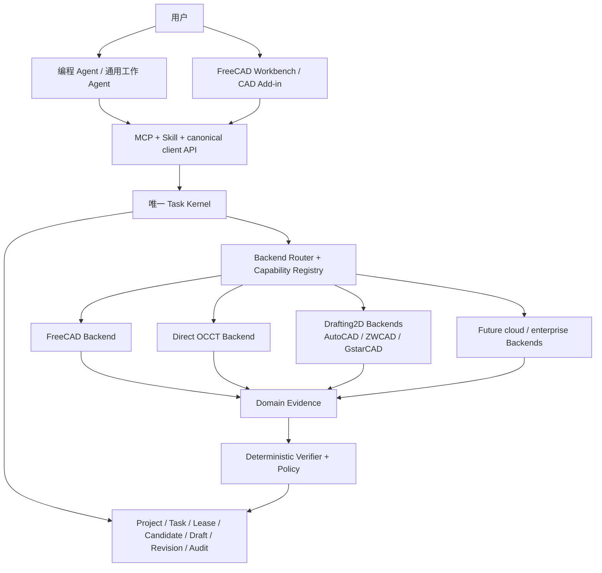

# VibeCAD 综合产品与技术战略

> 决策日期：2026-07-23
>
> 适用基线：VibeCAD 0.6.0 未发布的本地 `host-ready` 候选
>
> 本文是产品调研、宿主 Agent 调研、多 CAD Backend 调研和当前代码架构的统一决策页。市场证据见
> [`CAD_AGENT_PRODUCT_RESEARCH.md`](CAD_AGENT_PRODUCT_RESEARCH.md)，接口与 Backend 证据见
> [`CAD_BACKEND_RESEARCH.md`](CAD_BACKEND_RESEARCH.md)，近期交付顺序见
> [`PRODUCT_CAPABILITY_ROADMAP.md`](PRODUCT_CAPABILITY_ROADMAP.md)。

## 1. 一句话定位

> **VibeCAD 是全开源、本地优先、可被多种宿主 Agent 调用的可信 CAD Agent 内核；它用对象级操作、
> 隔离候选、确定性验证、人工审核和不可变版本，把设计意图安全地落实到多个 CAD Backend。**

VibeCAD 当前不是：

- 一个新的全栈云 CAD；
- 一个只生成 STL 或渲染图的 text-to-3D 工具；
- 一个允许模型任意执行 Python、LISP、shell 或厂商宏的代码代理；
- 一个面向企业搭建通用 Agent 的低代码平台；
- 一个已经覆盖全部 CAD 产品和专业设计流程的成熟商业 CAD。

VibeCAD 当前最可信的差异不是模型更聪明或建模功能最多，而是修改过程具有可验证的事务语义：

```text
意图
→ typed object-level operations
→ isolated candidate
→ reopen / observe / verify
→ durable draft
→ Accept / Reject
→ immutable revision + HEAD CAS
```

## 2. 目标用户与产品边界

### 2.1 当前首要用户

| 用户 | 主要诉求 | VibeCAD 提供的价值 | 当前优先级 |
|---|---|---|---:|
| 使用 Claude、Codex 等宿主的个人开发者/Maker | 免费、本地、容易安装、快速得到可编辑 CAD | 开源 FreeCAD 路径、宿主 Skill/MCP、可审核结果 | P0 |
| 机械设计个人用户和小团队 | 修改存量模型、不破坏原文件、可继续编辑 | Candidate、Revision、参数/特征级操作、Workbench 审核 | P0/P1 |
| 使用 DWG 的个人与小团队 | 图层、块、标题栏、尺寸、Layout 和出图自动化 | 后续 Drafting2D + AutoCAD/国产 CAD Backend | P2 |
| 对隐私和审计敏感的企业团队 | 本地部署、权限、稳定版本、持续验证 | 开源内核可采用，但企业交付由真实客户需求触发 | 后续 |

VibeCAD 不把 PLM/PDM、组织权限、企业知识库和通用 Agent 构建平台作为当前首要客户问题。企业能力
可以围绕同一内核逐步增加，但不能拖慢个人用户首先获得可用建模闭环。

### 2.2 两条宿主 Agent 路线

VibeCAD 评价和接入的是完整宿主产品表面，不是只评价基础模型名称：

1. **编程 Agent**：Codex、Claude Code、Kimi Code、Qwen Code、CodeBuddy/Trae 等；
2. **通用工作 Agent**：QClaw、WorkBuddy、OpenClaw、QwenPaw 等本地产品，之后再评估具有安全
   device bridge 的云端工作 Agent。

Claude、Codex 等产品通常是“模型 + 宿主 Agent + 工具运行时”一体化表面。选型和自动路由应记录
完整 Agent Profile；模型版本只是其中一个字段。默认在云端、不能安全访问用户本机 CAD 的 Manus、
Claude Cowork 远程任务、ChatGPT Work Web 等当前暂缓直接接入。

## 3. 开源与免费策略

建议整个可信主路径开源：

- Task Kernel、协议和 canonical schema；
- object-level operation registry 与 Backend SDK；
- Candidate、Revision、Verifier 和评测工具；
- FreeCAD、Direct OCCT 及可公开的商业 CAD Adapter；
- 官方安装器、Workbench 和宿主适配包。

默认路径应做到“无需购买 VibeCAD 即可完整使用”：

```text
开源宿主或兼容宿主
+ 用户自选模型
+ VibeCAD
+ FreeCAD / OCCT
```

但不能宣传所有组合“全链路零成本”：Claude/Codex、AutoCAD、APS 和其他商业 CAD 可能产生模型、
订阅、许可证或云任务费用。准确承诺应是：

> **VibeCAD 核心与默认开源 CAD 路径免费；商业模型、云服务和商业 CAD 的成本由用户选择并透明承担。**

未来收入可以来自企业支持、托管执行、私有部署、组织治理、认证 Backend、专业行业操作包和插件
市场，而不是人为关闭 Candidate、Verifier 或 operation 协议。

## 4. 统一产品架构



### 4.1 所有 Backend 必须共享的内核不变量

- Task Kernel 是 task、lease、review、commit、rollback 和 recovery 的唯一权威；
- 源文件和已发布 Revision 永不被 Agent 原地修改；
- 模型只能提交版本化、带预算的 `ModelProgram`，不能提交动态源码；
- Backend 只能修改 Candidate，不能直接推进 HEAD；
- 每次成功必须有保存后重开、结构化 Observation 和 Acceptance；
- Accept 使用 HEAD CAS，过期 Candidate 不能覆盖新版本；
- Driver 自报成功、截图好看或 CAD 没抛异常都不能单独构成成功；
- Workbench 和 AutoCAD Add-in 都是薄客户端，不建立第二套状态机。

### 4.2 必须拆开的四个概念

```text
BackendId       使用哪个 CAD 产品或几何执行器
CadDomain       Mechanical3D / Drafting2D / Assembly / future BIM
ExecutionMode   headless / offscreen / interactive / cloud_job
ArtifactProfile 该 Backend 的原生文件、交换文件、预览和证据
```

Project 默认绑定一个 primary Backend 和 CadDomain。跨 CAD 转换必须建立显式迁移、新 lineage 和损失
报告，不能把 STEP/DXF 中立格式转换冒充为无损往返。

## 5. CAD Backend 组合决策

“第二个技术 Backend”和“第二个市场 Backend”解决不同问题，不能用一个排名混在一起。

| 角色 | Backend | 战略作用 | 决策 |
|---|---|---|---|
| 当前 reference backend | FreeCAD | 提供完整免费、跨平台、参数化 CAD 与 Workbench | 继续完成首个产品闭环 |
| 受控几何执行层 | Direct OCCT | 无 GUI、可服务化、缩短执行路径、增强底层控制 | 作为补充，不立即替代 FreeCAD |
| 中国市场扩展 | AutoCAD / ZWCAD / GstarCAD | 覆盖大量 DWG、二维制图和存量图纸工作流 | Backend-neutral 后做 Drafting2D pilot |
| 真正跨架构验证 | Onshape | 验证 REST、远程 identity、workspace/version、异步任务 | 在资源允许时做 conformance spike |
| 商业机械 CAD | SOLIDWORKS / Inventor / Fusion / Rhino | 覆盖专业个人和中小企业存量用户 | 由用户需求和测试许可证触发 |
| 高端企业 CAD/PLM | NX / CATIA / Creo 及其 PLM | 高价值但版本、许可、部署和销售成本很高 | 必须绑定真实客户再接入 |

### 5.1 FreeCAD

FreeCAD 保持默认 Backend。它既提供可托管的 Python/OCCT 执行环境，也能承载首个可视审核
Workbench。近期产品成功仍取决于真实宿主验收、G1 Workbench 和 Sketcher/PartDesign/存量模型修改，
而不是 Backend 数量。

### 5.2 Direct OCCT

Direct OCCT 的优势是进程和几何生命周期更可控、适合无头执行、容器和批处理，并能减少 FreeCAD
Document/UI 层带来的不确定性。它的边界同样明确：

- OCCT 是几何内核，不是完整参数 CAD 产品；
- 参数文档、特征依赖、约束、Undo/Redo 和装配产品层需要自建；
- 它与 FreeCAD 共用 OCCT，不能证明 verifier 的几何实现真正独立；
- 近期应承担小型确定性几何、交换格式和验证工作，不替代 FreeCAD 产品层。

### 5.3 AutoCAD 与国产 DWG CAD

AutoCAD 值得接入，但它首先是 `Drafting2D` 市场入口，不是 FreeCAD `Mechanical3D` Backend 的同义
替换。中国市场应同时规划 ZWCAD 和 GstarCAD，避免产品依赖单一商业 CAD、单一许可证或未经授权
的软件环境。

AutoCAD 有 Windows 和 macOS 版本，但两端扩展与自动化能力不完全相同。Windows 的 .NET、
ObjectARX、ActiveX/Core Console 生态更完整；macOS 必须独立验证能力，不能承诺与 Windows
Adapter 功能相同。VibeCAD 不分发 AutoCAD，也不把非授权安装作为产品前提。

## 6. AutoCAD 接入对当前架构的影响

当前代码在 Task Kernel 层已经具备多 Backend 的核心形状，但执行和工件契约仍深度绑定
`model.FCStd + model.step`。因此 AutoCAD 接入不会推翻内核，却也不是增加一个 Handler 就能完成。

### 6.1 可以保留

- Project、Task、TaskRun、Lease；
- Candidate、Draft、Accept/Reject；
- Revision、HEAD CAS、祖先关系；
- 审计、恢复、幂等和本地认证 daemon；
- MCP、Skill 与资源交付的总体模式。

### 6.2 必须泛化

- `ExecutionProfile` 拆出 Backend identity 和 execution mode；
- 固定 FCStd/STEP 字段改为 `ArtifactDescriptor`/`ArtifactProfile`；
- `load_fcstd`/`checkpoint_fcstd` 改为通用 snapshot/candidate lifecycle；
- RevisionStore 和 CandidateStore 不再知道固定文件名；
- 三维 ShapeObservation 改为分域 Evidence；
- operation registry 增加 domain、capability 和 backend binding；
- FreeCAD 版本 gate 改为通用 product/API/driver compatibility；
- Worker 错误、取消、未知状态和 reconcile 形成统一 Driver Protocol。

### 6.3 Artifact 示例

```text
FreeCAD
├── primary: model.FCStd
└── exchange: model.step

Direct OCCT
├── primary/exchange: model.step
└── evidence: geometry.json

AutoCAD / DWG CAD
├── primary: drawing.dwg
├── exchange: drawing.dxf（按任务需要）
├── preview: drawing.pdf
└── evidence: drawing-observation.json
```

### 6.4 AutoCAD 第一批能力

首批只做可验证、重复频率高、风险较低的对象级操作：

- 读取并检查图层、块、块属性、文字、尺寸、Layout 和 Viewport；
- 修改标题栏和 Block Attribute；
- 创建或规范图层；
- 插入预注册标准块；
- 修改文字、尺寸和打印配置；
- 检查字体、外部参照、重复或异常实体；
- 输出 DWG/DXF/PDF 和结构化修改报告。

第一版禁止任意 AutoLISP、任意命令字符串、模型生成的 .NET/ObjectARX 代码和直接覆盖活动原图。
Desktop Adapter 应操作 DWG 副本或隔离数据库；APS Adapter 必须显式处理 OAuth、上传授权、费用、
数据驻留和云任务恢复。

## 7. Domain 与 object-level operation

公共层只统一真正具有相同语义的操作；CAD 产品特有能力通过命名空间和 capability 暴露：

```text
mechanical3d.create_hole
mechanical3d.create_pocket
mechanical3d.fillet

drafting2d.create_layer
drafting2d.insert_block
drafting2d.update_block_attributes
drafting2d.create_dimension
drafting2d.configure_layout

document.inspect
document.export_step
document.export_pdf
```

同一个 operation 可以有多个 Backend binding，但每个 binding 必须通过相同语义 fixture 和自己的
conformance suite。不能因为 ObjectARX 兼容宣传或格式相同，就默认 AutoCAD、ZWCAD、GstarCAD
行为等价。

Observation 也必须按 Domain 区分：

```text
CadObservation
├── Mechanical3DObservation
│   ├── solid / shell / topology / bounding box
│   ├── dimension / constraint / feature relation
│   └── validity / interference / reopen
└── Drafting2DObservation
    ├── layer / block / attribute / entity
    ├── dimension / text / style
    ├── layout / viewport / plot
    └── extents / xref / audit / reopen
```

## 8. Agent 与 CAD Agent 评价体系

### 8.1 评价单位

一级评价完整 Agent Profile：

```text
宿主产品
+ 模型及版本
+ VibeCAD/Skill 版本
+ CAD Backend/driver/product 版本
+ OS 和权限环境
+ 任务、输入文件与审核策略
```

这个结果用于回答“真实任务应该路由给哪个组合”，而不是给 Claude、Codex 或某个模型一个永久总分。

二级只记录可观察行为标签，例如：

- 错误理解设计要求；
- 没有读取关键模型上下文；
- 工具调用、重算、导出或重载失败；
- 修改超出作用域；
- 没有执行验证；
- 验证失败但声称完成；
- 重复无效操作；
- 因权限、许可证、网络或运行环境受限。

不在缺少对照实验时武断归因为“模型问题”或“宿主问题”。

### 8.2 CAD Agent 一级评分

| 维度 | 权重 | 核心问题 |
|---|---:|---|
| 任务正确性 | 25% | 几何/图纸、尺寸、单位、约束和语义目标是否正确 |
| 完成度 | 10% | 要求、特征、图纸和交付格式是否齐全 |
| 设计意图保持 | 15% | 参数关系、特征树或图纸语义能否继续编辑 |
| 修改安全性 | 15% | 是否保护源文件、限制作用域、支持审核/回滚/CAS |
| 验证质量 | 10% | 是否重算、重开并检查结构事实，而不只看截图 |
| 可制造/可装配/标准符合 | 10% | 是否满足相应 Domain 的工程约束 |
| 指令遵循 | 5% | 是否遵守格式、禁止项、保留项和审核策略 |
| 时间效率 | 3% | 首次可审核结果和总完成时间 |
| 成本效率 | 2% | 模型、CAD、云任务和人工复核成本 |
| 自主完成度 | 5% | 必要澄清之外的人工修复、CAD 操作和重跑次数 |

源文件破坏、越权执行、设计数据泄露、验证失败却声称完成、不可恢复的错误提交属于硬失败，不能被
其他维度的高分抵消。Mechanical3D 和 Drafting2D 使用同一一级骨架，但测试项和 Domain 工程规则
分别定义。

### 8.3 Benchmark 方向

持续基准至少覆盖：

- 从零创建、参数修改和存量模型修改；
- 歧义澄清、非法几何/图纸要求和失败诚实性；
- 宿主重启后的 draft 恢复；
- 两个 Agent 基于同一 HEAD 并发修改；
- Reject 后源文件/hash 不变；
- 保存、导出、重开和关键尺寸复测；
- 越权文件读取和任意脚本请求；
- Mechanical3D 的制造/装配任务；
- Drafting2D 的标题栏、块属性、Layout、PDF 与图纸标准任务。

P0 竞品基准优先比较 agentcad、ForgeCAD、Zoo MCP、BuildCAD 和 VibeCAD；Orca/MUSE 作为完整产品
体验和复杂可编辑 CAD 评测上限参考。

## 9. 统一实施顺序

### 阶段 0：兑现当前承诺

1. 完成真实 Claude Code、Codex 安装和端到端 `host-verified`；
2. 交付 G1 FreeCAD Workbench 的 preview、verdict、Accept/Reject 和 object/feature selection；
3. 关闭 retention/GC、runner migration 和运行观测等 P0-B hardening；
4. 发布可复现的源文件安全说明和首批竞品 benchmark。

退出条件：个人用户能安装、创建任务、看到 Candidate、审核并获得可重开的 Revision。

### 阶段 1：补齐 Mechanical3D 用户价值

1. Sketcher、PartDesign、孔/圆角/倒角/阵列；
2. 稳定 selector 和真实存量 FCStd/STEP 的受控修改；
3. 有预算的 repair/replan；
4. 参数、特征定位和 HEAD/Candidate 对比。

退出条件：VibeCAD 不再只是六个演示操作，可以完成一组公开的真实单零件任务。

### 阶段 2：Backend-neutral 基础

1. 引入 BackendId、CadDomain、ExecutionMode、ArtifactProfile；
2. 发布 Driver Protocol v0、错误 taxonomy 和 capability schema；
3. 建立 deterministic fake backend 与 conformance suite；
4. 保持所有 FreeCAD 回归测试通过。

退出条件：Kernel 源码不再需要知道 FCStd、FreeCAD Session 和固定 STEP 文件名；新增 Driver 不修改
Kernel 即可达到规定 conformance level。

### 阶段 3：DWG 市场 Pilot

1. 先做 AutoCAD/DWG 只读检查和 PDF 输出；
2. 再做 Candidate 副本上的标题栏、块属性、图层和 Layout 修改；
3. 保存后 reopen/AUDIT/plot，形成 Draft；
4. 抽取 Drafting2D fixture，分别验证 AutoCAD、ZWCAD、GstarCAD。

退出条件：任何失败不污染原 DWG；同一任务在已声明兼容的 Backend 上得到结构化、可审核结果。

### 阶段 4：真正的跨 Backend 与商业 CAD

1. 用 Onshape 或另一个远程非 Python Backend 验证架构中立性；
2. 按真实用户需求接入 SOLIDWORKS、Inventor、Fusion 或 Rhino；
3. NX/CATIA/Creo 和 PLM 只在客户提供版本、许可和持续测试环境后启动。

## 10. 当前决策清单

已经形成的产品决策：

1. VibeCAD 全开源；默认 FreeCAD/OCCT 路径免费。
2. 目标用户首先是个人、Maker、专业个人用户和小团队，不是企业 Agent 构建平台客户。
3. 编程 Agent 与通用工作 Agent 是两条接入路线，评价完整宿主组合。
4. Task Kernel、Candidate、Verifier、Review、Revision 和 CAS 是不可绕过的公共内核。
5. 公共多 CAD 抽象是版本化 Driver Protocol，不是 Python API。
6. Project 默认绑定一个 primary Backend；跨 CAD 是显式迁移。
7. FreeCAD 是当前 reference Backend；Direct OCCT 是补充执行层，不是短期替代品。
8. AutoCAD/国产 DWG CAD 是 Drafting2D 市场扩展，不与 Mechanical3D operation 强行统一。
9. AutoCAD 接入前先完成 Backend-neutral 化；不把商业 CAD 特例写入 Kernel。
10. Onshape 的价值是验证真正跨进程、跨语言、跨网络架构，不代表其市场优先级高于 DWG。
11. 模型永远不能提交任意动态源码；商业 CAD Adapter 也只能执行固定、可审计 binding。
12. 当前近期优先级仍是宿主验收、G1 Workbench 和 Mechanical3D 能力，而不是立即增加 Backend 数量。

## 11. 最终判断

VibeCAD 不应该在“做一个免费的 FreeCAD 插件”和“同时兼容所有商业 CAD”之间摇摆。合理演进是：

```text
可信 FreeCAD 产品闭环
→ 足够有用的 Mechanical3D
→ Backend-neutral Driver Protocol
→ AutoCAD/国产 CAD 的 Drafting2D 市场扩展
→ 远程与商业机械 CAD
```

这样既保留当前最有价值的安全内核，也避免过早承担多个商业 CAD 的许可证、平台、测试和支持成本。
产品是否成功，近期不由 Backend 数量决定，而由用户能否在真实宿主和真实 CAD 中稳定完成一次
“提出要求—看到候选—理解证据—安全接受”的完整任务决定。
