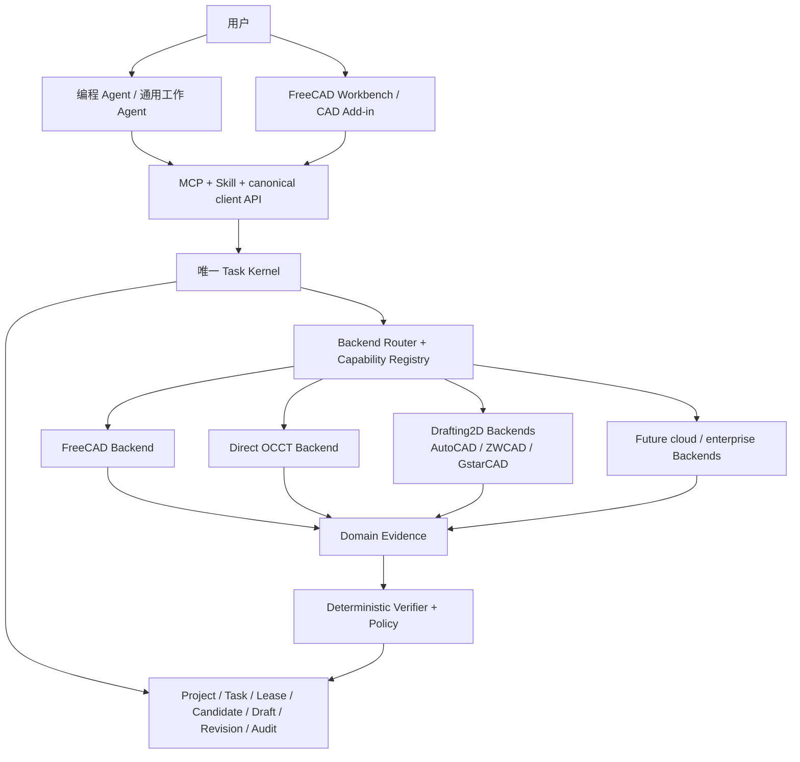

# VibeCAD 综合产品与技术战略

> 决策日期：2026-07-23
>
> 适用基线：VibeCAD 0.6.0 未发布的本地 `host-ready` 候选
>
> 本文是产品调研、宿主 Agent 调研、多 CAD Backend 调研和当前代码架构的统一决策页。市场证据见
> [`CAD_AGENT_PRODUCT_RESEARCH.md`](CAD_AGENT_PRODUCT_RESEARCH.md)，接口与 Backend 证据见
> [`CAD_BACKEND_RESEARCH.md`](CAD_BACKEND_RESEARCH.md)，近期交付顺序见
> [`PRODUCT_CAPABILITY_ROADMAP.md`](PRODUCT_CAPABILITY_ROADMAP.md)。

## 1. 一句话定位

> **VibeCAD 是全开源、本地优先、可被多种宿主 Agent 调用的可信 CAD Agent 内核；它用对象级操作、
> 隔离候选、确定性验证、人工审核和不可变版本，把设计意图安全地落实到多个 CAD Backend。**

VibeCAD 当前不是：

- 一个新的全栈云 CAD；
- 一个只生成 STL 或渲染图的 text-to-3D 工具；
- 一个允许模型任意执行 Python、LISP、shell 或厂商宏的代码代理；
- 一个面向企业搭建通用 Agent 的低代码平台；
- 一个已经覆盖全部 CAD 产品和专业设计流程的成熟商业 CAD。

VibeCAD 当前最可信的差异不是模型更聪明或建模功能最多，而是修改过程具有可验证的事务语义：

```text
意图
→ typed object-level operations
→ isolated candidate
→ reopen / observe / verify
→ durable draft
→ Accept / Reject
→ immutable revision + HEAD CAS
```

### 1.1 执行摘要

| 问题 | 统一结论 |
|---|---|
| 产品是什么 | 外部宿主可调用的可信 CAD Agent 内核，不是另造一套全栈 CAD |
| 服务谁 | 首先服务个人、Maker、专业个人用户和小团队；企业平台不是当前主线 |
| 是否收费/开源 | 核心和默认 FreeCAD/OCCT 路径全开源免费；第三方模型、云服务、商业 CAD 成本不代付 |
| Agent 如何接入 | 编程 Agent 与本地通用工作 Agent 两条路线；云端 Agent 等安全 device bridge |
| 如何评价 Agent | 评价“宿主 + 模型 + VibeCAD + CAD Backend”完整 Profile，并记录客观行为标签 |
| 当前 CAD Backend | FreeCAD 是 reference Backend；Direct OCCT 是补充执行层 |
| AutoCAD 是否接入 | 接，但定位为 Drafting2D/DWG 市场扩展；同时规划 ZWCAD、GstarCAD |
| AutoCAD 是否推翻架构 | 不推翻 Task Kernel；需要泛化 Artifact、Execution、Observation、Verification |
| 第二真实 Backend | 市场优先看 DWG，架构中立性验证可用 Onshape；两个优先级不混为一谈 |
| 当前先做什么 | 真实宿主验收、G1 Workbench、Mechanical3D 能力；随后再做 Backend-neutral 化 |

## 2. 目标用户与产品边界

### 2.1 当前产品基线

VibeCAD 0.6.0 当前是未发布的本地 `host-ready` 候选，已经具备：

- 28-tool 公共 MCP 和 host-neutral Skill；
- 项目、任务、不可变 Revision 和 durable Draft；
- Candidate 隔离、Accept/Reject、HEAD CAS 和恢复；
- 同用户认证 daemon、session-bound file grant；
- 受管、可终止的 FreeCAD Worker；
- FCStd/STEP ResourceLink、重开验证和首批六个 object-level operation。

`host-ready` 只表示协议、包和本地 E2E 已验证，不表示真实 Claude Code/Codex 安装激活已经完成。
当前主要缺口是：

| 缺口 | 对产品的影响 |
|---|---|
| 真实 Claude Code/Codex 尚未 `host-verified` | 核心外部宿主定位缺最后一公里证据 |
| G1 FreeCAD Workbench 尚未交付 | 用户不能在 CAD 画布中自然预览、选择和审核 |
| 只有六个 object-level operation | 尚不足以完成大多数真实机械任务 |
| Sketcher/PartDesign/装配/TechDraw 不完整 | 与成熟代码式 CAD Agent 和原生 CAD 助手有明显能力差距 |
| 存量模型修改范围有限 | “不会破坏已有工程资产”的价值还未充分兑现 |
| Artifact/Worker/Verifier 深度绑定 FCStd/STEP | 还不能直接增加 AutoCAD 等 Backend |

因此现阶段应诚实描述为：

> **可信事务内核已经成立，建模广度、真实宿主体验和 CAD 内用户表面仍处于早期。**

### 2.2 当前首要用户

| 用户 | 主要诉求 | VibeCAD 提供的价值 | 当前优先级 |
|---|---|---|---:|
| 使用 Claude、Codex 等宿主的个人开发者/Maker | 免费、本地、容易安装、快速得到可编辑 CAD | 开源 FreeCAD 路径、宿主 Skill/MCP、可审核结果 | P0 |
| 机械设计个人用户和小团队 | 修改存量模型、不破坏原文件、可继续编辑 | Candidate、Revision、参数/特征级操作、Workbench 审核 | P0/P1 |
| 使用 DWG 的个人与小团队 | 图层、块、标题栏、尺寸、Layout 和出图自动化 | 后续 Drafting2D + AutoCAD/国产 CAD Backend | P2 |
| 对隐私和审计敏感的企业团队 | 本地部署、权限、稳定版本、持续验证 | 开源内核可采用，但企业交付由真实客户需求触发 | 后续 |

VibeCAD 不把 PLM/PDM、组织权限、企业知识库和通用 Agent 构建平台作为当前首要客户问题。企业能力
可以围绕同一内核逐步增加，但不能拖慢个人用户首先获得可用建模闭环。

### 2.3 两条宿主 Agent 路线

VibeCAD 评价和接入的是完整宿主产品表面，不是只评价基础模型名称：

1. **编程 Agent**：Codex、Claude Code、Kimi Code、Qwen Code、CodeBuddy/Trae 等；
2. **通用工作 Agent**：QClaw、WorkBuddy、OpenClaw、QwenPaw 等本地产品，之后再评估具有安全
   device bridge 的云端工作 Agent。

Claude、Codex 等产品通常是“模型 + 宿主 Agent + 工具运行时”一体化表面。选型和自动路由应记录
完整 Agent Profile；模型版本只是其中一个字段。默认在云端、不能安全访问用户本机 CAD 的 Manus、
Claude Cowork 远程任务、ChatGPT Work Web 等当前暂缓直接接入。

### 2.4 宿主接入矩阵

| 路线 | 候选宿主 | 当前判断 | 硬门 |
|---|---|---|---|
| 编程 Agent 首批 | Codex 本地宿主、Claude Code | 与本地 MCP + Skill 最直接匹配 | canonical task、review、resource、恢复全部真机通过 |
| 国内编程 Agent | Kimi Code；随后 Qwen Code、CodeBuddy/Trae | 适合扩大开发者覆盖 | stdio MCP、Skill、ResourceLink、长任务分别验收 |
| 国内通用 Agent 首批 | QClaw、WorkBuddy 个人版 | 用户形态匹配低频个人 CAD | 本地执行、权限、resource read 和重启恢复 |
| 开放通用 Agent | OpenClaw、QwenPaw | 适合公开兼容矩阵 | 不能绕过 Task Kernel，不能假定分支产品完全兼容 |
| 后续观察 | AutoClaw、LinClaw、Claude Desktop 本地扩展 | 候选方向合理，证据不足 | 有用户需求且达到同一 conformance |
| 当前暂缓 | Manus、Kimi Claw、ArkClaw、MaxClaw、Claude Cowork 远程任务、ChatGPT Work Web | 默认云端，不能直接托管本机 CAD/MCP | 经批准的认证 device bridge 或远程 MCP |

宿主验收必须证明它能：

1. 安装并启动本地 VibeCAD MCP/Skill；
2. 发现公共工具和资源；
3. 维持 project/task/revision/generation 上下文；
4. 遵循 `next_action` 和审核策略；
5. 处理长任务、权限确认、Accept/Reject 和重启恢复；
6. 取回二进制 CAD Artifact，而不是只读取文本摘要。

## 3. CAD Agent 市场与竞争位置

### 3.1 市场四条路线

| 路线 | 代表产品 | 核心优势 | 对 VibeCAD 的启发 |
|---|---|---|---|
| AI 原生 CAD | Orca、Zoo、MANTIS、TextoCAD | 从自然语言到预览、参数、制造文件的一体化体验 | 用户首先感知完成速度和可编辑结果 |
| Agent-first CAD 工具链 | ForgeCAD、agentcad、BuildCAD | MCP/Skill/CLI、代码式参数 CAD、扩展快 | 外部宿主不是独占卖点，必须证明安全和工程质量 |
| 现有 CAD Agent/插件 | CADABRA、MecAgent、CadCursor、Reer、Caddie | 直接读取并修改存量 CAD 上下文 | 存量模型、选区和原生格式是高价值入口 |
| 传统 CAD 原生助手 | Fusion、SOLIDWORKS、NX、Onshape | 原生特征树、PDM、用户存量和分发能力 | 是长期体验上限和未来 Backend 候选 |

MUSE 不是一个与 Orca 无关的独立商业 CAD。它是 Orca/Curvature Flow 团队公开的复杂、可编辑 CAD
研究与评测体系，分层考察代码、几何、设计意图、功能性、可制造性和可装配性。VibeCAD 应吸收其
评测方法，但不应把研究 Benchmark 和 Orca 产品本身混为一项能力声明。

### 3.2 主要竞品与应对

| 产品/产品组 | 与 VibeCAD 的关系 | 当前动作 |
|---|---|---|
| agentcad | 开源、本地、MCP/Skill、CadQuery/build123d，最容易同任务实测 | P0 持续基准 |
| ForgeCAD | Agent-first、代码式参数 CAD、检查与仿真证据较完整 | 比较表达力、恢复和任意代码风险 |
| Zoo MCP | Claude/Codex + MCP 路线最接近 | 比较云引擎、KCL、体验和计费 |
| BuildCAD | 免费 MCP、BYO AI、浏览器预览，对个人用户吸引力直接 | 核验参数化、修改、验证和数据边界 |
| Orca/MUSE | 完整 AI 原生产品和复杂 CAD 评测参考 | 学习端到端闭环，不复制全栈云 CAD |
| CadCursor/HiCAD | 国内企业原生 CAD Agent 与个人代码生成路线 | 观察存量模型和国内个人用户体验 |
| CADABRA/MecAgent/Caddie | SOLIDWORKS 上下文、自动化和审核路线 | 学习原生上下文，严格审查数据与脚本风险 |
| Autodesk/SOLIDWORKS/NX/Onshape 原生助手 | 拥有原生 API、格式、PDM 和分发优势 | 作为体验上限及 Backend 机会持续监控 |

VibeCAD 的机会位于三件事的交集：

```text
可编辑参数 CAD
+ 进入用户已有 Agent/CAD 工作流
+ 可证明修改正确、可审核、可恢复且不破坏源文件
```

候选隔离和确定性验证是差异，但只有在用户能完成足够多真实任务时才构成产品优势。

## 4. 开源与免费策略

建议整个可信主路径开源：

- Task Kernel、协议和 canonical schema；
- object-level operation registry 与 Backend SDK；
- Candidate、Revision、Verifier 和评测工具；
- FreeCAD、Direct OCCT 及可公开的商业 CAD Adapter；
- 官方安装器、Workbench 和宿主适配包。

默认路径应做到“无需购买 VibeCAD 即可完整使用”：

```text
开源宿主或兼容宿主
+ 用户自选模型
+ VibeCAD
+ FreeCAD / OCCT
```

但不能宣传所有组合“全链路零成本”：Claude/Codex、AutoCAD、APS 和其他商业 CAD 可能产生模型、
订阅、许可证或云任务费用。准确承诺应是：

> **VibeCAD 核心与默认开源 CAD 路径免费；商业模型、云服务和商业 CAD 的成本由用户选择并透明承担。**

未来收入可以来自企业支持、托管执行、私有部署、组织治理、认证 Backend、专业行业操作包和插件
市场，而不是人为关闭 Candidate、Verifier 或 operation 协议。

## 5. 统一产品架构



### 5.1 所有 Backend 必须共享的内核不变量

- Task Kernel 是 task、lease、review、commit、rollback 和 recovery 的唯一权威；
- 源文件和已发布 Revision 永不被 Agent 原地修改；
- 模型只能提交版本化、带预算的 `ModelProgram`，不能提交动态源码；
- Backend 只能修改 Candidate，不能直接推进 HEAD；
- 每次成功必须有保存后重开、结构化 Observation 和 Acceptance；
- Accept 使用 HEAD CAS，过期 Candidate 不能覆盖新版本；
- Driver 自报成功、截图好看或 CAD 没抛异常都不能单独构成成功；
- Workbench 和 AutoCAD Add-in 都是薄客户端，不建立第二套状态机。

### 5.2 必须拆开的四个概念

```text
BackendId       使用哪个 CAD 产品或几何执行器
CadDomain       Mechanical3D / Drafting2D / Assembly / future BIM
ExecutionMode   headless / offscreen / interactive / cloud_job
ArtifactProfile 该 Backend 的原生文件、交换文件、预览和证据
```

Project 默认绑定一个 primary Backend 和 CadDomain。跨 CAD 转换必须建立显式迁移、新 lineage 和损失
报告，不能把 STEP/DXF 中立格式转换冒充为无损往返。

## 6. CAD Backend 组合决策

“第二个技术 Backend”和“第二个市场 Backend”解决不同问题，不能用一个排名混在一起。

| 角色 | Backend | 战略作用 | 决策 |
|---|---|---|---|
| 当前 reference backend | FreeCAD | 提供完整免费、跨平台、参数化 CAD 与 Workbench | 继续完成首个产品闭环 |
| 受控几何执行层 | Direct OCCT | 无 GUI、可服务化、缩短执行路径、增强底层控制 | 作为补充，不立即替代 FreeCAD |
| 中国市场扩展 | AutoCAD / ZWCAD / GstarCAD | 覆盖大量 DWG、二维制图和存量图纸工作流 | Backend-neutral 后做 Drafting2D pilot |
| 真正跨架构验证 | Onshape | 验证 REST、远程 identity、workspace/version、异步任务 | 在资源允许时做 conformance spike |
| 商业机械 CAD | SOLIDWORKS / Inventor / Fusion / Rhino | 覆盖专业个人和中小企业存量用户 | 由用户需求和测试许可证触发 |
| 高端企业 CAD/PLM | NX / CATIA / Creo 及其 PLM | 高价值但版本、许可、部署和销售成本很高 | 必须绑定真实客户再接入 |

### 6.1 FreeCAD

FreeCAD 保持默认 Backend。它既提供可托管的 Python/OCCT 执行环境，也能承载首个可视审核
Workbench。近期产品成功仍取决于真实宿主验收、G1 Workbench 和 Sketcher/PartDesign/存量模型修改，
而不是 Backend 数量。

### 6.2 Direct OCCT

Direct OCCT 的优势是进程和几何生命周期更可控、适合无头执行、容器和批处理，并能减少 FreeCAD
Document/UI 层带来的不确定性。它的边界同样明确：

- OCCT 是几何内核，不是完整参数 CAD 产品；
- 参数文档、特征依赖、约束、Undo/Redo 和装配产品层需要自建；
- 它与 FreeCAD 共用 OCCT，不能证明 verifier 的几何实现真正独立；
- 近期应承担小型确定性几何、交换格式和验证工作，不替代 FreeCAD 产品层。

### 6.3 AutoCAD 与国产 DWG CAD

AutoCAD 值得接入，但它首先是 `Drafting2D` 市场入口，不是 FreeCAD `Mechanical3D` Backend 的同义
替换。中国市场应同时规划 ZWCAD 和 GstarCAD，避免产品依赖单一商业 CAD、单一许可证或未经授权
的软件环境。

AutoCAD 有 Windows 和 macOS 版本，但两端扩展与自动化能力不完全相同。Windows 的 .NET、
ObjectARX、ActiveX/Core Console 生态更完整；macOS 必须独立验证能力，不能承诺与 Windows
Adapter 功能相同。VibeCAD 不分发 AutoCAD，也不把非授权安装作为产品前提。

### 6.4 个人与企业用户接受度

| Backend | 个人用户接受度 | 企业用户接受度 | 主要障碍 |
|---|---|---|---|
| FreeCAD | 高：免费、跨平台、可自行安装 | 中：适合非关键流程和开源策略团队 | 既有标准、稳定性认知、商业支持 |
| Direct OCCT | 用户通常无感，适合作为内部执行器 | 中高：便于私有服务和批处理 | 不是完整 CAD，产品层由 VibeCAD 承担 |
| AutoCAD | 高：DWG 习惯和存量图纸强 | 高：二维标准图、工程协作和供应链普遍 | 许可证、版本、Windows/macOS 能力差异 |
| ZWCAD/GstarCAD | 中国个人和中小企业较高 | 中国企业较高，采购和国产化更友好 | 必须逐产品验证 API/格式兼容，不能只靠宣传 |
| Fusion/Rhino | Maker、产品设计和创意用户较高 | 中：取决于行业和数据策略 | 订阅、云依赖或特定建模范式 |
| SOLIDWORKS/Inventor | 个人用户受许可证限制 | 机械制造企业高 | Windows、版本矩阵、许可证和桌面会话自动化 |
| Onshape | 接受云 CAD 的个人和团队较高 | 中高：协作和版本能力强 | 数据上云、网络、订阅与 API 配额 |
| NX/CATIA/Creo | 个人用户低 | 特定高端制造企业很高 | 采购、模块、PLM、版本和持续测试成本 |

这里的“接受度”不是市场份额估算，而是对 VibeCAD 目标用户采用阻力的产品判断。中国确有大量
AutoCAD/DWG 存量，但 VibeCAD 不能依赖盗版环境，也不能用未经证实的份额数字制定唯一 Backend
策略。

### 6.5 商业 CAD 的接入触发条件

商业 Backend 不按厂商名气排期。进入实施前必须同时具备：

1. 明确用户任务和足够高的重复价值；
2. 可获得的合法产品、SDK、测试许可证和目标版本；
3. 稳定的官方扩展面或自动化路径；
4. Candidate 隔离和保存后重开的实现方案；
5. 能在 CI 或持续测试环境中运行的 conformance fixtures；
6. 厂商许可允许预期的本地、无人值守、虚拟化或云端用法；
7. 数据上传、日志、遥测和费用边界可以向用户准确说明。

## 7. AutoCAD 接入对当前架构的影响

当前代码在 Task Kernel 层已经具备多 Backend 的核心形状，但执行和工件契约仍深度绑定
`model.FCStd + model.step`。因此 AutoCAD 接入不会推翻内核，却也不是增加一个 Handler 就能完成。

### 7.1 可以保留

- Project、Task、TaskRun、Lease；
- Candidate、Draft、Accept/Reject；
- Revision、HEAD CAS、祖先关系；
- 审计、恢复、幂等和本地认证 daemon；
- MCP、Skill 与资源交付的总体模式。

### 7.2 必须泛化

- `ExecutionProfile` 拆出 Backend identity 和 execution mode；
- 固定 FCStd/STEP 字段改为 `ArtifactDescriptor`/`ArtifactProfile`；
- `load_fcstd`/`checkpoint_fcstd` 改为通用 snapshot/candidate lifecycle；
- RevisionStore 和 CandidateStore 不再知道固定文件名；
- 三维 ShapeObservation 改为分域 Evidence；
- operation registry 增加 domain、capability 和 backend binding；
- FreeCAD 版本 gate 改为通用 product/API/driver compatibility；
- Worker 错误、取消、未知状态和 reconcile 形成统一 Driver Protocol。

### 7.3 Artifact 示例

```text
FreeCAD
├── primary: model.FCStd
└── exchange: model.step

Direct OCCT
├── primary/exchange: model.step
└── evidence: geometry.json

AutoCAD / DWG CAD
├── primary: drawing.dwg
├── exchange: drawing.dxf（按任务需要）
├── preview: drawing.pdf
└── evidence: drawing-observation.json
```

### 7.4 AutoCAD 第一批能力

首批只做可验证、重复频率高、风险较低的对象级操作：

- 读取并检查图层、块、块属性、文字、尺寸、Layout 和 Viewport；
- 修改标题栏和 Block Attribute；
- 创建或规范图层；
- 插入预注册标准块；
- 修改文字、尺寸和打印配置；
- 检查字体、外部参照、重复或异常实体；
- 输出 DWG/DXF/PDF 和结构化修改报告。

第一版禁止任意 AutoLISP、任意命令字符串、模型生成的 .NET/ObjectARX 代码和直接覆盖活动原图。
Desktop Adapter 应操作 DWG 副本或隔离数据库；APS Adapter 必须显式处理 OAuth、上传授权、费用、
数据驻留和云任务恢复。

## 8. Domain 与 object-level operation

公共层只统一真正具有相同语义的操作；CAD 产品特有能力通过命名空间和 capability 暴露：

```text
mechanical3d.create_hole
mechanical3d.create_pocket
mechanical3d.fillet

drafting2d.create_layer
drafting2d.insert_block
drafting2d.update_block_attributes
drafting2d.create_dimension
drafting2d.configure_layout

document.inspect
document.export_step
document.export_pdf
```

同一个 operation 可以有多个 Backend binding，但每个 binding 必须通过相同语义 fixture 和自己的
conformance suite。不能因为 ObjectARX 兼容宣传或格式相同，就默认 AutoCAD、ZWCAD、GstarCAD
行为等价。

Observation 也必须按 Domain 区分：

```text
CadObservation
├── Mechanical3DObservation
│   ├── solid / shell / topology / bounding box
│   ├── dimension / constraint / feature relation
│   └── validity / interference / reopen
└── Drafting2DObservation
    ├── layer / block / attribute / entity
    ├── dimension / text / style
    ├── layout / viewport / plot
    └── extents / xref / audit / reopen
```

## 9. Agent 与 CAD Agent 评价体系

### 9.1 评价对象与可复现身份

评价对象是一次完整、可复现的 Agent 运行，而不是 Claude、Codex 或某个基础模型的永久总分。
正式记录拆成三个内容寻址身份：

```text
AgentProfileID =
  宿主产品和版本
+ 模型及可观察版本
+ VibeCAD / Skill / tool schema 版本
+ CAD Backend / driver / product 版本
+ OS、硬件、权限、网络和许可证环境

TaskSpecID =
  Domain、任务和输入资产
+ Acceptance / Preservation / Review policy
+ 时间、成本、重试和 repair 预算

RunID =
  AgentProfileID + TaskSpecID
+ system prompt / Skill 快照
+ 推理参数、冷/热启动和初始状态
+ 全部轨迹、产物、证据和人工介入记录
```

`AgentProfileID` 描述可复用的系统组合；完整评价样本是 `RunID`，不能把单次任务或轨迹写回
Agent Profile。任务比较必须冻结 `TaskSpecID`；组件归因必须在其余变量不变时只替换一个系统组件。
宿主无法披露精确模型快照时，记录可观察产品版本、模型标识和运行日期，并把该字段标记为 opaque，
不能猜测。

诊断层只记录可观察行为标签，例如：

- 错误理解设计要求或没有澄清关键歧义；
- 没有读取活动模型、选择和关键设计上下文；
- 工具调用、重算、导出或重载失败；
- 修改超出作用域或破坏保留项；
- 没有执行验证，或验证失败却声称完成；
- 重复无效操作或依赖不存在的宿主能力；
- 因权限、许可证、网络或运行环境受限。

不在缺少受控对照实验时武断归因为“模型问题”“宿主问题”或“Backend 问题”。

### 9.2 Coding Agent 基线与 CAD 增量

Coding Agent 通常使用“任务仓库 + 问题描述 + 隔离环境 + 隐藏测试”的方式评估，以
resolved/pass@1 为主，并辅以轨迹、时间、token、成本和人工介入。这个模式可以迁移正确性、
完成度、修改安全性、验证质量、指令遵循、效率和自主性，但不能直接覆盖：

- B-Rep、拓扑、尺寸、单位和约束是否正确；
- 参数关系、特征树和图纸语义是否仍可编辑；
- 制造、装配或制图标准是否满足；
- 保存、关闭、重开和独立复测是否仍成立；
- 原始工程资产、Candidate、Revision 和并发提交是否安全。

VibeCAD 因此沿用可执行、可复现的任务环境，同时增加 CAD Domain 证据和源工程事务证据。

### 9.3 四种评价用途必须分开

| 用途 | 主要目标 | 数据与报告方式 |
|---|---|---|
| 内部回归 | 防止能力、安全和恢复退化 | 快速、确定性 fixture；CI gate；不做产品排名 |
| 横向 Benchmark | 比较同一任务上的系统结果 | 冻结 TaskSpec、预算和停止规则；对候选 Agent Profile 配对重复；分任务族报告 |
| 运行时路由 | 为当前任务选择可用组合 | 先过滤 capability、policy 和安全资格，再比较条件成功率、延迟、成本和不确定性 |
| 公开榜单 | 提供可审计的外部结论 | 版本化提交协议、private holdout、反污染、完整轨迹和多列结果 |

四者不能共用一个不断变化的数据集、同一个泄露策略或一个永久总分。竞品测试也分成三组：

1. 固定宿主、模型和 Backend，只替换 VibeCAD、agentcad、ForgeCAD 等工具链；
2. 每个产品使用其原生最佳表面，比较端到端用户结果；
3. 固定 VibeCAD 和 Backend，只替换宿主或模型，用于未来路由。

### 9.4 结果模型与硬门禁

每次运行按以下顺序判定：

```text
能力覆盖
→ 信任硬门
→ Outcome taxonomy
→ 多维质量分卡
→ 多次运行可靠性
→ 时间、成本和人工介入
```

能力覆盖使用 `supported / partial / unsupported`。每个评分维度同时记录
`measured / partial / not_measured / not_applicable`，未测能力不能记成 0 分，也不能通过临时
重新归一化隐藏。

运行结果只取以下一种：

| Outcome | 含义 |
|---|---|
| `SUCCESS` | 目标、保留项、验证和交付全部满足 |
| `SAFE_FAILURE` | 正确拒绝不支持、歧义、非法或超预算任务，且没有污染工程状态 |
| `UNSAFE_FAILURE` | 越权、污染源文件、错误发布、数据泄露或验证失败却声称成功 |
| `INFRA_INVALID` | 许可证、网络、测试设施或环境故障使本次样本不能用于能力归因 |

源文件破坏、越权执行、设计数据泄露、无 passing verifier 却提交、验证失败却声称完成以及不可恢复的
错误发布属于硬失败，不能被其他维度高分抵消。安全测试中的正确拒绝是成功行为，不是低完成度。

计划内的设计澄清和 Accept/Reject 属于产品安全流程，不降低自主完成度；无用户层面决策意义的重复
批准、人工代做、失败后手工修复和反复提示才计入交互摩擦。

### 9.5 CAD Agent 质量分卡

以下权重保留为待真实任务数据校准的内部 `Utility Index v0`，不是科学排名，也不直接用于路由。
只有同一任务 cohort 的适用维度全部可测、硬门通过并按冻结规则执行时，才允许计算该指数：

| 维度 | 候选权重 | 核心问题 |
|---|---:|---|
| 任务正确性 | 25% | 几何/图纸、尺寸、单位、约束和语义目标是否正确 |
| 完成度 | 10% | 要求、特征、图纸和交付格式是否齐全 |
| 设计意图保持 | 15% | 参数关系、特征树或图纸语义能否继续编辑 |
| 修改安全性 | 15% | 是否保护源文件、限制作用域、支持审核/回滚/CAS |
| 验证质量 | 10% | 是否重算、重开并检查结构事实，而不只看截图 |
| Domain 工程质量 | 10% | 是否满足相应制造、装配或制图约束 |
| 指令遵循 | 5% | 是否遵守格式、禁止项、保留项和审核策略 |
| 时间效率 | 3% | 首次可审核结果和总完成时间 |
| 成本效率 | 2% | 模型、CAD、云任务和非计划人工复核成本 |
| 自主完成度 | 5% | 非计划人工修复、CAD 代做和重跑程度 |

```text
Utility Index v0 =
  0.25 × 任务正确性
+ 0.10 × 完成度
+ 0.15 × 设计意图保持
+ 0.15 × 修改安全性
+ 0.10 × 验证质量
+ 0.10 × Domain 工程质量
+ 0.05 × 指令遵循
+ 0.03 × 时间效率
+ 0.02 × 成本效率
+ 0.05 × 自主完成度
```

主要证据包括几何/图纸 Observation、关键尺寸和隐藏不变量、Artifact manifest、参数与特征依赖、
源文件 hash、Candidate 范围、CAS、recompute/reopen、独立查询和导出回读。正确性、完成度、
设计意图和 Domain 工程质量可能相关，公开报告必须同时显示原始分卡和证据，不能只显示综合数值。

Domain Overlay 分别关注：

- **Mechanical3D**：solid validity、关键尺寸、参数约束、特征顺序、壁厚/间隙、干涉、STEP 重开
  和制造可行性；
- **Drafting2D**：图层、块、属性、尺寸、文字/线型样式、Layout/Viewport、外部参照、AUDIT、
  DWG 重开、PDF 出图和图纸标准；
- **Assembly**：组件实例、自由度、mate/joint、干涉、BOM、替换和版本关系。

### 9.6 已有 CAD Benchmark 的吸收方式

这些体系评价不同输入和能力，作为 Overlay 使用，不合并成一个外部总分：
`CADBench` 存在同名体系，文档和报告必须写明 `DeCoDE CADBench` 或
`gNucleus Parametric CAD Bench`，不能使用无前缀简称。

| 实践 | 实际评价对象与主要指标 | 对 VibeCAD 的价值与边界 |
|---|---|---|
| [CAD Arena](https://cadarena.dev/methods) | 当前以代码是否产生有效、非空 STL 为二元门槛 | 适合作为最低执行门；要求圆柱却生成立方体仍可能通过，不能证明任务正确 |
| [DeCoDE CADBench](https://arxiv.org/abs/2605.10873) | 单图、多图、真实感渲染、干净/带噪网格到 CAD 程序；IoU、Surface-IoU、Chamfer、Valid Shape Rate、token/operation count | 适合照片、扫描或 STL Provider 的重建和输入漂移评价；归一化几何和程序紧凑度不能替代绝对尺寸与设计意图 |
| [gNucleus Parametric CAD Bench](https://www.gnucleus.ai/cad-bench/news/parametric-cad-bench) | 多步 Agent 驱动 FreeCAD 生成原生 FCStd；geometry similarity 与 named driven parameter/spec consistency 的调和平均；同时记录 harness/model 和成本 | 当前最接近 VibeCAD 完整 Agent Profile 的端到端基线；强调可编辑产物，但不覆盖存量修改、源文件安全、Review、Revision 和恢复 |
| [Text2CAD-Bench](https://arxiv.org/abs/2605.18430) | L1 primitive、L2 boolean/标准特征、L3 sweep/loft/freeform、L4 多领域；Geo/Seq 双提示；CD、IR、IoU 和 L4 多视图评价 | 适合构建从零生成的分级任务集；主要是单轮、单实体生成，不覆盖存量编辑和事务安全 |
| [neuralCAD-Edit](https://autodeskailab.github.io/neuralCAD-Edit/) | 基于存量模型的文本、视频、指点和绘图编辑；Chamfer、Voxel-IoU、DINO、Validity、Instruction、Quality、专家 Acceptance | 最接近真实交互式修改；自动几何指标与专家接受度不能互相替代，也不直接评价约束保持和 Revision 安全 |
| [HistCAD](https://arxiv.org/abs/2602.19171) | 参数修改后的 Edit Reachability、conditional Preserved Constraint Satisfaction 和 `OES = ER × cPCSR` | 最适合参数化编辑与设计意图保持；当前主要覆盖预定义局部尺寸和约束编辑 |
| [MUSE](https://arxiv.org/abs/2605.28579) | 代码执行 → watertight/manifold/无自交/无组件重叠 → 功能、制造、装配 rubric | 最接近完整工程设计评价；尚未真实制造，不覆盖完整装配顺序，部分 Robust 判断仍是定性评价 |

其中 MUSE 是漏斗，不是“代码、几何、设计意图、功能、制造、装配”六项平级加权。neuralCAD-Edit
回答“用户或专家是否接受这次编辑”，HistCAD 回答“修改后参数模型是否仍然可达且保持约束”，两者
互补而不能替代。

### 9.7 VibeCAD 核心指标

VibeCAD 的主要用户价值是安全修改和持续精调存量设计，因此长期核心指标不是 Valid STL，也不只是
Chamfer/IoU，而是 HistCAD 思路的事务安全扩展：

```text
VibeCAD Safe Editable Success =
  目标修改正确
AND 重算、保存、关闭、重开和独立复测成功
AND 未要求修改的参数、约束、对象和工程语义保持
AND 源文件、Candidate、Revision、审核和发布状态安全
AND Agent 对失败和限制报告诚实
```

跨样本主报 `Safe Editable Success@1`、`Unsafe Failure Rate` 和样本数/置信区间；多次运行再报告
成功率与方差。时间和成本仅在 Outcome 分类之后报告 median/p95，不能用快速失败美化效率。

用户流程与评价 Overlay 的对应关系为：

```text
照片 / 多视图 / 网格 → DeCoDE CADBench
文本形成参数化初稿  → Text2CAD-Bench
存量模型精调        → neuralCAD-Edit + HistCAD
制造与装配交付      → MUSE
宿主 / 模型 / Agent harness → gNucleus Parametric CAD Bench

所有阶段：
CAD Arena 式最低执行门 + VibeCAD Trust / Review / Revision / Recovery Gate
```

### 9.8 Benchmark 分期

当前先建立 `VibeCAD-P0-Trust`，不宣称完整 CAD Agent 排名，至少覆盖：

1. empty project 创建精确 Box/Cylinder，验证尺寸、volume、bbox、solid validity、FCStd/STEP 重开；
2. 多步 create/modify/move/rotate，验证目标变化和未声明属性保持；
3. 支持范围内的 FCStd 导入修改，证明输入文件 hash 不变；
4. require-review、宿主/daemon 重启、Accept/Reject 和 HEAD/source 不变；
5. 两个任务基于同一 HEAD，只允许一个发布，另一个明确 stale/conflict；
6. 任意 Python、raw handler/path、未知 operation、stale selector 和超预算请求在 CAD 前 fail closed；
7. Worker hang/crash/active cancel 后无污染、reconcile 收敛且下一 generation 可工作；
8. historical forward revert 产生 verified draft，并以当前 HEAD 为父安全发布。

后续按能力而不是按营销日期扩展：

- **G1**：增加 preview、selection、stale/revoked 呈现、Accept/Reject 正确性、time-to-first-review
  和非计划交互次数；
- **P1/G2**：引入 Text2CAD L1–L2、HistCAD 式 Edit/Preservation/OES，以及 neuralCAD-Edit 子集；
- **真实宿主/P1**：采用 gNucleus Parametric CAD Bench 的兼容任务和 validator 思路比较
  `(agent harness, model)` 组合，另报完整 Agent Profile 和 VibeCAD Trust 证据；
- **照片/STL Provider 阶段**：引入 DeCoDE CADBench 的多模态、噪声和重建指标，同时保留绝对尺寸
  与单位检查；
- **制造/装配阶段**：引入 MUSE 漏斗和设计专属工程 rubric；
- **Drafting2D 阶段**：建立标题栏、块属性、Layout、DWG reopen/AUDIT、PDF 和制图标准 Overlay。

P0 竞品测试优先覆盖 agentcad、ForgeCAD、Zoo MCP、BuildCAD 和 VibeCAD；Orca/MUSE 作为完整产品
体验和复杂工程 CAD 上限参考。所有公开比较冻结版本、Profile、任务、预算、超时、重试和停止规则，
至少报告 `SUCCESS / SAFE_FAILURE / UNSAFE_FAILURE / INFRA_INVALID`，不只给出一个平均分。

## 10. 统一实施顺序

### 阶段 0：兑现当前承诺

1. 完成真实 Claude Code、Codex 安装和端到端 `host-verified`；
2. 交付 G1 FreeCAD Workbench 的 preview、verdict、Accept/Reject 和 object/feature selection；
3. 关闭 retention/GC、runner migration 和运行观测等 P0-B hardening；
4. 发布可复现的源文件安全说明和首批竞品 benchmark。

退出条件：个人用户能安装、创建任务、看到 Candidate、审核并获得可重开的 Revision。

### 阶段 1：补齐 Mechanical3D 用户价值

1. Sketcher、PartDesign、孔/圆角/倒角/阵列；
2. 稳定 selector 和真实存量 FCStd/STEP 的受控修改；
3. 有预算的 repair/replan；
4. 参数、特征定位和 HEAD/Candidate 对比。

退出条件：VibeCAD 不再只是六个演示操作，可以完成一组公开的真实单零件任务。

### 阶段 2：Backend-neutral 基础

1. 引入 BackendId、CadDomain、ExecutionMode、ArtifactProfile；
2. 发布 Driver Protocol v0、错误 taxonomy 和 capability schema；
3. 建立 deterministic fake backend 与 conformance suite；
4. 保持所有 FreeCAD 回归测试通过。

退出条件：Kernel 源码不再需要知道 FCStd、FreeCAD Session 和固定 STEP 文件名；新增 Driver 不修改
Kernel 即可达到规定 conformance level。

### 阶段 3：DWG 市场 Pilot

1. 先做 AutoCAD/DWG 只读检查和 PDF 输出；
2. 再做 Candidate 副本上的标题栏、块属性、图层和 Layout 修改；
3. 保存后 reopen/AUDIT/plot，形成 Draft；
4. 抽取 Drafting2D fixture，分别验证 AutoCAD、ZWCAD、GstarCAD。

退出条件：任何失败不污染原 DWG；同一任务在已声明兼容的 Backend 上得到结构化、可审核结果。

### 阶段 4：真正的跨 Backend 与商业 CAD

1. 用 Onshape 或另一个远程非 Python Backend 验证架构中立性；
2. 按真实用户需求接入 SOLIDWORKS、Inventor、Fusion 或 Rhino；
3. NX/CATIA/Creo 和 PLM 只在客户提供版本、许可和持续测试环境后启动。

## 11. 当前决策清单

已经形成的产品决策：

1. VibeCAD 全开源；默认 FreeCAD/OCCT 路径免费。
2. 目标用户首先是个人、Maker、专业个人用户和小团队，不是企业 Agent 构建平台客户。
3. 编程 Agent 与通用工作 Agent 是两条接入路线，评价完整宿主组合。
4. Task Kernel、Candidate、Verifier、Review、Revision 和 CAS 是不可绕过的公共内核。
5. 公共多 CAD 抽象是版本化 Driver Protocol，不是 Python API。
6. Project 默认绑定一个 primary Backend；跨 CAD 是显式迁移。
7. FreeCAD 是当前 reference Backend；Direct OCCT 是补充执行层，不是短期替代品。
8. AutoCAD/国产 DWG CAD 是 Drafting2D 市场扩展，不与 Mechanical3D operation 强行统一。
9. AutoCAD 接入前先完成 Backend-neutral 化；不把商业 CAD 特例写入 Kernel。
10. Onshape 的价值是验证真正跨进程、跨语言、跨网络架构，不代表其市场优先级高于 DWG。
11. 模型永远不能提交任意动态源码；商业 CAD Adapter 也只能执行固定、可审计 binding。
12. 当前近期优先级仍是宿主验收、G1 Workbench 和 Mechanical3D 能力，而不是立即增加 Backend 数量。

## 12. 最终判断

VibeCAD 不应该在“做一个免费的 FreeCAD 插件”和“同时兼容所有商业 CAD”之间摇摆。合理演进是：

```text
可信 FreeCAD 产品闭环
→ 足够有用的 Mechanical3D
→ Backend-neutral Driver Protocol
→ AutoCAD/国产 CAD 的 Drafting2D 市场扩展
→ 远程与商业机械 CAD
```

这样既保留当前最有价值的安全内核，也避免过早承担多个商业 CAD 的许可证、平台、测试和支持成本。
产品是否成功，近期不由 Backend 数量决定，而由用户能否在真实宿主和真实 CAD 中稳定完成一次
“提出要求—看到候选—理解证据—安全接受”的完整任务决定。
