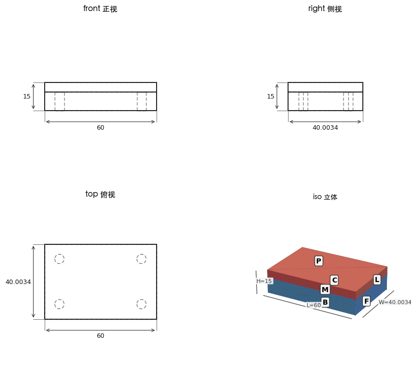

# VibeCAD 用户手册

> 用聊天的方式画 3D 零件——不用学 CAD 软件，说中文就行。

本手册面向**完全不懂 CAD、也不熟悉命令行**的朋友。每一步都给出可以直接复制粘贴的命令、可以照着念的话术。读完第一、二、三章（约 10 分钟）你就能开始画图了。

**目录**

1. [这是什么](#一这是什么)
2. [安装前提：装好 uv](#二安装前提装好-uv)
3. [在 Claude Cowork 中配置](#三在-claude-cowork-中配置)
4. [第一次使用](#四第一次使用)
5. [场景手册](#五场景手册)
6. [故障排查](#六故障排查)

---

## 一、这是什么

VibeCAD 是一个"会画三维图的 AI 助手插件"。装好之后，你在 Claude 的聊天窗口里用一句大白话描述想要的东西——比如"画一个 60×40×10 的底板，正中间打一个 8 毫米的孔"——AI 就会替你把三维模型建出来，而且**每做一步都回给你一张工程图**，让你亲眼确认做对了没有，不满意接着用嘴改。

它背后用的是免费开源的专业 CAD 软件 FreeCAD，但你完全不需要安装它、不需要打开它、更不需要学会它——所有专业操作都由 AI 代劳。它特别适合一年只设计几次东西的普通人：打印一个收纳盒、给设备配一块安装板、修一个坏掉的塑料件。

**它能做什么：**

- **画基础零件**：长方体、圆柱体，尺寸随口说（单位毫米）
- **打孔**：在你指定的面上打孔，还能一次打一排或一圈（孔阵列）
- **改尺寸**：说"长度改成 80"，模型和图上的标注当场更新
- **挖槽、圆角、倒角**：常见的细节加工都有
- **多零件装配**：新建第二个零件，"把盖板贴到底板上"，零件相撞时会自动拦下来
- **导出制造文件**：STL（给 3D 打印切片软件）、STEP（给 CNC 加工厂）、glTF（三维预览）

下面是一个双零件装配的实际出图效果——每次你说完一句话，就会收到一张这样的图：

<!-- screenshot: 控制者请将 R8 装配黑盒验证图存入 docs/images/assembly-example.png -->


---

## 二、安装前提：装好 uv

你只需要预先装**一个**小工具：**uv**（一个帮你自动下载并运行程序的小帮手，装完就不用再管它了）。另外请确保电脑至少有 **5GB 空闲磁盘空间**——首次使用时会自动下载约 2-3GB 的建模引擎。

### macOS

1. 打开"终端"：按 `Command + 空格` 调出聚焦搜索，输入"终端"（或 Terminal），回车。
2. 把下面整行复制粘贴进去，回车，等它跑完：

```bash
curl -LsSf https://astral.sh/uv/install.sh | sh
```

3. **关掉终端窗口，重新打开一个**，输入下面这行验证（uvx 是 uv 自带的命令）：

```bash
uvx --version
```

显示出版本号（如 `uvx 0.7.x`）就成功了。

### Windows

1. 点开始菜单，输入 "PowerShell"，打开 Windows PowerShell。
2. 把下面整行复制粘贴进去，回车，等它跑完：

```powershell
powershell -ExecutionPolicy ByPass -c "irm https://astral.sh/uv/install.ps1 | iex"
```

3. **关掉 PowerShell 窗口，重新打开一个**，输入下面这行验证：

```powershell
uvx --version
```

显示出版本号就成功了。

### 关于首次下载的预期

第一次让 AI 准备 CAD 环境时，它会在后台自动下载约 **2-3GB** 的建模引擎（FreeCAD），视网速需要几分钟到十几分钟。**这只发生一次**——之后每次使用都是秒开。下载过程中你可以随时问 AI"装到哪了"。

---

## 三、在 Claude Cowork 中配置

接下来把 VibeCAD 接入 Claude Cowork。整个过程就是"添加一个连接器，填三个空"。

> 注：Cowork 的界面可能随版本更新略有变化，找不到对应入口时以实际界面为准，按"添加自定义连接器 / 本地 MCP 服务器"的字样寻找。

1. 打开 Claude Cowork。
2. 进入 **设置（Settings）**，找到 **连接器（Connectors）** 或 **扩展（Extensions）** 页面。
   <!-- screenshot: Cowork 设置入口截图 -->
3. 点击 **添加自定义连接器（Add custom connector）**，选择 **本地 / stdio** 类型。
   <!-- screenshot: 添加连接器对话框截图 -->
4. 按下表填写：

   | 填写项 | 内容 |
   |---|---|
   | 名称（Name） | `vibecad` |
   | 类型（Type） | `stdio`（本地命令） |
   | 命令（Command） | `uvx` |
   | 参数（Arguments） | `vibecad` |

5. 保存并启用。连接器列表里出现 **vibecad** 且状态正常（无红色报错）即配置完成。
   <!-- screenshot: 连接器列表中 vibecad 已启用的截图 -->
6. 验证：新开一个对话，问 AI——

   > "你能看到 VibeCAD 的 CAD 工具吗？"

   AI 回答能看到一组 CAD 工具，就接好了。

### 3.1 等价配置：Claude Desktop

如果你用的是 Claude Desktop（桌面版聊天应用），改为编辑它的配置文件 `claude_desktop_config.json`：

- macOS 路径：`~/Library/Application Support/Claude/claude_desktop_config.json`
- Windows 路径：`%APPDATA%\Claude\claude_desktop_config.json`

用任意文本编辑器打开（没有此文件就新建一个），写入：

```json
{
  "mcpServers": {
    "vibecad": {
      "command": "uvx",
      "args": ["vibecad"]
    }
  }
}
```

保存后**完全退出并重启 Claude Desktop**（macOS 注意菜单栏 Quit，不是只关窗口）。

### 3.2 等价配置：Claude Code

如果你用的是 Claude Code（命令行工具），在终端里粘贴一行即可：

```bash
claude mcp add --transport stdio vibecad -- uvx vibecad
```

---

## 四、第一次使用

配置好连接器后，照下面四步走一遍。

**第 1 步：准备 CAD 环境。** 对 AI 说：

> "帮我准备好 CAD 环境"

AI 会开始在后台下载建模引擎（约 2-3GB，只此一次），并每隔一会儿向你汇报进度。你可以随时问"装到哪了"。

**第 2 步：按提示重新连接。** 下载完成后，AI 会告诉你"引擎已就绪，请重新连接"。这不是出错——刚装好的引擎需要重启一次连接才能真正用上。做法：回到 Cowork 的连接器页面，把 vibecad 连接器**关掉再打开**（或重启 Cowork 应用）。
<!-- screenshot: 连接器开关位置截图，以实际 UI 为准校正本步骤 -->

**第 3 步：试一下能不能用。** 重连后对 AI 说：

> "测试一下 CAD 能不能用"

AI 会悄悄画一个 10×10×10 的小方块并报告它的体积（1000 立方毫米）——看到这个数字，说明一切就绪。

**第 4 步：画你的第一个零件。** 说：

> "画一个 60×40×10 的底板"

**你会看到**：一张四格拼图——三格是黑白工程图（正视、右视、俯视，线框轮廓上标着 60、40、10 的尺寸），一格是彩色立体图。从现在起，**你每说一句建模指令，都会自动收到一张这样的图**，看图说话即可。

> 之后每次使用：引擎只装一次，以后打开 Cowork 直接说"画一个……"就行，不用再走第 1-3 步。

---

## 五、场景手册

以下场景都接在"已经画了一个底板"之后。每个场景给出：你说的话（可照念）、会看到什么、小贴士。

开始前先记住四件事：

- **单位都是毫米**。说"60×40×10"就是长 60 毫米、宽 40 毫米、高 10 毫米，不用带单位。
- **每说一句就看一眼图**。回图的四个格子里，三格黑白线框是工程图（虚线表示被挡住的轮廓，`⌀8` 表示直径 8 毫米的圆孔），一格彩色是立体效果。对一下图上的数字是不是你要的。
- **说错了直接改口**。"不对，孔要打在另一个面"、"刚才那个槽不要了，重新挖"——AI 会照办；失败的操作不会在零件上留下半成品。
- **被拒绝是好事**。遇到现实中做不出来的操作（孔打到零件外面、两个零件穿模），AI 会大声拒绝并讲明原因，零件保持原样。换个说法或改个数字再来即可。

### 场景 1：在指定的面上打孔

零件有六个面，AI 看不见你的鼠标，所以先要一张"面编号图"，之后用字母指面。

你说：

> "给我看看每个面的编号"

**会看到**：一张彩色立体图，每个可见面上贴着 A、B、C……字母标签，旁边带尺寸线；AI 同时用文字逐一说明每个面是哪个（如"A：顶面，60×40"）。背面看不见的面 AI 会告诉你换个说法指代。

然后你说：

> "在 F 面正中打一个 8mm 的孔"

**会看到**：一张四格工程图：三个视图带尺寸标注 + 一个彩色立体图，孔的位置和直径 ⌀8 都标在图上——俯视图里圆孔带红色点划中心线，旁边是孔到边的定位尺寸。

**小贴士**：不说深度就默认打穿；想打盲孔就说"打 5mm 深"。其实直接说"在顶面正中打个 8 毫米的孔"通常也行——AI 会自己对照编号图。

### 场景 2：改尺寸

你说：

> "长度改成 80"

**会看到**：一张新的工程图，原来标 60 的地方现在标 80，孔的位置等特征自动跟着重新计算，不用你重画。

**小贴士**：AI 随时知道当前零件有哪些可改的参数，"孔改大到 10 毫米"这种也是一句话的事。如果某个修改会把零件改坏（比如孔跑出零件边界），AI 会**拒绝并说明原因**，零件保持原样不受损——这是保护机制，不是故障。

### 场景 3：孔阵列

你说：

> "在顶面打 4 个 5mm 的孔，排成一排，间距 15"

**会看到**：俯视图上四个等距的圆孔排成一条线，标着 ⌀5 和相邻孔间 15 的间距尺寸链。

**小贴士**：也支持打一圈："沿半径 12 的圆均匀打 6 个孔"。阵列是"全有或全无"——只要有一个孔放不下，整组都不会打，不会给你留下打了一半的零件。

### 场景 4：挖槽

你说：

> "在顶面挖一个 20×8 的槽，深 5"

**会看到**：俯视图上多出一个 20×8 的矩形轮廓，立体图上能看到顶面凹下去的方槽。

**小贴士**：想要两端圆弧的腰形滑槽，就说"挖一个跑道形的槽"；反过来想"凸起一块"而不是挖掉，把"挖"换成"凸起 / 垫高"即可。打穿底或者越出边界的槽会被拒绝。

### 场景 5：圆角

和面一样，边也要先看编号图。你说：

> "给我看看边的编号"

**会看到**：一张立体图，每条棱边标着 E1、E2……（背面看不到的边用虚线画出并在表里注明），附一张文字对照表。

然后你说：

> "E3 这条边倒 3mm 圆角"

**会看到**：立体图上那条直棱变成了圆弧过渡面，工程图同步更新。

**小贴士**：一次倒多条："E1 到 E4 都倒 2mm"。想要斜切面（而非圆弧）就说"倒角"。注意：零件形状变了之后，旧编号可能对不上原来的边，AI 会提示"标签已过期，请重新标注"——重新要一张编号图就好，这是防止改错位置的保护机制。

### 场景 6：装配两个零件

你说：

> "新建一个零件叫盖板，画一个 60×40×5 的板"

**会看到**：工程图里出现了第二个零件；之前的底板原封不动。

然后你说：

> "把盖板的底面贴到底板的顶面"

**会看到**：一张装配工程图——立体图里两个零件**分别着色**、面贴面合在一起，被遮住的轮廓用虚线表示。

**小贴士**：要留缝就说"留 0.5mm 间隙"。如果摆放位置会让两个零件互相穿透，AI 会**拒绝并报告重叠了多少毫米**——现实中装不进去的东西它不让你装，调整位置或尺寸再试。

### 场景 7：导出 3D 打印文件

你说：

> "导出 STL 给 3D 打印"

**会看到**：AI 回复文件已保存，并给出完整路径（例如 `.../export/Part1.stl`）。把这个文件拖进你的切片软件（如 Bambu Studio、Cura）就能打印。

**小贴士**：送 CNC 加工厂要 STEP 格式，说"导出 STEP"；两样都要就说"STEP 和 STL 都导出"。装配体可以"按零件分开导出"，每个零件一个文件。

---

## 六、故障排查

| 现象 | 原因 | 解决 |
|---|---|---|
| 首次下载中途断网/关机，重试时 AI 说"安装已在进行中"却始终没有进展 | 上次中断留下了一个"安装锁"文件，挡住了新的安装 | 手动删除锁文件，再对 AI 说"帮我准备好 CAD 环境"。锁文件位置——macOS：`~/Library/Application Support/VibeCAD/.install.lock`（在 Finder 按 `Command+Shift+G`，粘贴路径前往）；Windows：在资源管理器地址栏粘贴 `%LOCALAPPDATA%\VibeCAD`，删除其中的 `.install.lock` |
| AI 提示"运行时已就绪，请重新连接"（needs_reconnect） | **不是故障**：建模引擎刚装好，连接需要重启一次才能加载它 | 到 Cowork 连接器页面把 vibecad 关掉再打开（或重启应用），回到对话继续即可 |
| AI 说"标签已过期，请重新标注" | **不是故障**：零件形状变了之后，旧的 A/F/E3 编号可能已经对不上原来的面或边；为防止改错位置，AI 拒绝沿用旧编号 | 说"重新给我看面（边）的编号"，照新图指即可 |
| 装配时 AI 拒绝操作，并报"干涉 / 重叠 x mm" | **不是故障**：按这个摆法两个零件会互相穿透，现实中装不进去，所以被保护机制拦下 | 调整位置、改小尺寸或留间隙后再试；如果是刻意的紧配合（硬压进去），明说"我知道会重叠，按压配处理" |
| Windows 防火墙或杀毒软件弹窗询问 | 首次运行要下载引擎、启动本地程序，触发了安全提示 | 选择"允许"。VibeCAD 完全在你本机运行、不向外发送你的设计，组件只从官方源下载，代码开源可查 |
| 出图里中文文字显示成方块（多见于 Windows） | 系统缺少中文绘图字体 | 只影响个别文字显示，尺寸数字和建模功能完全正常，可忽略 |
| 试了各种办法都不行，想彻底重来 | 引擎文件可能已损坏 | 删除整个数据目录，然后重新说"帮我准备好 CAD 环境"（会重新下载 2-3GB）。目录位置——macOS：`~/Library/Application Support/VibeCAD`；Windows：`%LOCALAPPDATA%\VibeCAD` |

> **报告问题时**：附上安装日志能大大加快定位——日志文件在数据目录下的 `install.log`（macOS：`~/Library/Application Support/VibeCAD/install.log`；Windows：`%LOCALAPPDATA%\VibeCAD\install.log`），连同"你说的话、AI 的回复、你期待的结果"一起发给我们。

---

*祝你画图愉快。想到什么就说什么——说错了也没关系，AI 拒绝得越响亮，你的零件就越安全。*
