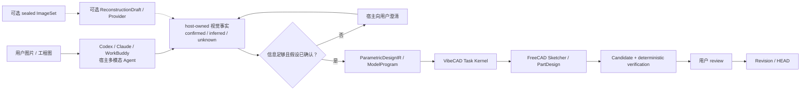

# VibeCAD Visual CAD 整体计划

> 状态：**`VCAD-S30.1`–`VCAD-S30.3` 已完成；`VCAD-S30.4` 真实宿主路径验收待执行**
>
> 更新：2026-08-04
>
> 产品基线：已发布 `v0.6.1@e7dd0c0`
>
> 当前里程碑：`VCAD-S30.4` WorkBuddy / Codex 真实宿主路径

本文件是“单张/多张图片 → 可编辑 CAD 草图/参数化模型”能力线的短期活动真源。
既有 Stage 3、P0-B、MRG1 和 P2 编排文件保持历史只读，不在其中继续追加命令、重试、
临时 hash、runner 演化或逐次诊断。

## 1. 产品目标

Visual CAD 的目标不是从图片恢复唯一的“原始 CAD”，而是：

> 从有证据来源的单张或多张图片中提取几何事实和不确定性，经用户确认后生成一份
> 可审核、可修改参数、可重新计算的 FreeCAD 草图与特征模型。

首个正式产品结果必须同时具备：

1. 图片、尺寸、用户回答和推断之间可追溯；
2. 无法从图片确定的信息会提问或标记为假设，不静默猜测；
3. 输出含真正的 Sketcher 几何/约束和基础 PartDesign 特征，不是静态 Shape；
4. 修改公开参数后可以 recompute，必要设计约束仍成立；
5. 所有设计改变仍经过 Task → Candidate → verifier → review → Revision/HEAD；
6. 视觉模型和外部 Provider 永远没有 Accept、commit 或 HEAD 权威。

## 2. 两条产品轨道

### 2.1 Mechanical Parametric 主线

初始支持单个、清晰、规则机械零件：

- 2.5D 拉伸件和回转件；
- 直线、圆、圆弧、槽和构造线；
- 重合、水平、垂直、平行、正交、相切、相等、对称和尺寸约束；
- Pad、Pocket、Hole 和 Revolve；
- 单张带尺寸工程图、单张正投影加尺寸基准，以及 2–4 张一致的多视图图片；
- 普通照片仅在比例尺、主体和必要视角足够时进入引导式重建。

首期不承诺自由曲面、装配、螺纹、钣金、焊件、复杂放样、制造公差推断，或恢复原始
特征历史。

### 2.2 Freeform 支线

自由曲面不是永久排除项，但使用不同的中间表示和验收：

- 工业外壳/手柄：截面曲线、导引曲线、Loft、Sweep、NURBS 和对称/厚度参数；
- 雕塑/高度有机形体：Mesh/SubD 控制笼，作为可塑形结果，不宣称全约束机械 CAD；
- 精密逆向：扫描/点云与专业曲面拟合 Provider，VibeCAD 只负责编排、来源、采纳和审核。

工业自由曲面若最终成为有效 BRep，可进入现有 FCStd/STEP Revision；Mesh/SubD 在当前
durable v1 下只作为 immutable derived artifact。把 Mesh/SubD 变成权威 Revision 需要单独的
artifact profile/durable 决策，不能由本计划暗含授权。

## 3. 目标架构



架构决定：

- `ParametricDesignIR` 是严格、版本化、provider-neutral 的领域值，不允许任意 Python；
- 主路径由宿主 Agent 直接观察其已经可见的图片；宿主拥有模型选择、订阅/API 授权和费用，VibeCAD
  不再次上传同一图片，也不需要宿主把模型凭据交给 VibeCAD；
- 宿主确认信息足够后直接创建普通 `REQUIRE_REVIEW` CAD Task 并提交 ModelProgram；图片本身不会因为
  Task 创建而自动成为 VibeCAD durable evidence，丢失宿主附件上下文时必须重新询问或重新附图；
- `ReconstructionDraft`、sealed ImageSet 与直连 Provider 是需要本地图片留存或独立批处理时的可选生命周期，
  不是 Agent-first 主线，也不拥有 CAD candidate、Revision 或 HEAD；
- IR 通过一个 ModelProgram-only 的原子 operation 编译到现有 `ModelProgram`，不把每条线和约束
  扩张成几十个 MCP 工具，也不建立第二套 CAD Task/Revision 状态机；
- 宿主多模态模型可以同时承担观察与 CAD reasoning，但输出仍必须落为受控 IR/ModelProgram，并由
  VibeCAD 确定性验证；
- 可选 Vision Provider 只产生 observation/proposal，不能成为第二个 Agent 或 CAD 写入端；
- WorkBuddy 是首个宿主适配对象，不是协议或模型架构的所有者。

## 4. 核心合同

### 4.1 `ImageSet`

最少记录：

- 每个输入的 visual-input ID、SHA-256、MIME、像素尺寸和视图角色；
- `front/top/right/back/isometric/unknown` 视角声明；
- 单位、显式尺寸、比例尺、相机/透视校准状态；
- 多图是否属于同一物体、同一状态和同一尺度；
- 原图与去 EXIF/归一化派生图之间的 provenance；
- 本地处理或外部 Provider 授权状态。

图片不是 Revision 原生 CAD payload。它作为 reconstruction-scoped immutable input/evidence 管理，因此
Mechanical V1 不受 Revision durable-v2 阻塞。

### 4.2 `VisualObservation`

每项观察携带来源状态，而不只是一分置信度：

- `confirmed`：用户或图中尺寸明确给出；
- `calibrated`：由比例尺或相机校准推导；
- `cross_view_derived`：由多视图一致性推导；
- `assumed`：基于对称、遮挡或常见结构的假设；
- `unknown`：证据不足。

只有前三类可以直接成为尺寸验收依据；`assumed` 在生成 CAD candidate 前必须确认。

### 4.3 `ReconstructionProposal`

包含零件类型、基准、草图、尺寸、约束、候选特征树、未决问题、替代方案、unsupported
内容和预期渲染视图。提案本身不能创建 CAD candidate。

### 4.4 `ParametricDesignIR`

首期表达：

- datum plane 和显式局部坐标系；
- stable sketch/geometry/constraint/parameter/feature ID；
- sketch primitives、geometric constraints 和 dimensional constraints；
- Pad、Pocket、Hole、Revolve 及明确依赖；
- 参数默认值、单位、合法范围和证据来源；
- 能够确定性派生后续 execution acceptance 的设计语义。

IR 只描述“设计是什么”。显式 edit probe、DoF/冲突观察以及 tolerance-bearing acceptance 属于
现有 `AcceptanceSpec` 和执行验证，不写入 IR，避免形成两套验收真源，也避免只改变 probe 就改变
设计 digest。

VCAD-V1 的草图只依附 origin/datum plane，不依赖不稳定的生成面/边拓扑。基于特征面的草图
和复杂 face/edge selector 在后续单独扩展。

首期对外只编辑 named parameter、whole sketch 或 feature，不公开逐条 sketch element selector；
IR-local stable ID 使用独立 `ir_*_<32 lowercase hex>` 命名空间。它不能替换现有 revision-bound
`object_` / `feature_` selector，也不能替换 FreeCAD 临时 geometry/constraint index；后续 compiler
必须显式维护三者之间的内部映射。

S10.1 保持 `ObservationSnapshot v1`、`SelectorV1` 和 `AcceptanceSpec v1` 的 wire 与 digest 不变。
新的 ModelProgram value shape、默认 operation、compiler 和 Worker handler 已在 S10.4 一次完整接入；
该 operation 只进入 capabilities/ModelProgram，不作为 direct MCP 建模工具暴露。

### 4.5 `S20.0` 冻结合同：`VCAD-A02` 已批准

现有 `ReviewDraft` 只表示已经通过确定性验证、等待用户审核的 CAD candidate，不能复用为图片重建
草稿；现有 `draft_*` ID 和 `draft_id` 字段也继续专属于该合同。新对象使用
`reconstruction_<32 lowercase hex>` / `reconstruction_id`；ImageSet 使用
`image_set_<32 lowercase hex>`，单图使用 `visual_input_<32 lowercase hex>`。ImageSet 与
ReconstructionDraft durable record 都显式携带 `schema_version = 1`。图片不能进入 `TaskRun.artifacts`、
CAD `artifacts/` store、Revision v1 或既有 `vibecad://artifact/...` URI；这些合同都要求已经存在的
candidate Revision 和 FCStd/STEP payload。

#### 持久化拓扑与兼容

`A02` 已批准两个新的 additive sibling roots：

```text
data_root/
  visual_inputs/           # sealed ImageSet、原图、归一化派生图
  reconstruction_drafts/   # lifecycle、observation、proposal、clarification
```

- 两个 root 都由 `ApplicationDataLayout` 以 `0700`、owner-only、captured identity 方式打开；内部读写
  继续采用 descriptor/no-follow、single-link、size、MIME/magic 和 atomic-publish 模式；
- 不移动、不重解释 `tasks/`、`projects/`、`artifacts/` 或 `releases/`，也不引入全局 layout-version
  或迁移框架；现有旧版 opener 不枚举额外 sibling，因此兼容方案是由旧版忽略、新版本在首次启用时
  纯加法创建；
- V1 不跨 ImageSet 去重 blob，避免删除语义变成引用计数和共享所有权问题；
- `RuntimeArtifact` / `RuntimeInvocation` / `RuntimeResult` 只复用为 provider-neutral 调用信封，仍不承担
  durable storage；每个 root 的 record/count/total-byte 预算在 S20.1 固定且必须 fail closed。

#### `ImageSet v1`

对外只发布 sealed `ImageSet`；copy/hash/normalize 的 staging 是内部临时态，失败后不留下半发布对象。
sealed manifest 至少包含 `schema_version = 1`、`image_set_id`、create-key digest、manifest digest，以及
每张原图和归一化图的独立 `visual_input_id`、SHA-256、byte/pixel size、MIME、view role、normalization
profile/version 和 provenance；还包含
unit、显式尺寸、scale/calibration、`same_object`、`same_state`、`same_scale` 与 processing authorization。
seal 后不能添加、替换或删除单张图片；输入变化创建新的 ImageSet。

Mechanical V1 已批准的输入包络是：

- 1–4 张，仅 JPEG/PNG；HEIC、PDF、TIFF 和视频后续单独扩展；
- 每张最多 20 MiB / 40 MP，每组最多 64 MiB / 100 MP；同时按 encoded byte 与 decoded pixel
  双重限额防止解压炸弹；
- 应用 EXIF orientation 后转为 sRGB、剥离 metadata，并生成最长边不超过 4096 px 的 analysis
  derivative；原图只保留在本地私有 store。
- derivative 每张最多 72 MiB、单 ImageSet 原图与 derivative 合计最多 384 MiB；`visual_inputs/`
  最多 8 GiB、1,024 个 sealed sets 与 8 个内部 temporary。manifest 最多 64 KiB；所有预算均
  fail closed；
- durable manifest 使用 `image_set_id` / `visual_input_id` 显式字段，归一化 profile 固定到
  Pillow 12.2.0；幂等重放只复核 semantic request 与原图 descriptor/hash，不重新生成 derivative；
- `explicit_scale` 与 `calibrated` 状态必须分别携带有界的 scale 或 camera-intrinsics evidence，
  不能只记录一个无数据的状态标签。

上述数字已由 `A02` 批准，可在 S20.1 成为实现常量。

#### `ReconstructionDraft v1`

最小 durable record 包含：`schema_version = 1`、`reconstruction_id`、create-key digest、`generation`、
project/base Revision/base HEAD generation、ImageSet ID/digest、status、immutable
observation/proposal/clarification refs 与 digest、
有界 append-only provider invocation records（runtime/model/version/invocation/budget/deadline/input/result
digest）、adoption-key digest、
`adopted_task_id` 和有界结构化 `last_error`。`next_action` 由状态确定性派生，不重复持久化。

生命周期冻结为：

```text
sealed ImageSet -> ready -> observing -> needs_input -> ready
                              |              (answer + new generation)
                              +-----------> proposed -> adopting -> adopted
                              +-----------> failed
observing | adopting -------> recovery_required
failed ---------------------> ready              (explicit retry)
recovery_required ----------> ready/proposed/adopted/failed (reconcile first)
ready | needs_input | proposed | failed --------> rejected
ready | needs_input | proposed | failed | rejected | adopted -> deleted tombstone
```

- 每次转换都要求 `reconstruction_id + expected_generation` CAS；generation 不匹配即冲突，不合并；
- provider/adoption intent 必须在外部效果前持久化，完成 receipt/digest 在效果后持久化；重启看到未知
  outcome 时进入 `recovery_required`，绝不自动重复付费调用或重复采纳；
- `needs_input` 的回答形成 immutable clarification 并推进新 generation；只有带确定失败 receipt 的
  `failed` 可以显式 retry。`recovery_required` 必须先 reconcile 已有 intent/receipt，证明没有仍在进行或
  已完成但未记录的效果后，才进入一个稳定状态；
- `proposed` 只有在所有 `assumed` 已确认且没有 `unknown` 阻断项时才能进入 `adopting`；
- `adopting` 使用由 reconstruction/proposal/base-HEAD digest 确定性派生的现有 Task create key，最终只
  创建一个普通 `REQUIRE_REVIEW` CAD Task。Provider 没有 candidate、Accept、commit 或 HEAD 权威。

#### 顺序所有权、保留与删除

- 创建 ReconstructionDraft 时捕获 base Revision 与 HEAD generation；采纳时 HEAD 不一致直接
  `conflict`，不自动 rebase、merge 或解决 FreeCAD/Agent 并发修改；
- V1 不运行后台 TTL。活动和终态图片默认保留到用户显式删除，并在产品界面展示占用空间；
- `observing`、`adopting` 或 `recovery_required` 存在未决 effect 时禁止 reject/delete；必须先完成或
  reconcile。其它合法状态的删除可以移除该 reconstruction 独占的 image bytes、observation/proposal
  和 draft record；tombstone 至少保留 schema、reconstruction ID、final generation、create-key digest
  和可选 adoption-intent digest，但采纳前不保留图片 hash/路径；
- 采纳后允许删除图片 bytes 和可重建明细，但随已采纳 CAD 项目的 durable lifetime 保留 bounded
  source hash/provenance、proposal digest 与 `adopted_task_id`；删除视觉来源不回删已经接受的 CAD
  Revision；
- 若外部 Provider 已接收副本，本地删除不能撤回外部副本；该告知、外发授权和 Provider retention
  由已批准的 `A03` 边界管理。

#### Host-neutral public contract

S20 的领域 API 只暴露 path-free、strict-schema 的逻辑动作：create/get/run/answer/adopt/reject/delete
reconstruction。所有 mutation 都带 generation；响应只返回 bounded status、generation、derived
`next_action`、questions/proposal summary 和可选 `adopted_task_id`。原图不通过 JSON/base64、现有 MCP
frame 或既有 CAD Resource URI 传输，也不在 S20 初期开放原图 `ResourceLink/resources.read`。

sealed ImageSet 由非 MCP、descriptor-bound ingress port 创建；`create_reconstruction` 只接收其
`image_set_id + manifest digest`。图片 ingress 是 host adapter 的受控 locator/descriptor capability：
CLI/Workbench 先安全复制并 seal；WorkBuddy 只有在附件 descriptor 行为被真实认证后才直接接入；
否则使用薄本地导入适配。S20.5 已把
这些逻辑动作投影成严格、host-neutral 的公共入口，但不得改变上述合同。若以后要向宿主重读图片，
必须新增独立
`vibecad://visual-input/...` URI 并单独批准，不能扩张既有 CAD artifact URI。

`A02` 当时只批准 `local_only` processing authorization、上述 public/durable 合同和 deterministic fake
provider 路径；其它 authorization 值在 A03 批准前均 fail closed。A03 的批准不回写已交付的 S20
运行能力；真实图片外发、真实 Provider 与 provider-specific profile 由 S30.1 实现和验证后才可用。

#### `VCAD-A02` 一次性批准内容

批准 `A02` 即同时确认：两个 additive roots；sealed-only ImageSet；1–4 张 JPEG/PNG 与上述 byte/pixel
预算；无后台 TTL、显式删除及采纳后 bounded provenance；generation/CAS 与创建时绑定、采纳时 HEAD
冲突即停止；七个 host-neutral reconstruction 逻辑动作；locator/descriptor ingress；以及只运行
deterministic fake provider 的 S20.1–S20.5 实现范围。它不批准任何真实 Provider/VLM（无论本地或
外部）、外部图片传输、真实模型费用、图片 Resource URI、
Revision/TaskRun v2、Freeform、发布或 tag。

### 4.6 `VCAD-A03` 真实 Provider 边界：已批准

用户于 2026-08-04 批准以下真实模型试点边界：

- 允许向云端多模态 Provider 发送图片，不要求每个任务再次弹出外发确认；个人版遵循用户选择的
  Provider 账户条款，企业版遵循企业模型/组织的数据策略，VibeCAD 不额外宣称所有 Provider 都不用于
  训练；
- 允许 Provider 按其账户与服务策略保留已发送图片；用户接受删除 VibeCAD 本地副本不能撤回已经外发
  的 Provider 副本；Provider/model/version、传输对象 digest 与所用数据策略 profile 仍进入 provenance，
  API key 不进入 durable record 或日志；
- pilot 不设置用户可见的美元费用、总调用次数或任务总时长预算。这里不取消工程资源边界：单个 durable
  intent 最多拥有一个在途 Provider effect；每个网络调用必须有有限 transport timeout、输入/输出大小上限
  和可取消路径；只有已证明 Provider 未接受请求时才允许同 intent 的一次 transport retry，未知结果进入
  `recovery_required`，绝不递归重试；
- 授权把当前已实现的 1–4 张 JPEG/PNG 包络向前兼容扩展为最多 16 张来源图。16 是用户输入 ceiling，
  不是“图片越多必然越好”的质量声明；只有清晰、互补且属于同一物体/状态/尺度的视图提供增量证据，
  重复、模糊或冲突图必须被降权、请求澄清或安全失败；
- VibeCAD 保留本地封存原图，Provider adapter 根据已认证模型能力生成 resize derivative 和局部 detail
  crop。高分辨率原图不会被盲目原样塞进每次请求：多数模型会按 patch/tile 预算缩放，工程图尺寸文字和
  小孔等细节应通过高细节模式或局部裁剪保真；
- A03 只批准 Mechanical Parametric 的真实 Provider pilot 与必要的 provider-neutral adapter、16 图输入
  扩展和测试；不批准公开质量声明、WorkBuddy 直接附件认证、Freeform、发布或 tag。

官方能力基线说明 provider-neutral 适配的必要性：OpenAI 当前视觉 API 允许很高的请求总量，但不同
detail/model family 有不同 patch/resize 行为；Claude API 的单图、请求总量、长边与 visual-token 上限按
模型/平台变化；Gemini 对大图按 tile/media-resolution 处理，并区分 inline 与 Files API。实现不得把任一
厂商当前上限写成 VibeCAD durable schema 的永恒事实。

## 5. 分阶段执行计划

### VCAD-S00 — 计划与合同冻结

状态：**complete；`VCAD-A01` 已由用户批准**。

产出：

- 产品范围、架构、阶段、验收和审批点；
- 现有能力与缺口清单；
- 明确确认前不写代码、不跑真实 Provider、不发布。

退出门：用户批准本计划。计划文字修订不等于批准实现。

### VCAD-S10 — Parametric Core

用户能力：Agent 能从明确尺寸创建和修改真正可编辑的参数化单零件，即使暂时没有图片输入。

顺序：

1. `S10.1` 冻结 `ParametricDesignIR`、stable ID、单位、约束和 feature schema（**complete**）；
2. `S10.2` 实现 Sketcher 编译、观察、DoF/冲突/冗余诊断（**complete**）；
3. `S10.3` 实现 datum-plane Pad/Pocket/Revolve，随后补 Hole（**complete**）；
4. `S10.4` 把 IR 编译进现有 ModelProgram/Task Kernel（**complete**）；
5. `S10.5` 完成“创建 → review → Accept → 修改参数 → 新 Revision”的真实 FreeCAD 纵切片（**complete**）。

退出门：

- 代表性草图 `DoF = 0`，无 conflicting constraint；
- confirmed 尺寸满足单位和公差合同；
- Pad/Pocket/Revolve/Hole 产生有效单实体 BRep；
- 修改代表性公开参数后 recompute、保存、重开仍有效；
- 同一操作走现有 Task/Revision/review 权威，不新增第二控制面。

最小固定样例：一个全约束安装板证明 Sketcher + Pad；一个带孔板证明 Pocket/Hole；一个阶梯轴
证明 Revolve。首期不借机补齐完整历史 P1 operation inventory。

S10.1 closeout：

- 新增 runtime-neutral、严格版本化且 canonical 的 `ParametricDesignIR v1`，覆盖 evidence、named
  parameter、origin/datum plane、五类草图 primitive、十五类约束和 Pad/Pocket/Hole/Revolve；
- IR ID 使用独立 `ir_*_<32 lowercase hex>` 命名空间，输入顺序不影响 digest，同时拒绝路径仍指向
  原始 wire index；设计结构预算为 3,500 JSON nodes、256 KiB canonical byte；
- profile closure、Sketcher solve、DoF/冲突、PartDesign recompute 和 edit probe 明确保留为 compiler/
  execution invariant，不伪装成纯合同层已经证明的几何事实；
- `ObservationSnapshot v1`、`SelectorV1`、`AcceptanceSpec v1`、operation registry 和现有 transport
  均未改变；package wheel/sdist 已包含并可导入新子包；
- focused contract gate 为 22 passed，既有核心 contract/program/registry/selector 回归为 405 passed，
  Ruff/format clean，独立复审 clean。

S10.2 closeout：

- 新增 import-safe 的 Sketcher compiler：一个外部参数 carrier、一个 `PartDesign::Body` 和最多八个
  `Sketcher::SketchObject`；Point/Line/Circle/Arc、三种 origin plane、显式 datum frame 和十五类约束
  使用真实 FreeCAD API 编译，Slot 在事务前安全拒绝；
- named length/angle 参数通过稳定 constraint name 与 FreeCAD expression 驱动草图；锁定 metadata
  保存 IR ID 到 geometry/constraint index 的内部映射。一个有界 document-graph gate 校验唯一 body、
  carrier、sketch 集合、Body membership、共享 design digest 和表达式绑定；求解失败在事务内回滚；
- `EntityObservation.parameters` 可承载 design/mapping digest、当前参数值、geometry/constraint count、
  DoF、fully-constrained、solver/conflict/redundancy/malformed facts，而不改变 ObservationSnapshot v1；
- managed FreeCAD outcome 证明全约束矩形参数从 60 mm 改为 75 mm 后几何实际更新，保存/重开仍为
  `DoF=0`；断开表达式、删除草图和冲突约束均 fail closed，合法 Point/Whole 对称约束不再触发原生
  崩溃；十九个 geometry/constraint 映射样例均由真实 FreeCAD 构造；
- 包含六个 focused compiler tests 的 497 个 contract/program/registry/selector/executor/worker 测试通过，
  Ruff/format/source compile 和独立复审通过。未新增 runner、controller 或 observation v2；全局 Worker
  stabilization 延后到 S10.4，与 solid、EntityIdentity 和真实 Worker outcome 一次接入。

S10.2/S10.3 的 datum 语义是“显式正交 frame 编译为稳定 Placement”，不是生成面 attachment，也不
宣称已经创建用户可见的 FreeCAD DatumPlane 对象；S10.3 保持了这一边界。

S10.3 closeout：

- `compile_parametric_design` 在 S10.2 的同一事务内按 IR 顺序创建原生 Pad/Pocket/Revolution/Hole；
  Length/Angle/Dimension/ThroughAll 使用 FreeCAD 1.1 的名称枚举，ThroughAll 不保留无效的 dormant
  length/depth expression；Pad/Pocket 使用 `SideType`，Hole 固定为 plain-hole 常量；
- 被消费的 profile 必须由全部非 construction curve 形成有效 closed wire；Revolution 支持 sketch X/Y
  轴和 construction-line ordinal `AxisN`。S10.3 的 Pocket/Hole 明确只接受 exactly one live wire，避免
  native 部分切除被误判成功；multi-loop Pocket 与 multi-location Hole 保留在 S35 扩展。每个 feature
  重算后必须精确处于唯一 `Up-to-date`、状态为 `Valid`、有效且恰有一个 Solid；加材体积必须增加，
  Pocket/Hole 体积必须减少，防止 native no-op 或 stale Shape 假成功；
- 锁定 feature metadata 与 graph gate 校验 feature index/base chain、唯一 sketch consumption、Body Group/
  Tip、Profile/ReferenceAxis、精确参数 binding、plain-hole 常量和 carrier 表达式；Body facts 新增 feature
  count，feature facts包含 kind/index/extent/profile wire/solid validity 和当前参数值；
- managed FreeCAD 1.1.0 outcome 证明三张全约束草图的 Pad→Pocket→Hole 单实体链、construction-axis
  Revolution、FCStd 保存/重开、Pad 8→12 mm、Hole 6→8 mm 和 Revolution 360→270° 参数编辑；open
  profile 与 no-op Pocket 均事务回滚，断开 Hole expression fail closed；
- focused/core gate 为 505 passed、13 deselected，Ruff/format/compile/package wheel import 通过；独立复审
  clean；没有新增
  public operation、Worker hook、runner/controller、Observation v2 或视觉 Provider。Task/Worker、identity
  adoption 与真实 Revision outcome 仍属于 S10.4/S10.5。

S10.4 closeout：

- registry 只新增 ModelProgram-only 的 `create_parametric_design` 和严格
  `parametric_design_ir` value shape；完整 IR 作为一个 frozen value 进入既有 program，未新增 direct MCP
  建模工具，MCP 工具数仍为 31；canonical capability fingerprint 随投影更新，private runtime epoch 保持 4；
- compiler 的 trusted adoption callback 位于同一 FreeCAD transaction 内：最终 `PartDesign::Body` 采用
  `PART` identity，每个 native feature 采用 `FEATURE` identity，Body 同时成为 result root；callback 任一步
  失败会连同几何、metadata、identity 和 result root 一起回滚；
- parametric stabilization 在 observation、checkpoint、STEP export 和 save/reload evidence 前统一执行；先
  solve/校验所有 sketch，再 recompute，最后校验 graph/feature/solid facts，避免观察 stale Shape。保存重开
  比较只容忍既有几何浮点阈值内的 OCC noise，不放宽 identity、metadata 或拓扑计数；
- 单 operation 精确容纳 FreeCAD 自动 Origin 对象在内的 26-object 最大设计，全局 admission ceiling 为 32；
  3,405-node / 45,774-byte IR 已通过 ModelProgram validation、Task 状态迁移和 durable TaskRun round-trip，
  没有放宽 512 KiB API 或 4,096-node durable preflight 预算；
- 真实 managed FreeCAD 门证明 transaction rollback、精确 26 objects、Worker checkpoint/STEP/reload 和
  Task `REQUIRE_REVIEW` draft；最后一项保持 HEAD 不前移。完整非慢速回归为 5,672 passed / 118
  deselected；Ruff/format/compile、wheel/sdist 与隔离 wheel import 通过，两个独立只读复审均无剩余 finding；
- Worker wire/service、Revision durable v1、ObservationSnapshot v1、SelectorV1、AcceptanceSpec v1、public
  direct tool 与第二控制面均未改变。Accept 后参数修改和新 Revision 属于 S10.5。

S10.5 closeout：

- registry 新增一个 ModelProgram-only 的 `modify_parametric_parameter`，以 revision-bound Body selector、
  完整原始 IR、parameter ID 和有限数值为输入；复用既有 `NONBLANK_STRING`/`FINITE_NUMBER`，没有新增
  value shape、direct MCP 工具或公开 schema，MCP 工具数保持 31，public surface digest 保持不变；
- 锁定的 source IR digest 和完整 carrier `(parameter id, property, unit)` 映射共同认证编辑来源；修改前把
  所有 live carrier 值覆盖回 source IR 并重新构造合同，因此 public/min/max、正长度及角度等跨字段规则
  仍由同一 `ParametricDesignIR` 真源判定；`design_ir_digest` 始终表示不可变的原始设计意图；
- carrier 更新、Sketcher/feature consumer 读回、solver/graph/single-solid gate 与 executor 的 identity、placement、
  provenance、result-root、非目标保持验证位于同一 FreeCAD transaction；任一失败会回滚，不在 commit 后
  才发现不可恢复的漂移；
- 3,405-node / 45,774-byte IR 的 modify program 与 durable TaskRun 分别为 3,470 / 3,526 nodes，未放宽
  4,096-node durable 或 512 KiB API 预算；
- 五条真实 managed FreeCAD 门覆盖 adoption rollback、Sketcher-bound edit verifier rollback、精确 26 objects、
  Worker checkpoint/reload，以及 R1 create/Accept → R2 modify/Accept。最后一条证明 draft 不提前推进 HEAD、
  R1 tree 字节不变、Body/feature identities 不变、Pad 8→12 mm、旧新 FCStd 均可重开且新 STEP 可由
  `Part.read` 导入为有效单实体；完整非慢速回归为 5,673 passed / 119 deselected，静态、package、
  isolated-wheel 与独立复审均通过；没有新增 runner/controller/scenario language。冻结提交为 `7dfddce`。

### VCAD-S20 — Visual Input 与提案合同

用户能力：用户可以安全提交一组图片，系统能返回有来源的不确定性报告和补充信息请求；
此阶段尚不作真实模型质量承诺。

顺序：

1. `S20.0` 冻结 ReconstructionDraft lifecycle、image retention/delete、durable-root topology 和兼容方案，
   形成 `VCAD-A02` 审批包（**complete；已批准**）；
2. `S20.1` 实现 ImageSet seal、大小/格式/数量预算和归一化 provenance（**complete**）；
3. `S20.2` 实现 VisualObservation、ReconstructionProposal 和 clarification 状态（**complete**）；
4. `S20.3` 在 generic runtime 之上实现 Visual Domain Service、result retrieval 和 provider
   composition，不把它注册成 CAD adapter（**complete**）；
5. `S20.4` 用 deterministic fake provider 打通 ReconstructionDraft 回答、显式重试、重启恢复、拒绝、
   采纳和删除路径（**complete**）；
6. `S20.5` 把七个 reconstruction lifecycle 动作投影到既有 Agent application、daemon 与 MCP，
   并提供非 MCP 的本地主机 descriptor ingress；协议保持严格、path-free、host-neutral（**complete**）。

退出门：

- 输入 byte、hash、视角和授权绑定正确；
- malformed、超预算、替换或来源不一致的输入 fail closed；
- `assumed` 未确认时不能进入 CAD candidate；
- Provider 无 store/lease/accept/commit/head capability；
- Task 重启后不会重复 Provider 调用或重复采纳。

最小固定样例：完整、缺尺度和多视图冲突三个 manifest。当前 WorkBuddy ResourceLink/Blob 只证明
VibeCAD 向宿主输出资源，不证明宿主附件能够进入 VibeCAD；正式入口不得把图片 base64 塞进现有
受限 MCP/local protocol frame。优先使用受控 locator/descriptor，经 no-follow、owner、link-count、
size、MIME/magic 检查后复制到私有 immutable store。若 WorkBuddy 无稳定附件 descriptor，再增加
薄宿主适配层。

### VCAD-S30 — Single Engineering Image V1

用户能力：从单张带尺寸工程图或清晰正投影视图生成可编辑机械零件草图和基础特征模型。

顺序：

1. `S30.1` 用一组自有合成 CAD 参考图比较少量真实多模态候选，并完成第一个 provider-neutral adapter
   纵切片，不先做大模型榜单（**adapter complete；已降级为可选路径**）；
2. `S30.2` 更新 host-neutral skill，使宿主已能看图时直接分类证据、澄清缺失信息，并走现有
   Task/ModelProgram；使用当前 Codex 对自有合成图执行首个真实 pilot（**complete**）；
3. `S30.3` 交付单张带尺寸图 → constrained sketch → basic feature（**complete**）；
4. `S30.4` 在 WorkBuddy 与 Codex 各做一次真实宿主路径（**complete**）；Workbench 继续作为预览/审核
   薄客户端，不充当第二个 Agent 或模型宿主。

S30.2/S30.3 宿主视觉证据（2026-08-04）：

| 输入 | 宿主观察 | 正确路由 |
|---|---|---|
| `docs/images/assembly-example.png` | 可读到若干外形尺寸和四个圆形特征，但单位、层厚、孔径/偏置、通孔/盲孔及单件/装配目标均不确定 | `SAFE_FAILURE`：提出 blocking questions，不创建 CAD Task |
| `docs/images/visual-cad-single-hole-plate.png` | 明确为 mm；板 `80 × 50 × 8`；一个居中的 `Ø10 THRU` 孔；孔心 `40 × 25`；材料未指定但不阻塞几何 | 直接构造受控 ParametricDesignIR/ModelProgram，进入 `REQUIRE_REVIEW` Task |
| `docs/images/visual-cad-stepped-shaft.png` | 明确为 mm；总长 70；三段长度 25/30/15；同轴直径 Ø30/Ø20/Ø12；明确 sharp shoulders 且无圆角/倒角/螺纹 | 构造完全约束半剖面并 360° Revolve，进入 `REQUIRE_REVIEW` Task |
| `docs/images/visual-cad-unscaled-bracket.png` | 可见 L 形与孔，但绝对尺寸、厚度、孔径/位置和深度均未知 | `SAFE_FAILURE`：请求 blocking measurements，不创建 CAD Task |
| `docs/images/visual-cad-conflicting-plate.png` | 同一 overall edge 同时标注 80 mm 与 75 mm，且 3D 厚度未给出 | `SAFE_FAILURE`：要求解决尺寸冲突并补充厚度，不静默选值 |

正例为本仓库自有的 1,200 × 1,200 合成工程图，标注在宿主视野内清晰可读，因此没有放大或额外裁剪；
识别由当前 Codex 多模态会话完成，不需要 API key，也没有经 VibeCAD 再次上传图片。该证据只证明
宿主对这些固定例的正确事实分流，不把单次视觉输出升级成普适重建质量声明。

正例随后通过现有 Task Kernel 在真实受管 FreeCAD 中生成两个 `DoF=0` 的完全约束草图，以及 Pad +
Through-All Hole。Task 停在 `awaiting_user_review` 且项目 HEAD 未推进；体积
`31371.681469282037 mm^3`、`80 × 50 × 8 mm` 包围盒、有效 BRep 与单实体四项 verifier verdict 均为
`pass`，候选产生 16,387-byte FCStd 和 8,311-byte STEP。该一次性 outcome 复用既有 integration rig，
没有新增 benchmark runner 或视觉状态机。

S30.3 阶梯轴正例通过 skill 内 portable `ParametricDesignIR v1` authoring reference 构造严格 IR；这是因为
`get_capabilities` 会发现 `create_parametric_design`/`parametric_design_ir`，但不会展开 nested wire contract。
该 reference 随 skill 分发，没有增加第 39 个工具。真实受管 FreeCAD 结果为一个 `DoF=0`、23 个无冲突
约束的半剖面草图与 360° Revolution；Task=`awaiting_user_review`、HEAD 不变，体积
`28792.696670150453 mm^3`、`70 × 30 × 30 mm` bbox、有效 BRep、单实体全部 `pass`，候选产生
12,579-byte FCStd 与 6,722-byte STEP。无尺度和冲突两个负例均在 Task 创建前停止。

S30.4 使用本机 WorkBuddy 5.3.5 / GLM-5V-Turbo 完成同一单孔板正例。透明 stdio tap 证明
9–11 KiB ModelProgram 参数完整到达 VibeCAD，排除了“大参数传输限制”；真实差异是 WorkBuddy 会在
若干严格 domain failure 后只向模型暴露 generic `-32603`。因此增加一个
`vibecad --workbuddy-submit` 薄适配：只读取当前项目中一个 bounded、owner-pinned、no-follow JSON，
复用现有 ModelProgram/ParametricDesignIR validator，并经 `LocalAgentClient` 进入原 Task Kernel；
不增加 MCP 工具、Task 状态、CAD operation 或第二控制面。

真实宿主权限只包含 fixture/skill 读取、一个指定 request file 写入、一个 exact adapter command 与六个
指定 MCP 动作。Task `task_4a5520dd7e3b9289eacf873565f71dd4` 到达 generation 9、
`awaiting_user_review`、`last_error=null`，HEAD 保持 base Revision
`revision_7d20d63e0b628c77c2b2aad3091cdcfd`。bbox、volume、valid shape、solid count 全部 pass；
候选产生 16,337-byte FCStd 与 8,311-byte STEP；一个新的只读 WorkBuddy 进程仅凭 `get_task` 又恢复了
相同 generation/candidate/draft/next_action，未发生 mutation。该结果闭合固定单图 V1，不升级为
任意照片重建声明。

产品门：

- 所有已确认尺寸均由确定性 verifier 验证；
- 每个提交结果通过 S10 editability gate；
- 信息不足样例必须提出正确问题，而不是输出伪精确尺寸；
- 渲染/轮廓相似度只作 diagnostic，不能覆盖尺寸、约束或 BRep 失败；
- 支持范围和实测失败类型写入用户文档。

最小固定样例：带孔安装板和阶梯轴两个正例；无尺度输入和尺寸冲突两个 SAFE_FAILURE
负例。初次 alpha 不以合成总分替代逐例 outcome。

### VCAD-S35 — Multi-view Mechanical V2

用户能力：从 2–16 张属于同一物体、同一状态和同一尺度的干净互补视图生成跨视图一致的 2.5D
参数模型；Provider adapter 可以降权重复图或分批处理，但不能静默丢弃冲突证据。

新增能力：视图归属、共享坐标和尺度、跨视图轮廓/尺寸一致性、冲突诊断，以及有限的多草图
和多 Pocket/Hole 表达。

退出门：一个 L 形支架正例完成可编辑重建；“相同前视图但深度不同”和“互相矛盾视图”
两个负例必须 SAFE_FAILURE 或进入澄清，隐藏结构不能静默升级为 confirmed。

### VCAD-S40 — Guided Photo V3

用户能力：上传带比例尺的普通实物照片，按系统指导补拍或回答隐藏结构问题，获得受限类别
的参数化重建模型。

初始包络：单物体、背景可分离、遮挡有限、无明显形变，优先拉伸件和回转件。

新增能力：

- 拍摄质量检测和补拍指导；
- perspective/scale consistency；
- 隐藏几何、对称性、壁厚和孔类型的候选分支；
- 用户确认后重新规划，而不是在旧 candidate 上静默修补。

退出门：在冻结的支持包络内通过真实照片样例；包络外必须明确降级为比例提案、请求更多
证据或拒绝。不得把“视觉上大致相似”宣传为精密逆向工程。

最小固定样例：三个自有、许可清晰且有卡尺真值的简单零件；无尺度和明显遮挡两个负例。
这些图片必须去 EXIF，用户私人图片不得进入仓库 fixture。

### VCAD-F10 — Industrial Freeform Alpha

启动条件：S35 稳定，并经 `VCAD-A05` 单独批准自由曲面输出和验收合同。

用户能力：从多视图轮廓或截面参考生成可编辑的 section/guide curve 与 Loft/Sweep/NURBS
工业曲面。

退出门：

- 截面和导引曲线可命名、可编辑并保留对称/尺寸来源；
- 曲面通过 G0/G1，声明需要时通过 G2 连续性检查；
- 无自交、法向错误、非预期间隙，要求实体时必须水密；
- 修改一个截面和一个整体参数后模型仍可 recompute；
- 多视图轮廓/曲面偏差明确报告。

最小固定样例：两个由自有 CAD 真值渲染的曲面件，以及一个仅用于人工接受度观察的真实外壳。

### VCAD-F20 — Sculpture / Mesh/SubD

这是 derived-artifact 产品，不与 S30/F10 使用同一个“全约束参数化 CAD”承诺。

FreeCAD、Blender、Open3D/PyMeshLab、Houdini、Rhino、ZBrush/3DCoat 的能力、API、费用和许可证边界已记录在
[`VISUAL_CAD_TOOLING_RESEARCH.md`](../VISUAL_CAD_TOOLING_RESEARCH.md)。当前方向是以 Blender 作为首个外部 DCC adapter 候选、Open3D 作为优先算法库，并把 GPL 的 PyMeshLab 保持为待许可证审查的可选外部工具；该结论不构成 F20 激活或依赖批准。

在 current durable v1 下只交付带 provenance 的 Mesh/SubD artifact、预览和导出。只有在
artifact profile、Revision payload 和恢复边界另行批准后，才允许把它纳入权威 Revision。

## 6. 依赖与关键路径

```text
VCAD-A01
  → S10 Parametric Core
  → S20.0 ReconstructionDraft / ingress durable design
  → VCAD-A02 visual persistence and public-contract approval
  → S20 Visual contracts / ingress / fake provider
  → VCAD-A03 external-provider and privacy approval
  → S30 Single Engineering Image V1
  → VCAD-A04 public supported-envelope approval
  → S35 Multi-view Mechanical V2
  → S40 Guided Photo V3

S35 stable
  → VCAD-A05 freeform activation
  → F10 Industrial Freeform
  → F20 Sculpture / Mesh/SubD（若产品需要）
```

S10 是唯一首要关键路径。S30 完成后已经形成独立可交付用户价值，不等待 S35、S40 或 Freeform。
模型研究可以在 S20 schema 冻结后并行进行，但不能让 Provider 选型
阻塞可编辑 CAD 基座，也不能先用视觉 demo 替代 S10。

## 7. 最小验收与验证预算

每个 slice 最多选择以下必要证据：

1. focused contract/unit tests；
2. 一条受影响的 Task Kernel integration；
3. 只有产品声明需要时，运行一次真实 FreeCAD、真实宿主或真实 Provider 纵切片。

硬性治理：

- 不为本计划创建新的通用 runner、controller、scenario DSL、observer framework 或证据语言；
- 现有测试、产品日志、直接命令或一次人工观察能回答时，不新增验证工具；
- full repository suite 只在 coherent release candidate 或共享核心风险要求时运行；
- 模型 benchmark 在阈值冻结前是 diagnostic，不阻塞 S10/S20；
- 不把临时截图、PID、逐次 hash、重试转录或原始模型输出长期写进活动计划；
- outcome/invariant 已直接证明时，诊断缺口记录为 residual，不继续验证验证器；
- 自有合成 fixture 优先，仓库不得包含用户私人照片或 EXIF；
- 独立 review 仅用于 Provider 权限/隐私边界、durable schema、公开 release 等高后果变化。

普通 PR/CI 只运行 deterministic fake Provider。真实 VLM 只在绑定 exact provider/model/version/
profile 的离线认证中运行，不进入日常 pytest；首次 alpha 逐例记录
`SUCCESS / SAFE_FAILURE / UNSAFE_FAILURE / INFRA_INVALID`，不建立排行榜或通用评分平台。

立即停止并重新定界的情况：

- 出现任意 `UNSAFE_FAILURE`；
- 无尺度输入产生 confirmed 绝对尺寸，或未确认假设进入最终模型；
- Provider 获得 candidate/Accept/commit/HEAD 权威；
- 静态 Shape 被宣称为参数化可编辑结果；
- 同一阻断 gate 经两次有针对性的产品修复仍失败；
- 为证明当前 slice 必须新建 controller、评分框架或复制几何/视觉算法；
- 没有 ground truth 却准备设置精度阈值；
- 需要改变 public/durable schema 或 Task Kernel 权威而尚未获得批准。

反过来，一旦当前 outcome、invariant 和固定样例通过，就停止扩展 validator，记录 residual 并
进入下一 slice。

外部基准用途：

- CADBench：IoU、surface alignment、Chamfer、valid shape、程序紧凑度，仅作重建诊断；
- HistCAD：Edit Reachability、constraint preservation、Overall Editable Success；
- VibeCAD 自有门：confirmed dimension correctness、DoF、BRep validity、edit probe、clarification
  correctness 和 user correction burden。

## 8. 隐私、安全与模型策略

- 主路径沿用宿主已经获得的图片访问和模型授权；Codex、Claude、WorkBuddy 等宿主负责模型选择、
  订阅/API 授权、费用、retention 与图片 prompt transcript，VibeCAD 不索取宿主 API key，也不重复
  把同一图片外发给第二个模型；
- 宿主直接观察图片时必须区分 confirmed/inferred/unknown，并把足够明确的结果收敛为严格
  ParametricDesignIR/ModelProgram；若原图 byte/hash 未进入 VibeCAD，只能称为 host-supplied design
  intent，不能宣称完整视觉 provenance；
- 宿主若能控制图片准备，优先使用约 2,048 px overview，并为尺寸文字、小孔、螺纹和局部边界补充
  原分辨率 crop；这属于识别质量/延迟策略，不要求 VibeCAD 接收图片；
- A03 仍允许用户显式选择可选 VibeCAD-managed Provider。该路径保留原图 hash、去 EXIF derivative、
  provider/model/version、输入/输出 digest、token 与 finite timeout provenance，不记录 API key；
- 可选直连 Provider 的缺失 live API 证据不再阻塞 Agent-first 图片到 CAD 主线。

## 9. 批准门

| Gate | 决策 | 当前状态 |
|---|---|---|
| `VCAD-A01` | 批准本整体计划并开始 S10 可逆实现 | **已批准** |
| `VCAD-A02` | 批准 ReconstructionDraft/image store、retention/delete、durable-root 与 public contract | **已批准** |
| `VCAD-A03` | 批准真实外部视觉 Provider、数据处理与费用边界 | **已批准；2026-08-04** |
| `VCAD-A04` | 根据 pilot 结果冻结公开支持包络和 V1 发布声明 | **已到达；待用户批准** |
| `VCAD-A05` | 启动 Freeform，批准其输出类型与验收合同 | 未到达 |
| `VCAD-A06` | tag/PyPI/GitHub Release 或其他公开发布 | 未到达 |

`VCAD-A01` 批准后，S10 和 S20.0 合同设计范围内的本地可逆实现、必要测试、计划内文档更新，
以及按既有授权进行的有意 commit/branch push 无需重复请求。`VCAD-A02` 已进一步批准 S20.1–S20.5
范围内的本地 visual 持久化、host-neutral contract 与 deterministic fake provider 实现。
`VCAD-A03` 进一步批准 provider-neutral 的真实云端 VLM pilot、默认图片外发、Provider retention、
最多 16 张来源图的计划内扩展，以及无需用户级费用预算但必须有限调用/无递归重试的执行边界。
`VCAD-A01` 已覆盖本计划明确列出的 S10 ModelProgram-only IR value shape 与原子 operation；它不覆盖
新增 direct MCP 建模工具、第二控制面或 durable schema。其它公开 schema 扩张、durable migration、
外部图片传输、费用、发布或产品范围变化必须进入对应批准门。

## 10. 当前状态与恢复入口

当前事实：

- `v0.6.1` 已发布；Task/Revision/Review、RuntimeArtifact/Invocation 和 WorkBuddy MCP 路径可复用；
- 已发布的 `v0.6.1` 没有真正的 Sketcher/PartDesign 可编辑基座；当前 branch candidate 已完成 S10 原生
  Sketcher/PartDesign 创建、Accept 后参数修改和第二 Revision 纵切片，但尚未公开发布；
- branch candidate 已完成 descriptor-bound、sealed-only ImageSet、additive captured roots、严格的
  VisualClaim/VisualObservation/ReconstructionProposal/clarification 合同、identity-pinned durable store、
  Visual Domain Service、deterministic fake-provider composition，以及回答/重试/采纳/拒绝/删除的持久
  生命周期；
- S20.5 已将七个严格 reconstruction 动作投影到同一 Agent application → authenticated daemon → MCP
  写入权威；当前分支公开 38 个工具，采纳仍只创建普通 `REQUIRE_REVIEW` CAD Task；
- CLI/Workbench/Python host 可经 `LocalAgentClient` 用一个 authenticated staging-directory FD 封存
  一至十六张 JPEG/PNG；固定 `openat`、no-follow/nonblock、owner/link/mode/identity、SHA-256 与完整目录
  inventory gate 保证 JSON wire 不含路径、文件名、base64 或图片字节；
- S30.1 branch candidate 已实现 provider-neutral capability profile、无元数据 PNG overview/detail crop、
  单 intent 单 transport effect 的 cloud adapter，以及第一个 OpenAI Responses transport；OpenAI pilot
  profile 的 overview 目标长边为 2,048 px、最多 16 张来源图和 32 个派生 part，原图仍封存在本地；
  detail-crop API 已能保留调用方指定的尺寸文字、小孔、螺纹或局部边界，但自动选择 crop 尚未接入
  Provider run，当前 OpenAI 路径只发送 overview derivative；
- OpenAI transport 使用严格 Structured Outputs 生成 `VisualObservation`，成功 provenance 记录 request、
  derivative batch、response ID/output digest、实际返回模型、token、data-policy profile 与 finite timeout，
  不持久化 API key、原始 response ID 或图片 byte；application default 仍为 deterministic fake；
- canonical `vibecad-agent` skill 已把宿主多模态路径设为默认：宿主已能看图时不调用
  `run_reconstruction`、不申请 ImageSet、不向 VibeCAD 传 API key，而是直接进入普通
  `create_task` → `submit_model_program` → review；
- Revision durable v1、TaskRun artifacts 与 CAD artifact store 仍固定于 CAD candidate/FCStd/STEP；S20.0
  因此选择独立的 `visual_inputs/` 与 `reconstruction_drafts/` additive roots，不重解释现有 durable v1；
- `releases/` 保持现状；新增 root 只做 captured-identity 的纯加法兼容，不引入全局 migration framework；
- WorkBuddy 的 ResourceLink/Blob 读取沿用 native MCP；GLM-5V-Turbo 已读取项目 skill/reference 与固定
  单孔板图片，并通过 bounded file-submit adapter 进入同一 Task Kernel，四项 deterministic verdict
  全 pass；该证据不覆盖普通照片、多视图、遮挡或未知尺度；
- S10.1 已选择冻结 `ObservationSnapshot v1`、`SelectorV1` 和 `AcceptanceSpec v1`；有限的重开后
  parametric facts 在 S10.2 复用既有 entity parameter 容器，完整 feature/constraint observation 若
  将来需要则走显式 v2；
- 当前 Task API `program_json` 上限为 512 KiB，durable TaskRun 的 nested preflight 上限为 4,096
  nodes；IR 的 3,500-node 上限保持不变，3,405-node fixture 已通过原子 program/durable TaskRun round-trip；
- `.workbuddy/` 与两份 CAD 课程文档均为用户所有，不在本计划范围。

当前下一动作：

```text
S30.1–S30.4 已完成。停止扩展当前 validator/host fixture，并请求 `VCAD-A04`：冻结公开 V1 支持包络
为“有清晰单位和完整尺寸的单个机械拉伸件/回转件，输出可编辑 Sketcher + bounded PartDesign，所有
confirmed 尺寸与 BRep/单实体必须经 deterministic verifier；无尺度、冲突、遮挡或隐藏结构必须澄清或
SAFE_FAILURE”。A04 未批准前不启动 S35 多视图、新 public claim、Freeform 或发布。
```

执行分支为 `codex/visual-cad-m0`；S10.1 anchor 为 `3835da7`，S10.2 anchor 为 `882e665`，S10.3 anchor
为 `1c52d7a`，S10.4 anchor 为 `368ccf8`，S10.5 anchor 为 `7dfddce`。在 A02 获批时，S20.0 只完成
合同设计；当前 S20.1–S20.5 已实现本地持久化和 deterministic fake/interface-ready 路径，S30.1 已
实现 opt-in OpenAI transport，但不是产品主线；S30.2–S30.4 已由 Codex/WorkBuddy 宿主多模态通道
完成固定样例，下一产品门是 `VCAD-A04`。

## 11. Material event ledger

| Event | Authority | Effect | Evidence / recovery | Residual |
|---|---|---|---|---|
| `VCAD-E00` | 用户要求先设计、确认后执行 | 冻结机械参数化主线与 Freeform 分轨设计；本计划处于 waiting approval | 本文件；恢复动作是等待 `VCAD-A01` | 真实 Provider、公开包络和 Freeform 激活仍需后续 gate |
| `VCAD-E01` | 用户批准按整体计划执行 | `VCAD-A01` 生效；允许 S10 和 S20.0 范围内的本地可逆实现及既有授权内 commit/branch push | `origin/main@d7ab6b7`；`codex/visual-cad-m0`；恢复动作是继续 S10.1 | A02–A06 未授权，范围保持不变 |
| `VCAD-E02` | `VCAD-A01` 与 S10.1 focused gate | 冻结 ParametricDesignIR v1；不改变现有公共/持久合同 | 22 focused + 405 core regression；Ruff/format/package import；独立 review clean；恢复动作是继续 S10.2 | profile closure/solver/DoF/recompute 由 S10.2/S10.3 真实 FreeCAD gate 证明 |
| `VCAD-E03` | S10.2 compiler 与 managed FreeCAD outcome | 建立真实 Sketcher、参数表达式、稳定映射、有界 graph/solver gate 和 v1 entity parameter facts | 497 focused/core tests；真实 edit/save/reopen 与 fail-closed outcomes；独立 review clean；恢复动作是继续 S10.3 | feature/solid、identity adoption、Worker stabilization 和 Task Kernel 接入留在 S10.3/S10.4 |
| `VCAD-E04` | S10.3 feature compiler 与 managed FreeCAD outcome | 建立闭合 profile → native single-solid feature chain、feature mapping/facts 与 fail-closed shape gate | 505 focused/core tests；真实 plate/hole/shaft edit/save/reopen、partial multi-cut rejection、rollback 和 tamper outcomes；独立 review clean；恢复动作是继续 S10.4 | ModelProgram/Task/Worker、EntityIdentity、Revision review 纵切片留在 S10.4/S10.5；multi-loop Pocket / multi-location Hole 留在 S35 |
| `VCAD-E05` | S10.4 Task/Worker integration 与 managed FreeCAD outcomes | 完整 IR 经一个 hidden atomic operation 进入既有 Task Kernel；Body/feature identity、stabilization、review draft 与 HEAD authority 保持单一 | 3,405-node durable round-trip；精确 26-object/rollback/Worker reload/Task draft 四条真实门；full/static/package/isolated-wheel gate；双重独立 review clean；恢复动作是继续 S10.5 | Accept 后参数修改与第二 Revision 留在 S10.5；A02–A06 均未到达 |
| `VCAD-E06` | S10.5 hidden edit operation 与 managed FreeCAD outcomes | 已接受 Revision 的公开 parameter 经同一 Task/Worker 权威原子修改，产生 identity-stable 的第二 Revision | `7dfddce`；3,526-node durable modify TaskRun；五条真实门覆盖 rollback、R1/R2 Accept、FCStd/STEP reload 和旧 Revision 不变；5,673 non-slow + static/package/review gate | 尚未公开发布；A02–A06 均未授权 |
| `VCAD-E07` | `VCAD-A01` 授权的 S20.0 design-only slice | 冻结两个 additive roots、sealed ImageSet、ReconstructionDraft generation/CAS、sequential HEAD、显式删除和 host-neutral ingress 候选合同 | 本文件 §4.5；现有 durable/public seam 只读审计；恢复动作是等待 `VCAD-A02` | 未写图片、未改 schema、未调用 Provider；A02–A06 均未授权 |
| `VCAD-E08` | 用户批准 `VCAD-A02` | 授权 S20.1–S20.5 的两个 additive roots、sealed ImageSet、ReconstructionDraft durable/public contract、locator/descriptor ingress 与 deterministic fake provider 本地实现 | `8c9e5e6` 的 §4.5 审批包；恢复动作是执行 S20.1 | 真实 Provider/VLM、外部图片传输、图片 Resource URI、A03–A06 仍未授权 |
| `VCAD-E09` | `VCAD-A02` 与 S20.1 focused gate | 纯加法建立两个 captured roots，并实现 descriptor-bound JPEG/PNG seal、结构化 calibration evidence、早期限幅归一化、原图 hash 重放与 atomic no-replace publish | 19 visual-input + 123 layout/application tests（142 combined）；Ruff/compile/package/lock gate；恢复动作是执行 S20.2 | 未调用 Provider、未外发图片；真实模型与 visual Resource URI 仍等待后续 gate |
| `VCAD-E10` | `VCAD-A02` 与 S20.2 focused gate | 建立 deterministic claim/observation/proposal/clarification identity、完整 IR evidence binding、assumption confirmation 与 status-derived next action；多视图事实必须绑定至少两个来源 | 21 visual-reconstruction + 19 visual-input tests；144 combined visual/parametric/workflow contract tests；Ruff/format/compile/diff 与独立审查问题闭合；恢复动作是执行 S20.3 | 尚无 durable ReconstructionDraft service 或 Provider 调用；真实模型与 visual Resource URI 仍等待后续 gate |
| `VCAD-E11` | `VCAD-A02` 与 S20.3 focused gate | 建立 identity-pinned ReconstructionDraft CAS/store、独立 runtime result port、严格 fake-provider composition 与 intent-before-start Visual Domain Service；UNKNOWN、重启及缺失 result 只 reconcile，不重放调用 | 88 focused tests；compile/Ruff/format；独立复核无 must-fix；恢复动作是执行 S20.4 | 仅 deterministic fake；answer/adopt/reject/delete 尚由 S20.4 闭合，真实模型与图片外发仍等待 A03 |
| `VCAD-E12` | `VCAD-A02` 与 S20.4 focused gate | 回答 digest 绑定 durable clarification authority；FAILED 仅经显式、generation-pinned retry；采纳通过 application-owned trusted port 生成普通 `REQUIRE_REVIEW` CAD Task，重启只 reconcile durable adoption intent；删除以三个 durable draft 阶段包围源字节删除，再将 transient exact marker 降级为永久 ID-only retired tombstone | 297 passed、1 deselected；retired tombstone 不含 manifest/source hash 或 path，永久阻止同 ImageSet ID 重用并与 ReconstructionDraft tombstone 共享 1,024 identity 生命周期预算；恢复动作是执行 S20.5 | 仍仅 deterministic fake；真实 Provider/VLM、外部图片传输、图片 Resource URI 与 WorkBuddy 直接附件入口均未认证，继续等待后续 gate |
| `VCAD-E13` | `VCAD-A02` 与 S20.5 public/host-interface gate | 七个严格、host-neutral reconstruction 动作经 Agent application、authenticated daemon 和 MCP 投影；非 MCP host adapter 经单一 staging-directory FD 安全封存 1–4 张 JPEG/PNG；当前分支为 38 tools，采纳仍进入普通 `REQUIRE_REVIEW` CAD Task，private build ID 保证旧 daemon 不复用新路由 | integrated 488 passed、2 deselected；sandbox-external daemon worker 1 passed；真实四图、重连及 daemon restart replay 1 passed；full repository 5,875 passed、119 deselected；固定 discovery frame 30,415 bytes；Ruff/format/compile/diff/Skill validation 通过；独立复审 P0/P1 none；恢复动作是准备 `VCAD-A03` | 仍仅 deterministic fake/interface-ready；真实 VLM 与数据策略需 A03，WorkBuddy 直接附件入口尚未验证，无图片 Resource URI |
| `VCAD-E14` | 用户批准 `VCAD-A03` 并确认数据/费用取向 | 允许默认向用户或企业选定的云端多模态 Provider 发送图片且不逐任务确认；允许 Provider retention，并接受本地删除不能撤回远端副本；不设用户可见费用、总调用次数或总任务时长预算；批准把来源图计划包络从当前 1–4 扩展到最多 16 张 | 2026-08-04 用户决策；OpenAI、Anthropic、Gemini 官方视觉输入限制复核；工程恢复动作是执行 S30.1 provider-neutral adapter/候选 pilot | 仍需有限 transport timeout、bounded payload/result、单 intent 单在途 effect 和无递归重试；当前代码在新 gate 落地前仍为 1–4 图 deterministic fake；WorkBuddy 直接附件、A04–A06 未批准 |
| `VCAD-E15` | `VCAD-A03` 与 S30.1 implementation gate | 将 source envelope 扩展为 1–16；原图 sealed read-only，Provider 只收到 bounded metadata-free PNG overview/crop；cloud invocation 单 effect、异常为 UNKNOWN 且 reconcile 不重放；落地第一个 quality-first OpenAI Responses/Structured Outputs transport 与完整 execution provenance | 203 visual passed/1 deselected，real daemon 1 passed；affected host 369 passed/1 deselected；full 5,897 passed/119 deselected；Ruff/format/compile/diff gate；恢复动作是执行 bounded live pilot | 本机无 `OPENAI_API_KEY`，尚无真实模型 outcome；默认仍 deterministic fake；clarification answer 值、proposal/CAD translation、WorkBuddy 直接附件和 A04–A06 均未完成 |
| `VCAD-E16` | 用户重申 VibeCAD 是 Codex/Claude/WorkBuddy 的 Agent-first CAD 能力层，并授权继续推进 | 宿主多模态理解成为图片到 CAD 主线；现有 Task/ModelProgram 是默认执行入口；OpenAI adapter 保留为可选、非默认、非发布阻塞路径；VibeCAD 不要求宿主 API key | canonical skill focused RED 后补齐 host-owned image workflow；恢复动作是用当前 Codex 分析 `docs/images/assembly-example.png`，再决定是否具备进入 CAD Task 的足够证据 | WorkBuddy 与 Codex 的正式 image-attachment host verification、A04–A06 尚未完成；宿主未把原图 byte/hash 提交给 VibeCAD 时不宣称完整视觉 provenance |
| `VCAD-E17` | S30.2 host-owned vision outcome gate | 当前 Codex 对不完整装配图正确 SAFE_FAILURE，对自有单孔板工程图提取完整 confirmed facts；后者只经现有 Task/ModelProgram 进入真实受管 FreeCAD | 两个完全约束草图；Pad + Through-All Hole；Task=`awaiting_user_review` 且 HEAD 不变；体积、bbox、valid shape、solid count 全部通过；FCStd 16,387 bytes、STEP 8,311 bytes；34 focused/package tests passed、9 deselected，Skill validation、Ruff、format、diff gate 通过；恢复动作是执行 S30.3 固定样例集 | 仅证明当前两个 fixture；阶梯轴、无尺度/冲突固定例及 WorkBuddy attachment host outcome 尚待 S30.3/S30.4；未保存宿主原图 byte/hash 为 VibeCAD durable evidence |
| `VCAD-E18` | S30.3 fixed-fixture outcome gate | canonical skill 增加 portable ParametricDesignIR v1 authoring reference，不改变 MCP 工具数；宿主完成阶梯轴正例与无尺度/冲突负例分流 | 阶梯轴：`DoF=0`、23 constraints、360° Revolution；Task=`awaiting_user_review` 且 HEAD 不变；四项 verifier 全 pass；FCStd 12,579 bytes、STEP 6,722 bytes；负例均未创建 Task；35 focused/package tests passed、9 deselected，Skill validation、Ruff、format、diff gate 通过；恢复动作是执行 S30.4 WorkBuddy/Codex public host path | 尚未证明 WorkBuddy/Codex 通过正式已安装 skill + stdio MCP 完整运行；直径输入在当前 IR 中以 evidence-derived 半径/shoulder offset 驱动，完整表达式参数关系留待后续 IR 版本 |
| `VCAD-E19` | S30.4 WorkBuddy host-path gate | WorkBuddy 5.3.5 / GLM-5V-Turbo 读取真实 fixture 与 canonical skill/reference；raw stdio 排除大参数限制；新增单文件、no-follow、owner-bound 的 `--workbuddy-submit` 适配，仅复用现有 validator 与 LocalAgentClient，不增加 MCP/Task/CAD 权威 | Task `task_4a5520dd7e3b9289eacf873565f71dd4` generation 9、`awaiting_user_review`、HEAD 不变；80 × 50 × 8 bbox、31371.681469282037 mm³ volume、valid shape、one solid 全 pass；FCStd 16,337 bytes、STEP 8,311 bytes；真实权限限于 fixture/skill、一个 request file、一个 exact command 与六个 MCP 动作；恢复动作是完成回归并请求 `VCAD-A04` | 仅证明固定 dimensioned single-image fixture；普通照片、多视图、遮挡/隐藏结构、公开 V1 claim 与 S35 仍需 `VCAD-A04` |

## 12. 研究依据

- [CADBench](https://arxiv.org/abs/2605.10873)：单图、多图、真实感渲染到 CAD program 的复杂度、输入漂移与执行性基准；
- [CAD-Coder](https://arxiv.org/abs/2505.14646)：视觉到可执行 CadQuery 的当前能力和真实照片泛化限制；
- [HistCAD](https://arxiv.org/abs/2602.19171)：显式约束、编辑可达性和整体可编辑成功；
- [Metric3D](https://arxiv.org/abs/2307.10984)：单目尺度/深度歧义；
- [OpenAI Images and vision](https://developers.openai.com/api/docs/guides/images-vision)：图片请求总量、detail、patch 与 resize 行为；
- [OpenAI Structured model outputs](https://developers.openai.com/api/docs/guides/structured-outputs)：Responses API 的 `text.format` JSON Schema 与 strict output；
- [OpenAI GPT-5.6 Sol](https://developers.openai.com/api/docs/models/gpt-5.6-sol)：quality-first pilot 的当前模型、图像输入、Structured Outputs 与 Responses 支持；
- [Claude Vision](https://platform.claude.com/docs/en/build-with-claude/vision)：多图数量、单图/请求大小、视觉分辨率与 token 行为；
- [Gemini Image understanding](https://ai.google.dev/gemini-api/docs/image-understanding)：多图、inline/Files、tile 与 media-resolution 行为；
- `docs/ARCHITECTURE.md`：Task/Revision/Provider 权限和 durable-v1 边界；
- `docs/WORKBUDDY_COMPATIBILITY_RESEARCH.md`：视觉观察、CAD reasoning 和确定性提交权威分离。
