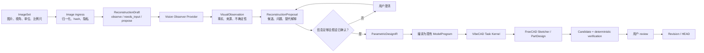

# VibeCAD Visual CAD 整体计划

> 状态：**`VCAD-S10.3 native feature compiler` 已完成；`VCAD-S10.4` 执行中**
>
> 更新：2026-08-03
>
> 产品基线：已发布 `v0.6.1@e7dd0c0`
>
> 当前里程碑：`VCAD-S10.4`

本文件是“单张/多张图片 → 可编辑 CAD 草图/参数化模型”能力线的短期活动真源。
既有 Stage 3、P0-B、MRG1 和 P2 编排文件保持历史只读，不在其中继续追加命令、重试、
临时 hash、runner 演化或逐次诊断。

## 1. 产品目标

Visual CAD 的目标不是从图片恢复唯一的“原始 CAD”，而是：

> 从有证据来源的单张或多张图片中提取几何事实和不确定性，经用户确认后生成一份
> 可审核、可修改参数、可重新计算的 FreeCAD 草图与特征模型。

首个正式产品结果必须同时具备：

1. 图片、尺寸、用户回答和推断之间可追溯；
2. 无法从图片确定的信息会提问或标记为假设，不静默猜测；
3. 输出含真正的 Sketcher 几何/约束和基础 PartDesign 特征，不是静态 Shape；
4. 修改公开参数后可以 recompute，必要设计约束仍成立；
5. 所有设计改变仍经过 Task → Candidate → verifier → review → Revision/HEAD；
6. 视觉模型和外部 Provider 永远没有 Accept、commit 或 HEAD 权威。

## 2. 两条产品轨道

### 2.1 Mechanical Parametric 主线

初始支持单个、清晰、规则机械零件：

- 2.5D 拉伸件和回转件；
- 直线、圆、圆弧、槽和构造线；
- 重合、水平、垂直、平行、正交、相切、相等、对称和尺寸约束；
- Pad、Pocket、Hole 和 Revolve；
- 单张带尺寸工程图、单张正投影加尺寸基准，以及 2–4 张一致的多视图图片；
- 普通照片仅在比例尺、主体和必要视角足够时进入引导式重建。

首期不承诺自由曲面、装配、螺纹、钣金、焊件、复杂放样、制造公差推断，或恢复原始
特征历史。

### 2.2 Freeform 支线

自由曲面不是永久排除项，但使用不同的中间表示和验收：

- 工业外壳/手柄：截面曲线、导引曲线、Loft、Sweep、NURBS 和对称/厚度参数；
- 雕塑/高度有机形体：Mesh/SubD 控制笼，作为可塑形结果，不宣称全约束机械 CAD；
- 精密逆向：扫描/点云与专业曲面拟合 Provider，VibeCAD 只负责编排、来源、采纳和审核。

工业自由曲面若最终成为有效 BRep，可进入现有 FCStd/STEP Revision；Mesh/SubD 在当前
durable v1 下只作为 immutable derived artifact。把 Mesh/SubD 变成权威 Revision 需要单独的
artifact profile/durable 决策，不能由本计划暗含授权。

## 3. 目标架构



架构决定：

- `ParametricDesignIR` 是严格、版本化、provider-neutral 的领域值，不允许任意 Python；
- 图片分析由轻量 `ReconstructionDraft` 承载；它没有 CAD candidate、Revision 或 HEAD，proposal 被确认后才
  创建普通 CAD Task；
- IR 通过一个 ModelProgram-only 的原子 operation 编译到现有 `ModelProgram`，不把每条线和约束
  扩张成几十个 MCP 工具，也不建立第二套 CAD Task/Revision 状态机；
- Vision Observer 只产生 observation/proposal，CAD reasoning 只产生受控 IR；
- 初期可以用同一个多模态模型承担观察与推理，但接口、证据和权限仍保持分离；
- 主编排模型不必永久绑定多模态能力；视觉模型可以独立替换；
- WorkBuddy 是首个宿主适配对象，不是协议或模型架构的所有者。

## 4. 核心合同

### 4.1 `ImageSet`

最少记录：

- 每个输入的 artifact ID、SHA-256、MIME、像素尺寸和视图角色；
- `front/top/right/back/isometric/unknown` 视角声明；
- 单位、显式尺寸、比例尺、相机/透视校准状态；
- 多图是否属于同一物体、同一状态和同一尺度；
- 原图与去 EXIF/归一化派生图之间的 provenance；
- 本地处理或外部 Provider 授权状态。

图片不是 Revision 原生 CAD payload。它作为 task-scoped immutable input/evidence 管理，因此
Mechanical V1 不受 Revision durable-v2 阻塞。

### 4.2 `VisualObservation`

每项观察携带来源状态，而不只是一分置信度：

- `confirmed`：用户或图中尺寸明确给出；
- `calibrated`：由比例尺或相机校准推导；
- `cross_view_derived`：由多视图一致性推导；
- `assumed`：基于对称、遮挡或常见结构的假设；
- `unknown`：证据不足。

只有前三类可以直接成为尺寸验收依据；`assumed` 在生成 CAD candidate 前必须确认。

### 4.3 `ReconstructionProposal`

包含零件类型、基准、草图、尺寸、约束、候选特征树、未决问题、替代方案、unsupported
内容和预期渲染视图。提案本身不能创建 CAD candidate。

### 4.4 `ParametricDesignIR`

首期表达：

- datum plane 和显式局部坐标系；
- stable sketch/geometry/constraint/parameter/feature ID；
- sketch primitives、geometric constraints 和 dimensional constraints；
- Pad、Pocket、Hole、Revolve 及明确依赖；
- 参数默认值、单位、合法范围和证据来源；
- 能够确定性派生后续 execution acceptance 的设计语义。

IR 只描述“设计是什么”。显式 edit probe、DoF/冲突观察以及 tolerance-bearing acceptance 属于
现有 `AcceptanceSpec` 和执行验证，不写入 IR，避免形成两套验收真源，也避免只改变 probe 就改变
设计 digest。

VCAD-V1 的草图只依附 origin/datum plane，不依赖不稳定的生成面/边拓扑。基于特征面的草图
和复杂 face/edge selector 在后续单独扩展。

首期对外只编辑 named parameter、whole sketch 或 feature，不公开逐条 sketch element selector；
IR-local stable ID 使用独立 `ir_*_<32 lowercase hex>` 命名空间。它不能替换现有 revision-bound
`object_` / `feature_` selector，也不能替换 FreeCAD 临时 geometry/constraint index；后续 compiler
必须显式维护三者之间的内部映射。

S10.1 保持 `ObservationSnapshot v1`、`SelectorV1` 和 `AcceptanceSpec v1` 的 wire 与 digest 不变。
新的 ModelProgram value shape、默认 operation、compiler 和 Worker handler 在 S10.4 一次完整接入，
不提前公布一个无法执行的半成品 operation。

## 5. 分阶段执行计划

### VCAD-S00 — 计划与合同冻结

状态：**complete；`VCAD-A01` 已由用户批准**。

产出：

- 产品范围、架构、阶段、验收和审批点；
- 现有能力与缺口清单；
- 明确确认前不写代码、不跑真实 Provider、不发布。

退出门：用户批准本计划。计划文字修订不等于批准实现。

### VCAD-S10 — Parametric Core

用户能力：Agent 能从明确尺寸创建和修改真正可编辑的参数化单零件，即使暂时没有图片输入。

顺序：

1. `S10.1` 冻结 `ParametricDesignIR`、stable ID、单位、约束和 feature schema（**complete**）；
2. `S10.2` 实现 Sketcher 编译、观察、DoF/冲突/冗余诊断（**complete**）；
3. `S10.3` 实现 datum-plane Pad/Pocket/Revolve，随后补 Hole（**complete**）；
4. `S10.4` 把 IR 编译进现有 ModelProgram/Task Kernel（**active**）；
5. `S10.5` 完成“创建 → review → Accept → 修改参数 → 新 Revision”的真实 FreeCAD 纵切片。

退出门：

- 代表性草图 `DoF = 0`，无 conflicting constraint；
- confirmed 尺寸满足单位和公差合同；
- Pad/Pocket/Revolve/Hole 产生有效单实体 BRep；
- 修改代表性公开参数后 recompute、保存、重开仍有效；
- 同一操作走现有 Task/Revision/review 权威，不新增第二控制面。

最小固定样例：一个全约束安装板证明 Sketcher + Pad；一个带孔板证明 Pocket/Hole；一个阶梯轴
证明 Revolve。首期不借机补齐完整历史 P1 operation inventory。

S10.1 closeout：

- 新增 runtime-neutral、严格版本化且 canonical 的 `ParametricDesignIR v1`，覆盖 evidence、named
  parameter、origin/datum plane、五类草图 primitive、十五类约束和 Pad/Pocket/Hole/Revolve；
- IR ID 使用独立 `ir_*_<32 lowercase hex>` 命名空间，输入顺序不影响 digest，同时拒绝路径仍指向
  原始 wire index；设计结构预算为 3,500 JSON nodes、256 KiB canonical byte；
- profile closure、Sketcher solve、DoF/冲突、PartDesign recompute 和 edit probe 明确保留为 compiler/
  execution invariant，不伪装成纯合同层已经证明的几何事实；
- `ObservationSnapshot v1`、`SelectorV1`、`AcceptanceSpec v1`、operation registry 和现有 transport
  均未改变；package wheel/sdist 已包含并可导入新子包；
- focused contract gate 为 22 passed，既有核心 contract/program/registry/selector 回归为 405 passed，
  Ruff/format clean，独立复审 clean。

S10.2 closeout：

- 新增 import-safe 的 Sketcher compiler：一个外部参数 carrier、一个 `PartDesign::Body` 和最多八个
  `Sketcher::SketchObject`；Point/Line/Circle/Arc、三种 origin plane、显式 datum frame 和十五类约束
  使用真实 FreeCAD API 编译，Slot 在事务前安全拒绝；
- named length/angle 参数通过稳定 constraint name 与 FreeCAD expression 驱动草图；锁定 metadata
  保存 IR ID 到 geometry/constraint index 的内部映射。一个有界 document-graph gate 校验唯一 body、
  carrier、sketch 集合、Body membership、共享 design digest 和表达式绑定；求解失败在事务内回滚；
- `EntityObservation.parameters` 可承载 design/mapping digest、当前参数值、geometry/constraint count、
  DoF、fully-constrained、solver/conflict/redundancy/malformed facts，而不改变 ObservationSnapshot v1；
- managed FreeCAD outcome 证明全约束矩形参数从 60 mm 改为 75 mm 后几何实际更新，保存/重开仍为
  `DoF=0`；断开表达式、删除草图和冲突约束均 fail closed，合法 Point/Whole 对称约束不再触发原生
  崩溃；十九个 geometry/constraint 映射样例均由真实 FreeCAD 构造；
- 包含六个 focused compiler tests 的 497 个 contract/program/registry/selector/executor/worker 测试通过，
  Ruff/format/source compile 和独立复审通过。未新增 runner、controller 或 observation v2；全局 Worker
  stabilization 延后到 S10.4，与 solid、EntityIdentity 和真实 Worker outcome 一次接入。

S10.2/S10.3 的 datum 语义是“显式正交 frame 编译为稳定 Placement”，不是生成面 attachment，也不
宣称已经创建用户可见的 FreeCAD DatumPlane 对象；S10.3 保持了这一边界。

S10.3 closeout：

- `compile_parametric_design` 在 S10.2 的同一事务内按 IR 顺序创建原生 Pad/Pocket/Revolution/Hole；
  Length/Angle/Dimension/ThroughAll 使用 FreeCAD 1.1 的名称枚举，ThroughAll 不保留无效的 dormant
  length/depth expression；Pad/Pocket 使用 `SideType`，Hole 固定为 plain-hole 常量；
- 被消费的 profile 必须由全部非 construction curve 形成有效 closed wire；Revolution 支持 sketch X/Y
  轴和 construction-line ordinal `AxisN`。S10.3 的 Pocket/Hole 明确只接受 exactly one live wire，避免
  native 部分切除被误判成功；multi-loop Pocket 与 multi-location Hole 保留在 S35 扩展。每个 feature
  重算后必须精确处于唯一 `Up-to-date`、状态为 `Valid`、有效且恰有一个 Solid；加材体积必须增加，
  Pocket/Hole 体积必须减少，防止 native no-op 或 stale Shape 假成功；
- 锁定 feature metadata 与 graph gate 校验 feature index/base chain、唯一 sketch consumption、Body Group/
  Tip、Profile/ReferenceAxis、精确参数 binding、plain-hole 常量和 carrier 表达式；Body facts 新增 feature
  count，feature facts包含 kind/index/extent/profile wire/solid validity 和当前参数值；
- managed FreeCAD 1.1.0 outcome 证明三张全约束草图的 Pad→Pocket→Hole 单实体链、construction-axis
  Revolution、FCStd 保存/重开、Pad 8→12 mm、Hole 6→8 mm 和 Revolution 360→270° 参数编辑；open
  profile 与 no-op Pocket 均事务回滚，断开 Hole expression fail closed；
- focused/core gate 为 505 passed、13 deselected，Ruff/format/compile/package wheel import 通过；独立复审
  clean；没有新增
  public operation、Worker hook、runner/controller、Observation v2 或视觉 Provider。Task/Worker、identity
  adoption 与真实 Revision outcome 仍属于 S10.4/S10.5。

### VCAD-S20 — Visual Input 与提案合同

用户能力：用户可以安全提交一组图片，系统能返回有来源的不确定性报告和补充信息请求；
此阶段尚不作真实模型质量承诺。

顺序：

1. `S20.0` 冻结 ReconstructionDraft lifecycle、image retention/delete、durable-root topology 和兼容方案，
   进入 `VCAD-A02`；
2. `S20.1` 实现 ImageSet seal、大小/格式/数量预算和归一化 provenance；
3. `S20.2` 实现 VisualObservation、ReconstructionProposal 和 clarification 状态；
4. `S20.3` 在 generic runtime 之上实现 Visual Domain Service、result retrieval 和 provider
   composition，不把它注册成 CAD adapter；
5. `S20.4` 用 deterministic fake provider 打通 ReconstructionDraft 重启、恢复、拒绝和采纳路径；
6. `S20.5` 为 WorkBuddy/Workbench/CLI 定义最薄 ingress adapter，协议仍保持 host-neutral。

退出门：

- 输入 byte、hash、视角和授权绑定正确；
- malformed、超预算、替换或来源不一致的输入 fail closed；
- `assumed` 未确认时不能进入 CAD candidate；
- Provider 无 store/lease/accept/commit/head capability；
- Task 重启后不会重复 Provider 调用或重复采纳。

最小固定样例：完整、缺尺度和多视图冲突三个 manifest。当前 WorkBuddy ResourceLink/Blob 只证明
VibeCAD 向宿主输出资源，不证明宿主附件能够进入 VibeCAD；正式入口不得把图片 base64 塞进现有
受限 MCP/local protocol frame。优先使用受控 locator/descriptor，经 no-follow、owner、link-count、
size、MIME/magic 检查后复制到私有 immutable store。若 WorkBuddy 无稳定附件 descriptor，再增加
薄宿主适配层。

### VCAD-S30 — Single Engineering Image V1

用户能力：从单张带尺寸工程图或清晰正投影视图生成可编辑机械零件草图和基础特征模型。

顺序：

1. `S30.1` 用一组自有合成 CAD 参考图比较少量真实多模态候选，不先做大模型榜单；
2. `S30.2` 锁定一个默认 Observer 和一个 fallback，但保持合同可替换；
3. `S30.3` 交付单张带尺寸图 → constrained sketch → basic feature；
4. `S30.4` 在 WorkBuddy 与 VibeCAD Workbench 各做一次真实用户路径。

产品门：

- 所有已确认尺寸均由确定性 verifier 验证；
- 每个提交结果通过 S10 editability gate；
- 信息不足样例必须提出正确问题，而不是输出伪精确尺寸；
- 渲染/轮廓相似度只作 diagnostic，不能覆盖尺寸、约束或 BRep 失败；
- 支持范围和实测失败类型写入用户文档。

最小固定样例：带孔安装板和阶梯轴两个正例；无尺度输入和尺寸冲突两个 SAFE_FAILURE
负例。初次 alpha 不以合成总分替代逐例 outcome。

### VCAD-S35 — Multi-view Mechanical V2

用户能力：从 2–4 张属于同一物体、同一尺度的干净视图生成跨视图一致的 2.5D 参数模型。

新增能力：视图归属、共享坐标和尺度、跨视图轮廓/尺寸一致性、冲突诊断，以及有限的多草图
和多 Pocket/Hole 表达。

退出门：一个 L 形支架正例完成可编辑重建；“相同前视图但深度不同”和“互相矛盾视图”
两个负例必须 SAFE_FAILURE 或进入澄清，隐藏结构不能静默升级为 confirmed。

### VCAD-S40 — Guided Photo V3

用户能力：上传带比例尺的普通实物照片，按系统指导补拍或回答隐藏结构问题，获得受限类别
的参数化重建模型。

初始包络：单物体、背景可分离、遮挡有限、无明显形变，优先拉伸件和回转件。

新增能力：

- 拍摄质量检测和补拍指导；
- perspective/scale consistency；
- 隐藏几何、对称性、壁厚和孔类型的候选分支；
- 用户确认后重新规划，而不是在旧 candidate 上静默修补。

退出门：在冻结的支持包络内通过真实照片样例；包络外必须明确降级为比例提案、请求更多
证据或拒绝。不得把“视觉上大致相似”宣传为精密逆向工程。

最小固定样例：三个自有、许可清晰且有卡尺真值的简单零件；无尺度和明显遮挡两个负例。
这些图片必须去 EXIF，用户私人图片不得进入仓库 fixture。

### VCAD-F10 — Industrial Freeform Alpha

启动条件：S35 稳定，并经 `VCAD-A05` 单独批准自由曲面输出和验收合同。

用户能力：从多视图轮廓或截面参考生成可编辑的 section/guide curve 与 Loft/Sweep/NURBS
工业曲面。

退出门：

- 截面和导引曲线可命名、可编辑并保留对称/尺寸来源；
- 曲面通过 G0/G1，声明需要时通过 G2 连续性检查；
- 无自交、法向错误、非预期间隙，要求实体时必须水密；
- 修改一个截面和一个整体参数后模型仍可 recompute；
- 多视图轮廓/曲面偏差明确报告。

最小固定样例：两个由自有 CAD 真值渲染的曲面件，以及一个仅用于人工接受度观察的真实外壳。

### VCAD-F20 — Sculpture / Mesh/SubD

这是 derived-artifact 产品，不与 S30/F10 使用同一个“全约束参数化 CAD”承诺。

在 current durable v1 下只交付带 provenance 的 Mesh/SubD artifact、预览和导出。只有在
artifact profile、Revision payload 和恢复边界另行批准后，才允许把它纳入权威 Revision。

## 6. 依赖与关键路径

```text
VCAD-A01
  → S10 Parametric Core
  → S20.0 ReconstructionDraft / ingress durable design
  → VCAD-A02 visual persistence and public-contract approval
  → S20 Visual contracts / ingress / fake provider
  → VCAD-A03 external-provider and privacy approval
  → S30 Single Engineering Image V1
  → VCAD-A04 public supported-envelope approval
  → S35 Multi-view Mechanical V2
  → S40 Guided Photo V3

S35 stable
  → VCAD-A05 freeform activation
  → F10 Industrial Freeform
  → F20 Sculpture / Mesh/SubD（若产品需要）
```

S10 是唯一首要关键路径。S30 完成后已经形成独立可交付用户价值，不等待 S35、S40 或 Freeform。
模型研究可以在 S20 schema 冻结后并行进行，但不能让 Provider 选型
阻塞可编辑 CAD 基座，也不能先用视觉 demo 替代 S10。

## 7. 最小验收与验证预算

每个 slice 最多选择以下必要证据：

1. focused contract/unit tests；
2. 一条受影响的 Task Kernel integration；
3. 只有产品声明需要时，运行一次真实 FreeCAD、真实宿主或真实 Provider 纵切片。

硬性治理：

- 不为本计划创建新的通用 runner、controller、scenario DSL、observer framework 或证据语言；
- 现有测试、产品日志、直接命令或一次人工观察能回答时，不新增验证工具；
- full repository suite 只在 coherent release candidate 或共享核心风险要求时运行；
- 模型 benchmark 在阈值冻结前是 diagnostic，不阻塞 S10/S20；
- 不把临时截图、PID、逐次 hash、重试转录或原始模型输出长期写进活动计划；
- outcome/invariant 已直接证明时，诊断缺口记录为 residual，不继续验证验证器；
- 自有合成 fixture 优先，仓库不得包含用户私人照片或 EXIF；
- 独立 review 仅用于 Provider 权限/隐私边界、durable schema、公开 release 等高后果变化。

普通 PR/CI 只运行 deterministic fake Provider。真实 VLM 只在绑定 exact provider/model/version/
profile 的离线认证中运行，不进入日常 pytest；首次 alpha 逐例记录
`SUCCESS / SAFE_FAILURE / UNSAFE_FAILURE / INFRA_INVALID`，不建立排行榜或通用评分平台。

立即停止并重新定界的情况：

- 出现任意 `UNSAFE_FAILURE`；
- 无尺度输入产生 confirmed 绝对尺寸，或未确认假设进入最终模型；
- Provider 获得 candidate/Accept/commit/HEAD 权威；
- 静态 Shape 被宣称为参数化可编辑结果；
- 同一阻断 gate 经两次有针对性的产品修复仍失败；
- 为证明当前 slice 必须新建 controller、评分框架或复制几何/视觉算法；
- 没有 ground truth 却准备设置精度阈值；
- 需要改变 public/durable schema 或 Task Kernel 权威而尚未获得批准。

反过来，一旦当前 outcome、invariant 和固定样例通过，就停止扩展 validator，记录 residual 并
进入下一 slice。

外部基准用途：

- CADBench：IoU、surface alignment、Chamfer、valid shape、程序紧凑度，仅作重建诊断；
- HistCAD：Edit Reachability、constraint preservation、Overall Editable Success；
- VibeCAD 自有门：confirmed dimension correctness、DoF、BRep validity、edit probe、clarification
  correctness 和 user correction burden。

## 8. 隐私、安全与模型策略

- 默认 local-first；外部 Provider 必须在 `VCAD-A03` 明确数据去向、成本和用户授权；
- 保留原图 hash；外发派生图默认去 EXIF，并最小化分辨率和裁剪范围；
- 不记录 API key，不把图片 byte 写进普通日志或模型 prompt transcript；
- Provider identity、model/version、输入 artifact、预算、deadline、输出 digest 全部进入 provenance；
- WorkBuddy 能直接观察图片时，也必须输出同一严格 VisualObservation；若原图 byte/hash 无法
  进入 VibeCAD，只能按“host-supplied structured intent”处理，不能宣称完整视觉 provenance；
- 真实模型调用、费用和用户图片外发都不由 `VCAD-A01` 自动授权。

## 9. 批准门

| Gate | 决策 | 当前状态 |
|---|---|---|
| `VCAD-A01` | 批准本整体计划并开始 S10 可逆实现 | **已批准** |
| `VCAD-A02` | 批准 ReconstructionDraft/image store、retention/delete、durable-root 与 public contract | 未到达 |
| `VCAD-A03` | 批准真实外部视觉 Provider、数据处理与费用边界 | 未到达 |
| `VCAD-A04` | 根据 pilot 结果冻结公开支持包络和 V1 发布声明 | 未到达 |
| `VCAD-A05` | 启动 Freeform，批准其输出类型与验收合同 | 未到达 |
| `VCAD-A06` | tag/PyPI/GitHub Release 或其他公开发布 | 未到达 |

`VCAD-A01` 批准后，S10 和 S20.0 合同设计范围内的本地可逆实现、必要测试、计划内文档更新，
以及按既有授权进行的有意 commit/branch push 无需重复请求。S20 持久写路径仍等待 A02。
`VCAD-A01` 已覆盖本计划明确列出的 S10 ModelProgram-only IR value shape 与原子 operation；它不覆盖
新增 direct MCP 建模工具、第二控制面或 durable schema。其它公开 schema 扩张、durable migration、
外部图片传输、费用、发布或产品范围变化必须进入对应批准门。

## 10. 当前状态与恢复入口

当前事实：

- `v0.6.1` 已发布；Task/Revision/Review、RuntimeArtifact/Invocation 和 WorkBuddy MCP 路径可复用；
- 当前 public 产品没有真正的 Sketcher/PartDesign 可编辑基座；现有 profile extrusion 是静态 Shape；
- 当前没有 ImageSet、VisualObservation、ReconstructionProposal 或 reconstruction domain service；
- Revision durable v1 仍固定 FCStd/STEP，但不阻塞 task-scoped image/proposal artifact；
- 当前 durable-root 合同还必须把已存在的 `releases/` 与未来 `visual_inputs/reconstruction_drafts` 一并校正；
  这不阻塞 S10，但阻塞 S20 的持久化写路径；
- 当前 WorkBuddy 只验证了 VibeCAD → WorkBuddy 的资源读取，尚未认证附件 → VibeCAD 的输入；
- S10.1 已选择冻结 `ObservationSnapshot v1`、`SelectorV1` 和 `AcceptanceSpec v1`；有限的重开后
  parametric facts 在 S10.2 复用既有 entity parameter 容器，完整 feature/constraint observation 若
  将来需要则走显式 v2；
- 当前 Task API `program_json` 上限为 512 KiB，但 durable TaskRun 的 nested preflight 上限为 4,096
  nodes；IR 的 3,500-node 上限为原子 program envelope 留出余量。S10.4 仍须加入一个近边界 round-trip
  fixture，不能靠放宽公共请求预算通过；
- `.workbuddy/` 与两份 CAD 课程文档均为用户所有，不在本计划范围。

当前下一动作：

```text
执行 S10.4：把完整 ParametricDesignIR 作为一个原子 ModelProgram value/operation 接入现有 Task Kernel
与私有 FreeCAD Worker；编译后为最终 Body/feature 采用既有 EntityIdentity，并在 shape observation 前调用
现有 bounded parametric stabilization。保持单一候选/Revision/review 权威，不提前公开逐草图元素 selector，
不新增测试 controller 或视觉 Provider。
```

执行分支为 `codex/visual-cad-m0`；S10.1 anchor 为 `3835da7`，S10.2 anchor 为 `882e665`。S10.4 只接入
既有 ModelProgram/Task/Worker/identity seam；不运行真实 Provider，也不进入 S20 持久化写路径。

## 11. Material event ledger

| Event | Authority | Effect | Evidence / recovery | Residual |
|---|---|---|---|---|
| `VCAD-E00` | 用户要求先设计、确认后执行 | 冻结机械参数化主线与 Freeform 分轨设计；本计划处于 waiting approval | 本文件；恢复动作是等待 `VCAD-A01` | 真实 Provider、公开包络和 Freeform 激活仍需后续 gate |
| `VCAD-E01` | 用户批准按整体计划执行 | `VCAD-A01` 生效；允许 S10 和 S20.0 范围内的本地可逆实现及既有授权内 commit/branch push | `origin/main@d7ab6b7`；`codex/visual-cad-m0`；恢复动作是继续 S10.1 | A02–A06 未授权，范围保持不变 |
| `VCAD-E02` | `VCAD-A01` 与 S10.1 focused gate | 冻结 ParametricDesignIR v1；不改变现有公共/持久合同 | 22 focused + 405 core regression；Ruff/format/package import；独立 review clean；恢复动作是继续 S10.2 | profile closure/solver/DoF/recompute 由 S10.2/S10.3 真实 FreeCAD gate 证明 |
| `VCAD-E03` | S10.2 compiler 与 managed FreeCAD outcome | 建立真实 Sketcher、参数表达式、稳定映射、有界 graph/solver gate 和 v1 entity parameter facts | 497 focused/core tests；真实 edit/save/reopen 与 fail-closed outcomes；独立 review clean；恢复动作是继续 S10.3 | feature/solid、identity adoption、Worker stabilization 和 Task Kernel 接入留在 S10.3/S10.4 |
| `VCAD-E04` | S10.3 feature compiler 与 managed FreeCAD outcome | 建立闭合 profile → native single-solid feature chain、feature mapping/facts 与 fail-closed shape gate | 505 focused/core tests；真实 plate/hole/shaft edit/save/reopen、partial multi-cut rejection、rollback 和 tamper outcomes；独立 review clean；恢复动作是继续 S10.4 | ModelProgram/Task/Worker、EntityIdentity、Revision review 纵切片留在 S10.4/S10.5；multi-loop Pocket / multi-location Hole 留在 S35 |

## 12. 研究依据

- [CADBench](https://arxiv.org/abs/2605.10873)：单图、多图、真实感渲染到 CAD program 的复杂度、输入漂移与执行性基准；
- [CAD-Coder](https://arxiv.org/abs/2505.14646)：视觉到可执行 CadQuery 的当前能力和真实照片泛化限制；
- [HistCAD](https://arxiv.org/abs/2602.19171)：显式约束、编辑可达性和整体可编辑成功；
- [Metric3D](https://arxiv.org/abs/2307.10984)：单目尺度/深度歧义；
- `docs/ARCHITECTURE.md`：Task/Revision/Provider 权限和 durable-v1 边界；
- `docs/WORKBUDDY_COMPATIBILITY_RESEARCH.md`：视觉观察、CAD reasoning 和确定性提交权威分离。
